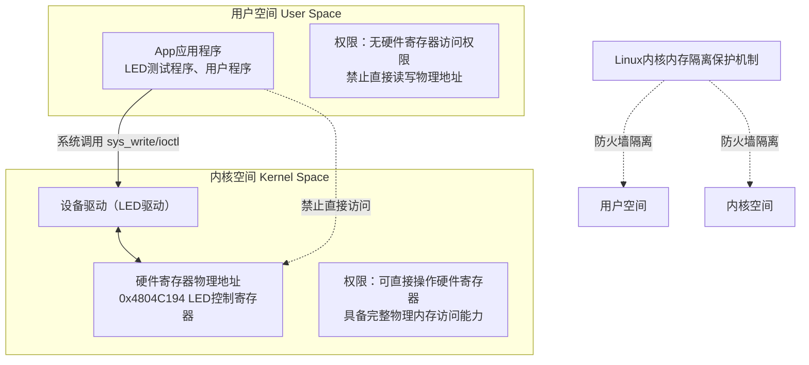

# 4.5.1 什么是设备驱动

> 所属章节：第4章 内核配置与编译 > 4.5 设备驱动模块化
> 
> 难度：[B] | 预计阅读时间：5分钟

## <span class="blue"> 本节导读

本节覆盖：驱动在内核与硬件之间的角色，用户空间与内核空间的隔离机制，以及驱动作为「翻译官」的核心作用。最后简要提及驱动的两种形态。

---

## <span class="blue"> 用户空间与内核空间的隔离 [B]

你写了一个C程序，想点亮开发板上的LED。手册说往地址`0x4804C194`写`1`就能点亮，于是你写了：

```c
// 错误的写法！用户程序不能直接访问硬件
*(unsigned int *)0x4804C194 = 0x1;
```

程序立刻报`Segmentation fault`。在Linux中，内存被严格划分为**用户空间**和**内核空间**。硬件寄存器映射在内核空间，用户程序无权访问——MMU（内存管理单元）会拦截非法访问，触发`SIGSEGV`信号终止进程。这是操作系统保护系统稳定的基础机制，防止用户程序误操作导致整个系统崩溃。

驱动就是内核与硬件之间的**翻译官**。它运行在内核空间，拥有直接操作硬件寄存器的权限；同时通过`file_operations`等标准接口，把硬件能力翻译成应用程序能理解的`read()`/`write()`/`ioctl()`系统调用。例如应用程序说"读取温度"，驱动便配置ADC寄存器、启动转换、等待中断完成、读取原始码值并换算成摄氏度，再把结果返回给用户空间。


```mermaid
flowchart TD
    subgraph 用户空间 User Space
        A[App应用程序<br/>LED测试程序、用户程序]
        note1["权限：无硬件寄存器访问权限<br/>禁止直接读写物理地址"]
    end

    subgraph 内核空间 Kernel Space
        B[设备驱动（LED驱动）]
        C[硬件寄存器物理地址<br/>0x4804C194 LED控制寄存器]
        B <--> C
        note2["权限：可直接操作硬件寄存器<br/>具备完整物理内存访问能力"]
    end

    OS[Linux内核内存隔离保护机制]

    A --系统调用 sys_write/ioctl--> B
    A -.禁止直接访问.-> C
    OS -.防火墙隔离.-> 用户空间
    OS -.防火墙隔离.-> 内核空间
```

> 💡 硬件原始数据（如ADC码值）与用户需要的格式（如浮点温度值）之间的转换，正是驱动的工作之一。

---

## <span class="blue"> 驱动的核心职责 [B]

驱动的核心职责可概括为：初始化资源（中断、DMA、时钟）、读写硬件寄存器、响应中断、转换数据格式。没有驱动，内核不认识硬件，外设就是一块无法工作的硅片。

> ⚠️ 不要把「驱动」和「设备节点」搞混。`/dev/ttyS0`是设备节点（用户空间的访问入口），而串口驱动是躲在节点背后的内核代码。没有驱动，节点只是一个空壳。

---

## <span class="blue"> 驱动的两种形态 [B]

Linux中的驱动有两种存在形式：编译进内核镜像的**内置（Y）**，启动时自动初始化；或编译为独立`.ko`文件的**模块（M）**，按需加载、可运行时卸载。

> 💡 嵌入式场景中，开机必需的驱动（如EMMC、串口控制台）通常选Y，可热插拔的外设（如USB网卡、摄像头）通常选M。具体选择策略将在4.5.2中展开。

---

## <span class="blue"> 下一步

4.5.2「驱动编译进内核 vs 编译成模块」将详细对比内置（Y）与模块（M）的启动时序差异，并给出嵌入式场景的配置决策策略。

---
