# 4.5.2 驱动编译进内核 vs 编译成模块

> 所属章节：第4章 嵌入式Linux驱动开发基础 > 4.5 驱动的加载方式
> 难度：[B→I] | 预计阅读时间：15分钟

## 本节导读

学完后，你能理解Linux驱动"编译进内核（built-in）"和"编译成模块（module）"的本质区别，掌握在实际项目中根据场景选择加载方式的策略，并能动手修改`.config`来切换驱动的编译方式。

---

## 知识点1：两种编译方式对比 [B] ~1000字

在Linux内核源码树中，每个驱动都可以选择两种命运：要么成为内核"不可分割的一部分"，要么成为"可以插拔的模块"。这个选择通过Kconfig配置系统中的`Y`（Yes，编译进内核）和`M`（Module，编译成模块）来实现。

### 1.1 Built-in（Y）：与内核融为一体

当你把某个驱动配置为`Y`时，它的代码会被编译、链接到`vmlinuz`（或`zImage`/`uImage`）这个内核镜像文件中。开机时，Bootloader把内核加载到内存，内核初始化阶段会按预定顺序执行各驱动的`init`函数——就像工厂流水线启动时，所有设备必须同时就位。

**适合场景**：系统启动就必须工作的硬件，比如CPU核心支持、内存控制器、串口控制台、GPIO基础驱动。

### 1.2 Module（M）：按需插拔的外挂组件

配置为`M`时，驱动代码被编译成独立的`.ko`（Kernel Object）文件，存放在文件系统的`/lib/modules/$(uname -r)/`目录下。内核启动时**不会**自动加载它们，直到你执行`insmod`或`modprobe`命令，或者由udev/systemd在检测到硬件时触发加载。这好比打印机的驱动——只有当你真正插上打印机时才需要它工作。

**适合场景**：非必需外设、第三方闭源驱动、调试阶段频繁修改的驱动、节省内存的精简系统。

### 启动加载流程对比

两种方式的启动时序差异，直接决定了系统的启动速度和灵活性：

```mermaid
flowchart TB
    subgraph BuiltIn["Built-in (Y) 启动流程"]
        A1["Bootloader加载zImage"] --> B1["内核解压/启动"]
        B1 --> C1["执行built-in驱动init"]
        C1 --> D1["挂载rootfs"]
        D1 --> E1["用户空间init启动"]
    end

    subgraph Module["Module (M) 启动流程"]
        A2["Bootloader加载zImage"] --> B2["内核解压/启动"]
        B2 --> D2["挂载rootfs"]
        D2 --> E2["用户空间init启动"]
        E2 --> F2["执行modprobe/insmod"]
        F2 --> G2["模块初始化完成"]
    end

    style BuiltIn fill:#e1f5e1
    style Module fill:#fff3e0
```



[图1：Built-in与Module启动时序对比图]

从图中可见，`Y`的驱动初始化在内核阶段完成，早于rootfs挂载；而`M`的初始化发生在用户空间，时机更晚但更可控。

### 操作步骤：切换驱动的编译方式

以常见的USB WiFi驱动`rtl8188eu`为例，演示如何在菜单中切换：

1. 进入内核源码目录
2. 执行 `make menuconfig`
3. 导航至 `Device Drivers → Network device support → Wireless LAN`
4. 找到目标驱动，按`Y`（显示`*`）、`M`（显示`M`）或`N`（空）切换

### 代码示例

`.config`文件中对应的变化：

```bash
# 编译进内核（Y）
CONFIG_RTL8188EU=y

# 编译成模块（M）
CONFIG_RTL8188EU=m

# 不编译（N）
# CONFIG_RTL8188EU is not set
```

模块加载与卸载命令：

```bash
# 手动加载模块（需指定完整路径或模块已在标准路径）
insmod /lib/modules/5.15.36/kernel/drivers/net/wireless/rtl8188eu.ko

# 更推荐：自动处理依赖关系
modprobe rtl8188eu

# 查看已加载模块
lsmod | grep rtl8188eu

# 卸载模块
rmmod rtl8188eu
```

### Y vs M 核心对比表

| 对比维度 | Built-in (Y) | Module (M) |
|---------|-------------|-----------|
| 产物形态 | 合并进`zImage`/`uImage` | 独立的`.ko`文件 |
| 加载时机 | 内核启动早期自动执行 | 用户空间按需手动/自动加载 |
| 启动速度 | 内核体积大，启动略慢 | 内核体积小，启动快 |
| 内存占用 | 始终占用内存，无法释放 | 按需加载，卸载后释放内存 |
| 修改调试 | 改一行代码需重编整个内核 | 改代码只需重编单个`.ko`，秒级 |
| 依赖关系 | 系统自动处理 | `modprobe`自动解析，`insmod`需手动保证 |
| 适用硬件 | 启动必需设备（串口、存储） | 可插拔/非必需设备（USB网卡、摄像头） |
| 符号导出 | 任意函数可被后续驱动调用 | 需显式`EXPORT_SYMBOL()`导出才能被其他模块使用 |

### 常见错误

⚠️ **陷阱1**：以为`M`方式下驱动会自动工作。实际上模块文件需要放在`rootfs`的`/lib/modules/$(uname -r)/`路径下，且模块版本必须严格匹配`uname -r`输出的字符串，否则`insmod`会报`Invalid module format`。

💡 **提示**：如果你看到`modprobe: FATAL: Module xxx not found`，先检查两点：(1)模块文件是否确实存在于`/lib/modules/$(uname -r)/`；(2)是否运行过`depmod -a`生成模块依赖数据库。

⚠️ **陷阱2**：模块与内核版本号必须完全一致。在嵌入式开发中，如果你改了内核配置重新编译，但未更新rootfs中的模块目录，旧模块会加载失败。

🔴 **危险**：生产环境中卸载正在被使用的模块会导致内核崩溃。执行`rmmod`前务必确认模块没有被进程占用（用`lsmod`查看`Used by`列是否为0）。

---

## 知识点2：嵌入式场景的选择策略 [I] ~700字

理解了Y和M的技术差异后，真正的挑战在于：**面对一块嵌入式开发板，几十个驱动到底怎么选？** 本节给出工程化的决策思路。

### 2.1 核心原则：开机必需的选Y，其他的默认选M

嵌入式设备通常有明确的硬件边界——不像PC需要兼容千变万化的外设。因此遵循"最小内核原则"：

- **选Y（Built-in）**：SOC本身的核心控制器（I2C、SPI、UART、EMMC/SDHCI、网卡MAC）、电源管理、看门狗、串口控制台。这些设备不工作，系统连启动日志都输出不了。
- **选M（Module）**：USB外接设备（WiFi、4G模组、摄像头）、传感器（温湿度、加速度计）、音频Codec、显示屏触摸驱动。这些设备可能在某些产品批次中不存在。

### 2.2 调试阶段 vs 量产阶段的策略转换

嵌入式开发是迭代密集型工作，驱动的选择策略应该**随项目阶段动态调整**：

| 阶段 | 策略 | 原因 |
|------|------|------|
| 板级 bring-up | 核心驱动Y，其余尽可能M | 内核频繁重编，模块方式可独立更新驱动，缩短调试周期 |
| 驱动开发/调试 | 正在改的驱动设M | 修改后只需`scp`新的`.ko`到板子`rmmod`/`insmod`，无需重启 |
| 系统集成测试 | 逐步将稳定的M改为Y | 验证启动时序，确保rootfs挂载前所需驱动已就绪 |
| 量产固件 | 核心Y，低频使用外设M | 兼顾启动速度和内存占用；极端精简场景可全部Y |

### 2.3 实战：为i.MX6ULL板卡做配置决策

假设你有一块飞思卡尔i.MX6ULL开发板，硬件资源包括：eMMC、SD卡槽、USB Host、一个USB WiFi、一路I2C接触摸屏、一路SPI接LCD。推荐策略如下：

```bash
# 核心存储与总线 —— 必须Y
CONFIG_MMC_SDHCI=y
CONFIG_MMC_SDHCI_PLTFM=y
CONFIG_EXT4_FS=y

# 串口控制台 —— 必须Y
CONFIG_SERIAL_IMX=y
CONFIG_CONSOLE_TRANSLATIONS=y

# USB控制器 —— Y（控制器本身必需，但具体设备驱动可M）
CONFIG_USB_EHCI_HCD=y
CONFIG_USB_OHCI_HCD=y

# USB WiFi、触摸屏 —— M（调试阶段）
CONFIG_RTL8188EU=m
CONFIG_TOUCHSCREEN_FT5X06=m

# SPI LCD —— 开发时Y（启动显示logo），量产后可M
CONFIG_FB_TFT_ILI9341=y
```

### 常见错误

⚠️ **陷阱3**：量产时盲目全部选Y。一个工业网关如果把所有外设驱动都编进内核，可能导致内核体积超过Bootloader能加载的上限（某些老版本U-Boot只支持8MB以内内核），或者内核占用过多低端内存，留给用户空间的内存不足。

💡 **提示**：嵌入式设备改一次内核配置重编可能耗时10分钟以上，而重编单个模块通常只需几十秒。调试阶段优先用M能显著提升迭代效率。

⚠️ **陷阱4**：rootfs在SD卡/eMMC上，却把SD卡驱动配成M。这会导致经典"先有鸡还是先有蛋"问题：内核启动后要挂载rootfs，但读SD卡需要驱动，驱动又在SD卡上的rootfs里。结果就是内核panic。存储驱动永远选Y。

---

## 本节总结

| 概念 | 要点 | 操作建议 |
|------|------|---------|
| Built-in (Y) | 驱动并入内核镜像，启动自动加载 | 存储控制器、串口、电源管理等启动必需设备选Y |
| Module (M) | 驱动编译为`.ko`文件，按需加载 | 调试频繁的外设、非必需设备选M；记得做`depmod` |
| 启动时序 | Y在内核阶段初始化，M在用户空间初始化 | 依赖rootfs的驱动不能是Y的反向依赖（如存储驱动必须Y） |
| 阶段策略 | 调试期多用M，量产期核心Y外围M | 根据项目阶段动态调整，追求启动速度+内存效率平衡 |
| 版本匹配 | `.ko`必须与运行内核严格版本匹配 | 更新内核后务必同步更新rootfs中的`/lib/modules` |

## 下一步

学完驱动加载方式后，下一节`4.5.3 模块加载与卸载的底层机制`将深入讲解`insmod`/`modprobe`背后发生了什么——内核如何解析`.ko`文件的ELF结构、如何解析符号依赖、如何执行模块的`init_module()`系统调用。理解了这些，你在调试`Invalid module format`或`Unknown symbol`错误时就能游刃有余。

---

## 配套资源

### 表格清单
- 表1：Built-in (Y) vs Module (M) 核心对比表
- 表2：嵌入式项目各阶段驱动配置策略表

### 图示清单
- 图1：Built-in与Module启动时序对比图 [mermaid图]
- 图2：Kconfig配置界面中Y/M/N切换的菜单截图 [配图说明：需在make menuconfig界面截取Network device support下的选项截图，显示`*`、`M`、空三种状态]

### 代码清单
- 代码1：`.config`中`CONFIG_RTL8188EU=y`与`=m`的对比
- 代码2：模块加载/卸载命令（insmod/modprobe/rmmod/lsmod）
- 代码3：i.MX6ULL板卡驱动配置策略示例
