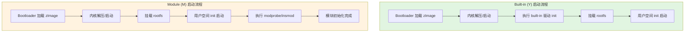

# 4.5.2 驱动编译进内核 vs 编译成模块

> 所属章节：第4章 内核配置与编译 > 4.5 设备驱动模块化
> 难度：[B→I] | 预计阅读时间：12分钟

## <span class="blue"> 本节导读

本节覆盖：在菜单中切换 Y/M 的操作步骤、`.config` 中 `=y`/`=m` 的代码变化、嵌入式场景的选择策略（开机必选的选 Y，非关键外设选 M，阶段策略动态调整）、i.MX6ULL 实战配置示例，以及常见错误（rootfs 在 SD 卡但 SD 驱动是 M、量产全部选 Y 导致内核过大）。模块命令的详细用法在 4.5.3 展开。

---

## <span class="blue"> 切换编译方式的操作 [B]

每个驱动在 `make menuconfig` 中都可以按空格键在 `Y`（编译进内核，显示 `*`）、`M`（编译成模块，显示 `M`）、`N`（不编译，空白）之间切换。

以 USB WiFi 驱动 `rtl8188eu` 为例：

```
Device Drivers
  → Network device support
    → Wireless LAN
      → Realtek 8188EU/8811CU/8822CU/8821CU USB WiFi (M)
```

`.config` 文件中的对应变化：

```bash
# 编译进内核（Y）
CONFIG_RTL8188EU=y

# 编译成模块（M）
CONFIG_RTL8188EU=m

# 不编译（N）
# CONFIG_RTL8188EU is not set
```

> 💡 修改 `.config` 后，只需执行 `make` 即可增量编译，无需重新 `make menuconfig`。内核镜像和模块产物会按最新配置自动更新。

---

## <span class="blue"> 启动时序差异 [B]

两种方式的启动时序差异直接决定了系统能否成功挂载 rootfs：


```mermaid
flowchart TB
    subgraph BuiltIn["Built-in (Y) 启动流程"]
        A1["Bootloader 加载 zImage"] --> B1["内核解压/启动"]
        B1 --> C1["执行 built-in 驱动 init"]
        C1 --> D1["挂载 rootfs"]
        D1 --> E1["用户空间 init 启动"]
    end

    subgraph Module["Module (M) 启动流程"]
        A2["Bootloader 加载 zImage"] --> B2["内核解压/启动"]
        B2 --> D2["挂载 rootfs"]
        D2 --> E2["用户空间 init 启动"]
        E2 --> F2["执行 modprobe/insmod"]
        F2 --> G2["模块初始化完成"]
    end

    style BuiltIn fill:#e1f5e1
    style Module fill:#fff3e0
```


`Y` 的驱动初始化在内核阶段完成，早于 rootfs 挂载；`M` 的初始化发生在用户空间，时机更晚但更可控。模块的加载/卸载命令（`insmod`/`modprobe`/`rmmod`/`lsmod`）在 4.5.3 详细讲解。

---

## <span class="blue"> 嵌入式场景选择策略 [I]

面对一块嵌入式开发板，几十个驱动到底怎么选？本节给出工程化的决策思路。

### 核心原则：开机必需的选 Y，其他默认选 M

嵌入式设备硬件边界明确，遵循"最小内核原则"：

- **选 Y（Built-in）**：SOC 核心控制器（I2C、SPI、UART、EMMC/SDHCI、网卡 MAC）、电源管理、看门狗、串口控制台。这些设备不工作，系统连启动日志都输出不了。
- **选 M（Module）**：USB 外接设备（WiFi、4G 模组、摄像头）、传感器（温湿度、加速度计）、音频 Codec、显示屏触摸驱动。这些设备可能在某些产品批次中不存在，或仅在特定场景使用。

| 驱动类型 | 推荐 | 典型示例 |
|---------|------|---------|
| SOC 核心总线/存储控制器 | Y | SDHCI、SPI、I2C、EMMC、UART |
| 串口控制台 | Y | SERIAL_IMX、CONSOLE_TRANSLATIONS |
| 电源管理/看门狗 | Y | PMIC、WATCHDOG |
| 文件系统（rootfs 所用） | Y | EXT4、FAT |
| USB 控制器（Host/OTG） | Y | EHCI、OHCI、DWC2 |
| USB WiFi/4G/摄像头 | M | RTL8188EU、USB Video Class |
| 传感器 | M | 温湿度、加速度计、陀螺仪 |
| 触摸/显示驱动 | M | FT5X06、ILI9341 |


### 阶段策略：随项目阶段动态调整

嵌入式开发是迭代密集型工作，驱动选择应随阶段动态调整：

| 阶段 | 策略 | 原因 |
|------|------|------|
| 板级 bring-up | 核心驱动 Y，其余尽可能 M | 内核频繁重编，模块方式可独立更新驱动，缩短调试周期 |
| 驱动开发/调试 | 正在改的驱动设 M | 修改后只需 `scp` 新的 `.ko` 到板子 `rmmod`/`insmod`，无需重启 |
| 系统集成测试 | 逐步将稳定的 M 改为 Y | 验证启动时序，确保 rootfs 挂载前所需驱动已就绪 |
| 量产固件 | 核心 Y，低频使用外设 M | 兼顾启动速度和内存占用；极端精简场景可全部 Y |

> 💡 嵌入式设备改一次内核配置重编可能耗时 10 分钟以上，而重编单个模块通常只需 30~60 秒。调试阶段优先用 M 能显著提升迭代效率。

---

## <span class="blue"> 实战：i.MX6ULL 板卡配置示例 [I]

假设有一块飞思卡尔 i.MX6ULL 开发板，硬件资源包括：eMMC、SD 卡槽、USB Host、一个 USB WiFi、一路 I2C 接触摸屏、一路 SPI 接 LCD。推荐配置如下：

```bash
# 核心存储与总线，必须 Y
CONFIG_MMC_SDHCI=y
CONFIG_MMC_SDHCI_PLTFM=y
CONFIG_EXT4_FS=y

# 串口控制台，必须 Y
CONFIG_SERIAL_IMX=y
CONFIG_CONSOLE_TRANSLATIONS=y

# USB 控制器，Y（控制器本身必需，但具体设备驱动可 M）
CONFIG_USB_EHCI_HCD=y
CONFIG_USB_OHCI_HCD=y

# USB WiFi、触摸屏，M（调试阶段）
CONFIG_RTL8188EU=m
CONFIG_TOUCHSCREEN_FT5X06=m

# SPI LCD，开发时 Y（启动显示 logo），量产后可 M
CONFIG_FB_TFT_ILI9341=y
```


---

## <span class="blue"> Y vs M 精简对比表 [B]

| 维度 | Built-in (Y) | Module (M) |
|------|-------------|-----------|
| 产物 | 并入内核镜像 | 独立 `.ko` 文件 |
| 加载时机 | 内核启动早期自动执行 | 用户空间按需加载 |
| 内存占用 | 始终占用，无法释放 | 按需加载，卸载后释放 |
| 修改调试 | 改一行需重编整个内核 | 改代码只需重编单个 `.ko` |
| 适用硬件 | 启动必需设备 | 可插拔/非必需设备 |

---

## <span class="blue"> 常见错误 [I]

> 🔴 rootfs 在 SD 卡/eMMC 上，却把 SD 卡驱动配成 M。这会导致"先有鸡还是先有蛋"问题：内核启动后要挂载 rootfs，但读 SD 卡需要驱动，驱动又在 SD 卡上的 rootfs 里。结果就是内核 panic。存储驱动永远选 Y。

> 🔴 量产时盲目全部选 Y。一个工业网关如果把所有外设驱动都编进内核，可能导致内核体积超过 Bootloader 能加载的上限（某些老版本 U-Boot 只支持 8MB 以内内核），或者内核占用过多低端内存，留给用户空间的内存不足。

> ⚠️ 以为 `M` 方式下驱动会自动工作。模块文件需要放在 `rootfs` 的 `/lib/modules/$(uname -r)/` 路径下，且模块版本必须严格匹配 `uname -r` 输出的字符串，否则 `insmod` 会报 `Invalid module format`。

> ⚠️ 如果你看到 `modprobe: FATAL: Module xxx not found`，先检查两点：(1) 模块文件是否确实存在于 `/lib/modules/$(uname -r)/`；(2) 是否运行过 `depmod -a` 生成模块依赖数据库。

> ⚠️ 模块与内核版本号必须完全一致。在嵌入式开发中，如果你改了内核配置重新编译，但未更新 rootfs 中的模块目录，旧模块会加载失败。

> 🔴 生产环境中卸载正在被使用的模块会导致内核崩溃。执行 `rmmod` 前务必确认模块没有被进程占用（用 `lsmod` 查看 `Used by` 列是否为 0）。

---

## <span class="blue"> 下一步

知道怎么选择 Y/M 后，下一节（4.5.3 动手加载模块）学习 `insmod`/`modprobe`/`rmmod`/`lsmod`/`modinfo` 等模块命令的实操用法。

---
