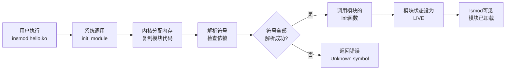

# 4.5.3 动手加载模块

> 所属章节：第4章 Linux内核 > 4.5 内核模块
> 难度：[B→I] | 预计阅读时间：25分钟

## 本节导读

本节教你用手边的命令把内核模块"装进"系统和"请出"系统。学完本节，你将能熟练使用 `insmod`、`rmmod`、`modprobe` 等工具管理模块，就像插拔U盘一样自如。

---

## 知识点1：模块加载与卸载 [B] ~900字

内核模块不是开机就自动进驻内存的，很多时候需要用户手动操作。Linux 提供了三条最基础的命令，分别对应"装进去"、"拔出来"和"看看有哪些"。

### 1.1 insmod —— 把模块塞进内核

`insmod`（insert module）是最直接的加载命令，它接收一个参数：模块文件的路径。

```bash
# 加载当前目录下的 hello.ko
sudo insmod ./hello.ko

# 如果模块带参数，可以这样传
sudo insmod ./hello.ko greeting="Hi" times=3
```

加载成功后，模块的代码和数据就被映射到内核空间，模块的 `init` 函数会被调用。如果一切正常，命令不会输出任何内容（Unix 哲学：没消息就是好消息）。

⚠️ **陷阱**：`insmod` **不会**自动处理依赖！如果你的模块依赖了另一个模块，而那个模块还没加载，`insmod` 会直接报错：

```
insmod: ERROR: could not insert module mydriver.ko: Unknown symbol in module
```

遇到这个错误，先检查被依赖的模块是否已加载，或者改用后面讲的 `modprobe`。

### 1.2 rmmod —— 把模块请出内核

`rmmod`（remove module）用于卸载模块。它接收的是**模块名**，不是文件路径：

```bash
# 正确：使用模块名（不带 .ko）
sudo rmmod hello

# 错误示范：不要把路径传给 rmmod
sudo rmmod ./hello.ko   # ❌ 会报错
```

卸载时，内核会调用模块的 `exit` 函数做清理工作。如果还有其他组件正在使用该模块，`rmmod` 会拒绝卸载并提示 `Module is in use`。

🔴 **危险**：强行卸载一个正在被使用的模块会导致内核崩溃或系统死机！如果确实需要卸载（比如调试驱动），可以先用 `rmmod -f` 强制卸载，但这只应在开发环境使用，**生产环境绝对禁止**。

```bash
# 开发调试用，生产环境禁用！
sudo rmmod -f hello
```

### 1.3 lsmod —— 查看已加载的模块

`lsmod`（list modules）会列出当前内核中所有已加载的模块，信息来自 `/proc/modules`：

```bash
lsmod
```

输出格式如下：

```
Module                  Size  Used by
hello                  16384  0
snd_pcm               110592  1 snd_hda_intel
```

- **Module**：模块名称
- **Size**：模块占用的内存大小（字节）
- **Used by**：引用计数，表示有多少地方正在使用这个模块。如果是数字，表示引用次数；如果后面跟了模块名，表示被哪些模块依赖。

💡 **提示**：把 `lsmod` 和 `grep` 结合使用，可以快速定位目标模块：

```bash
lsmod | grep hello
```

### 模块加载的完整流程

当你执行 `insmod` 时，内核内部经历了什么？下图展示了一个模块从用户空间进入内核空间的全过程：



[图1：insmod 模块加载内核流程图]

---

## 知识点2：modprobe自动加载 [I] ~700字

`insmod` 的硬伤是不会自动处理依赖。现实世界中的模块往往像积木一样层层依赖，比如 WiFi 驱动依赖 MAC 层，MAC 层又依赖总线层。手动按顺序一个个 `insmod` 太痛苦了，`modprobe` 就是来解决这个问题的。

### 2.1 modprobe 的工作方式

`modprobe` 接收的是**模块名**（不是路径），它会自动做三件事：

1. 到 `/lib/modules/$(uname -r)/modules.dep` 中查找依赖关系
2. 按正确的先后顺序加载所有被依赖的模块
3. 最后加载你指定的模块

```bash
# 一键加载 mywifi 及其所有依赖
sudo modprobe mywifi

# 卸载模块及其不再被使用的依赖
sudo modprobe -r mywifi
```

### 2.2 依赖关系是怎么生成的？

`/lib/modules/$(uname -r)/modules.dep` 这个文件不是手写的，而是 `depmod` 命令自动生成的：

```bash
# 重新生成模块依赖数据库（编译安装新模块后必做）
sudo depmod -a

# 查看某个模块的依赖链
modinfo --field depends mywifi
```

💡 **提示**：每次你用 `make modules_install` 安装新模块后，系统会自动运行 `depmod`。如果你手动拷贝 `.ko` 文件到 `/lib/modules/...` 目录下，记得手动运行 `sudo depmod -a`，否则 `modprobe` 找不到它。

### 2.3 modprobe vs insmod 对比

| 场景 | 用哪个命令 |
|------|-----------|
| 模块没有依赖，或正在调试单个模块 | `insmod` |
| 模块有依赖，或不知道依赖关系 | `modprobe` |
| 需要指定完整路径加载自定义模块 | `insmod` |
| 系统启动时自动加载服务所需模块 | `modprobe` |
| 卸载模块并清理无用依赖 | `modprobe -r` |

⚠️ **陷阱**：`modprobe` 只在标准路径 `/lib/modules/$(uname -r)/` 下搜索模块。如果你的模块在 `~/mydriver/` 这类非标准位置，`modprobe` 找不到它，仍然需要使用 `insmod` 并指定完整路径。

💡 **提示**：你可以临时让 `modprobe` 找到自定义路径的模块，通过 `insmod` 加载依赖后，再用 `modprobe --force` 加载目标模块。不过最干净的做法是用 `insmod` 逐个加载，或者把模块安装到标准目录后执行 `depmod -a`。

---

## 知识点3：模块信息查看 [B] ~500字

加载模块之前，了解它是什么、需要什么、作者是谁，都是很有必要的。Linux 提供了两条查看模块信息的途径。

### 3.1 modinfo —— 模块的"身份证"

`modinfo` 读取模块文件中的元数据，展示详细信息：

```bash
# 查看模块信息（可以接路径或模块名）
modinfo ./hello.ko
# 或者
modinfo hello
```

典型输出如下：

```
filename:       /lib/modules/5.15.0/hello.ko
license:        GPL
author:         Your Name <you@example.com>
description:    A simple hello world module
vermagic:       5.15.0 SMP mod_unload modversions
parm:           greeting:Greeting string (charp)
parm:           times:Number of times to print (uint)
depends:
```

关键字段说明：

| 字段 | 含义 |
|------|------|
| `filename` | 模块文件的实际路径 |
| `license` | 许可证，影响能否调用某些内核接口 |
| `depends` | 依赖的其他模块（空表示无依赖） |
| `parm` | 模块支持的参数及类型 |
| `vermagic` | 编译时的内核版本和配置信息 |

⚠️ **陷阱**：如果 `vermagic` 与当前运行内核不匹配，`insmod` 会拒绝加载并提示 `Invalid module format`。这是内核版本不一致导致的，**必须用相同版本内核的头文件重新编译模块**。

### 3.2 /proc/modules —— 内核眼中的模块列表

`/proc/modules` 是一个虚拟文件，内核通过它把已加载模块的原始数据暴露给用户空间。`lsmod` 实际上就是格式化读取这个文件。

```bash
# 直接读取原始数据
cat /proc/modules
```

输出格式：

```
hello 16384 0 - Live 0x0000000000000000 (OE)
snd_pcm 110592 1 snd_hda_intel, Live 0x0000000000000000
```

每一行的字段依次为：**模块名、大小、引用计数、被依赖模块列表、状态、内存地址、标记**。

💡 **提示**：写脚本时如果只需要模块名列表，可以直接解析 `/proc/modules`，比调用 `lsmod | awk` 更轻量：

```bash
# 提取所有已加载模块的名称
cut -d' ' -f1 /proc/modules
```

---

## 本节总结

本节介绍了模块管理的核心命令，汇总如下：

| 命令 | 作用 | 参数类型 | 自动处理依赖 |
|------|------|----------|-------------|
| `insmod` | 加载模块 | 文件路径（可带参数） | ❌ 否 |
| `rmmod` | 卸载模块 | 模块名 | ❌ 否 |
| `modprobe` | 加载/卸载模块 | 模块名 | ✅ 是 |
| `modprobe -r` | 卸载模块及无用依赖 | 模块名 | ✅ 是 |
| `lsmod` | 查看已加载模块 | 无 | — |
| `modinfo` | 查看模块信息 | 路径或模块名 | — |
| `depmod -a` | 生成依赖数据库 | 无 | — |
| `cat /proc/modules` | 原始模块数据 | 无 | — |

记住两条黄金法则：

1. **加载**用 `modprobe`（省心），调试用 `insmod`（灵活）。
2. **卸载**前先用 `lsmod` 确认引用计数，不要强行卸载正在使用的模块。

## 下一步

模块能进能出之后，下一节（4.5.4）我们将深入模块内部，动手写一个带有参数的"Hello Kernel"模块，并理解 `module_init()` 和 `module_exit()` 的底层机制。

---

## 配套资源

### 表格清单
- 表1：模块命令速查表（本节总结中的8命令对比表）

### 图示清单
- 图1：insmod 模块加载内核流程图 [mermaid图]

### 代码清单
- 代码1：`insmod ./hello.ko` 及带参数加载示例
- 代码2：`rmmod hello` 正确与错误用法对比
- 代码3：`lsmod | grep hello` 模块过滤技巧
- 代码4：`modprobe mywifi` 自动加载示例
- 代码5：`depmod -a` 依赖数据库更新
- 代码6：`modinfo ./hello.ko` 信息查看示例
- 代码7：`cut -d' ' -f1 /proc/modules` 脚本化提取模块名
