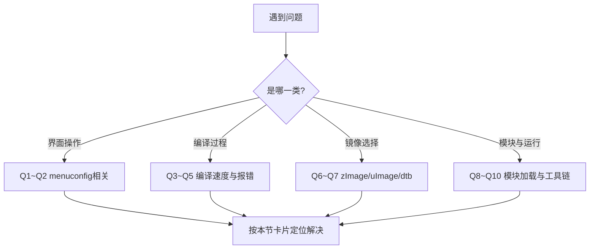

# 4.6.2 常见问题FAQ

> 所属章节：第4章 Linux内核编译与配置 > 4.6 本章总结
> 难度：[B] | 预计阅读时间：12分钟

## 本节导读

内核编译路上，新手90%的时间都花在10个重复问题上。本节把这10个"拦路虎"整理成问答卡片，每个都给出"现象→原因→解法"的三段式答案，让你遇到问题不再盲目搜索。


[图1：FAQ问题分类定位图]

---

## 知识点：10个高频问题速查 [B] ~800字

---

### Q1：menuconfig界面操作不熟悉，怎么退出？怎么保存？

**现象**：进了`make menuconfig`的TUI界面，不知道怎么退出，怕按错键把配置改乱了。

**解法**：menuconfig的快捷键是固定的——`↑↓`移动光标，`Enter`进入子菜单或切换选项，`Space`切换Y/M/N三态，`/`搜索关键词。退出时按`Esc`两次（或选`< Exit >`），退出前会自动提示是否保存，选`< Yes >`即可。

💡 **提示**：改乱了不怕，直接按`Esc`不保存退出，再重新进入即可；或者先用`cp .config .config.bak`备份当前配置。

---

### Q2：几千个配置项，新手应该怎么选？

**现象**：menuconfig里选项太多，不知道哪些该开、哪些该关。

**解法**：永远先执行`make xxx_defconfig`（你的板子默认配置），得到一个**能启动的基础配置**。然后只做增量修改——只开启你需要的驱动或功能，不要从零开始勾选。

⚠️ **陷阱**：看到不明所以的选项就随手关掉，可能导致内核启动失败。不确定的选项保持默认（按`?`看Help说明）。

---

### Q3：链接阶段报错"undefined reference to xxx"

**现象**：编译到末尾时链接器报错，说某个函数未定义。

**解法**：这类错误通常是依赖关系被打破——你手动关了某个子选项，但另一个选项还依赖它。用`/`搜索报错中的符号名，找到对应的CONFIG_选项，检查其依赖是否已开启。最快修复：`make distclean`后重新用defconfig起步。

---

### Q4：编译时间太长，每次改一行代码都要等几十分钟？

**现象**：内核编译耗时久，调试效率低。

**解法**：① 用`make -j$(nproc)`启用全部CPU核心并行编译；② 只改驱动时，用`make M=drivers/xxx/`局部编译模块；③ 确保启用了`ccache`缓存重复编译结果。

```bash
# 启用ccache加速（首次配置）
export CC="ccache arm-linux-gnueabihf-gcc"
make ARCH=arm CROSS_COMPILE=arm-linux-gnueabihf- -j$(nproc)
```

---

### Q5：生成的内核镜像太大，启动失败或烧录不下

**现象**：`zImage`或`uImage`体积超过板子Bootloader的限制（如U-Boot的`bootm`有大小限制）。

**解法**：用`make menuconfig`关闭不需要的功能和驱动。最立竿见影的三刀：① 关闭不需要的文件系统（如`CONFIG_XFS_FS`）；② 关闭未使用的网卡/USB驱动；③ 关闭调试符号`CONFIG_DEBUG_INFO`。

💡 **提示**：用`ls -lh arch/arm/boot/zImage`随时查看当前体积，`make kernelversion`确认你编译的是目标版本。

---

### Q6：zImage和uImage到底该选哪个？

**现象**：编译后同时看到`zImage`和`uImage`，不知道拷贝哪个到目标板。

**解法**：看Bootloader。如果你用**老版本U-Boot**（不支持`bootz`命令），必须生成并拷贝`uImage`；如果用**新版U-Boot**或**其他Bootloader**（支持`bootz`），直接用`zImage`更省事。生成uImage需要额外配置`CONFIG_UIMAGE`并指定加载地址。

```bash
# 查看U-Boot是否支持 bootz
U-Boot> help bootz
# 有输出就用 zImage；没有就用 uImage
```

---

### Q7：启动时提示dtb文件找不到，或者"Failed to load device tree"

**现象**：内核启动失败，U-Boot提示找不到`.dtb`文件。

**解法**：先确认你的板子对应哪个dts文件（在`arch/arm/boot/dts/`目录下搜索你的芯片型号，如`imx6ull`）。编译后dtb应该出现在`arch/arm/boot/dts/`下。启动时U-Boot需要同时加载`zImage`和对应的`dtb`，并传给内核。

⚠️ **陷阱**：dtb文件名必须与U-Boot启动命令中指定的完全一致（包括大小写），很多板子需要重命名为`xxx.dtb`放到boot分区。

---

### Q8：模块加载时报"invalid module format"

**现象**：把`.ko`文件拷贝到板子上，`insmod`时报格式无效。

**解法**：这个错误99%是因为**模块和当前运行的内核版本不匹配**。检查两者的`uname -r`输出是否一致。也可能是用本机gcc（非交叉编译器）编译了模块。修复：确保编译内核和编译模块时`ARCH`、`CROSS_COMPILE`以及内核源码路径完全一致。

```bash
# 板子上查看当前内核版本
uname -r
# 模块文件中查看编译时的版本
modinfo your_module.ko | grep vermagic
```

---

### Q9：我只改了设备树dts文件，怎么只编译dtb不重新编译整个内核？

**现象**：改了一行dts里的GPIO编号，不想等半小时完整编译。

**解法**：内核编译系统支持单独编译设备树。执行以下命令即可秒级生成dtb：

```bash
# 单独编译指定dtb（以imx6ull为例）
make ARCH=arm CROSS_COMPILE=arm-linux-gnueabihf- imx6ull-14x14-evk.dtb

# 或编译全部dtb
make ARCH=arm CROSS_COMPILE=arm-linux-gnueabihf- dtbs
```

💡 **提示**：.dtb文件生成后，直接拷贝到目标板的boot分区替换旧文件即可，无需重新烧录整个系统。

---

### Q10：交叉编译器版本和内核版本不匹配会怎样？

**现象**：不确定手头的arm-gcc能不能编译当前内核。

**解法**：内核源码根目录的`Makefile`开头有`minimum GNU make version`和GCC版本建议。最可靠的方法是直接执行编译，如果版本不兼容，内核会在配置阶段（甚至编译早期）明确报错`Your compiler is too old`。出现此报错就去下载对应版本的Linaro或ARM官方编译器，不要强行绕过检查。

🔴 **危险**：强行修改内核Makefile跳过版本检查，编译可能通过，但生成的二进制存在ABI隐患，板上启动时会出现随机崩溃，极难排查。

---

## 本节总结

| 问题编号 | 问题类别 | 核心原因 | 快速解法 |
|---------|---------|---------|---------|
| Q1 | menuconfig操作 | 不熟悉TUI快捷键 | `Esc`退出，`/`搜索，`?`看帮助 |
| Q2 | 配置项太多 | 从零开始勾选 | 先用`make xxx_defconfig`打底 |
| Q3 | 链接报错 | 依赖关系被破坏 | 搜索符号→检查依赖→或clean重配 |
| Q4 | 编译太慢 | 未充分利用并行 | `-j$(nproc)` + `ccache` + 局部编译 |
| Q5 | 镜像太大 | 功能全开未裁剪 | 关文件系统/驱动/调试符号 |
| Q6 | zImage vs uImage | 不清楚Bootloader需求 | 看U-Boot是否支持`bootz` |
| Q7 | dtb找不到 | 文件名错误或没拷贝 | 核对dts文件名与U-Boot加载命令 |
| Q8 | 模块格式无效 | 版本或编译器不匹配 | `uname -r`与`modinfo`交叉核对 |
| Q9 | 只想编译dtb | 不知道局部编译命令 | `make xxx.dtb`单独编译 |
| Q10 | 工具链版本 | 内核要求新版本GCC | 看Makefile要求，换官方编译器 |

[表1：10个高频问题FAQ速查表]

---

## 下一步

第4章的内核编译之旅到此结束。你现在已经掌握了从源码到可启动镜像的完整技能链。第5章将带你进入**根文件系统**的世界——学习如何构建一个能让内核"住得舒服"的最小用户空间环境。

---

## 配套资源

### 表格清单
- 表1：10个高频问题FAQ速查表

### 图示清单
- 图1：FAQ问题分类定位图 [mermaid图]

### 代码清单
- 代码1：单独编译dtb命令示例
- 代码2：启用ccache加速编译命令示例
- 代码3：查看模块版本信息命令示例
