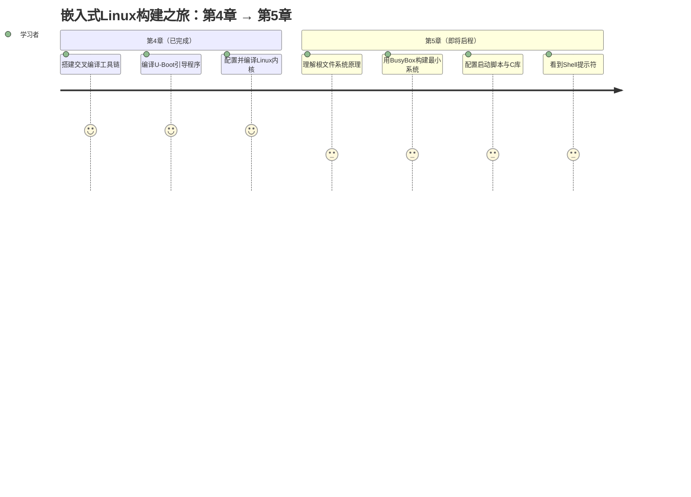

# 4.6.3 下一步预告

> 所属章节：第4章 Linux内核构建之旅 > 4.6 本章总结与展望
> 难度：[B] | 预计阅读时间：5分钟

## 本节导读

恭喜你，已经完成了Linux内核的配置、编译和镜像生成！但一个仅有内核的系统就像一辆只有发动机却没有方向盘和座椅的汽车——它**能运转，却无法驾驶**。本节将为你揭示嵌入式Linux启动的最后一块拼图：**根文件系统（Root Filesystem）**，并预告第5章的学习蓝图。

## 知识点1：从内核到完整系统——第5章预告 [B] ~450字

### 为什么内核还不够？

当你把第4章编译出的内核烧录进开发板并上电时，你会在串口终端看到内核飞速打印初始化日志，然后画面突然停在一个让人困惑的错误上：

```
[    3.456789] VFS: Cannot open root device "(null)" or unknown-block(0,0)
[    3.467890] Please append a correct "root=" boot option
[    3.478901] Kernel panic - not syncing: VFS: Unable to mount root fs
```

🔴 **危险**：这个`Kernel panic`不是内核崩溃，而是内核**找不到根文件系统**，无法继续启动用户空间。这是每个嵌入式开发者的"成人礼"。

内核只负责管理硬件和提供系统调用。而应用程序需要的**命令解释器（Shell）**、**共享库（libc等）**、**配置文件**、**设备节点**，全部存放在根文件系统中。没有它，内核完成初始化后就"无家可归"了。

### 第5章我们将学什么？

第5章将带你在裸机上构建一个能跑起来的最小Linux系统。核心任务包括：

1. **理解根文件系统的本质**：它为什么特殊？最小需要哪些文件？
2. **用BusyBox打造瑞士军刀**：一个可执行文件就能提供上百个Unix命令
3. **构建目录骨架**：创建 `/bin`、`/lib`、`/etc`、`/dev` 等标准目录
4. **交叉编译C库**：把glibc或musl移植到目标架构
5. **制作可烧录镜像**：将目录打包成ext4、initramfs或squashfs格式
6. **见证奇迹时刻**：调整bootargs，让U-Boot把内核和根文件系统一起启动——最终看到那个梦寐以求的提示符：

```bash
# 这就是胜利的标志
root@embedded:~# 
```

### 学习旅程图



### 第4章 vs 第5章对比

| 维度 | 第4章：内核编译 | 第5章：根文件系统 |
|------|----------------|------------------|
| **核心产出** | zImage/uImage 内核镜像 | 可挂载的目录或镜像文件 |
| **关键工具** | make、menuconfig、交叉编译器 | BusyBox、Buildroot/Yocto（可选） |
| **目标** | 让硬件"听得懂"系统指令 | 让用户能"操作"系统 |
| **启动顺序** | 第2阶段（内核阶段） | 第3阶段（用户空间阶段） |
| **可见成果** | 内核启动日志 | **Shell提示符 + 可执行命令** |

### 给初学者的小建议

💡 **提示**：在第5章开始之前，建议你现在就备份好第4章的成果——保存你的`.config`内核配置文件和编译好的镜像。第5章我们会把这些组件真正"拼"在一起，你将第一次拥有一套**完整的、可启动的嵌入式Linux系统**。

⚠️ **陷阱**：很多新手误以为把Ubuntu的SD卡镜像直接拷贝到开发板就能工作。不同架构的ARM板需要**交叉编译**的库和可执行文件，x86的Ubuntu根文件系统无法直接在ARM板上运行。第5章会手把手教你从零构建正确架构的根文件系统，避开这个深坑。

## 本节总结

| 概念 | 要点 | 操作 |
|------|------|------|
| 根文件系统 | 内核启动后挂载的第一个文件系统，包含用户空间所需的一切 | 第5章将用BusyBox构建 |
| Kernel Panic | 并非内核崩溃，通常是找不到根文件系统 | 通过`root=`启动参数和正确镜像解决 |
| BusyBox | 被称为"嵌入式Linux的瑞士军刀"，提供精简版Unix工具集 | 下载源码→交叉编译→安装到目标目录 |
| 完整启动链 | Bootloader → 内核 → 根文件系统 → init进程 → Shell | 第5章结尾将打通整条链路 |

## 下一步

休整一下，准备好一块空白SD卡或分区，我们将在第5章《根文件系统构建实战》中，让你的开发板第一次说出：

```
Welcome to Embedded Linux!
root@embedded:~# █
```

光标在闪，故事继续。

---

## 配套资源

### 表格清单
- 表1：第4章 vs 第5章学习内容对比
- 表2：本节核心概念总结表

### 图示清单
- 图1：Kernel panic（无法挂载根文件系统）的串口终端输出截图 [配图说明]
- 图2：成功启动后显示Shell提示符的终端界面截图 [配图说明]
- 图3：嵌入式Linux构建之旅（第4章→第5章）[mermaid图]

### 代码清单
- 代码1：根文件系统缺失时的内核panic日志示例
- 代码2：成功启动后的Shell提示符示例
