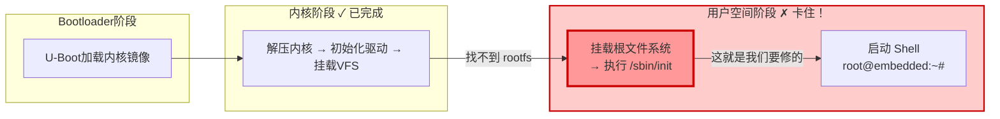

# 5.1.1 内核启动的最后一条消息

> 所属章节：第5章 根文件系统构建实战 > 5.1 内核启动的最后一步
> 难度：[B] | 预计阅读时间：10分钟

## 本节导读

回到第4章结尾，你的内核编译完成、烧录上板，串口终端上却停在一行刺眼的红字上。本节带你逐字读懂这条消息，搞清楚内核到底"卡"在了哪里——以及为什么本章的任务就是解决它。

---

## 知识点1：那条让人心跳骤停的红字 [B] ~500字

### 你还记得这个画面吗？

把第4章编译好的内核烧进开发板，上电，看着启动日志像瀑布一样滚过屏幕——CPU型号检测通过、内存初始化完成、设备树解析成功、驱动一个个加载……一切都在向好的方向发展。

然后，屏幕突然停住了。最后一行是刺眼的红色：

```
[    3.456789] VFS: Cannot open root device "(null)" or unknown-block(0,0)
[    3.467890] Please append a correct "root=" boot option
[    3.478901] Kernel panic - not syncing: VFS: Unable to mount root fs on unknown-block(0,0)
[    3.489012] CPU: 0 PID: 1 Comm: swapper/0 Not tainted 6.1.0-g1234567 #1
[    3.500123] Hardware name: TI AM335x BeagleBone Black
[    3.511234] Backtrace:
[    3.522345]  [<c0109ab0>] (dump_backtrace) from [<c0109d40>] (show_stack+0x20/0x24)
[    3.533456]  ...
```

🔴 **危险**：看到 `Kernel panic` 四个字，很多新手的第一反应是"内核崩溃了"——其实**内核运转良好**，它只是站在门口发现没有钥匙，于是选择停下来等你。

### 逐行拆解这条消息

| 日志行 | 含义 | 内核在说什么 |
|--------|------|-------------|
| `VFS: Cannot open root device "(null)"` | 虚拟文件系统找不到根设备 | "你启动参数里没告诉我根文件系统在哪里" |
| `unknown-block(0,0)` | 设备号(0,0)无法识别 | "我也不知道这个设备号对应什么存储介质" |
| `Please append a correct "root=" boot option` | 提示解决方案 | "请在bootargs里加上 `root=/dev/mmcblk0p2` 之类的参数" |
| `Kernel panic - not syncing` | 内核主动停止 | "我没地方去了，只能停在这里等你修好环境" |
| `Comm: swapper/0` | 出问题的进程 | 这是内核的0号进程（idle进程演化来的init进程） |

💡 **提示**：`Kernel panic` 不等于内核崩溃。它更像是内核的"安全刹车"——发现继续运行下去也没有意义（没有文件系统、没有init程序），于是主动挂起，把现场保留给你调试。

### 为什么内核会"无家可归"？



[图1：启动流程图——内核完成初始化后，在挂载根文件系统处卡住]

上图展示了完整的启动链路。第4章我们搞定了前两步：Bootloader把内核送进内存，内核完成自身初始化。现在内核站在第三步的门口，却发现**根文件系统（root filesystem）**这个"新家"根本不存在——没有 `/bin`、`/sbin/init`、没有 Shell、没有任何用户空间程序。

这就好比你买了一辆精心改装的跑车（内核），发动了引擎，却发现目的地连路都没修好（没有根文件系统）。车没坏，只是无处可去。

⚠️ **陷阱**：有些开发板会反复重启而不是停住，是因为内核配置了 `panic_timeout` 参数。如果在bootargs里看到 `panic=3`，内核挂起3秒后会自动重启，让你误以为是硬件不稳定。解决方法是去掉 `panic` 参数，或者在调试阶段改为 `panic=-1`（永不自动重启）。

💡 **提示**：在U-Boot命令行里临时修改启动参数，可以让内核尝试从不同的位置找根文件系统。试试这条命令，观察错误信息的变化：
```bash
# 在U-Boot提示符下临时指定SD卡第二分区为根文件系统
setenv bootargs 'console=ttyS0,115200 root=/dev/mmcblk0p2 rw'
boot
```
如果SD卡上并没有正确的文件系统，你会看到错误从 `unknown-block(0,0)` 变成类似 `VFS: Cannot find a valid ext4 filesystem on mmcblk0p2`——这说明内核至少找到了设备，只是里面的数据不对。这是第5章要解决的精确问题。

---

## 本节总结

| 概念 | 要点 | 判断标志 |
|------|------|---------|
| `Kernel panic` | 不是内核崩溃，而是主动停止等待修复 | 串口打印后停住，LED常亮 |
| `Unable to mount root fs` | 缺少根文件系统或启动参数错误 | 日志中出现 `unknown-block` |
| `root=` 参数 | 告诉内核从哪里挂载根文件系统 | U-Boot的 `bootargs` 环境变量 |
| 本章使命 | 构建根文件系统，打通启动链的最后一步 | 最终看到 `root@embedded:~#` |

## 下一步

 panic 消息已经读懂了——它不是死刑判决书，而是一张明确的"施工图纸"，告诉我们缺什么、补哪里。下一节（5.1.2），我们先建立根文件系统的整体认知：它为什么叫"根"？最小需要哪些目录和文件？有了地图，才好动手建造。

---

## 配套资源

### 表格清单
- 表1：内核panic日志逐行解读表（4行关键日志详解）
- 表2：本节核心概念总结表

### 图示清单
- 图1：启动流程图——内核在挂载根文件系统处卡住 [mermaid流程图]
- 图2：真实串口终端显示Kernel panic的截图 [配图说明：PuTTY/minicom串口终端，红色panic信息高亮]

### 代码清单
- 代码1：根文件系统缺失时的完整内核panic日志示例
- 代码2：U-Boot中临时修改bootargs指向SD卡分区的命令
