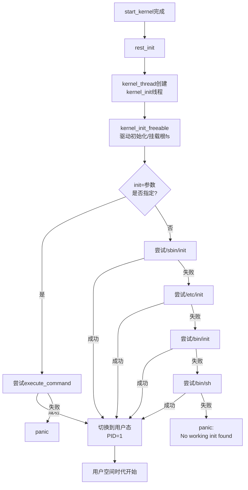

# 5.1.2 init进程：Linux世界的"亚当"

> 所属章节：第5章 用户空间启航 > 5.1 从内核到用户空间的最后一跃
> 难度：[I→I] | 预计阅读时间：15分钟

## 本节导读
本节带你揭开Linux系统中1号进程的神秘面纱——从内核如何"接生"init，到它为何被称为所有进程的"始祖"，读完你能独立追踪嵌入式设备的启动失败问题。

---

## 知识点1：init进程的诞生 [I] ~800字

在上一节中，我们讲到`start_kernel()`完成内核初始化后，会调用`rest_init()`。这个函数看似"休息"，实则是Linux启动过程中最忙的阶段之一——它要做一件历史性的大事：**创建系统中的第一个用户空间进程**。

### 从内核线程到用户进程

`rest_init()`首先调用`kernel_thread(kernel_init, NULL, CLONE_FS)`创建了一个内核线程。这个线程会执行`kernel_init()`函数，但它此时还运行在内核态。为了让这个进程"下凡"到用户空间去执行普通程序，内核采用了一个巧妙的方法——**连续尝试执行一系列可执行文件**，一旦某个文件执行成功，当前线程就摇身一变，从内核线程切换为用户空间进程。

这个"变身"过程通过`do_execve()`系统调用完成，它会把当前进程的地址空间替换为目标程序的内容，同时从内核态切换到用户态。这就像是给灵魂换了一副肉身——PID不变，但里面运行的已经是完全不同的程序了。

### kernel_init()的"寻宝"之旅

在`init/main.c`中，`kernel_init()`函数完成内核初始化收尾工作后，会按固定顺序寻找init程序。这个搜索逻辑就像一个执着的寻宝者：找到了就停止，找不到就继续下一个，直到全部尝试完毕。

```c
/* init/main.c 中 kernel_init() 的核心逻辑 */
static int __ref kernel_init(void *unused)
{
    int ret;

    kernel_init_freeable();      /* 完成驱动初始化、挂载根文件系统等 */
    async_synchronize_full();
    free_initmem();               /* 释放初始化时占用的内存 */
    system_state = SYSTEM_RUNNING;
    ...
    /* 第1步：如果指定了init=参数，先尝试它 */
    if (execute_command) {
        ret = run_init_process(execute_command);
        if (!ret) return 0;       /* 成功执行，本函数不再返回 */
        panic("Requested init %s failed", execute_command);
    }

    /* 第2~5步：依次尝试默认路径 */
    if (!try_to_run_init_process("/sbin/init") ||
        !try_to_run_init_process("/etc/init") ||
        !try_to_run_init_process("/bin/init") ||
        !try_to_run_init_process("/bin/sh"))
        return 0;

    /* 全部失败，系统panic */
    panic("No working init found. Try passing init= option to kernel.");
}
```

### init搜索路径一览

| 优先级 | 路径 | 说明 | 典型场景 |
|:------:|:------|:------|:---------|
| 0 | `execute_command`（`init=`参数指定） | 用户自定义init路径 | 嵌入式设备使用自定义启动器 |
| 1 | `/sbin/init` | System V init、systemd等标准位置 | 大多数桌面/服务器发行版 |
| 2 | `/etc/init` | 早期Unix传统路径 | 嵌入式精简系统 |
| 3 | `/bin/init` | 备用路径 | BusyBox构建的init |
| 4 | `/bin/sh` | 最后的救命稻草 | 系统严重损坏时的应急shell |

⚠️ **陷阱**：很多嵌入式开发者修改了init路径却忘记更新，导致内核找不到init而panic。如果看到启动日志最后出现`No working init found`，请先用`init=`参数指定正确路径（如`init=/bin/busybox`）进入系统排查。

💡 **提示**：现代内核启动时会在控制台打印`Run /sbin/init as init process`这样的日志，告诉你它正在尝试哪个init。这是定位启动问题的第一个线索。

[图1：init进程诞生流程图]



---

## 知识点2：init的重要性 [I] ~500字

如果Linux世界有一部《创世纪》，那init进程就是里面的"亚当"——它是第一个被"创造"出来的用户空间生命，此后所有的进程都是它的后代。

### PID=1：独一无二的身份

在Linux中，进程ID（PID）1被永久保留给init进程。这个号码不是普通的编号，它代表着**整个用户空间世界的起点**。你可以在任何Linux系统中运行下面这条命令验证：

```bash
# 查看PID=1的进程
ps -p 1 -o pid,ppid,comm,args
```

在桌面系统上，输出通常是`systemd`；在嵌入式设备上，可能是`init`（SysVinit）或`busybox`。但无论名字是什么，PID一定是1。

### 所有进程的祖先

当你用`pstree`命令查看进程树时，会发现所有用户进程的根节点都指向init。它就像一棵大树的根——没有根，树枝和树叶都无法存在。

### 孤儿进程的"收养所"

init还有一个不为人知的职责：**收尸人**。当一个进程的父进程先于它退出时，这个进程就成了"孤儿"。Linux内核会自动把这个孤儿进程的PPID（父进程ID）改为1，也就是交给init收养。init进程会在这些子进程退出时调用`wait()`回收它们的资源，防止系统中积累大量"僵尸进程"。

🔴 **危险**：在嵌入式系统中，如果你编写了一个守护程序并将其作为PID 1运行（比如直接用自定义程序替换init），这个程序**必须**实现收养孤儿进程的逻辑。否则，任何父进程先退出的子进程都会变成僵尸，最终导致系统资源耗尽。这也是为什么自制init程序比想象中更复杂的原因。

💡 **提示**：在开发板调试阶段，可以用`/bin/sh`作为init（通过`init=/bin/sh`内核参数），这样启动后直接进入root shell，方便排查根文件系统或驱动问题。但记住这只是调试手段，不能用于量产！

---

## 本节总结

| 概念 | 要点 | 操作/验证 |
|:------|:------|:----------|
| init进程 | 第一个用户空间进程，PID=1 | `ps -p 1`查看 |
| 搜索路径 | 按优先级依次尝试5个位置 | 通过内核日志`Run xxx as init`确认 |
| 内核参数 | `init=`可自定义init路径 | 在bootloader中设置，如`init=/bin/busybox` |
| 收养孤儿 | 内核将孤儿进程的父进程设为init | init必须能`wait()`回收子进程 |
| 应急启动 | `init=/bin/sh`可绕过init直接进shell | 仅用于调试，不可量产 |

## 下一步

现在你已经知道init是如何被内核"接生"出来的。但它被启动后具体做了什么？下一节我们将深入init程序的内部，看看它如何一步步把整个系统从"毛坯房"变成"精装修"——包括挂载文件系统、启动服务、配置网络等。

---

## 配套资源

### 表格清单
- 表1：init搜索路径优先级表（5个优先级、路径、说明、典型场景）

### 图示清单
- 图1：init进程诞生流程图 [mermaid图] — 展示从start_kernel到用户空间的完整流程

### 代码清单
- 代码1：`init/main.c`中`kernel_init()`核心搜索逻辑
- 代码2：查看PID=1进程的`ps`命令
