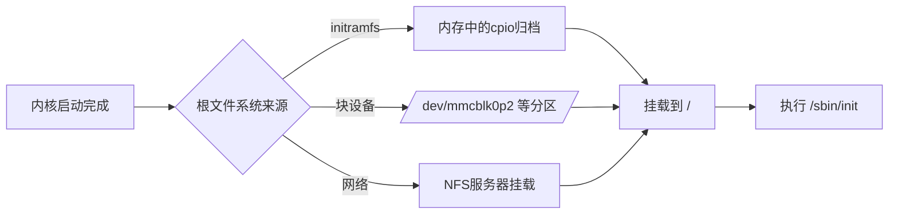

# 5.1.3 根文件系统：init的"家"

> 所属章节：第5章 构建完整嵌入式系统 > 5.1 根文件系统基础
> 难度：[I→M] | 预计阅读时间：10分钟

## 本节导读
本节带你理解根文件系统的本质——它是Linux内核启动后第一个挂载的文件系统，也是init进程赖以生存的"家"。学完后，你能说清楚根文件系统里至少要有哪些东西，并能动手查看一个真实系统的根目录结构。

---

## 知识点1：根文件系统概念——init必须有个"落脚处" [I] ~700字

### 把根文件系统比作"精装空房"

想象你买了一套**精装空房** [图1：精装空房类比图]：房子本身有墙壁、地板、门窗（基础设施），但没有家具和住户（应用程序）。你需要先搬进去一张床（init程序）才能住人，再慢慢添置衣柜、书桌（各种工具和库）。

根文件系统（Root Filesystem）就是这个"精装空房"——它是Linux内核启动后挂载的第一个文件系统，通常挂载到`/`目录。内核启动的最后一步就是查找并执行`/sbin/init`（或`/init`、`/linuxrc`），如果找不到，系统就会 panic 报错：

```
Kernel panic - not syncing: No working init found.
```

没有根文件系统，内核就像一台发动机装好了却没有车身的汽车——能转，但哪儿也去不了。

### 最小根文件系统的四大"家具"

一个能让init成功运行的最小根文件系统，必须包含以下四类内容：

```
/
├── bin/           # 基本命令（busybox提供）
├── dev/           # 设备节点（console、null、zero等）
├── etc/           # 配置文件（inittab、fstab等）
├── lib/           # 共享库（libc等）
├── sbin/          # 系统命令（init就在这里！）
├── tmp/           # 临时文件
└── var/           # 可变数据
```

| 组成部分 | 作用说明 | 不带的后果 |
|---------|---------|-----------|
| 目录结构 | 给文件一个"收纳柜"，让路径有意义 | 文件无处安放，命令找不到 |
| 设备节点 | 让应用程序能读写硬件（如`/dev/console`） | init无法输出信息，shell无法交互 |
| init程序 | 第一个用户态进程，PID=1，负责"带娃"（启动其他进程） | 内核直接panic，系统停止 |
| 基本配置 | 告诉init怎么启动终端、挂载哪些分区 | 启动后黑屏或进不了命令行 |

🔴 **危险**：根文件系统不是内核镜像（zImage/uImage）的一部分！很多初学者以为编译完内核就万事大吉，结果启动时卡在"VFS: Cannot open root device"——这是因为你没把根文件系统放到内核能找到的地方（SD卡分区、NFS服务器、initramfs等）。

### 操作步骤：查看你当前系统的根文件系统

1. **查看根目录挂载点**

```bash
# 代码1：查看根文件系统挂载信息
$ mount | grep "on / "
/dev/mmcblk0p2 on / type ext4 (rw,relatime)
```

2. **浏览最小根文件系统的必备目录**

```bash
# 代码2：查看根目录结构
$ ls /
bin  dev  etc  lib  proc  sbin  tmp  usr  var

# 代码3：确认init程序存在
$ ls -l /sbin/init
lrwxrwxrwx 1 root root 20 Jan 15 08:30 /sbin/init -> /bin/busybox

# 代码4：查看关键设备节点
$ ls -l /dev/console /dev/null
crw------- 1 root root 5, 1 Jan 15 08:30 /dev/console
crw-rw-rw- 1 root root 1, 3 Jan 15 08:30 /dev/null
```

💡 **提示**：在嵌入式系统中，根文件系统通常只有几MB到几十MB。BusyBox工具集可以把几百个常用命令打包成一个可执行文件（约1-2MB），是嵌入式根文件系统的"神器"。

⚠️ **陷阱**：手动创建设备节点时容易搞错主次设备号。例如`/dev/console`的主设备号是5，次设备号是1；`/dev/null`的主设备号是1，次设备号是3。如果写错，应用程序open()时会返回-ENODEV（设备不存在）。

### 根文件系统从哪儿来？

内核找到根文件系统有三种常见方式：



[图1：根文件系统挂载来源示意图]

对于嵌入式开发板，最常见的是**initramfs**（启动阶段临时根文件系统）或**SD卡分区**（持久化存储）。后续小节会手把手教你用BusyBox构建一个最小根文件系统。

---

## 本节总结

| 概念 | 核心要点 | 自查操作 |
|------|---------|---------|
| 根文件系统 | 内核挂载的第一个文件系统，是用户空间的起点 | `mount \| grep "on / "` |
| 最小构成 | 目录结构 + 设备节点 + init程序 + 基本配置 | `ls / && ls /dev && file /sbin/init` |
| 常见来源 | initramfs、SD卡分区、NFS | 查看bootargs中的`root=`参数 |
| BusyBox | 一个程序替代几百个Linux命令 | `ls -l /bin/ \| head` |

---

## 下一步
你已经知道了根文件系统是init的"家"，也知道了"精装空房"里至少要有哪些"家具"。下一节（5.1.4）我们将动手用BusyBox搭建一个真实可用的最小根文件系统，从"空房"变成"能住人的家"。

---

## 配套资源

### 表格清单
- 表1：最小根文件系统的四大组成部分及作用
- 表2：本节总结自查表

### 图示清单
- 图1：根文件系统挂载来源示意图 [mermaid图]
- 图2：精装空房类比图 [配图说明：一套简约风格的空房间，有门框、地板、窗户，但只放了一张小床，寓意"最小根文件系统"]

### 代码清单
- 代码1：查看根文件系统挂载信息（`mount \| grep "on / "`）
- 代码2：查看根目录结构（`ls /`）
- 代码3：确认init程序存在（`ls -l /sbin/init`）
- 代码4：查看关键设备节点（`ls -l /dev/console /dev/null`）
