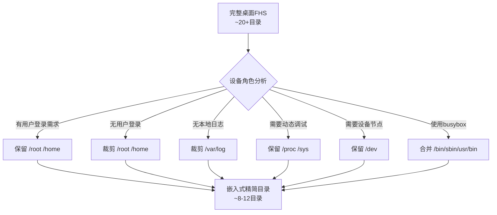

# 5.2.1 FHS标准与嵌入式裁剪

> 所属章节：第5章 根文件系统构建 > 5.2 根文件系统概述
> 难度：[B] | 预计阅读时间：15分钟

## 本节导读

本节带你认识 Linux 的文件系统"交通规则"——FHS 标准，并学会根据嵌入式设备的资源限制，从桌面系统的庞大目录中裁剪出真正需要的部分。学完本节，你能看懂任何 Linux 系统的目录布局，并判断嵌入式 rootfs 中哪些目录可以精简。

---

## 知识点1：FHS标准与桌面vs嵌入式对比 [B][M] ~600字

### 什么是FHS

FHS（Filesystem Hierarchy Standard，文件系统层次结构标准）是 Linux 社区约定的一套"目录使用规范"，好比城市道路的规划图——它规定了每个目录应该放什么类型的文件，让所有 Linux 发行版保持一致。目前最新版本是 FHS 3.0（2015年发布）。

在桌面 Linux（如 Ubuntu、Fedora）上，根目录下通常有 20 多个目录：

```bash
# 在桌面Linux上查看根目录结构
$ ls /
bin  boot  dev  etc  home  lib  lib64  media  mnt  opt  proc  root  
run  sbin  srv  sys  tmp  usr  var
```

这么多目录加起来，一个桌面系统的根文件系统动辄占用 **2~5GB**。而嵌入式设备（比如一个路由器或工控板）的 Flash 往往只有 **8MB~128MB**，不可能全盘照搬。

### 核心裁剪原则

嵌入式裁剪的核心思路是三个字：**按需保留**。我们根据 FHS 的"必需/可选"分类，结合嵌入式设备的实际用途，判断每个目录是去是留。

下图展示了从完整 FHS 到嵌入式裁剪的决策过程：



[图1：FHS裁剪决策流程图]

### 桌面 vs 嵌入式目录对比

下表列出常见目录在桌面系统与嵌入式系统中的存在情况：

| 目录 | FHS分类 | 桌面系统 | 典型嵌入式 | 说明 |
|------|---------|----------|------------|------|
| `/bin` | **必需** | 存在 | **保留** | 基础用户命令 |
| `/sbin` | **必需** | 存在 | **保留** | 系统管理命令 |
| `/etc` | **必需** | 存在 | **保留** | 配置文件 |
| `/dev` | **必需** | 存在 | **保留** | 设备节点 |
| `/lib` | **必需** | 存在 | **保留** | 共享库 |
| `/proc` | **必需** | 存在 | **保留** | 内核虚拟文件系统 |
| `/sys` | **必需** | 存在 | **保留** | 设备/驱动信息 |
| `/tmp` | **必需** | 存在 | **保留** | 临时文件（常挂载tmpfs） |
| `/usr` | 可选 | 存在 | **常裁剪** | 用户程序（busybox已合并） |
| `/home` | 可选 | 存在 | **常裁剪** | 普通用户主目录 |
| `/root` | 可选 | 存在 | **可选保留** | root用户主目录 |
| `/var` | 可选 | 存在 | **常裁剪** | 可变数据/日志 |
| `/boot` | 可选 | 存在 | **常裁剪** | 引导文件（Bootloader已处理） |
| `/media` / `/mnt` | 可选 | 存在 | **常裁剪** | 可移动介质挂载点 |
| `/opt` | 可选 | 存在 | **常裁剪** | 附加应用软件包 |

[表1：桌面Linux与嵌入式系统目录对比表]

⚠️ **陷阱**：不要以为`/usr`可以随便删掉。在 glibc 系統上，`/lib`通常是指向`/usr/lib`的软链接。删除前务必确认是否有符号链接依赖。

💡 **提示**：查看当前系统的 FHS 合规性，可阅读系统自带的文档：`cat /usr/share/doc/debian-policy/fhs/fhs.txt.gz`（Debian系）或在线访问 [refspecs.linuxfoundation.org/fhs.shtml](https://refspecs.linuxfoundation.org/fhs.shtml)。

🔴 **危险**：裁剪前先备份！一次误删 `/lib` 或 `/etc` 会导致系统无法启动，只能通过重新烧录镜像恢复。

---

## 知识点2：嵌入式关键目录详解 [B] ~500字

嵌入式系统最少只需要 **8 个目录** 就能运行一个带有 shell 的 Linux 系统。下面逐一说明这些目录的作用和嵌入式场景下的特殊注意事项。

### 关键目录功能一览

| 目录 | 存放内容 | 嵌入式中的特殊处理 | 缺少后果 |
|------|----------|-------------------|----------|
| `/bin` | 所有用户都可执行的基础命令（`ls`、`cp`、`cat`、`sh`） | busybox 提供多命令合一，通常直接放 `/bin` | 无法执行任何基础命令 |
| `/sbin` | 系统管理命令（`ifconfig`、`reboot`、`insmod`） | 小型系统常与 `/bin` 合并 | 无法配置网络/加载驱动 |
| `/etc` | 系统配置文件（启动脚本、网络配置、服务配置） | 通常是只读分区，运行时通过 overlay 修改 | 系统无法完成初始化 |
| `/dev` | 设备节点文件（`/dev/ttyS0`、`/dev/mmcblk0`） | 使用 `mdev` 或 `udev` 动态创建，或预置静态节点 | 无法访问串口、存储等硬件 |
| `/proc` | 内核运行时信息（进程列表、CPU/内存状态） | 启动时必须挂载：`mount -t proc proc /proc` | `ps`、`top` 等命令失效 |
| `/sys` | 内核设备模型信息（总线、驱动、设备属性） | 启动时必须挂载：`mount -t sysfs sys /sys` | 无法通过文件接口操作硬件 |
| `/tmp` | 程序运行时临时文件 | 通常挂载为内存文件系统 `tmpfs`，重启后自动清空 | 程序无法创建临时文件 |
| `/lib` | 共享库（`libc.so`、`libm.so` 等） | 用 `arm-linux-gnueabihf-strip` 去除调试符号，可减小50%体积 | 所有动态链接程序无法运行 |

[表2：嵌入式关键目录功能表]

### 操作：在嵌入式板上检查这些目录

登录到你的嵌入式开发板后，用以下命令查看目录结构：

```bash
# 查看根目录下有哪些内容
ls /

# 检查 /bin 里有哪些命令（busybox 通常以软链接形式提供）
ls -l /bin | head -20

# 查看 /lib 里的动态库大小（嵌入式中库文件占空间最大）
ls -lh /lib/*.so* | head -10

# 检查 /proc 是否已挂载
mount | grep proc

# 查看 /etc 里的关键配置文件
ls /etc/init.d /etc/network /etc/fstab 2>/dev/null
```

### 静态设备节点 vs 动态设备节点

在早期的嵌入式系统中，`/dev` 目录里的设备节点是**静态**预置的——构建 rootfs 时就创建好几百个节点文件，不管硬件是否存在。这种方式简单但浪费空间。

现代嵌入式系统普遍采用**动态**方式：内核通过 `udev` 或更轻量的 `mdev`（busybox 提供）在设备插入或驱动加载时自动创建节点。

```bash
# 检查你的系统使用静态还是动态设备节点
# 如果存在 /dev/udev 或运行着 udevd / mdev 进程，则为动态管理
ps | grep -E "udevd|mdev"
```

⚠️ **陷阱**：如果你的 `/dev` 下缺少 `console` 节点，内核启动参数中的 `console=/dev/console` 将无法工作，导致启动日志不输出，仿佛系统"卡死"。

💡 **提示**：使用 BusyBox 构建最小系统时，它默认会把 `bin`、`sbin`、`usr/bin`、`usr/sbin` 合并到同一目录，通过软链接实现。这是嵌入式 FHS 裁剪的经典实践。

---

## 本节总结

本节我们学习了 FHS 标准在嵌入式场景下的裁剪实践：桌面系统有 20+ 目录，而嵌入式通常只需保留 8 个核心目录。

| 核心要点 | 操作记忆 | 检查方法 |
|----------|----------|----------|
| FHS 是 Linux 目录规范 | 访问官网查看最新标准 | `man hier` |
| 嵌入式裁剪原则 = 按需保留 | 先分析设备角色，再决定目录去留 | 对照表1逐项检查 |
| 8 个目录缺一不可 | `/bin` `/sbin` `/etc` `/dev` `/lib` `/proc` `/sys` `/tmp` | `ls /` 确认 |
| `/proc` 和 `/sys` 必须挂载 | 在启动脚本中加入 mount 命令 | `mount \| grep -E "proc\|sys"` |
| `/lib` 是体积大户 | 用 `strip` 去除调试符号 | `ls -lh /lib/*.so*` |
| `/dev` 推荐动态管理 | 使用 mdev/udev 替代静态节点 | `ps \| grep mdev` |

---

## 下一步

你已经知道了嵌入式 rootfs 需要保留哪些目录。在 5.2.2 节中，我们将动手创建这些目录的骨架结构，并了解 busybox 如何帮我们一键生成最小根文件系统的目录框架。

---

## 配套资源

### 表格清单
- 表1：桌面Linux与嵌入式系统目录对比表（FHS分类、桌面存在性、嵌入式处理方式）
- 表2：嵌入式关键目录功能表（目录、存放内容、特殊处理、缺少后果）
- 本节总结表：核心要点、操作记忆、检查方法

### 图示清单
- 图1：FHS裁剪决策流程图 [mermaid流程图] — 展示从完整桌面FHS到嵌入式精简目录的裁剪决策路径
- 图2：桌面Linux与嵌入式目录结构对比示意图 [配图说明] — 左侧画桌面完整目录树（20+目录），右侧画嵌入式精简目录树（8个目录），用箭头标注被裁剪的目录

### 代码清单
- 代码1：`ls /` — 查看桌面Linux根目录结构
- 代码2：嵌入式板上目录检查命令集（ls /bin, ls -lh /lib, mount | grep proc 等）
- 代码3：`ps | grep -E "udevd|mdev"` — 检查动态设备管理机制
