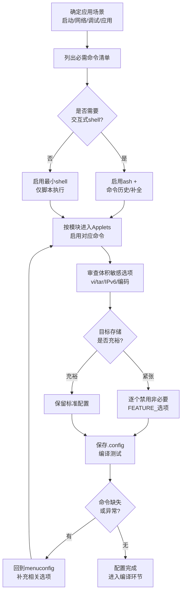

# 5.3.2 配置BusyBox：用menuconfig定制你的工具箱

> 所属章节：第5章 嵌入式根文件系统构建 > 5.3 节 BusyBox构建
> 难度：[B→I] | 预计阅读时间：25分钟

## 本节导读
上一节我们下载并解压了BusyBox源码，本节将学习如何通过`make menuconfig`图形化界面来配置BusyBox——决定编译哪些命令、是否静态编译、安装到哪里。学完本节，你将能独立定制一个适合你目标板需求的精简工具箱。

---

## 知识点1：BusyBox配置界面与关键配置项 [B] ~1,000字

### 启动menuconfig

BusyBox和Linux内核一样，使用Kconfig配置系统。进入源码目录后，执行以下命令启动图形化配置界面：

```bash
cd ~/busybox-1.36.0          # 进入BusyBox源码目录
make menuconfig               # 启动配置界面
```

```
💡 提示：如果提示缺少ncurses库，请先安装：sudo apt install libncurses5-dev（Debian/Ubuntu）
```

启动后，你会看到一个基于文本的菜单界面，可以用方向键导航，回车键进入子菜单，`Y`键选中选项，`N`键取消，`M`键设为模块（BusyBox中很少用），按两次`Esc`或选择`Exit`返回上级。

### 关键配置项详解

BusyBox有上百个配置项，但嵌入式开发中只需要关注最核心的几类。下表总结了最关键的配置项：

| 配置路径 | 配置项名称 | 作用说明 | 嵌入式推荐设置 |
|---------|-----------|---------|-------------|
| Settings → | Build static binary (no shared libs) | 是否静态编译（不依赖动态库） | 初次构建建议`Y`（静态），减少根文件系统复杂度 |
| Settings → | Installation prefix | 安装路径前缀 | 设为`../rootfs`或你希望安装到的目录 |
| Settings → | (/bin:/sbin:/usr/bin:/usr/sbin) Destination path for symlinks | 符号链接目标路径 | 保持默认即可 |
| Settings → | Enable locale support | 多语言本地化支持 | 嵌入式建议`N`，节省空间 |
| Applets → | 各类命令子菜单 | 选择需要编译的内置命令 | 按需选择，见本节第二部分 |
| Library Tuning → | Use clock_gettime() if available | 使用高精度时钟 | 需要精确计时时选`Y` |
| Library Tuning → | Use ioctl names rather than hex values | 错误信息使用ioctl名称 | 调试时建议`Y` |

### 操作步骤：完成一次完整配置

按照以下步骤，为你的第一个BusyBox工具箱完成基础配置：

1. **设置静态编译**（降低复杂度）
   ```
   进入：Settings →
   找到：[*] Build static binary (no shared libs)
   按Y选中，方括号内显示星号[*]表示已启用
   ```

   🔴 **危险**：动态编译虽然文件更小，但需要把glibc或musl库复制到根文件系统中，初学者容易遗漏库文件导致命令无法运行。静态编译会把所有依赖打包进busybox二进制文件，一个文件就能跑。

2. **设置安装路径**
   ```
   进入：Settings →
   找到：(./_install) Installation prefix
   按Enter编辑，输入你希望的路径，例如：../my-rootfs
   ```

   ⚠️ **陷阱**：这个路径是"安装前缀"，BusyBox安装时会在这个目录下创建`bin/`、`sbin/`等子目录。不要把这里设成最终根文件系统的根目录本身，除非你清楚目录结构。

3. **选择需要的命令**
   ```
   进入：Applets →
   浏览各个子菜单，按需选择命令
   ```
   至少确保以下基础命令被选中（默认通常已选）：
   - `ls`、`cp`、`mv`、`rm`（Coreutils）
   - `cat`、`echo`、`printf`（Coreutils）
   - `mkdir`、`rmdir`（Coreutils）
   - `mount`、`umount`（Linux System Utilities）
   - `init`、`halt`、`reboot`（Init Utilities）
   - `sh`（Shells）
   - `ps`、`top`、`free`（Procps）

4. **保存并退出**
   ```
   一路按Esc退出，提示保存时选择`Yes`
   配置会写入`.config`文件
   ```

### 代码示例：用命令行方式直接修改关键配置

除了图形界面，你也可以直接用`sed`或`scripts/config`脚本修改配置，这在自动化构建中非常有用：

```bash
# 在BusyBox源码目录中

# 启用静态编译
sed -i 's/^# CONFIG_STATIC is not set/CONFIG_STATIC=y/' .config

# 设置安装路径
sed -i 's|CONFIG_PREFIX=.*|CONFIG_PREFIX="../my-rootfs"|' .config

# 确保init命令被编译（取消注释并设为y）
sed -i 's/^# CONFIG_INIT is not set/CONFIG_INIT=y/' .config

# 验证修改
grep -E "CONFIG_STATIC|CONFIG_PREFIX|CONFIG_INIT" .config
```

```
💡 提示：BusyBox源码中自带`scripts/kconfig/merge_config.sh`脚本，可以用于合并多个片段配置文件。团队协作时，可以每个人维护一个自己的`my-board.config`片段，再合并到主配置中。
```

---

## 知识点2：嵌入式最小化配置策略 [I] ~600字

### 为什么要最小化？

嵌入式系统的存储空间（Flash/ROM）通常是按MB甚至KB计算的。一个全功能BusyBox编译出来约1.5MB，但如果只选必要的命令，可以压缩到500KB以下。每节省1KB空间，都可能意味着更便宜的存储芯片或更快的启动速度。

### 最小化原则：按需选择

嵌入式配置的核心原则只有一句话：**"不要预装可能用得上的命令，只装现在就得用的命令。"**

具体执行时，按照以下策略操作：

#### 策略1：先确定你的应用场景

在配置之前，列出目标设备启动和运行必需的操作：

```text
启动流程需要什么？
  → init、sh、mount、mkdir、mknod、sysctl

设备管理需要什么？
  → ls、cat、echo、insmod、rmmod、lsmod

网络功能需要什么？
  → ifconfig、route、ping、udhcpc（或dhclient）

调试维护需要什么？
  → dmesg、ps、top、free、kill

应用部署需要什么？
  → cp、mv、rm、tar、grep、awk
```

#### 策略2：按模块批量启用/禁用

在menuconfig中，大多数命令按功能分组。例如：

```
Applets →
  Coreutils ───────────── 日常文件操作命令
  Console Utilities ───── 终端相关
  Debian Utilities ────── Debian风格工具
  Editors ─────────────── 编辑器（vi等）
  Finding Utilities ───── 查找工具（find、grep、xargs）
  Init Utilities ──────── 启动相关（init、halt、reboot）
  Login/Password ──────── 登录管理
  Linux Ext2 FS Progs ─── ext2/3/4工具
  Linux Module Utilities ─ 内核模块管理
  Linux System Utilities ─ 系统级工具（mount、mknod等）
  Miscellaneous ────────── 其他
  Networking Utilities ─── 网络工具（ifconfig、ping、route等）
  Print Utilities ──────── 打印相关
  Mail Utilities ───────── 邮件相关（嵌入式通常不需要）
  Process Utilities ─────── 进程管理（ps、top、kill等）
  Shells ───────────────── shell解释器（ash、hush、msh等）
```

💡 **提示**：对于嵌入式系统，可以直接跳过Mail Utilities、Print Utilities、Debian Utilities这几组，立刻节省不少空间。

#### 策略3：逐个审查大体积选项

某些功能会显著增加BusyBox体积，需要单独审查：

| 功能项 | 体积影响 | 建议 |
|-------|---------|------|
`vi`编辑器 | +100KB | 不需要现场编辑就选`N`，或用更小的`nano`替代 |
| `ash` shell历史/补全 | +50KB | 交互式调试需要，纯后台运行可禁用 |
| `tar` + gzip/bzip2/xz | +80KB | 需要解压缩固件包时保留 |
| IPv6支持 | +30KB | 明确不需要IPv6时禁用 |
| 额外字符集编码 | +40KB | 纯英文环境禁用 |

⚠️ **陷阱**：不要禁用`CONFIG_FEATURE_TAR_LONG_OPTIONS`之类的内部功能选项，除非你知道自己在做什么。这些"FEATURE_"前缀的选项往往是其他命令正常工作的依赖。

### 配置策略流程图

下图展示了从需求分析到最终生成配置文件的完整决策流程：



[图1：BusyBox最小化配置决策流程图]

---

## 本节总结

本节学习了BusyBox的图形化配置方法，以及嵌入式场景下的最小化配置策略。

| 概念 | 要点 | 操作 |
|------|------|------|
| menuconfig启动 | 基于ncurses的文本菜单 | `make menuconfig` |
| 静态编译 | 不依赖外部动态库，单文件可运行 | Settings中启用`Build static binary` |
| 安装路径 | BusyBox安装时生成bin/sbin等目录的位置 | Settings中设置`Installation prefix` |
| 命令选择 | 按需启用，避免预装"可能用到"的命令 | Applets菜单中按模块选择 |
| 体积审查 | vi/tar/IPv6/字符集会显著增加体积 | 不需要时明确禁用 |
| 配置保存 | 配置写入`.config`，可被版本控制 | 退出时选择`Yes`保存 |

核心 takeaway：BusyBox配置的本质是**在功能和体积之间做取舍**。初学者建议先用静态编译+全功能配置跑通，再逐步精简到最小集合。

---

## 下一步

配置完成后，`.config`文件已经就绪。下一节（5.3.3）将执行`make`和`make install`完成BusyBox的编译与安装，并验证生成的工具箱能否正常工作。

---

## 配套资源

### 表格清单
- 表1：关键配置项速查表（静态编译、安装路径、符号链接路径等）
- 表2：体积敏感选项审查表（vi、tar、IPv6、字符集等）

### 图示清单
- 图1：BusyBox最小化配置决策流程图 [mermaid图]
- 图2：menuconfig界面示意图 [配图说明：BusyBox make menuconfig启动后的主界面截图，显示Settings/Applets等顶层菜单]
- 图3：Applets子菜单结构示意图 [配图说明：展示Applets菜单下各命令分类子菜单的层级关系]

### 代码清单
- 代码1：启动menuconfig命令
- 代码2：用sed直接修改.config关键配置项
- 代码3：需求分析命令清单模板

### 自检清单

完成本节学习后，检查你是否能回答以下问题：

- [ ] 能在终端中成功启动`make menuconfig`并导航菜单
- [ ] 知道静态编译和动态编译的区别，以及为什么嵌入式初次建议静态编译
- [ ] 能正确设置Installation prefix，理解它会生成哪些子目录
- [ ] 知道至少3个Applets下的命令分组名称
- [ ] 能列出自己目标场景下至少10个必需的BusyBox命令
- [ ] 理解体积敏感选项（vi/tar/IPv6）对最终二进制大小的影响
