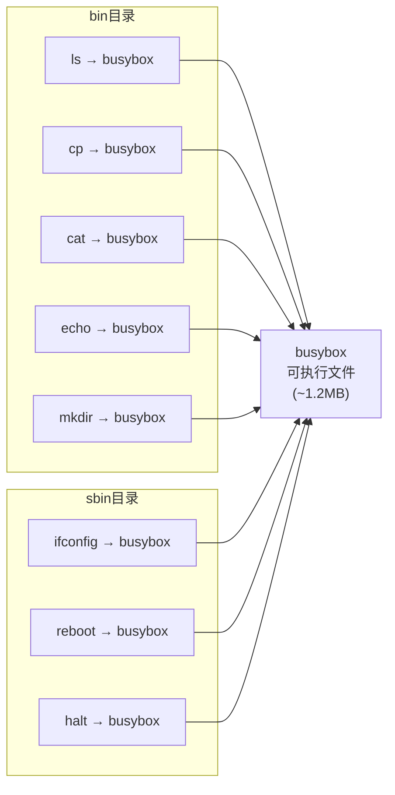

# 5.3.4 安装BusyBox到根文件系统

> 所属章节：第5章 根文件系统与初始化 > 5.3 BusyBox
> 
> 难度：[B→I] | 预计阅读时间：25分钟

## <span class="blue"> 本节导读
本节讲解如何将编译好的BusyBox安装到目标根文件系统目录。学完后，你将掌握BusyBox的安装命令、理解安装后的目录结构与符号链接机制，并能独立完成安装验证和常见问题排查。

---

##  <span class="blue"> BusyBox安装 [B]

在前面的步骤中，我们已经完成了BusyBox的配置和编译。现在，编译产物（一个名为 `busybox` 的可执行文件和若干辅助文件）还静静地躺在源码目录里。要让这些命令真正可用，我们需要把它们"安装"到目标根文件系统的目录结构中。

### BusyBox的安装方式

与常规软件不同，BusyBox的"安装"并不是把可执行文件复制到系统路径那么简单。BusyBox是一个**多调用二进制文件**（multi-call binary），单个 `busybox` 可执行文件内部包含了上百个命令的实现。为了让用户能够通过 `ls`、`cp`、`mkdir` 等熟悉的名称调用这些功能，BusyBox的安装过程需要创建大量**符号链接**（symbolic link），每个链接名对应一个命令，全部指向同一个 `busybox` 文件。

这种模式的优势显而易见：

- **节省空间**：几百个命令只需一个可执行文件
- **统一更新**：升级BusyBox只需替换一个文件
- **灵活裁剪**：重新配置后重新安装即可调整命令集

### 安装命令详解

BusyBox使用 `make install` 完成安装，但必须通过 `CONFIG_PREFIX` 参数指定目标目录：

```bash
# 假设你的根文件系统目录是 ~/rootfs
make CONFIG_PREFIX=~/rootfs install
```

| 参数 | 说明 | 示例值 |
|------|------|--------|
| `CONFIG_PREFIX` | 目标根文件系统根目录的绝对路径 | `~/rootfs` 或 `/home/user/rootfs` |
| `install` | make目标，执行安装操作 | - |

### 操作步骤

1. **确认编译已完成**
   ```bash
   cd ~/busybox-1.36.1
   ls -lh busybox    # 应该存在且大小约1-2MB
   ```

2. **创建目标目录（如不存在）**
   ```bash
   mkdir -p ~/rootfs
   ```

3. **执行安装命令**
   ```bash
   make CONFIG_PREFIX=~/rootfs install
   ```

4. **查看安装结果**
   ```bash
   ls -la ~/rootfs/
   ```

### 安装后的目录结构

安装完成后，BusyBox会在目标目录中创建标准的Linux目录结构：

```
~/rootfs/
├── bin/           # 基本用户命令（ls, cp, cat, echo...）
├── sbin/          # 系统管理命令（ifconfig, reboot, halt...）
├── usr/
│   ├── bin/       # 额外的用户命令（awk, diff, find...）
│   └── sbin/      # 额外的系统命令（crond, telnetd...）
├── linuxrc -> bin/busybox    # 初始化脚本链接
└── bin/busybox    # 真正的可执行文件
```

以 `bin/` 目录为例，里面的内容大致如下：

```bash
ls -la ~/rootfs/bin/
lrwxrwxrwx 1 user user    7 Jan 10 09:20 ls -> busybox
lrwxrwxrwx 1 user user    7 Jan 10 09:20 cp -> busybox
lrwxrwxrwx 1 user user    7 Jan 10 09:20 cat -> busybox
lrwxrwxrwx 1 user user    7 Jan 10 09:20 echo -> busybox
lrwxrwxrwx 1 user user    7 Jan 10 09:20 mkdir -> busybox
-rwxr-xr-x 1 user user 1.2M Jan 10 09:20 busybox
```

注意：所有命令文件都是指向 `busybox` 的符号链接，文件大小只有几个字节，真正的代码都在 `busybox` 可执行文件中。


```mermaid
flowchart LR
    subgraph bin目录
        ls["ls → busybox"]
        cp["cp → busybox"]
        cat["cat → busybox"]
        echo["echo → busybox"]
        mkdir["mkdir → busybox"]
    end
    
    subgraph sbin目录
        ifconfig["ifconfig → busybox"]
        reboot["reboot → busybox"]
        halt["halt → busybox"]
    end
    
    busybox["busybox\n可执行文件\n(~1.2MB)"]
    
    ls --> busybox
    cp --> busybox
    cat --> busybox
    echo --> busybox
    mkdir --> busybox
    ifconfig --> busybox
    reboot --> busybox
    halt --> busybox
```

> 💡 如果你之前使用 `make menuconfig` 裁剪了某些命令，安装时BusyBox只会为你启用的功能创建对应的符号链接。如果后来发现某个命令缺失，需要重新配置、重新编译、重新安装。

> ⚠️ `CONFIG_PREFIX` 必须使用**绝对路径**。如果使用相对路径（如 `make CONFIG_PREFIX=../rootfs install`），BusyBox的链接创建可能会出错，导致符号链接指向错误的位置。

---

##  <span class="blue"> 验证安装 [B]

安装完成后，千万不要急着打包或烧录。就像写完代码要测试一样，安装完BusyBox后必须进行验证，确保每个环节都正确无误。

### 验证清单

#### 验证1：检查目录结构

首先确认基本目录都已创建：

```bash
cd ~/rootfs
ls -la
```

预期输出应包含 `bin`、`sbin`、`usr` 等目录。如果缺少某个目录，可能是安装过程被中断或配置异常。

#### 验证2：检查符号链接

进入 `bin` 目录，确认命令都是符号链接：

```bash
ls -la ~/rootfs/bin/ | head -20
```

你应该看到类似这样的输出：

```
lrwxrwxrwx 1 user user    7 Jan 10 09:20 arch -> busybox
lrwxrwxrwx 1 user user    7 Jan 10 09:20 ash -> busybox
lrwxrwxrwx 1 user user    7 Jan 10 09:20 base64 -> busybox
lrwxrwxrwx 1 user user    7 Jan 10 09:20 busybox -> busybox
lrwxrwxrwx 1 user user    7 Jan 10 09:20 cat -> busybox
lrwxrwxrwx 1 user user    7 Jan 10 09:20 chattr -> busybox
lrwxrwxrwx 1 user user    7 Jan 10 09:20 chgrp -> busybox
lrwxrwxrwx 1 user user    7 Jan 10 09:20 chmod -> busybox
lrwxrwxrwx 1 user user    7 Jan 10 09:20 chown -> busybox
lrwxrwxrwx 1 user user    7 Jan 10 09:20 chroot -> busybox
```

> 💡 注意链接目标的长度。如果显示 `-> /some/absolute/path/busybox`，说明 `CONFIG_PREFIX` 使用了绝对路径，链接是正确的。如果显示 `-> busybox`（相对路径），也是正常的，因为所有链接和 `busybox` 文件在同一目录内。

#### 验证3：确认链接指向正确

使用 `which` 或 `readlink` 确认 `ls` 命令最终指向的是你的 `busybox`：

```bash
cd ~/rootfs
# 方法1：使用readlink追踪链接
readlink -f bin/ls
# 输出示例：/home/user/rootfs/bin/busybox

# 方法2：查看链接详情
ls -l bin/ls
# 输出示例：lrwxrwxrwx 1 user user 7 Jan 10 09:20 bin/ls -> busybox
```

#### 验证4：统计链接数量

一个简单的方法确认安装是否完整，统计符号链接的数量：

```bash
# 统计bin目录中的符号链接数
find ~/rootfs/bin -type l | wc -l

# 统计所有目录中的符号链接数
find ~/rootfs -type l | wc -l
```

如果你编译时启用了大部分功能，全功能BusyBox通常会创建200-300个符号链接。如果数量明显偏少（比如只有几十个），可能是配置阶段裁剪了太多功能。

#### 验证5：尝试运行busybox

如果当前系统架构与目标架构相同（如在x86 PC上为x86目标构建），可以直接测试：

```bash
~/rootfs/bin/busybox ls
~/rootfs/bin/busybox cat /etc/passwd
```

如果架构不同（如为ARM板构建），则需要在目标板上或通过QEMU测试。

> ⚠️ 如果符号链接显示为红色（在支持颜色的终端中），通常表示链接指向的文件不存在。请检查 `busybox` 可执行文件是否确实存在于 `bin/` 目录中。

---

##  <span class="blue"> 安装常见问题 [B]

即使步骤看起来简单，实际操作中仍可能遇到各种问题。本节汇总最常见的安装故障及其解决方法。

### 问题1：权限被拒绝（Permission denied）

**现象**：
```bash
make CONFIG_PREFIX=/root/rootfs install
# 报错：mkdir: cannot create directory '/root/rootfs': Permission denied
```

**原因**：目标目录位于需要root权限的路径，或当前用户对该目录没有写权限。

**解决方法**：
- 将目标目录放在用户有权限的位置，如 `~/rootfs` 或 `/tmp/rootfs`
- 如果需要使用系统目录，先用 `sudo` 创建目录并修改权限：
  ```bash
  sudo mkdir -p /opt/rootfs
  sudo chown $USER:$USER /opt/rootfs
  make CONFIG_PREFIX=/opt/rootfs install
  ```

> 🔴 不要用 `sudo make CONFIG_PREFIX=... install` 直接以root身份运行make安装。这会导致安装后的文件所有权全变为root，后续打包或修改会很麻烦。正确的做法是让目录归当前用户所有。

### 问题2：路径错误导致链接失效

**现象**：安装完成后，符号链接指向错误位置，命令无法执行。

**原因**：使用了相对路径或路径中包含符号链接。

**解决方法**：
始终使用绝对路径：
```bash
# 正确
make CONFIG_PREFIX=/home/user/rootfs install
make CONFIG_PREFIX=$(realpath ~/rootfs) install

# 避免使用相对路径
make CONFIG_PREFIX=../rootfs install    # 可能导致问题
```

### 问题3：安装后命令数量异常少

**现象**：`bin/` 目录下只有几十个链接，而不是预期的200+个。

**原因**：配置阶段使用了极简配置，或 `.config` 文件未正确保存。

**解决方法**：
```bash
# 检查配置是否保存
cd ~/busybox-1.36.1
ls -la .config

# 重新进入配置菜单，确认所需功能已启用
make menuconfig
# 保存后重新编译安装
make -j$(nproc)
make CONFIG_PREFIX=~/rootfs install
```

### 问题4：覆盖安装时旧链接残留

**现象**：重新配置BusyBox并安装后，发现之前已移除的命令链接仍然存在。

**原因**：BusyBox的 `install` 目标只会创建新链接，不会删除旧链接。

**解决方法**：
在安装前清理目标目录，或至少清理命令目录：
```bash
# 安全清理：只删除链接和busybox，保留其他文件
find ~/rootfs/bin -type l -delete
rm -f ~/rootfs/bin/busybox
rm -f ~/rootfs/sbin/busybox
rm -f ~/rootfs/usr/bin/busybox
rm -f ~/rootfs/usr/sbin/busybox

# 然后重新安装
make CONFIG_PREFIX=~/rootfs install
```

> 💡 建议将上述清理步骤写成脚本，方便每次重新安装时调用。

---

## <span class="blue"> 从目录到镜像：打包根文件系统 [B]

经过前面的步骤，你已经在 `~/rootfs` 目录中创建了一个完整的根文件系统骨架：目录结构、BusyBox 命令、设备节点、配置文件、启动脚本。但这些文件现在还只是 **PC 上的普通目录**——要让内核在启动时挂载它，你需要把它打包成一个 **文件系统镜像**。

嵌入式 Linux 中常用的根文件系统镜像有三种格式：

| 镜像格式 | 适用场景 | 制作工具 | 特点 |
|---------|---------|---------|------|
| **cpio + gzip** | initramfs（内存中运行） | `find + cpio + gzip` | 启动最快，内存运行，不持久化 |
| **ext4 块设备镜像** | eMMC / SD 卡 | `dd + mkfs.ext4` | 持久化存储，可读写，最通用 |
| **squashfs** | SPI NOR Flash（只读） | `mksquashfs` | 只读、压缩率高、适合 ROM |
| **jffs2 / ubifs** | NAND Flash（可读写） | `mkfs.jffs2 / mkfs.ubifs` | 带坏块管理、日志、掉电安全 |

作为第一部的起点，我们使用 **ext4 镜像**——eMMC 和 SD 卡都是块设备，用 ext4 最直观。实际产品中，**eMMC 是最常见的根文件系统存储介质**（焊接在板子上，比 SD 卡更可靠）。如果你使用的是 NAND Flash，后续章节会介绍 jffs2/ubifs；如果是 SPI NOR Flash，通常用 squashfs + overlayfs。

### 制作 ext4 根文件系统镜像

假设你的根文件系统内容在 `~/rootfs` 目录中，目标镜像为 `rootfs.ext4`：

```bash
# 1. 创建空的镜像文件（32MB，足够最小系统）
dd if=/dev/zero of=rootfs.ext4 bs=1M count=32

# 2. 在镜像上创建 ext4 文件系统
mkfs.ext4 rootfs.ext4

# 3. 挂载镜像到临时目录
mkdir -p /tmp/mnt_rootfs
sudo mount -o loop rootfs.ext4 /tmp/mnt_rootfs

# 4. 将 rootfs 内容复制到镜像中
sudo cp -a ~/rootfs/* /tmp/mnt_rootfs/

# 5. 卸载镜像
sudo umount /tmp/mnt_rootfs
```

参数说明：

- `dd if=/dev/zero of=rootfs.ext4 bs=1M count=32`：创建 32MB 全零文件作为镜像容器
- `mkfs.ext4 rootfs.ext4`：在空文件上创建 ext4 文件系统（需要 `root` 权限或 `sudo`）
- `-o loop`：将普通文件作为块设备挂载（loop 设备）
- `cp -a`：保留权限、符号链接、时间戳等属性，**`-a` 非常关键**

### 验证镜像

```bash
# 查看镜像文件信息
file rootfs.ext4
# 预期输出：Linux rev 1.0 ext4 filesystem data, UUID=...

# 重新挂载查看内容
sudo mount -o loop rootfs.ext4 /tmp/mnt_rootfs
ls -la /tmp/mnt_rootfs/
# 应该能看到 bin/、etc/、dev/、proc/、sbin/ 等目录
sudo umount /tmp/mnt_rootfs
```

### 补充：initramfs（可选了解）

如果你使用 QEMU 仿真，更常见的做法是制作 **initramfs**——它是一个压缩的 cpio 归档，由内核直接解压到内存中作为临时根文件系统：

```bash
cd ~/rootfs
find . | cpio -o -H newc | gzip -9 > ../initramfs.cpio.gz
```

- `-H newc`：指定 cpio 的 "newc" 格式（Linux 内核唯一支持的格式）
- `gzip -9`：最大压缩，减小体积
- 内核启动时通过 `initrd=` 或 `-initrd` 参数加载这个归档

> 💡 制作 ext4 镜像时，`cp -a` 的 `-a` 选项非常重要。如果漏掉，符号链接会变成普通文件，文件权限会丢失，导致 BusyBox 的命令链接失效、init 脚本无法执行——启动时会出现大量 "Permission denied" 或 "command not found" 错误。

> ⚠️ 镜像大小要预留余量。当前最小系统约 5-10MB，但后续添加内核模块、配置文件、日志文件会快速增长。32MB 是安全起点，生产环境通常 64MB-256MB。

## <span class="blue"> 本节总结

| 概念 | 要点 | 操作 |
|------|------|------|
| 安装命令 | 使用 `CONFIG_PREFIX` 指定目标根目录 | `make CONFIG_PREFIX=~/rootfs install` |
| 目录结构 | 创建 `bin/`, `sbin/`, `usr/bin/`, `usr/sbin/` | 安装后自动创建 |
| 符号链接 | 每个命令名都是一个指向 `busybox` 的软链接 | `ls -la bin/` 查看链接关系 |
| 验证方法 | 检查链接、确认指向、统计数量 | `readlink -f`, `find -type l` |
| 常见问题 | 权限不足、路径错误、链接残留 | 使用绝对路径、预清理目录 |
| **镜像制作** | **从目录到可烧录的 ext4 镜像** | **`dd` + `mkfs.ext4` + `cp -a` + loop 挂载** |

## <span class="blue"> 下一步

下一节（5.4.1）介绍 devtmpfs：内核自动创建设备节点 的具体内容。

---

