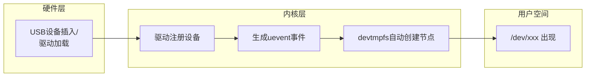

# 5.4.1 devtmpfs：内核自动创建设备节点

> 所属章节：第5章 设备与驱动 > 5.4 设备文件系统
> 难度：[I→I] | 预计阅读时间：15分钟

## 本节导读

本节教你认识 `devtmpfs`——一个让内核自动帮你创建 `/dev` 下设备节点的文件系统。学完本节，你能理解为什么现代嵌入式Linux不再需要手动 `mknod`，也能动手在开发板上挂载和启用 `devtmpfs`。

---

## 知识点1：devtmpfs——内核帮你管设备节点 [I] ~1000字

### 1.1 为什么需要devtmpfs？

在早期的Linux系统中，`/dev` 目录下的设备节点（如 `/dev/ttyS0`、`/dev/null`）是靠人工或启动脚本逐个创建的。这意味着：

- 系统管理员需要知道有哪些设备，并用 `mknod` 命令手动创建
- 设备增删时，节点不会自动同步
- 嵌入式系统中，启动脚本越来越臃肿

`devtmpfs` 于内核 **2.6.32** 版本引入，它把这项工作交给了内核自己：当内核检测到硬件设备时，自动在 `/dev` 下创建对应的设备节点；设备移除时，节点自动消失。

> 💡 **通俗理解**：你可以把 `devtmpfs` 想象成一位"自动管家"——它住在内核里，每当有新设备插上或驱动加载，它就立刻去 `/dev` 门口挂上对应的"门牌号"（设备节点），不用你动手。

### 1.2 devtmpfs的本质

`devtmpfs` 是一个基于 `tmpfs` 的文件系统，数据只存在于内存中，不占用磁盘空间。它的核心职责很简单：

1. 在系统启动的早期阶段挂载到 `/dev`
2. 监听内核的 `uevent` 事件（设备增删通知）
3. 根据事件自动创建或删除设备节点



**图1：devtmpfs工作原理图**

从图1可以看出，整个流程完全是内核内部自治的：用户空间的程序（甚至包括 init 进程）还没完全启动时，`/dev` 下就已经有基本设备节点了。

### 1.3 动手挂载devtmpfs

如果你的系统内核已经启用了 `devtmpfs` 支持（后面知识点3会讲如何确认），只需要一行命令就能挂载：

### 操作步骤

1. **确认当前 `/dev` 的挂载情况**
   ```bash
   mount | grep /dev
   ```
   如果已经看到 `devtmpfs on /dev`，说明已经挂载好了。

2. **手动挂载 devtmpfs**（通常在启动脚本中执行）
   ```bash
   mount -t devtmpfs devtmpfs /dev
   ```
   参数说明：
   - `-t devtmpfs`：指定文件系统类型
   - 第一个 `devtmpfs`：作为设备名占位（tmpfs类不需要真实块设备）
   - `/dev`：挂载点

3. **验证节点已自动创建**
   ```bash
   ls /dev | head -20
   ```
   你应该能看到 `null`、`zero`、`random`、`tty`、`console` 等基本设备节点，即使没有运行任何 udev/mdev 守护进程。

4. **查看内核消息确认**
   ```bash
   dmesg | grep devtmpfs
   ```
   典型输出：`devtmpfs: mounted`

### 代码示例

以下是一个典型的嵌入式系统早期启动脚本片段，在挂载根文件系统后立即挂载 `devtmpfs`：

```bash
#!/bin/sh
# /etc/init.d/S00mountdev

# 先创建挂载点（如果 initramfs 里没有的话）
mkdir -p /dev

# 挂载 devtmpfs
mount -t devtmpfs devtmpfs /dev

# 确保标准设备存在（即使 devtmpfs 已经创建，做保险）
ln -sf /proc/self/fd /dev/fd
ln -sf /proc/self/fd/0 /dev/stdin
ln -sf /proc/self/fd/1 /dev/stdout
ln -sf /proc/self/fd/2 /dev/stderr
```

### 常见错误

⚠️ **错误1：挂载后 /dev 为空**
如果挂载后 `/dev` 下什么都没有，说明你的内核**没有启用 devtmpfs 支持**。此时 `mount` 命令不会报错（因为 tmpfs 本身可以挂载），但内核不会自动创建任何节点。

> 💡 **排查方法**：运行 `cat /proc/filesystems | grep devtmpfs`，如果没有任何输出，说明内核不支持。

⚠️ **错误2：与 mdev/udev 冲突**
有些系统同时启用了 `devtmpfs` 和 `mdev`（或 `udev`），这本身没问题——`devtmpfs` 负责创建基础节点，`mdev/udev` 在此基础上做权限调整、符号链接创建等精细管理。但如果配置不当，可能出现权限被反复覆盖的情况。

> 💡 **提示**：现代嵌入式Linux推荐的做法是——先挂载 `devtmpfs` 获得基础节点，再启动 `mdev -s` 做补充处理，而不是用 `mdev` 从头创建所有节点。

🔴 **危险：在 /dev 挂载前删除设备节点**
如果你在没有挂载任何文件系统的情况下操作 `/dev`，可能误删 initramfs 中预置的静态节点，导致系统无法打开 `console` 或 `null`，启动失败。

---

## 知识点2：devtmpfs的优势——为什么用它 [I] ~500字

### 2.1 从"手动"到"自动"的跨越

有了 `devtmpfs`，嵌入式系统的 `/dev` 管理从"人工维护清单"变成了"内核自动响应"。这带来的好处是实实在在的：

**① 不需要手动 mknod**

以前做根文件系统时，要在 `mknod` 脚本里列一长串设备：

```bash
mknod /dev/null    c 1 3
mknod /dev/zero    c 1 5
mknod /dev/random  c 1 8
mknod /dev/tty     c 5 0
# ... 还要为每个串口、每个分区单独创建
```

现在这些全部省略。内核知道设备号（驱动在注册时已经声明），由它统一创建，不会出错。

**② 设备节点随硬件变化自动更新**

USB 设备热插拔、SD 卡插拔、驱动模块加载/卸载——这些动作都会产生内核事件。`devtmpfs` 实时响应，节点"出现"和"消失"与硬件状态保持一致。用户空间程序只需打开 `/dev/sda1` 就能访问U盘，不需要提前知道它是否存在。

**③ 启动更快、脚本更简洁**

传统 `mdev` 方案需要在启动时遍历 `/sys` 树并逐一 `mknod`，耗时随设备数量线性增长。`devtmpfs` 在内核空间直接完成，用户空间启动脚本可以大幅精简。

### 2.2 devtmpfs vs 手动mknod 对比

| 对比项 | 手动 mknod + 静态 /dev | devtmpfs 自动管理 |
|--------|------------------------|-------------------|
| 节点来源 | 启动脚本或预制根文件系统 | 内核根据设备注册自动生成 |
| 设备增删 | 不自动同步，需手动维护 | 实时响应，随硬件自动出现/消失 |
| 启动速度 | 慢（需遍历创建大量节点） | 快（内核空间直接完成） |
| 准确性 | 容易搞错主/次设备号 | 由驱动声明，不会出错 |
| 热插拔支持 | 不支持 | 原生支持 |
| 内存占用 | 无额外内存开销 | 节点存于内存（tmpfs），量极小 |
| 兼容性 | 所有内核版本 | 内核 2.6.32+ |

**表1：devtmpfs 与手动 mknod 方案对比**

从表1可以清楚地看到，对于内核版本在 2.6.32 以上的现代嵌入式系统，`devtmpfs` 在便利性和可靠性上都全面优于静态方案。

> 💡 **提示**：即便如此，很多系统还是会保留 `mdev` 或 `udev` 做"后处理"——例如设置设备权限、创建友好的符号链接（如 `/dev/mmcblk0` → `/dev/sdcard`）。`devtmpfs` 替代的是"创建节点"这件事，而不是整个设备管理。

---

## 知识点3：启用devtmpfs——内核配置 [I] ~400字

### 3.1 确认内核支持

`devtmpfs` 不是强制开启的，需要在内核编译时显式启用。如果你的嵌入式系统是自己编译内核，按以下步骤操作：

### 操作步骤

1. **进入内核配置菜单**
   ```bash
   cd linux-xxx/
   make menuconfig
   ```

2. **找到 devtmpfs 配置项**
   依次进入：
   ```
   Device Drivers  --->
       Generic Driver Options  --->
           [*] Maintain a devtmpfs filesystem to mount at /dev
           [*]   Automount devtmpfs at /dev, after the kernel mounted the rootfs
   ```

3. **查看对应 CONFIG 宏**
   ```bash
   grep CONFIG_DEVTMPFS .config
   ```
   预期输出：
   ```
   CONFIG_DEVTMPFS=y
   CONFIG_DEVTMPFS_MOUNT=y
   ```

   - `CONFIG_DEVTMPFS=y`：编译 devtmpfs 支持
   - `CONFIG_DEVTMPFS_MOUNT=y`：内核在挂载根文件系统后**自动**挂载 devtmpfs 到 `/dev`，连启动脚本里的 `mount` 都省了

### 代码示例

以下是典型的内核 `.config` 片段：

```bash
# 检查 devtmpfs 配置
$ grep -E "DEVTMPFS" /boot/config-$(uname -r)
CONFIG_DEVTMPFS=y
CONFIG_DEVTMPFS_MOUNT=y
```

如果输出是 `# CONFIG_DEVTMPFS is not set`，说明当前运行内核没有启用该功能，需要重新编译内核。

### 常见错误

⚠️ **错误1：只开启了 DEVTMPFS，没开 DEVTMPFS_MOUNT**
如果 `.config` 中只有 `CONFIG_DEVTMPFS=y` 而缺少 `CONFIG_DEVTMPFS_MOUNT=y`，内核不会自动挂载 `/dev`。你需要在启动脚本（如 `/etc/inittab` 或 initramfs 的 `/init`）中手动执行 `mount -t devtmpfs devtmpfs /dev`。

> 💡 **提示**：在 Yocto、Buildroot 等构建系统中，`devtmpfs` 通常是默认启用的。如果你发现 `/dev` 下空空如也，先别急着改内核配置——先检查 `menuconfig` 里是不是被人误关了。

🔴 **危险：忘记创建 /dev 挂载点**
如果根文件系统的骨架里没有 `/dev` 目录，即使 `CONFIG_DEVTMPFS_MOUNT=y` 也无法自动挂载。确保你的根文件系统至少包含一个空的 `/dev` 目录。

---

## 本节总结

本节我们学习了 `devtmpfs` 的核心作用、优势和启用方法。

| 概念 | 要点 | 操作 |
|------|------|------|
| devtmpfs 是什么 | 内核内置的 tmpfs，自动管理 `/dev` 节点 | `mount -t devtmpfs devtmpfs /dev` |
| 核心优势 | 免手动 mknod、自动响应热插拔、启动更快 | 替换启动脚本中的静态 mknod 逻辑 |
| 内核配置 | `CONFIG_DEVTMPFS=y` 开启支持 | `make menuconfig` → Generic Driver Options |
| 自动挂载 | `CONFIG_DEVTMPFS_MOUNT=y` 免写 mount 命令 | 检查 `.config` 中两项都开启 |
| 与 udev/mdev 的关系 | devtmpfs 管"创建"，udev/mdev 管"权限/链接" | 二者配合，不互斥 |

**表2：本节核心内容速查表**

---

## 下一步

现在你的系统已经有了自动管理的 `/dev`，但设备节点的权限、属主、符号链接可能还不够完美。5.4.2 节将介绍 `mdev`——BusyBox 提供的轻量级设备管理器，它负责在 `devtmpfs` 创建节点的基础上做"精修"工作，让嵌入式系统的设备管理既自动又灵活。

---

## 配套资源

### 表格清单
- 表1：devtmpfs 与手动 mknod 方案对比
- 表2：本节核心内容速查表

### 图示清单
- 图1：devtmpfs工作原理图 [mermaid流程图]
- 图3（需要配图）：嵌入式启动时 `/dev` 目录从空到 populated 的状态变化示意图 [配图说明]

### 代码清单
- 代码1：手动挂载 devtmpfs 命令
- 代码2：启动脚本片段（`S00mountdev`）
- 代码3：内核 `.config` 中 `CONFIG_DEVTMPFS` 配置检查
