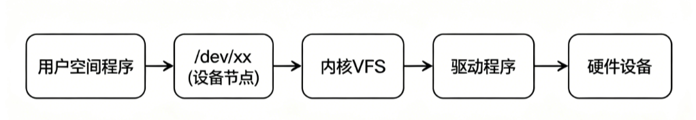

# 5.4.1 设备节点是什么

> 所属章节：第5章 根文件系统与初始化 > 5.4 /dev目录
> 
> 难度：[I] | 预计阅读时间：15分钟

## <span class="blue"> 本节导读

本节覆盖 `/dev` 目录下那些特殊文件的本质, 它们不是普通文件，而是用户空间与内核驱动之间的"门牌号"。读完你将理解设备节点的两种类型、主次设备号的含义，并能从 `ls -l` 的输出中读出设备号信息。

---

##  <span class="blue"> 设备文件的本质：不是文件，是接口 [I]

### 比喻/场景引入

在 Linux 中，"一切皆文件"是核心哲学。但 `/dev` 下的文件格外特殊, 它们不存储数据，而是作为**用户空间与内核驱动之间的通信门牌号**。

当程序打开 `/dev/ttyS0` 时，它实际上是在对内核说："请把这个 I/O 请求转交给管理串口 ttyS0 的驱动程序。"内核通过设备号找到对应的驱动，由驱动完成硬件操作。这就像一个快递柜：每个格子有编号，快递员（用户程序）把包裹（I/O 请求）放到格子里，内核根据编号通知对应的收件人（驱动）来处理。

> 💡 设备文件和普通文件的根本区别：普通文件 `read()` 是从磁盘读数据，设备文件 `read()` 是触发驱动从硬件读取数据。

---

##  <span class="blue"> 两种类型：字符设备 vs 块设备 [I]

Linux 将设备分为两大类，文件类型字母就在 `ls -l` 的第一列：

| 类型 | 标记 | 数据模式 | 典型设备 | 读写方式 |
|------|------|---------|---------|---------|
| 字符设备 | `c` | 字节流，无缓存 | 串口、键盘、/dev/null | 顺序读写，不可seek |
| 块设备 | `b` | 固定大小块，有缓存 | 硬盘、SD卡、/dev/mmcblk0 | 随机读写，支持seek |

**字符设备**像一根水管：数据逐个字符流过，你按顺序读，不能回头跳。串口、终端、键盘都是这类。

**块设备**像一扇带格子的窗口：数据按块（通常512B或4KB）进出，你可以跳到任意位置读写。硬盘、U盘、eMMC都属于块设备。

> ⚠️ 块设备通常有缓存（页缓存），写入后数据不会立即到硬件。字符设备则通常直通硬件，无中间缓存。

---

##  <span class="blue"> 主次设备号：驱动的身份证号 [I]

每个设备文件都有一对**主设备号（major）**和**次设备号（minor）**，合称设备号。它们用逗号分隔显示在 `ls -l` 的输出中：

```bash
ls -l /dev/console /dev/null
# 输出：
# crw--w---- 1 root tty   5, 1 Jan  1  1970 /dev/console
# crw-rw-rw- 1 root root 1, 3 Jan  1  1970 /dev/null
```

解读：`5, 1` 和 `1, 3` 就是主设备号和次设备号。

| 编号 | 含义 | 作用 |
|------|------|------|
| **主设备号** | 驱动标识 | 内核用它找到对应的驱动程序 |
| **次设备号** | 设备实例 | 驱动用它区分同类设备的多个实例 |

### 经典设备号速查

| 设备文件 | 类型 | 主设备号 | 次设备号 | 作用 |
|---------|------|---------|---------|------|
| `/dev/console` | c | 5 | 1 | 系统控制台 |
| `/dev/null` | c | 1 | 3 | 黑洞，写入即丢弃 |
| `/dev/zero` | c | 1 | 5 | 读出无限个0字节 |
| `/dev/random` | c | 1 | 8 | 真随机数源 |
| `/dev/tty` | c | 5 | 0 | 当前终端 |
| `/dev/ttyS0` | c | 4 | 64 | 串口0 |
| `/dev/mmcblk0` | b | 179 | 0 | SD/eMMC卡 |

> 💡 **主设备号的分配**：早期 Linux 主设备号固定（0-255），由 `Documentation/admin-guide/devices.txt` 统一管理。现代内核支持动态分配，驱动加载时自动申请一个主设备号，不再受255限制。

---

##  <span class="blue"> 查看设备号：从 ls -l 读懂硬件 [I]

设备号就在你身边。在开发板或任何 Linux 系统上执行：

```bash
ls -l /dev/ | head -15
```

输出示例（节选）：

```
crw-rw---- 1 root tty     5,  0 Jan  1  1970 tty
crw--w---- 1 root tty     5,  1 Jan  1  1970 console
crw-rw-rw- 1 root root    1,  3 Jan  1  1970 null
crw-rw-rw- 1 root root    1,  5 Jan  1  1970 zero
brw-rw---- 1 root disk  179,  0 Jan  1  1970 mmcblk0
```

读图步骤：

1. **第一列**：文件类型。`c` = 字符设备，`b` = 块设备，`-` = 普通文件，`d` = 目录。
2. **第五列**：`root root` 是属主/属组，不是设备号。
3. **两个数字**：`5, 1` 格式 = 主设备号 + 次设备号。注意这是**两列数字**，不是时间戳。

> ⚠️ 初学者常把设备号当成文件大小。普通文件第五列是字节大小，但设备文件没有大小概念，那一列是 `主设备号, 次设备号`。



### 在嵌入式系统中验证

如果你的板子已经启动到 shell，尝试以下操作：

```bash
# 查看所有设备号
ls -l /dev/

# 只看字符设备
ls -l /dev/ | grep "^c"

# 只看块设备
ls -l /dev/ | grep "^b"

# 查看具体设备的号
ls -l /dev/console /dev/null /dev/zero
```

---

## 本节总结

| 概念 | 一句话解释 | 在本节的作用 | 常见命令/路径 |
|------|-----------|------------|-------------|
| 设备文件 | 用户空间与内核驱动的"门牌号" | 通过它访问硬件 | `/dev/xxx` |
| 字符设备 | 按字节流读写的设备 | 串口、键盘、/dev/null | `c` 开头 |
| 块设备 | 按块随机读写的设备 | 硬盘、SD卡 | `b` 开头 |
| 主设备号 | 标识驱动类型 | 内核用它找驱动 | `ls -l` 第1个数字 |
| 次设备号 | 标识设备实例 | 驱动用它区分同类设备 | `ls -l` 第2个数字 |

---

## 下一步

本节建立了设备节点的概念基础。下一节（5.4.2）将介绍**手动 `mknod` 创建设备节点**, 在没有 `devtmpfs` 的极简系统中，你必须亲手用 `mknod` 命令"挂门牌号"。

---
