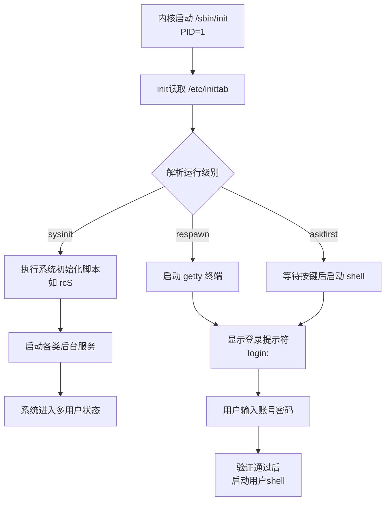

# 5.5.1 init程序的启动与第一个进程

> 所属章节：第5章 Linux根文件系统与启动流程 > 5.5 系统启动流程
> 难度：[B→I] | 预计阅读时间：15分钟

## 本节导读

内核完成硬件初始化后，需要有一个"管家"来接管用户空间——这个管家就是`init`程序。本节带你完整追踪init从被内核调用到用户成功登录的全过程，并对比三种主流init方案，为后续使用BusyBox init打下坚实基础。

---

## 知识点1：init启动过程 [B][M] ~900字

当Linux内核完成挂载根文件系统后，会执行一个固定动作：启动用户空间的第一个进程。这个进程就是`init`，它的进程号（PID）永远是**1**。

### 1.1 内核如何找到init

内核按以下顺序查找init程序：

```
/sbin/init → /etc/init → /bin/init → /bin/sh
```

只要找到其中一个可执行文件，内核就会启动它；如果全部找不到，内核会panic并报错 `"No init found"`。

🔴 **危险**：如果根文件系统中没有`/sbin/init`，系统会卡死并抛出内核panic。制作根文件系统时，务必确认init程序存在且可执行。

### 1.2 init启动全流程

init被内核启动后，会按固定流程完成系统初始化：



[图1：init启动流程图 — 从内核调用到用户登录的完整链路]

### 1.3 init读取配置文件

`inittab`是init的"任务清单"。BusyBox init使用的`/etc/inittab`格式如下：

```
<id>:<runlevels>:<action>:<process>
```

每个字段的含义：

| 字段 | 说明 | 示例 |
|------|------|------|
| `id` | 标识符，通常对应tty设备名 | `ttyS0` |
| `runlevels` | 运行级别（BusyBox中通常为空） | 留空 |
| `action` | 触发时机 | `sysinit`/`respawn`/`askfirst` |
| `process` | 要执行的命令 | `/bin/sh` |

### 1.4 实际操作：查看当前系统的inittab

```bash
# 读取inittab配置文件
cat /etc/inittab

# 示例输出（BusyBox init）:
# ::sysinit:/etc/init.d/rcS
# ::respawn:/sbin/getty -L ttyS0 115200 vt100
# ::restart:/sbin/init
```

### 1.5 从init到用户登录

典型的嵌入式系统inittab配置包含三类任务：

1. **sysinit动作**：系统刚启动时执行一次，通常调用`/etc/init.d/rcS`脚本完成网络、挂载等初始化。
2. **respawn动作**：启动getty程序，在串口上显示`login:`提示符；如果getty意外退出，init会自动重新启动它。
3. **askfirst动作**：与respawn类似，但会先显示`Please press Enter to activate this console`，等待用户按回车后再启动shell——适合调试阶段避免串口输出被淹没。

```bash
# 嵌入式系统典型的 inittab 配置
cat << 'EOF' > /etc/inittab
::sysinit:/etc/init.d/rcS
::respawn:/sbin/getty -L ttyS0 115200 vt100
::ctrlaltdel:/sbin/reboot
::shutdown:/sbin/swapoff -a
EOF
```

⚠️ **陷阱**：`respawn`和`askfirst`配置的进程如果持续崩溃退出，init会不断重启它，导致CPU占用100%且串口刷屏。调试时应先用`once`代替`respawn`。

💡 **提示**：开发阶段可以把getty换成`/bin/sh`，跳过登录直接进root shell，方便调试：`::askfirst:/bin/sh`

---

## 知识点2：init的类型 [B] ~600字

Linux世界里，init程序并非只有一款。不同发行版/嵌入式方案选择的init各不相同。

### 2.1 三大主流init对比

| 特性 | SysV init | BusyBox init | systemd |
|------|-----------|--------------|---------|
| 体积大小 | ~100KB+ | ~20KB（含在BusyBox内） | 数MB |
| 配置文件 | `/etc/inittab` + `/etc/init.d/` | `/etc/inittab` | `.service`单元文件 |
| 启动速度 | 慢（串行脚本） | 快（简单直接） | 快（并行启动） |
| 依赖管理 | 手动处理（数字优先级） | 无 | 自动依赖解析 |
| 适用场景 | 传统桌面/服务器 | **嵌入式设备** | 现代桌面/服务器 |
| 日志系统 | syslog | syslog | 内置journald |

### 2.2 SysV init：最经典的传统方案

SysV init是Unix System V风格的init，曾在Debian、Ubuntu早期版本中使用。它的特点是：

- 使用运行级别（runlevel 0~6）区分系统状态
- 启动脚本放在`/etc/init.d/`，通过`/etc/rcN.d/`中的符号链接控制开机启动
- 脚本命名以`S01xxx`或`K01xxx`开头，`S`表示启动，`K`表示停止，数字表示优先级

SysV init体积较大、启动慢，但成熟稳定，目前在部分传统服务器发行版中仍有使用。

### 2.3 systemd：现代Linux的宠儿

systemd是目前主流桌面和服务器的标准init，特点包括：

- **并行启动**：利用socket激活和依赖关系，同时启动多个服务
- **单元文件**：每个服务一个`.service`文件，声明式配置
- **统一管理**：集成了日志（journald）、定时器（timer）、挂载（mount）等功能

但对嵌入式设备来说，systemd体积过大、依赖库多，通常只有高端嵌入式平台才会采用。

### 2.4 BusyBox init：嵌入式首选

**本章及后续内容均以BusyBox init为讲解对象。**

BusyBox init是BusyBox工具集内置的一个精简版init，专为嵌入式系统设计：

- **零额外体积**：已经包含在BusyBox可执行文件中
- **配置极简**：只需一个`/etc/inittab`文件
- **够用就好**：支持sysinit、respawn、askfirst、once、restart、ctrlaltdel、shutdown等核心动作

对于资源有限的嵌入式设备，BusyBox init是性价比最高的选择。

💡 **提示**：很多嵌入式Linux发行版（如Buildroot默认输出、OpenWrt早期版本）都使用BusyBox init。如果你看到系统里有`/etc/inittab`但没有`/lib/systemd/`，那大概率就是BusyBox init。

---

## 本节总结

| 概念 | 要点 | 操作 |
|------|------|------|
| init的PID | 永远是1，是用户空间第一个进程 | `ps -p 1` 查看 |
| 内核查找顺序 | `/sbin/init` → `/etc/init` → `/bin/init` → `/bin/sh` | 确保根文件系统包含其一 |
| inittab格式 | `id:runlevels:action:process` | 编辑`/etc/inittab` |
| sysinit | 开机只执行一次，用于系统初始化 | 通常调用`rcS`脚本 |
| respawn | 进程退出后自动重启 | 用于getty终端 |
| askfirst | 等待用户按回车再启动 | 开发调试常用 |
| BusyBox init | 体积小、配置简单、嵌入式首选 | 本章核心讲解对象 |

---

## 下一步

下一节（5.5.2）将深入解析`/etc/inittab`的每一条语法规则，并动手编写一个完整的inittab配置文件，让开发板启动后自动运行你的应用程序。

---

## 配套资源

### 表格清单
- 表1：inittab字段说明表
- 表2：三种主流init方案对比表
- 表3：本节核心概念总结表

### 图示清单
- 图1：init启动全流程图（从内核调用到用户登录）[mermaid图]
- 图2：三种init在Linux发行版中的分布示意图 [配图说明]

### 代码清单
- 代码1：查看当前系统inittab命令
- 代码2：典型的嵌入式inittab配置文件
