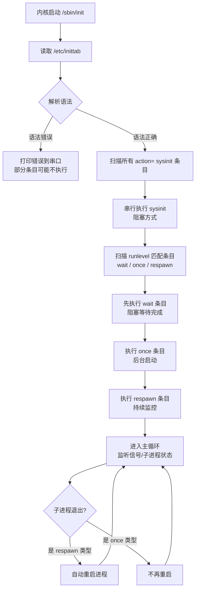

# 5.5.2 /etc/inittab配置文件：init的"作战地图"

> 所属章节：第5章 初始化与用户空间 > 5.5 传统SysV init
> 难度：[I→I] | 预计阅读时间：25分钟

## 本节导读

`/etc/inittab` 是 SysV init 的灵魂文件。本节你将理解它的四段式语法，亲手编写一份最小可用的 inittab，并学会验证配置是否正确——这是你让嵌入式系统"自动运转起来"的关键一步。

---

## 知识点1：inittab 格式解析 [I] ~1,000字

### 一条 inittab 记录 = 四个字段

inittab 的每一行都是一条**指令**，格式极其规整：

```
id:runlevels:action:process
```

四个字段用**冒号**分隔，缺一不可。下面逐个拆解。

#### 字段1：id —— 记录的"身份证号" [B]

`id` 是一条记录的唯一标识符，长度通常 1~4 个字符。init 用它在内部管理各个进程。

- 同一个 inittab 里 **id 不能重复**
- 只有字符和数字，不要加特殊符号
- 如果你写两条相同 id 的记录，后一条会**静默覆盖**前一条

💡 **提示**：给 id 起有意义的缩写，比如 `si` = sysinit，`gt` = getty，`rc` = rcS 脚本。

#### 字段2：runlevels —— 运行级别过滤 [I]

这个字段告诉 init：**哪些运行级别下才执行这条记录**。Linux 的运行级别（runlevel）是 0~6 七个数字，嵌入式系统通常只用到 `1`（单用户）和 `2~5`（多用户，通常不区分）。

- 如果填 `-` 或空，表示**忽略运行级别**（常用于 `sysinit`、`boot` 等系统级动作）
- 如果填 `12345`，表示在运行级别 1~5 都执行
- 嵌入式板子默认启动到运行级别 `2` 或 `3`，由内核参数或 init 默认决定

#### 字段3：action —— init 的"行为指令" [I]

这是 inittab 的**核心控制字段**，决定了 init 如何对待 `process` 字段指定的程序。

#### 字段4：process —— 要执行的命令 [B]

就是一条 shell 命令或程序路径。如果要执行脚本，注意：

- **必须给脚本加可执行权限**（`chmod +x`）
- 脚本首行要有 shebang，如 `#!/bin/sh`
- 路径如果不是绝对路径，init 会按系统 `PATH` 查找，但嵌入式环境 PATH 往往不完整，**建议全部写绝对路径**

⚠️ **陷阱**：process 字段前面如果忘了加冒号分隔，init 会报语法错误，拒绝启动后续条目。

### Action 类型详解

inittab 的 `action` 字段有十余种取值，嵌入式开发中常用的是下面 6 种：

| Action | 执行时机 | 是否阻塞 | 是否重复执行 | 典型用途 |
|--------|---------|---------|-------------|---------|
| `sysinit` | 启动早期，最先执行 | 是（阻塞） | 否 | 挂载文件系统、创建设备节点 |
| `respawn` | 运行级别匹配时 | 否（不阻塞） | **是**（进程退出后自动重启） | 启动 getty 登录终端、看门狗程序 |
| `once` | 运行级别匹配时 | 否（不阻塞） | 否 | 启动后台守护进程 |
| `wait` | 运行级别匹配时 | 是（阻塞） | 否 | 启动初始化脚本，等它跑完再下一步 |
| `restart` | 当 init 收到 SIGHUP 信号时 | 取决于 process | 否 | 热重载配置后重启服务 |
| `ctrlaltdel` | 用户按下 Ctrl+Alt+Del 时 | 是 | 否 | 执行安全关机或重启 |

🔴 **危险**：`respawn` 如果指定的进程**一启动就崩溃退出**，init 会**无限循环重启它**，CPU 被占满，串口输出刷屏，系统几乎无法操作。调试时务必先确保程序能稳定运行，再加 `respawn`。

### inittab 执行流程

init 读取 inittab 后，按下面的顺序执行：



[图1：init 读取并执行 inittab 的完整流程]

---

## 知识点2：inittab 实战编写 [I] ~800字

### 最小可用 inittab 示例

下面是一份**嵌入式 Linux 最小可用**的 inittab，可以直接放到 BusyBox init 或 SysV init 中使用：

```bash
# /etc/inittab - 嵌入式系统最小配置

# 系统初始化：挂载 /proc、/sys，创建必要目录
::sysinit:/etc/init.d/rcS

# 启动串口登录终端（ttyS0，波特率 115200）
::respawn:/sbin/getty -L ttyS0 115200 vt100

# Ctrl+Alt+Del 安全重启
::ctrlaltdel:/sbin/reboot

# 关机前执行清理
::shutdown:/etc/init.d/rcK
```

💡 **提示**：BusyBox init 的语法与经典 SysV init 兼容，但 BusyBox 只支持 action 的一个子集（`sysinit`、`respawn`、`wait`、`once`、`restart`、`ctrlaltdel`、`shutdown`）。如果你用 BusyBox，上面的配置完全够用。

### 启动挂载脚本

嵌入式系统启动时，需要挂载 `/proc`、`/sys`、`/dev`、`/tmp` 等虚拟文件系统。推荐把这些操作放到一个启动脚本里，用 `sysinit` 调用：

```bash
# /etc/init.d/rcS 示例内容
#!/bin/sh

# 挂载 proc 和 sysfs
mount -t proc proc /proc
mount -t sysfs sysfs /sys
mount -t devtmpfs devtmpfs /dev
mount -t tmpfs tmpfs /tmp

# 创建必要的设备节点链接
ln -sf /proc/self/fd /dev/fd
ln -sf /proc/self/fd/0 /dev/stdin
ln -sf /proc/self/fd/1 /dev/stdout
ln -sf /proc/self/fd/2 /dev/stderr

# 启动网络（可选）
/sbin/ifconfig lo 127.0.0.1 up
```

对应 inittab 条目：

```
::sysinit:/etc/init.d/rcS
```

⚠️ **陷阱**：`sysinit` 条目是**串行阻塞执行**的。如果 `rcS` 脚本里某条命令卡住（比如网络初始化等待 DHCP 超时），整个系统启动会被**堵住**。建议把耗时的初始化放到 `wait` 或 `once` 条目里。

### 启动 getty 登录终端

嵌入式板子通常通过串口调试，`getty` 负责在串口上提供登录提示符。

```
::respawn:/sbin/getty -L ttyS0 115200 vt100
```

参数说明：
- `-L`：本地模式，忽略 modem 控制线（串口直连不需要 modem）
- `ttyS0`：第一个 UART 设备
- `115200`：波特率，需与 bootloader 和串口工具一致
- `vt100`：终端类型，兼容性最好

如果你有多个串口需要登录，复制一行改 `ttyS1`、`ttyS2` 即可：

```
::respawn:/sbin/getty -L ttyS0 115200 vt100
::respawn:/sbin/getty -L ttyS1 115200 vt100
```

⚠️ **陷阱**：`respawn` 会无限重启。如果 `getty` 因为串口设备不存在（比如 `ttyS0` 被设备树改名成 `ttymxc0`）而秒退，你会看到串口疯狂刷屏 `getty: ttyS0: No such file or directory`。这时赶紧检查设备名。

### 设置重启与关机行为

```
# Ctrl+Alt+Del 组合键触发重启
::ctrlaltdel:/sbin/reboot

# 系统关机前执行清理脚本
::shutdown:/etc/init.d/rcK
```

### 一份更完整的实战 inittab

```bash
# /etc/inittab - 嵌入式 ARM 开发板完整示例

# id:runlevels:action:process

# 1. 系统初始化（阻塞执行，必须等完成）
::sysinit:/etc/init.d/rcS

# 2. 网络初始化（非阻塞后台执行）
::once:/etc/init.d/network.sh

# 3. 串口登录终端（崩溃自动重启）
::respawn:/sbin/getty -L ttyS0 115200 vt100

# 4. 看门狗喂狗程序（确保系统不死）
::respawn:/usr/sbin/watchdog -t 30 /dev/watchdog

# 5. 安全重启快捷键
::ctrlaltdel:/sbin/reboot

# 6. 关机清理
::shutdown:/etc/init.d/rcK

# 7. 收到 SIGHUP 时重新加载并重启 getty
# ::restart:/sbin/getty -L ttyS0 115200 vt100
```

💡 **提示**：最后一行 `restart` 被我注释掉了。如果你需要**热更新 inittab**，可以保留它。修改 inittab 后，给 init 发 `kill -HUP 1`，init 会重新读取文件并执行 `restart` 条目。

---

## 知识点3：inittab 验证与排错 [I] ~400字

### init 如何读取 inittab

1. **启动时**：`/sbin/init` 一运行，第一件事就是打开 `/etc/inittab`
2. **逐行解析**：跳过空行和以 `#` 开头的注释行
3. **按 action 分类归档**：把条目按 `sysinit`、`wait`、`once`、`respawn` 等分组
4. **依次执行**：先执行所有 `sysinit`（阻塞），再执行当前 runlevel 匹配的 `wait`（阻塞），然后后台启动 `once` 和 `respawn`
5. **进入主循环**：监听子进程退出信号，对 `respawn` 类型自动重启

### inittab 语法错误的后果

| 错误类型 | 现象 | 严重程度 |
|---------|------|---------|
| 缺少冒号分隔符 | init 报 `inittab: bad entry`，跳过该行 | 中等 |
| id 重复 | 后一条**静默覆盖**前一条 | 高（难排查） |
| action 拼写错误 | 报 `inittab: invalid action` | 中等 |
| process 路径不存在 | 进程启动失败，`respawn` 无限重试 | **致命** |
| inittab 完全缺失 | init 使用**硬编码默认行为** | 看运气 |

🔴 **危险**：如果 inittab 有语法错误，init 的行为是**尽可能继续执行其他正确的行**，而不是直接 panic。这有时候是双刃剑——系统看起来启动了，但某些关键服务（比如网络脚本）被跳过了，你花了半小时才发现是 inittab 里少了一个冒号。

### 验证方法

**方法1：直接看串口输出**

init 的报错会直接打印到控制台。如果看到：

```
inittab: bad entry at line 5
```

立刻去检查第 5 行。

**方法2：用 `init -t` 测试语法（部分 init 支持）**

```bash
# 某些 BusyBox 版本支持
/sbin/init -t
```

**方法3：手动触发重载**

修改 inittab 后，不要重启整台机器，直接给 init 发信号：

```bash
# 让 init 重新读取 inittab
kill -HUP 1

# 查看 init 是否收到信号（串口会有输出）
```

💡 **提示**：在嵌入式调试阶段，建议**保留一份最小 inittab 的备份**。改坏了导致串口刷屏时，可以从 bootloader 把备份文件写回去恢复。

### 排查检查清单

- [ ] `/etc/inittab` 是否存在？
- [ ] 每行格式是 `id:runlevels:action:process` 四段？
- [ ] action 拼写正确（小写，无多余空格）？
- [ ] process 路径是绝对路径吗？
- [ ] 脚本是否有 shebang 和可执行权限？
- [ ] 串口设备名（如 `ttyS0`）与实际设备树定义一致？
- [ ] `respawn` 的进程不会秒退？

---

## 本节总结

| 概念 | 要点 | 操作 |
|------|------|------|
| inittab 四段格式 | `id:runlevels:action:process`，冒号分隔 | 编写时每行检查字段数 |
| sysinit | 启动最先执行，阻塞 | 放挂载、创建设备等基础操作 |
| respawn | 持续守护，崩溃自动重启 | 用于 getty、看门狗等常驻服务 |
| once | 只启动一次，不阻塞 | 用于网络初始化、后台守护进程 |
| wait | 启动时执行一次，阻塞 | 用于必须完成的初始化脚本 |
| ctrlaltdel | 响应三键重启 | 绑定 `/sbin/reboot` 或关机脚本 |
| 语法错误 | init 跳过错误行继续执行 | 改后执行 `kill -HUP 1` 重载验证 |

---

## 下一步

有了 inittab，你的系统已经能自动挂载文件系统并弹出登录提示。但现代嵌入式系统越来越多地采用 **systemd** 替代传统 SysV init。接下来请阅读 **5.6.1 systemd 单元文件初探**，了解新的初始化范式——或者如果你继续维护传统系统，下一节 **5.5.3 /etc/init.d 启动脚本编写** 将教你编写 rcS 和 rcK 脚本。

---

## 配套资源

### 表格清单
- 表1：inittab action 类型对比表（执行时机、阻塞性、重复执行、典型用途）
- 表2：inittab 语法错误类型与现象对照表

### 图示清单
- 图1：init 读取并执行 inittab 的完整流程 [mermaid流程图]

### 代码清单
- 代码1：最小可用 inittab 配置（4行）
- 代码2：`/etc/init.d/rcS` 挂载脚本示例
- 代码3：带 getty、看门狗、重启键的完整 inittab 示例（7条目）
- 代码4：`kill -HUP 1` 热重载命令
