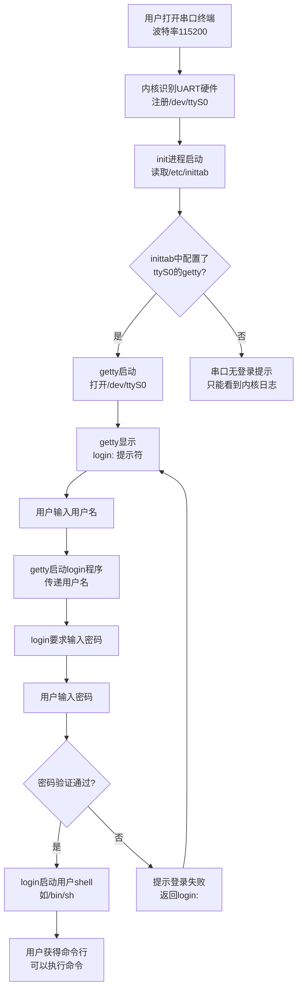

# 5.5.4 串口登录 getty：等待你的到来

> 所属章节：第5章 系统启动与初始化 > 5.5 串口控制台配置
> 难度：[B→I] | 预计阅读时间：15分钟

## 本节导读
当你接通嵌入式设备的串口线，打开终端，第一眼看到的 `login:` 提示符，背后是一个叫 getty 的小程序在默默守候。本节将带你理解 getty 的角色、学会在启动脚本中配置它，并完整走通从串口线插入到 Linux 命令行出现的全过程。

## 知识点1：getty 的作用 [I] ~800字

### 5.5.4.1 谁是 getty？它为什么总在等？

想象你敲开一扇门，门后有人应声："请问您是谁？" 在 Linux 世界里，**getty**（get teletype，获取终端）就是那个守在"门"后、永远问你"你是谁"的看门人。

当你通过串口线把电脑和开发板连好、打开串口终端时，屏幕上会稳定地显示一行文字：

```
myboard login:
```

这行字不是内核打印的，也不是 shell 主动显示的——它来自 **getty**。getty 是 Linux 初始化系统（init）启动的第一个面向用户的程序，专门负责在指定的终端设备上：

1. **打开串口设备**（如 `/dev/ttyS0`）
2. **设置串口参数**（波特率、数据位、校验位）
3. **显示登录提示符**，等待用户输入用户名
4. **把用户名交给 login 程序**，完成后续验证

getty 本身不做密码校验，它只是"迎宾员"；真正的"安检"由 `login` 程序负责。getty 和 login 配合，构成了传统 Linux 文本登录的完整入口。

### 为什么嵌入式设备必须用串口 getty？

桌面电脑有显示器和键盘，可以直接登录。但绝大多数嵌入式设备——路由器、工控板、传感器网关——没有显示器，只留了一个 **RS-232/UART 串口** 作为人机交互的唯一通道。内核把串口映射为 `/dev/ttyS0`、`/dev/ttyS1` 等设备文件，getty 负责在这些设备上"摆摊迎客"。

没有 getty，串口就只是一条单向的"内核消息输出管"，你只能看日志，却无法输入命令；有了 getty，串口才变成"可对话的终端"。

### getty 的家族成员

Linux 下有好几种 getty 实现，嵌入式领域常见的是 **BusyBox getty** 和 **agetty**（util-linux）。BusyBox 的 `getty` 体积最小，配置简单，是嵌入式系统的首选；而 PC 发行版通常用功能更全的 `agetty`。

```bash
# 查看当前系统用的哪个 getty
which getty
# 输出示例：/sbin/getty（通常是 busybox 的符号链接）

# 查看 getty 是否属于 busybox
ls -la $(which getty)
# 输出示例：/sbin/getty -> /bin/busybox
```

💡 **提示**：在嵌入式系统中，90% 的 `/sbin/getty` 都是指向 BusyBox 的软链接。BusyBox 的 getty 虽然精简，但足以完成串口登录的全部功能。

⚠️ **陷阱**：有的新手看到内核启动日志从串口疯狂输出，就以为"已经能用了"。实际上，只有当你看到 `login:` 提示符时，才说明 getty 已启动、串口终端真正就绪。如果只有内核日志而没有登录提示，多半是 getty 没配置或配置错了串口设备。

🔴 **危险**：在某些安全敏感场景下，开发阶段为了方便，root 用户不设密码就开放串口 getty。这相当于给任何人一把物理钥匙——拿到串口线就能以 root 身份进入系统。量产前务必为所有登录账户设置强密码，或完全禁用串口 getty。

## 知识点2：getty 配置 [I] ~700字

### 5.5.4.2 告诉 init：在串口上启动 getty

Linux 的 init 进程（PID 1）负责启动系统其他所有进程。传统的 SysVinit 使用 `/etc/inittab` 文件来声明"系统在不同运行级别下应该启动哪些程序"。getty 就是在 inittab 里注册的常驻进程。

#### inittab 的语法格式

inittab 每一行有四列，用冒号分隔：

```
id:runlevels:action:process
```

各列含义如表1所示。

#### 表1：inittab 关键字段说明（getty 相关）

| 字段 | 名称 | 作用 | 嵌入式常见取值 |
|------|------|------|----------------|
| `id` | 标识符 | 唯一标识这一条目，通常取设备名缩写 | `S0`、`S1` |
| `runlevels` | 运行级别 | 哪些运行级别下执行此条目 | `2345`（多用户模式） |
| `action` | 动作 | init 如何管理这个进程 | `respawn` |
| `process` | 命令 | 实际要执行的程序及参数 | `getty 115200 ttyS0` |

#### 最经典的串口 getty 配置

下面是一份嵌入式系统中常见的 `/etc/inittab` 片段，实现了在 `ttyS0` 上启动 getty、波特率 115200、崩溃后自动重启：

```bash
# /etc/inittab - 嵌入式系统串口控制台配置示例

# 系统初始化脚本
::sysinit:/etc/init.d/rcS

# 在 ttyS0 上启动 getty，波特率 115200
# respawn 表示：如果 getty 退出或崩溃，init 会立即重新启动它
S0:2345:respawn:/sbin/getty 115200 ttyS0

# 如果还有第二个串口，可以再加一行
# S1:2345:respawn:/sbin/getty 115200 ttyS1

# 按下 Ctrl+Alt+Del 时重启（部分系统支持）
::ctrlaltdel:/sbin/reboot

# 关机时执行
::shutdown:/sbin/stop
```

#### respawn：getty 的"不死之身"

配置里最值得关注的动作是 **`respawn`**。它的意思是：如果这个进程终止了，init 会立刻重新 fork 一个。为什么这很重要？

想象一下：某个用户在串口登录后输入 `exit` 退出 shell。此时 getty 的任务完成了，进程自然结束。如果没有 respawn，这个串口就永远"关门大吉"，下一个用户再也无法登录。有了 respawn，init 会秒级重新拉起 getty，屏幕上再次弹出 `login:`，串口永远开放。

同样，如果 getty 因为某种 bug 崩溃，respawn 也能保证它自动复活——这是嵌入式设备长期稳定运行的重要保障。

⚠️ **陷阱**：如果 inittab 里 action 写的是 `once` 而不是 `respawn`，getty 只会在开机时启动一次。用户 `exit` 后串口就死了，新用户再也登不进去。这是嵌入式新手最常踩的坑之一。

💡 **提示**：波特率必须和串口终端软件（如 PuTTY、minicom、MobaXterm）的设置严格一致。常见组合是 `115200 8N1`（115200 波特率、8 数据位、无校验、1 停止位）。如果两边波特率不一致，你会看到满屏乱码或完全无输出。

```bash
# 快速验证 getty 是否正在运行
ps | grep getty
# 示例输出：
#   123 root     getty 115200 ttyS0

# 查看当前串口参数
stty -F /dev/ttyS0
```

## 知识点3：登录流程 [I] ~500字

### 5.5.4.3 从串口线到命令行：完整旅程

一条串口线插上，到你真正能敲入 `ls` 命令，中间经历了多个程序的接力传递。理解这个流程，对排查"串口没反应""登录不了"等问题至关重要。

#### 图1：串口登录完整流程



#### 流程详解

**第一步：硬件就绪**
内核启动时，UART 驱动初始化硬件，把物理串口映射为字符设备文件 `/dev/ttyS0`。此时设备文件存在，但还没有程序打开它。

**第二步：init 派生 getty**
init 读取 inittab，发现 `S0:2345:respawn:/sbin/getty 115200 ttyS0`，于是在后台启动 getty 进程。getty 打开 `/dev/ttyS0`，把波特率设为 115200，然后向这个设备写入 `login:` 字符串。

**第三步：用户交互**
你打开串口终端软件，看到 `login:`，输入用户名并按回车。getty 捕获这一行文本，然后执行 `login 用户名`。

**第四步：密码验证**
login 程序读取 `/etc/passwd` 和 `/etc/shadow`，核对密码哈希。如果匹配，login 查询该用户的默认 shell（例如 `/bin/sh`），用 fork+exec 启动 shell，并把标准输入/输出都绑定到 `/dev/ttyS0`。

**第五步：命令行就绪**
shell 启动后，显示提示符（如 `#` 或 `$`），此时你才真正"进入"了 Linux 系统。

⚠️ **陷阱**：如果用户名输入正确、密码也正确，但始终回不到命令行，要检查 `/etc/passwd` 里该用户最后一个字段（shell 路径）是否正确。如果写的是 `/bin/bash` 但根文件系统里只有 `/bin/sh`，login 会失败且提示不直观。

```bash
# 查看某用户的登录shell
grep root /etc/passwd
# 示例输出：root:x:0:0:root:/root:/bin/sh
#                              ↑ 最后一个字段就是shell路径
```

💡 **提示**：如果串口能看到 `login:` 但输入用户名后卡死，通常是根文件系统缺少 `login` 程序（BusyBox 中需要确保启用了 `CONFIG_FEATURE_LOGIN_SESSION_AS_CHILD` 等相关配置），或者 `/etc/passwd` 文件损坏。

## 本节总结

| 概念 | 要点 | 操作 |
|------|------|------|
| getty 是什么 | 终端登录的"迎宾员"，负责在串口上显示 `login:` 并收集用户名 | 确认 `/sbin/getty` 存在且来自 BusyBox |
| inittab 配置 | `id:runlevels:action:process` 四段式语法 | 编辑 `/etc/inittab`，添加 `S0:2345:respawn:/sbin/getty 115200 ttyS0` |
| respawn | 保证 getty 崩溃或退出后自动重启，串口永远可用 | 检查 action 字段必须是 `respawn`，不是 `once` |
| 波特率一致性 | getty 和串口终端软件的波特率必须一致 | 两边都设为 115200 8N1 |
| 登录接力 | getty → login → 密码验证 → shell 启动 | 排查问题时逐环节确认：有无 `login:` → 有无密码提示 → 有无 shell 提示符 |

## 下一步

串口 getty 配置好之后，你就可以在启动日志滚动结束后，从容地以 root 身份登录系统了。但 root 用户直接登录在生产环境中存在安全风险——下一节 `5.5.5` 将介绍如何为串口控制台设置安全的用户认证与自动登录机制。

---

## 配套资源

### 表格清单
- 表1：inittab 关键字段说明（getty 相关）

### 图示清单
- 图1：串口登录完整流程 [mermaid图]
- 图2：串口线连接示意图 [配图说明]——展示开发板 UART 引脚与 USB转串口模块的连接方式（TX-RX 交叉、共地）

### 代码清单
- 代码1：检查 getty 来源的 shell 命令
- 代码2：完整 `/etc/inittab` 串口 getty 配置示例
- 代码3：查看串口参数与用户 shell 路径的命令
