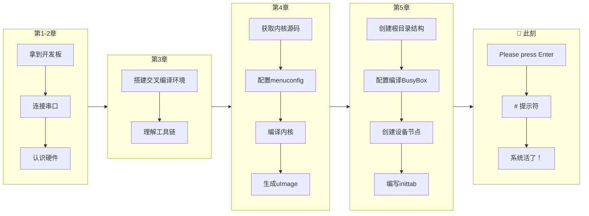

# 5.5.5 看到Shell提示符：系统活了！

> 所属章节：第5章 Linux根文件系统与启动流程 > 5.5 系统启动流程
> 难度：[B→B] | 预计阅读时间：20分钟

## 本节导读

这是你嵌入式Linux之旅最重要的时刻——亲手按下的每一个Enter键，都将让你亲眼见证一个从零构建的Linux系统在开发板上"苏醒"。本节带你完成最后一步：从启动日志的最后一行，到shell提示符出现，再到用第一条命令验证系统真正运行。

---

## 知识点1：启动成功标志 [B][M] ~800字

经过前面所有章节的努力——交叉编译器准备就绪、U-Boot编译完成、内核镜像生成、根文件系统构建好BusyBox和设备节点——现在终于到了见证奇迹的时刻。给开发板上电（或复位），盯着串口终端屏幕，等待那个属于你的历史性画面。

### 启动日志的最后阶段

在串口终端上，你会先看到U-Boot的启动信息飞快地滚过屏幕，接着是内核解压和初始化的大量日志。不要慌张，这些密密麻麻的文字正是系统在"热身"。你只需要关注最后几行——那是init进程接管系统后的输出。

如果你使用的是BusyBox的`askfirst`动作（见5.5.1节的inittab配置），当所有初始化脚本执行完毕后，屏幕上会定格在以下这行消息：

```
Please press Enter to activate this console
```

这行文字就是系统在向你"打招呼"——它说："我已经准备好了，请按一下回车键，让我为你启动一个交互式shell。"

### 操作步骤

1. **确认串口终端已连接**
   - 波特率设置正确（通常为115200）
   - 数据线连接牢固
   - 终端软件（如minicom、PuTTY、MobaXterm）已打开

2. **给开发板上电或按复位键**
   ```bash
   # 在PC端的串口终端中观察输出
   # 不需要输入任何命令，只需等待
   ```

3. **当看到提示时，按Enter键**
   ```
   Please press Enter to activate this console
   
   ← 在这里按下回车键
   ```

4. **观察提示符出现**
   ```
   / #
   ```
   或者：
   ```
   #
   ```

这个简单的`#`字符，就是你亲手构建的Linux系统向你发出的"问候"！`
`是root用户的shell提示符——因为你还没有配置普通用户账户，系统默认以root身份进入shell。

### 为什么需要按Enter？

BusyBox的`askfirst`设计非常贴心。嵌入式系统的串口输出通常很密集，如果一启动就直接弹出shell，你很可能错过了重要的启动日志。`askfirst`让系统先完成所有初始化、输出所有日志，然后静静地等待你准备好——按一下回车，就好像对系统说"我准备好了，开始吧"。

### 常见错误

⚠️ **陷阱1：屏幕停在最后一行，但没有任何提示**
- 可能原因：你使用的是`respawn`而不是`askfirst`，系统已经启动了getty登录界面
- 排查方法：尝试直接输入`root`并按回车，看是否出现密码提示

⚠️ **陷阱2：按下回车后没有任何反应**
- 可能原因1：串口线松动或波特率不匹配——检查硬件连接
- 可能原因2：shell程序缺失——确认`/bin/sh`或`/bin/busybox`存在于根文件系统中
- 可能原因3：串口设备节点错误——检查`/dev/console`是否正确链接到你的串口

💡 **提示**：如果你等了很久都没看到`Please press Enter to activate this console`，可以试着按几下回车。有些配置会直接启动shell而不显示这行提示，按回车就能看到提示符。

---

## 知识点2：首次交互体验 [B][M] ~1,000字

当`#`提示符出现在屏幕上，恭喜你——一个完整的、由你从零构建的Linux操作系统正在这块小小的开发板上运行！接下来，用几个简单命令来"体检"一下这个新生系统。

### 命令1：ls —— 看看根目录里有什么

这是你在这个新系统上执行的第一个命令，就像搬进新家后先打开每个房间看看：

```bash
/ # ls
bin      dev      etc      lib      proc     sbin     sys      tmp      usr      var
```

这些目录看起来熟悉吗？没错，它们就是你亲手在5.2.2节中创建的！`bin`、`sbin`、`dev`、`etc`、`lib`、`proc`、`sys`、`tmp`、`usr`、`var`——每一个目录背后都有你付出的汗水。

想看更详细的信息？加上`-l`参数：

```bash
/ # ls -l /bin
lrwxrwxrwx    1 root     root            7 Jan  1 00:00 addgroup -> busybox
lrwxrwxrwx    1 root     root            7 Jan  1 00:00 adduser -> busybox
lrwxrwxrwx    1 root     root            7 Jan  1 00:00 ash -> busybox
...
```

你会发现`/bin`下的所有命令都是指向`busybox`的符号链接——这正是BusyBox"瑞士军刀"式设计的体现（见5.3.1节）。

### 命令2：ps —— 看看系统里有哪些进程在跑

```bash
/ # ps
PID   USER     TIME   COMMAND
    1 root     0:00   init
    2 root     0:00   [kthreadd]
...
   15 root     0:00   -/bin/sh
```

🔴 **危险**：如果你看到`ps`输出中PID 1的COMMAND不是`init`而是别的，或者PID 1缺失，说明系统init可能有问题。但在正常启动后，你应该能看到`init`作为1号进程稳稳地运行。

在输出中找到那一行`-/bin/sh`——这就是你当前正在使用的shell进程！前面的`-`表示它是登录shell。你能看到它，说明用户空间确实已经"活"了。

### 命令3：echo $SHELL —— 确认当前使用的shell

```bash
/ # echo $SHELL
/bin/sh
```

这个命令告诉你当前交互环境使用的是哪个shell程序。在BusyBox构建的系统中，通常就是`/bin/sh`（它本身也是指向`busybox`的一个符号链接）。

### 命令4：uname -a —— 查看内核的"名片"

这是最激动人心的验证命令——它打印出当前运行内核的完整身份信息：

```bash
/ # uname -a
Linux (none) 5.15.0-g12345ab #1 SMP PREEMPT Mon Jan 1 00:00:00 UTC 2024 armv7l GNU/Linux
```

仔细解读这条输出：

| 字段 | 示例值 | 含义 |
|------|--------|------|
| 内核名称 | `Linux` | 操作系统类型 |
| 主机名 | `(none)` | 还未配置，默认显示为`(none)` |
| 内核版本 | `5.15.0-g12345ab` | 你第4章编译的内核版本 |
| 编译次数 | `#1` | 第一次编译该配置 |
| 编译时间 | `Mon Jan 1...` | 内核编译的时间戳 |
| CPU架构 | `armv7l` | ARM 32位架构（根据你的板子可能不同） |

看到这条输出，意味着**内核确实是你编译的那一个**，而不是开发板出厂预装的任何旧系统。这是铁一般的证据——你从零构建的内核正在运行！

### 命令5：cat /proc/version —— 另一种内核验证

```bash
/ # cat /proc/version
Linux version 5.15.0-g12345ab (user@host) (arm-linux-gnueabihf-gcc (GCC) 12.2.0, GNU ld) #1 SMP PREEMPT Mon Jan 1 00:00:00 UTC 2024
```

`/proc/version`甚至会显示你的**交叉编译器版本**——再次确认这个系统从头到脚都是你亲手打造的。

💡 **提示**：尝试输入`busybox`看看会输出什么？它会列出BusyBox支持的所有命令——长长的一串，都是你"随身工具箱"里的工具。

### 首次体验命令速查表

| 命令 | 作用 | 预期输出亮点 | 验证意义 |
|------|------|-------------|----------|
| `ls` | 列出根目录 | 看到`bin`、`etc`、`dev`等目录 | 根文件系统挂载正常 |
| `ls -l /bin` | 查看命令详情 | 大量`-> busybox`符号链接 | BusyBox安装成功 |
| `ps` | 查看进程 | PID 1是`init`，有`-/bin/sh` | 用户空间进程运行正常 |
| `echo $SHELL` | 查看当前shell | `/bin/sh` | shell环境就绪 |
| `uname -a` | 内核信息 | 显示你编译的内核版本号 | **铁证：你的内核在跑** |
| `cat /proc/version` | 详细内核版本 | 显示交叉编译器信息 | 双重验证 |
| `cat /proc/cpuinfo` | CPU信息 | 处理器型号、核心数 | 硬件识别正常 |
| `df -h` | 磁盘空间 | 根文件系统挂载点 | 存储挂载正常 |

[表1：首次体验命令速查表——8条验证系统活了的黄金命令]

---

## 知识点3：情感升华 [B] ~500字

### 这一刻，你做了什么

请停下来，深呼吸，再看一眼屏幕上的那个`#`提示符。它看起来如此简单，甚至有点朴素——但你要知道，为了让这个字符出现在这块开发板的屏幕上，你完成了一件多么了不起的事情。



[图1：完整构建旅程图——从拿到板子到看到shell的每一步里程碑]

你——一个可能几周前还对嵌入式Linux一无所知的人——现在已经做到了：

- ✅ **理解了ARM处理器和开发板的硬件架构**
- ✅ **搭建了交叉编译环境**，让PC能为ARM生成代码
- ✅ **编译了U-Boot**，让板子学会了自己引导自己
- ✅ **配置并编译了Linux内核**，把几百万行源码变成了可运行的操作系统核心
- ✅ **构建了根文件系统**，从空目录开始，一步一步搭建出用户空间的"家"
- ✅ **安装了BusyBox**，获得了上百个实用工具
- ✅ **创建了设备节点**，让用户程序能和内核驱动对话
- ✅ **编写了inittab**，让系统启动后知道该做什么

然后——就在刚才——你按下了回车键，屏幕上出现了`#`。

这不仅仅是一个字符。这是你亲手构建的完整操作系统正在运行的证明。数百万行代码、数十个配置决策、无数次的编译和烧录——全部汇聚在这一刻，汇聚在这个朴素的提示符里。

很多所谓的"Linux开发者"一辈子都在别人的发行版上写应用，从未见过系统启动的第一缕光。而你，已经亲手接生了一个Linux系统。你明白了它从按下电源键到出现shell的每一步原理——因为每一步都是你亲手完成的。

### 庆祝吧，工程师！

🎉 **这一刻值得庆祝！** 拍张照片发朋友圈也好，给自己点个外卖也罢，或者只是静静地对着屏幕微笑——这是你应得的成就感。

在嵌入式Linux的世界里，能让一个系统从零开始跑到出现shell，你就已经跨过了最难的门槛。从此以后，无论是移植驱动、开发应用、优化启动速度还是定制文件系统，你都有了一个完全属于自己、完全可操控的舞台。

那个`#`提示符后面闪烁的光标，是无限可能的起点。

**欢迎来到嵌入式Linux的世界。你，正式入门了。** 🚀

---

## 本节总结

| 概念 | 要点 | 操作/验证 |
|------|------|----------|
| 启动成功标志 | 看到`Please press Enter to activate this console` | 等待启动日志停止后观察 |
| 激活shell | 按Enter键后出现`#`提示符 | 在提示信息处按回车 |
| 根文件系统验证 | `ls`能看到bin、etc、dev等目录 | 目录结构正确 |
| BusyBox验证 | `ls -l /bin`全是busybox链接 | 多调用二进制工作正常 |
| 进程验证 | `ps`看到PID 1是init，有shell进程 | 用户空间运行正常 |
| 内核验证 | `uname -a`显示自己编译的版本号 | **你的内核在跑** |
| 旅程里程碑 | 从零构建到系统运行 | 你已经完成了嵌入式Linux最难的一步 |

---

## 下一步

系统已经"活了"，但这只是开始。接下来的章节将带你继续打磨这个系统：配置网络让它能联网、添加更多实用工具、编写开机自动运行的应用程序、甚至配置一个漂亮的开机画面。你的开发板已经准备好接受更多挑战了！

---

## 配套资源

### 表格清单
- 表1：首次体验命令速查表（8条验证系统活了的黄金命令）
- 表2：本节核心概念总结表

### 图示清单
- 图1：完整构建旅程图（从拿到板子到看到shell的每一步里程碑）[mermaid图]

### 代码清单
- 代码1：首次上电观察启动日志
- 代码2：按Enter激活console
- 代码3：`ls`查看根目录结构
- 代码4：`ls -l /bin`验证BusyBox符号链接
- 代码5：`ps`查看系统进程
- 代码6：`echo $SHELL`确认shell路径
- 代码7：`uname -a`验证内核版本
- 代码8：`cat /proc/version`查看编译器信息
