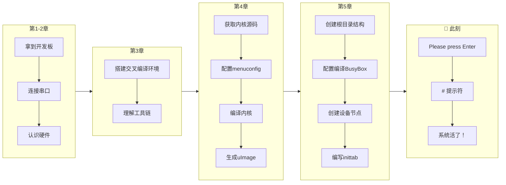

# 5.5.5 看到Shell提示符：系统活了！

> 所属章节：第5章 根文件系统与初始化 > 5.5 初始化系统
> 
> 难度：[B] | 预计阅读时间：20分钟

## <span class="blue"> 本节导读

这是你嵌入式Linux之旅最重要的时刻，亲手按下的每一个Enter键，都将让你亲眼见证一个从零构建的Linux系统在开发板上"苏醒"。<br>本节带你完成最后一步：从启动日志的最后一行，到shell提示符出现，再到用第一条命令验证系统真正运行。

---

## <span class="blue"> 启动成功标志 [B]

经过前面所有章节的努力，交叉编译器准备就绪、U-Boot编译完成、内核镜像生成、根文件系统构建好BusyBox和设备节点，现在终于到了见证奇迹的时刻。给开发板上电（或复位），盯着串口终端屏幕，等待那个属于你的历史性画面。

### 启动日志的最后阶段

在串口终端上，你会先看到U-Boot的启动信息飞快地滚过屏幕，接着是内核解压和初始化的大量日志。不要慌张，这些密密麻麻的文字正是系统在"热身"。你只需要关注最后几行，那是init进程接管系统后的输出。

如果你使用的是BusyBox的`askfirst`动作（见5.5.1节的inittab配置），当所有初始化脚本执行完毕后，屏幕上会定格在以下这行消息：

```
Please press Enter to activate this console
```

这行文字就是系统在向你"打招呼"，它说："我已经准备好了，请按一下回车键，让我为你启动一个交互式shell。"

### 操作步骤

1. **确认串口终端已连接**
   ```bash
   - 波特率设置正确（通常为115200）
   - 数据线连接牢固
   - 终端软件（如minicom、PuTTY、MobaXterm）已打开
   ```

2. **给开发板上电或按复位键**
   ```bash
   # 在PC端的串口终端中观察输出
   # 不需要输入任何命令，只需等待
   ```

3. **当看到提示时，按Enter键**
   ```
   Please press Enter to activate this console
   
   ← 在这里按下回车键
   ```

4. **观察提示符出现**
   ```
   / #
   ```
   或者：
   ```
   #
   ```

这个简单的`#`字符，就是你亲手构建的Linux系统向你发出的"问候"！
`是root用户的shell提示符，因为你还没有配置普通用户账户，系统默认以root身份进入shell。

### 为什么需要按Enter？

BusyBox的`askfirst`设计非常贴心。嵌入式系统的串口输出通常很密集，如果一启动就直接弹出shell，你很可能错过了重要的启动日志。`askfirst`让系统先完成所有初始化、输出所有日志，然后静静地等待你准备好，按一下回车，就好像对系统说"我准备好了，开始吧"。

### 常见错误

> ⚠️ **陷阱1：屏幕停在最后一行，但没有任何提示**
- 可能原因：你使用的是`respawn`而不是`askfirst`，系统已经启动了getty登录界面
- 排查方法：尝试直接输入`root`并按回车，看是否出现密码提示

> ⚠️ **陷阱2：按下回车后没有任何反应**
- 可能原因1：串口线松动或波特率不匹配，检查硬件连接
- 可能原因2：shell程序缺失，确认`/bin/sh`或`/bin/busybox`存在于根文件系统中
- 可能原因3：串口设备节点错误，检查`/dev/console`是否正确链接到你的串口

> 💡 如果你等了很久都没看到`Please press Enter to activate this console`，可以试着按几下回车。有些配置会直接启动shell而不显示这行提示，按回车就能看到提示符。

---

## <span class="blue"> 首次交互体验 [B]

当`#`提示符出现在屏幕上，恭喜你，一个完整的、由你从零构建的Linux操作系统正在这块小小的开发板上运行！接下来，用几个简单命令来"体检"一下这个新生系统。

### 命令1：ls ， 看看根目录里有什么

这是你在这个新系统上执行的第一个命令，就像搬进新家后先打开每个房间看看：

```bash
/ # ls
bin      dev      etc      lib      proc     sbin     sys      tmp      usr      var
```

这些目录看起来熟悉吗？没错，它们就是你亲手在5.2.2节中创建的！`bin`、`sbin`、`dev`、`etc`、`lib`、`proc`、`sys`、`tmp`、`usr`、`var`，每一个目录背后都有你付出的汗水。

想看更详细的信息？加上`-l`参数：

```bash
/ # ls -l /bin
lrwxrwxrwx    1 root     root            7 Jan  1 00:00 addgroup -> busybox
lrwxrwxrwx    1 root     root            7 Jan  1 00:00 adduser -> busybox
lrwxrwxrwx    1 root     root            7 Jan  1 00:00 ash -> busybox
...
```

你会发现`/bin`下的所有命令都是指向`busybox`的符号链接，这正是BusyBox"瑞士军刀"式设计的体现（见5.3.1节）。

### 命令2：ps ， 看看系统里有哪些进程在跑

```bash
/ # ps
PID   USER     TIME   COMMAND
    1 root     0:00   init
    2 root     0:00   [kthreadd]
...
   15 root     0:00   -/bin/sh
```

> 🔴 如果你看到`ps`输出中PID 1的COMMAND不是`init`而是别的，或者PID 1缺失，说明系统init可能有问题。但在正常启动后，你应该能看到`init`作为1号进程稳稳地运行。

在输出中找到那一行`-/bin/sh`，这就是你当前正在使用的shell进程！前面的`-`表示它是登录shell。你能看到它，说明用户空间确实已经"活"了。

### 命令3：echo $SHELL ， 确认当前使用的shell

```bash
/ # echo $SHELL
/bin/sh
```

这个命令告诉你当前交互环境使用的是哪个shell程序。在BusyBox构建的系统中，通常就是`/bin/sh`（它本身也是指向`busybox`的一个符号链接）。

### 命令4：uname -a ， 查看内核的"名片"

这是最激动人心的验证命令，它打印出当前运行内核的完整身份信息：

```bash
/ # uname -a
Linux (none) 5.15.0-g12345ab #1 SMP PREEMPT Mon Jan 1 00:00:00 UTC 2024 armv7l GNU/Linux
```

仔细解读这条输出：

| 字段 | 示例值 | 含义 |
|------|--------|------|
| 内核名称 | `Linux` | 操作系统类型 |
| 主机名 | `(none)` | 还未配置，默认显示为`(none)` |
| 内核版本 | `5.15.0-g12345ab` | 你第4章编译的内核版本 |
| 编译次数 | `#1` | 第一次编译该配置 |
| 编译时间 | `Mon Jan 1...` | 内核编译的时间戳 |
| CPU架构 | `armv7l` | ARM 32位架构（根据你的板子可能不同） |

看到这条输出，意味着**内核确实是你编译的那一个**，而不是开发板出厂预装的任何旧系统。这是铁一般的证据，你从零构建的内核正在运行！

### 命令5：cat /proc/version ， 另一种内核验证

```bash
/ # cat /proc/version
Linux version 5.15.0-g12345ab (user@host) (arm-linux-gnueabihf-gcc (GCC) 12.2.0, GNU ld) #1 SMP PREEMPT Mon Jan 1 00:00:00 UTC 2024
```

`/proc/version`甚至会显示你的**交叉编译器版本**，再次确认这个系统从头到脚都是你亲手打造的。

> 💡 尝试输入`busybox`看看会输出什么？它会列出BusyBox支持的所有命令，长长的一串，都是你"随身工具箱"里的工具。

### 首次体验命令速查表

| 命令 | 作用 | 预期输出亮点 | 验证意义 |
|------|------|-------------|----------|
| `ls` | 列出根目录 | 看到`bin`、`etc`、`dev`等目录 | 根文件系统挂载正常 |
| `ls -l /bin` | 查看命令详情 | 大量`-> busybox`符号链接 | BusyBox安装成功 |
| `ps` | 查看进程 | PID 1是`init`，有`-/bin/sh` | 用户空间进程运行正常 |
| `echo $SHELL` | 查看当前shell | `/bin/sh` | shell环境就绪 |
| `uname -a` | 内核信息 | 显示你编译的内核版本号 | **铁证：你的内核在跑** |
| `cat /proc/version` | 详细内核版本 | 显示交叉编译器信息 | 双重验证 |
| `cat /proc/cpuinfo` | CPU信息 | 处理器型号、核心数 | 硬件识别正常 |
| `df -h` | 磁盘空间 | 根文件系统挂载点 | 存储挂载正常 |


---


---

## <span class="blue"> 从目录到启动：如何让系统跑起来 [B]

前面我们验证了根文件系统的每个组成部分：目录结构、BusyBox、设备节点、配置文件。但读者可能还有最后一个疑问：**这个 `~/rootfs` 目录，是怎么变成开发板上能启动的系统的？** 本节补充这个关键桥梁。

### 方式1：用 QEMU 仿真启动（无需硬件）

如果你还没有开发板，或者想先在 PC 上验证，可以用 QEMU 启动。QEMU 是一个 ARM 架构的仿真器，能模拟一块虚拟开发板。

```bash
# 前提：已准备好内核镜像（zImage）和设备树（.dtb）
# 5.3.4 制作的 initramfs 或 rootfs 镜像

qemu-system-arm -M vexpress-a9 -m 256M \
  -kernel zImage \
  -dtb vexpress-v2p-ca9.dtb \
  -initrd initramfs.cpio.gz \
  -nographic \
  -append "console=ttyAMA0"
```

参数说明：

- `-M vexpress-a9`：模拟 ARM Versatile Express 开发板（QEMU 内置）
- `-m 256M`：给虚拟机分配 256MB 内存
- `-kernel zImage`：指定第4章编译的内核镜像
- `-dtb vexpress-v2p-ca9.dtb`：指定设备树 blob
- `-initrd initramfs.cpio.gz`：指定 5.3.4 制作的 initramfs 归档
- `-nographic`：不启动图形窗口，串口输出直接显示在终端
- `-append "console=ttyAMA0"`：告诉内核串口控制台是 `ttyAMA0`

> 💡 如果你使用的是 ext4 镜像而非 initramfs，QEMU 需要额外的 `-sd rootfs.ext4` 参数，并在 bootargs 中指定 `root=/dev/mmcblk0p2`。initramfs 更简单，适合第一步验证。

### 方式2：在真实开发板上启动（eMMC / Flash）

如果你已经有开发板，实际产品中根文件系统通常存储在 **eMMC** 或 **Flash** 上。以下是三种常见方案：

**方案 A：eMMC（最常用）**

eMMC 是焊接在板子上的存储芯片，容量通常为 4GB-64GB，和 SD 卡一样属于块设备，使用 ext4 文件系统。

1. **eMMC 分区**：eMMC 通常已分好区（boot 分区 + rootfs 分区）。boot 分区放内核和设备树，rootfs 分区放 ext4 镜像。
2. **烧录镜像**：
   ```bash
   # 确认 eMMC 设备名（如 /dev/mmcblk0，切勿搞错！）
   lsblk
   
   # 将 rootfs.ext4 烧录到 eMMC 的 rootfs 分区
   sudo dd if=rootfs.ext4 of=/dev/mmcblk0p2 bs=4M status=progress
   sync
   ```
3. **设置 U-Boot 启动参数**：
   ```bash
   # 在 U-Boot 命令行执行
   setenv bootargs 'console=ttyS0,115200 root=/dev/mmcblk0p2 rw rootwait'
   saveenv
   boot
   ```
   - `root=/dev/mmcblk0p2`：eMMC 第二分区
   - `rw`：以读写方式挂载
   - `rootwait`：等待存储设备初始化完成（**eMMC 必需**）

> 💡 开发调试阶段也可以用 SD 卡替代 eMMC（设备名通常是 `/dev/mmcblk1p2`），因为 SD 卡可以拔插、方便更新镜像。但量产产品中，eMMC 更可靠（抗震、接触稳定、寿命更长）。

**方案 B：NAND Flash**

NAND Flash 成本低、容量大，但需要专门的文件系统管理坏块。常用 **ubifs** 或 **jffs2**：

```bash
# 擦除 NAND 的 rootfs 分区（如 mtd2）
flash_erase /dev/mtd2 0 0

# 烧录 ubifs 镜像
nandwrite -p /dev/mtd2 rootfs.ubifs
```

bootargs 参数：
```bash
setenv bootargs 'console=ttyS0,115200 ubi.mtd=2 root=ubi0:rootfs rw rootfstype=ubifs'
```

> ⚠️ NAND Flash 有坏块，ext4 无法直接使用。ubifs 在底层自动处理坏块和磨损均衡，是 NAND 上的标准选择。这属于进阶内容，第 II 部会详细讲解。

**方案 C：SPI NOR Flash**

SPI NOR Flash 容量小（通常 8MB-128MB），适合只读 rootfs。通常用 **squashfs** + **overlayfs**（可写层放在 RAM 或 eMMC 上）：

```bash
# 制作 squashfs 镜像
mksquashfs ~/rootfs rootfs.squashfs

# 烧录到 SPI NOR（通过 SPI 接口或烧录器）
flashcp rootfs.squashfs /dev/mtd0
```

bootargs 参数：
```bash
setenv bootargs 'console=ttyS0,115200 root=/dev/mtdblock0 ro rootfstype=squashfs'
```

> 🔴 SPI NOR Flash 的擦写次数有限（通常 10 万次），不适合频繁写入。只读 rootfs + overlayfs 是最佳实践。

### 启动成功后的验证清单

无论用 QEMU 还是开发板，看到 `Please press Enter to activate this console` 后按 Enter，执行以下命令确认系统真正由你构建：

| 命令 | 预期输出 | 验证意义 |
|------|---------|---------|
| `uname -a` | `Linux ... 5.15.x ... armv7l` | 第4章编译的内核在运行 |
| `cat /proc/cpuinfo` | `Processor: ARMv7` | 内核正确识别了 CPU |
| `ps` | PID 1 = `init`，有 `/bin/sh` | 用户空间初始化成功 |
| `free` | 显示 Mem 总量和可用量 | 内存管理正常工作 |
| `ls -l /bin/ls` | 指向 `/bin/busybox` | BusyBox 多调用机制正确 |
| `echo "Hello from my Linux!"` | 正常输出 | shell 交互可用 |

> ⚠️ 如果启动时看到 `VFS: Unable to mount root fs on unknown-block(...)`，99% 是 `root=` 参数错误。检查设备名（`mmcblk0p2` vs `mmcblk1p2`）、检查是否遗漏 `rootwait`、检查 ext4 驱动是否编译进内核（`CONFIG_EXT4_FS=y`）。

> 🔴 如果看到 `Kernel panic - not syncing: No working init found`，检查 `/sbin/init` 是否存在（应该是 busybox 的链接）、检查文件架构是否匹配（ARM vs x86）、检查动态链接库是否齐全。

---

## <span class="blue"> 庆祝一下 [B]

### 这一刻，你做了什么

请停下来，深呼吸，再看一眼屏幕上的那个`#`提示符。它看起来如此简单，甚至有点朴素，但你要知道，为了让这个字符出现在这块开发板的屏幕上，你完成了一件多么了不起的事情。


```mermaid
flowchart LR
    subgraph A["第1-2章"]
        A1["拿到开发板"]
        A2["连接串口"]
        A3["认识硬件"]
    end
    subgraph B["第3章"]
        B1["搭建交叉编译环境"]
        B2["理解工具链"]
    end
    subgraph C["第4章"]
        C1["获取内核源码"]
        C2["配置menuconfig"]
        C3["编译内核"]
        C4["生成uImage"]
    end
    subgraph D["第5章"]
        D1["创建根目录结构"]
        D2["配置编译BusyBox"]
        D3["创建设备节点"]
        D4["编写inittab"]
    end
    subgraph E["🎉 此刻"]
        E1["Please press Enter"]
        E2["# 提示符"]
        E3["系统活了！"]
    end

    A --> B --> C --> D --> E
    A1 --> A2 --> A3
    B1 --> B2
    C1 --> C2 --> C3 --> C4
    D1 --> D2 --> D3 --> D4
    E1 --> E2 --> E3
```


你，一个可能几周前还对嵌入式Linux一无所知的人，现在已经做到了：

- ✅ **理解了ARM处理器和开发板的硬件架构**
- ✅ **搭建了交叉编译环境**，让PC能为ARM生成代码
- ✅ **编译了U-Boot**，让板子学会了自己引导自己
- ✅ **配置并编译了Linux内核**，把几百万行源码变成了可运行的操作系统核心
- ✅ **构建了根文件系统**，从空目录开始，一步一步搭建出用户空间的"家"
- ✅ **安装了BusyBox**，获得了上百个实用工具
- ✅ **创建了设备节点**，让用户程序能和内核驱动对话
- ✅ **编写了inittab**，让系统启动后知道该做什么

然后，就在刚才，你按下了回车键，屏幕上出现了`#`。

这不仅仅是一个字符。这是你亲手构建的完整操作系统正在运行的证明。数百万行代码、数十个配置决策、无数次的编译和烧录，全部汇聚在这一刻，汇聚在这个朴素的提示符里。

很多所谓的"Linux开发者"一辈子都在别人的发行版上写应用，从未见过系统启动的第一缕光。而你，已经亲手接生了一个Linux系统。你明白了它从按下电源键到出现shell的每一步原理，因为每一步都是你亲手完成的。

### 庆祝吧，工程师！

🎉 **这一刻值得庆祝！** 拍张照片发朋友圈也好，给自己点个外卖也罢，或者只是静静地对着屏幕微笑，这是你应得的成就感。

在嵌入式Linux的世界里，能让一个系统从零开始跑到出现shell，你就已经跨过了最难的门槛。从此以后，无论是移植驱动、开发应用、优化启动速度还是定制文件系统，你都有了一个完全属于自己、完全可操控的舞台。

那个`#`提示符后面闪烁的光标，是无限可能的起点。

**欢迎来到嵌入式Linux的世界。你，正式入门了。** 🚀

---

## 本节总结

| 概念 | 要点 | 操作/验证 |
|------|------|----------|
| 启动成功标志 | 看到`Please press Enter to activate this console` | 等待启动日志停止后观察 |
| 激活shell | 按Enter键后出现`#`提示符 | 在提示信息处按回车 |
| 根文件系统验证 | `ls`能看到bin、etc、dev等目录 | 目录结构正确 |
| BusyBox验证 | `ls -l /bin`全是busybox链接 | 多调用二进制工作正常 |
| 进程验证 | `ps`看到PID 1是init，有shell进程 | 用户空间运行正常 |
| 内核验证 | `uname -a`显示自己编译的版本号 | **你的内核在跑** |
| 旅程里程碑 | 从零构建到系统运行 | 你已经完成了嵌入式Linux最难的一步 |

---

## 下一步

下一节（5.6.1）介绍 本章小结 的具体内容。

---

