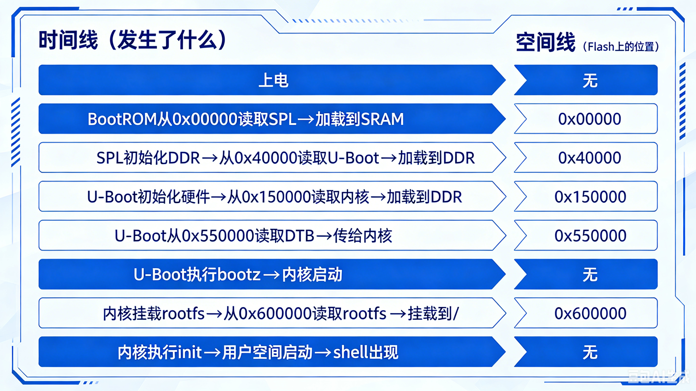

# 5.6.1 系统全景图：从裸机到shell

> 所属章节：第5章 根文件系统与初始化 > 5.6 总结与展望
> 
> 难度：[B] | 预计阅读时间：10分钟

## <span class="blue"> 本节导读

经过第1章到第5章的旅程，你已经亲手构建了一个能启动、能交互的完整Linux系统。本节用一张全景图把全部环节串联起来，标注每个步骤的产出和对应章节，让你建立从"裸机"到"shell"的完整认知框架。

---

## <span class="blue"> 完整链路：从按下电源到shell出现 [B]

嵌入式Linux系统的启动不是单一章节的知识点，而是五个章节、数十个步骤的精密协作。下面这张表格展示了完整的链路，标注了每个环节的关键动作、你的产出物、以及对应的章节。

| 阶段 | 关键动作 | 你的产出 | 对应章节 | 验证方式 |
|------|---------|---------|---------|---------|
| **上电** | BootROM 从存储介质加载代码 | — | 第1章（硬件了解） | 串口有输出 |
| **引导** | U-Boot 初始化硬件、加载内核 | u-boot.bin / u-boot.img | 第3章 | `printenv` 能查看环境变量 |
| **加载** | 内核解压、初始化子系统 | zImage / Image / uImage | 第4章 | `dmesg` 有启动日志 |
| **挂载** | 内核挂载根文件系统 | rootfs.ext4 / initramfs.cpio.gz | **第5章 5.3.4** | `mount \| grep /` 显示根分区 |
| **初始化** | init 读取配置、执行启动脚本 | /etc/inittab、/etc/init.d/rcS | **第5章 5.5.2/5.5.3** | `ps` 显示 PID 1 = init |
| **挂载虚拟** | proc、sys、devtmpfs 挂载 | /proc/cpuinfo、/dev/console | **第5章 5.2.3/5.4.3** | `ls /proc` 有内容 |
| **交互** | getty 启动 shell 等待输入 | `#` 提示符 | **第5章 5.5.4/5.5.5** | 按 Enter 后出现 `#` |

从这张表可以清楚看到：第5章不是独立的章节，而是**承接第3章（U-Boot传递参数）和第4章（内核提供系统调用接口）的终点**。没有 U-Boot 的 `bootargs`，内核不知道去哪里找 rootfs；没有内核的文件系统支持，rootfs 无法被挂载；没有 rootfs 中的 init，系统无法进入用户空间。

### 三个核心文件的位置

在整个链路中，有三个文件是你亲手制作、最终部署到板子上的：

| 文件 | 制作章节 | 放置位置 | 作用 |
|------|---------|---------|------|
| 内核镜像（zImage/Image） | 第4章 | eMMC boot 分区 / TFTP 服务器 | 操作系统核心，管理硬件、调度进程 |
| 设备树（.dtb） | 第3章/第4章 | eMMC boot 分区 / TFTP 服务器 | 硬件描述，告诉内核板子上有哪些外设 |
| 根文件系统镜像（rootfs.ext4） | **第5章 5.3.4** | eMMC rootfs 分区 / NAND Flash / SPI NOR / initramfs | 用户空间的基础：程序、配置、设备节点、脚本 |

> 💡 这三个文件是嵌入式Linux系统的"三件套"。无论是手动构建（第1-5章的方式）还是使用构建系统（Yocto/Buildroot，第II部），最终产物都是这三类文件。理解它们的位置和作用，你就理解了嵌入式Linux系统的本质结构。

### 启动参数：U-Boot 如何告诉内核"rootfs 在这里"

U-Boot 通过 `bootargs` 环境变量向内核传递启动参数。这是一个字符串，内核启动时会解析它。关键参数如下：

| 参数 | 示例 | 含义 |
|------|------|------|
| `console=` | `ttyS0,115200` | 串口控制台设备名和波特率 |
| `root=` | `/dev/mmcblk0p2` | 根文件系统所在设备 |
| `rootfstype=` | `ext4` | 根文件系统类型（可选，内核会自动探测） |
| `rw` / `ro` | `rw` | 以读写/只读方式挂载 |
| `rootwait` | `rootwait` | 等待存储设备初始化完成后再挂载（**SD/eMMC 必需**） |
| `init=` | `/sbin/init` | 指定 init 程序路径（默认，通常省略） |
| `initrd=` | `0x80800000,0x100000` | initramfs 的内存地址和大小（QEMU/旧方式） |

完整示例：

```bash
setenv bootargs 'console=ttyS0,115200 root=/dev/mmcblk0p2 rw rootwait'
```

> ⚠️ `rootwait` 是嵌入式开发中最容易遗漏的参数。eMMC / SD 卡 / NAND 等存储设备需要几百毫秒初始化，如果内核在设备就绪前尝试挂载，就会报 `VFS: Unable to mount root fs`。`rootwait` 让内核阻塞等待，直到设备出现。

---

## <span class="blue"> Flash 上的众生相：所有组件在存储中的位置 [B]

前面我们讲了启动的"时间线"——从 U-Boot 到内核到 init 到 shell，按时间顺序依次发生。但启动还有一个"空间线"——**所有组件在 Flash 上怎么摆放？BootROM 从 Flash 的哪个地址读取 SPL？SPL 从哪个地址读取 U-Boot？** 本节用一张 Flash 分区图，把这条空间线补全。

### 典型嵌入式 Flash 分区布局（以 16MB SPI NOR 为例）

以下是一个**真实产品常用的 Flash 分区方案**。注意：不同 SoC、不同板子、不同厂商的分区大小可能不同，但**逻辑结构是相通的**——永远是 SPL → U-Boot → 环境变量 → 内核 → 设备树 → 根文件系统。

| 分区名 | 起始偏移 | 大小 | 内容 | 由谁读取 | 读取到何处 |
|--------|---------|------|------|---------|-----------|
| SPL | 0x00000 | 256KB | 最小引导程序 | BootROM | 芯片内部 SRAM |
| U-Boot | 0x40000 | 1MB | 完整 Bootloader | SPL | DDR 内存 |
| U-Boot ENV | 0x140000 | 64KB | 环境变量持久化 | U-Boot | DDR 内存 |
| 内核 | 0x150000 | 4MB | zImage / uImage | U-Boot | DDR 内存 |
| 设备树 | 0x550000 | 64KB | .dtb 文件 | U-Boot | DDR 内存 |
| 根文件系统 | 0x600000 | ~9.5MB | rootfs.ext4 / squashfs | 内核 | DDR 内存（挂载后） |

> 💡 为什么是这些偏移？**BootROM 的加载协议决定的**。例如某 SoC 的 BootROM 规定：上电后从 Flash 偏移 0x0 开始读取前 256KB 作为 SPL。SPL 的代码里又硬编码了从偏移 0x40000 读取 U-Boot。这些偏移地址不是随意设定的，而是芯片参考手册里明确定义的。查阅你使用的 SoC 的 Reference Manual 中 "Boot ROM" 或 "Boot Configuration" 章节，可以找到精确的偏移表。

### 启动时序的 Flash 读取视角

如果把时间线和空间线叠加在一起，启动过程是这样读取 Flash 的：

| 阶段 | 读取者 | 从 Flash 偏移 | 读取大小 | 加载到 | 下一步 |
|------|--------|-------------|---------|--------|--------|
| 1 | BootROM | 0x00000 | 256KB | 内部 SRAM | 跳转到 SPL 执行 |
| 2 | SPL | 0x40000 | 1MB | DDR 内存 | 跳转到 U-Boot 执行 |
| 3 | U-Boot | 0x150000 | 4MB | DDR 内存 | 准备内核启动参数 |
| 4 | U-Boot | 0x550000 | 64KB | DDR 内存 | 将 DTB 地址传给内核 |
| 5 | U-Boot | — | — | — | 执行 `bootz` 或 `bootm` 启动内核 |
| 6 | 内核 | 0x600000 | 剩余全部 | DDR 内存 | 挂载 rootfs，执行 init |

**关键认知**：BootROM、SPL、U-Boot 都是**从 Flash 读取到内存后执行**，不是直接在 Flash 上运行。Flash 的读取速度（通常几十 MB/s）远低于 DDR 的访问速度（几 GB/s），所以启动的第一步永远是"把代码搬到内存里"。

### 固件制作：把分散的组件合成一个整体

开发阶段，SPL、U-Boot、内核、设备树、rootfs 是分别编译的。但量产烧录时，需要一个**完整的固件镜像**（firmware.bin），一次性烧录到 Flash 中。制作方法是用 `dd` 把各组件按偏移位置拼接到一起：

```bash
# 1. 创建空固件容器（大小 = Flash 总容量，如 16MB）
dd if=/dev/zero of=firmware.bin bs=1M count=16

# 2. 把各组件写入对应偏移位置（seek 参数 = 起始偏移 / 块大小）
# SPL 在偏移 0x00000 = 0K
dd if=u-boot-spl.bin of=firmware.bin bs=1K seek=0 conv=notrunc

# U-Boot 在偏移 0x40000 = 256K
dd if=u-boot.bin of=firmware.bin bs=1K seek=256 conv=notrunc

# 内核在偏移 0x150000 = 1344K（1MB + 256KB + 64KB = 1344KB）
dd if=zImage of=firmware.bin bs=1K seek=1344 conv=notrunc

# 设备树在偏移 0x550000 = 5440K
dd if=vexxx.dtb of=firmware.bin bs=1K seek=5440 conv=notrunc

# 根文件系统在偏移 0x600000 = 6144K
dd if=rootfs.ext4 of=firmware.bin bs=1K seek=6144 conv=notrunc

# 3. 验证固件结构（查看各偏移位置的内容）
xxd firmware.bin | grep -A 2 "00000000:"   # 看开头：应该是 SPL 的魔数
xxd firmware.bin | grep -A 2 "00040000:"   # 看 U-Boot 偏移：应该是 U-Boot 头

# 4. 烧录到 Flash（一次性烧录）
flashcp firmware.bin /dev/mtd0
```

参数说明：

- `bs=1K`：块大小 1KB，`seek` 参数以 1KB 为单位
- `seek=256`：跳过 256 个块（即 256KB），对应偏移 0x40000
- `conv=notrunc`：不截断输出文件，只覆盖指定位置

> ⚠️ `seek` 参数的计算要格外小心！1MB = 1024KB，所以 U-Boot 的偏移 0x40000 = 256KB，seek = 256。内核偏移 0x150000 = 1MB + 256KB + 64KB = 1344KB，seek = 1344。建议用计算器或脚本辅助计算，避免手动算错导致组件覆盖或留空。

### mtdparts：让 U-Boot 和内核认识 Flash 分区

U-Boot 通过 `mtdparts` 环境变量告诉内核 Flash 的分区结构。这个变量在 U-Boot 和 Linux 内核之间传递，让内核启动时知道"Flash 上哪些区域是内核、哪些是 rootfs"。

```bash
# 在 U-Boot 命令行设置 mtdparts
setenv mtdparts 'spi-nor:256k(SPL),1m(U-Boot),64k(env),4m(kernel),64k(dtb),-(rootfs)'

# 把 mtdparts 和 bootargs 合并（内核需要知道 mtdparts 才能识别分区）
setenv bootargs 'console=ttyS0,115200 root=/dev/mtdblock5 ro rootfstype=squashfs mtdparts=${mtdparts}'

saveenv
```

`mtdparts` 格式解析：

- `spi-nor`：Flash 类型（spi-nor / nand / spi-nand 等）
- `256k(SPL)`：256KB 分区，命名为 SPL
- `1m(U-Boot)`：1MB 分区，命名为 U-Boot
- `-(rootfs)`：`-` 表示剩余所有空间都分配给 rootfs
- `mtdblock5`：第 6 个 MTD 分区（从 0 开始计数），对应 rootfs

> 💡 如果你看到内核启动时打印 `mtd: partitioning` 但没有任何分区信息，或者 `root=/dev/mtdblockX` 报错 "No such device"，99% 是 `mtdparts` 设置错误。用 `cat /proc/mtd` 在启动后的 shell 中查看实际分区表，与 `mtdparts` 变量逐字对比。

### 一张图看懂：时间线 × 空间线

如果把前面学到的全部知识叠加，嵌入式 Linux 启动的全貌是：



> 🔴 **启动失败排查的"黄金法则"**：启动失败时，先看串口日志停在哪个阶段，然后检查该阶段的"读取偏移"是否正确。如果停在 `U-Boot SPL` 之后、主 U-Boot 之前 → 检查 SPL 的读取偏移（0x40000）和 U-Boot 是否烧录到位。如果停在 U-Boot 之后、内核之前 → 检查内核的读取偏移（0x150000）和 `bootargs` 中的 `root=`。如果停在 `VFS: Unable to mount root fs` → 检查 rootfs 的偏移和 `mtdparts` 设置。

## 本节总结

| 概念 | 一句话解释 | 在本章的作用 | 常见关联路径/命令 |
|------|-----------|------------|------------------|
| 根文件系统 | Linux 运行的基础目录树，包含所有用户态程序和数据 | 提供系统运行的"地基" | `/` 挂载点 |
| FHS | 文件系统层次标准，规定各目录用途 | 指导目录规划，避免乱放 | `/bin`、`/etc`、`/lib`、`/dev` |
| BusyBox | 将上百个 Unix 工具集成到单个可执行文件中 | 用最小体积提供基础命令集 | `/bin/busybox`，大量软链接 |
| devtmpfs | 内核自动管理设备节点的虚拟文件系统 | 自动创建 `/dev` 下的设备文件 | `mount -t devtmpfs devtmpfs /dev` |
| 设备节点 | `/dev` 目录下代表硬件的特殊文件 | 用户空间访问硬件的"入口" | `/dev/ttyS0`、`/dev/mmcblk0` |
| init | 第一个用户态进程（PID=1），负责系统初始化 | 启动所有后续服务和终端 | `/sbin/init` |
| inittab | init 的配置文件，定义系统运行级别和启动脚本 | 控制 init 的行为和启动序列 | `/etc/inittab` |
| getty | 在终端上等待用户登录的程序 | 提供串口交互登录界面 | `getty 115200 ttyS0` |
| **镜像制作** | **从目录到可烧录的 ext4 文件** | **将 PC 上的目录变成开发板上的文件系统** | **`dd` + `mkfs.ext4` + `cp -a`** |
| **启动参数** | **U-Boot 传递给内核的"启动说明书"** | **告诉内核 rootfs 在哪里、用什么方式挂载** | **`bootargs` 中的 `root=` 和 `rootwait`** |

## 下一步

下一节（5.6.2）介绍 常见问题 FAQ 的具体内容。

---
