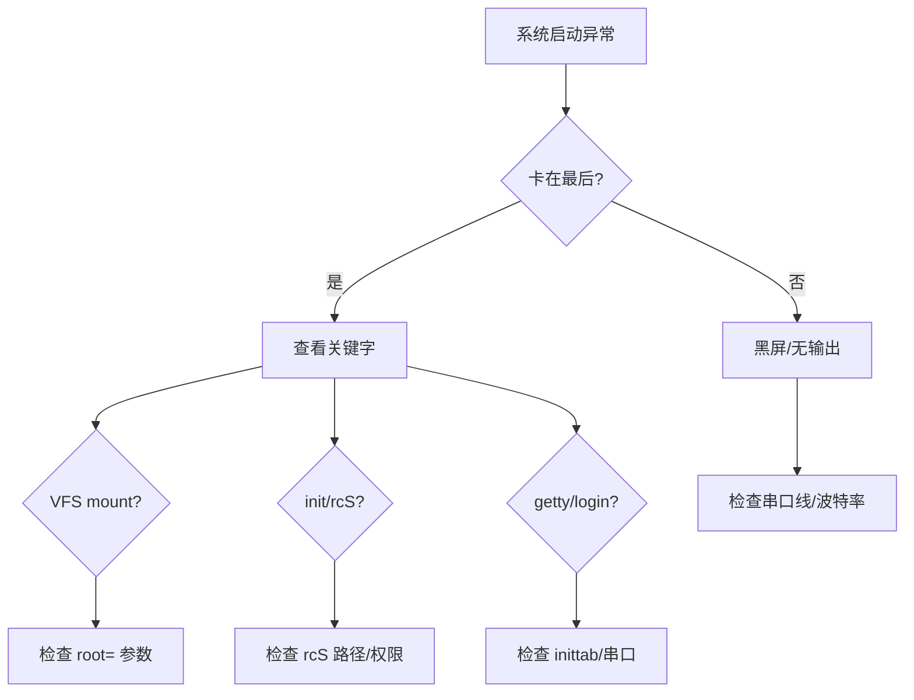

# 5.6.2 常见问题 FAQ

> 所属章节：第5章 Linux 根文件系统与启动流程 > 5.6 调试与故障排查
> 难度：[B] | 预计阅读时间：15分钟

## 本节导读

第一次启动几乎不可能一帆风顺——内核卡住、设备消失、登录失败都是家常便饭。本节把新手最常遇到的10个问题汇总成一份"急救手册"，每个问题给出症状、根因和修复动作，让你遇到黑屏时不再慌乱。

---

## 知识点1：10个高频启动问题速查 [B] ~800字

遇到启动失败时，不要盯着满屏日志发呆。下面的流程图帮你从"症状"快速定位到"嫌疑犯"：

[图1：启动故障排查决策树]



### Q1：内核卡住 "VFS: Unable to mount root fs" [B]

**现象**：内核日志滚动到 `VFS: Unable to mount root fs on unknown-block(...)` 后冻结。

**根因**：内核找不到根文件系统所在设备。

**修复**：
1. 检查 U-Boot 的 `root=` 参数（如 `root=/dev/mmcblk0p2`）
2. 确认内核开启了对应文件系统（ext4 → `CONFIG_EXT4_FS`）
3. 检查设备名拼写

```bash
# U-Boot 查看 bootargs
printenv bootargs
# 临时修改验证
setenv bootargs 'console=ttyS0,115200 root=/dev/mmcblk0p2 rw rootwait'
saveenv; boot
```

⚠️ **陷阱**：遗漏 `rootwait` 时，存储介质未初始化完成，内核会立即报错放弃挂载。

---

### Q2：init 启动失败 "can't run '/etc/init.d/rcS': No such file" [B]

**现象**：日志提示 `cannot run '/etc/init.d/rcS': No such file or directory`。

**根因**：rcS 脚本不存在、名字写错或路径错误。

**修复**：
1. 确认根文件系统中存在 `/etc/init.d/rcS`
2. 给可执行权限：`chmod +x /etc/init.d/rcS`
3. 检查 shebang：`#!/bin/sh`

💡 **提示**：Windows 编辑器保存的文件可能带 `\r\n` 换行符，init 会解析失败。用 `dos2unix` 转换。

---

### Q3：`/dev` 下没有设备节点 [B]

**现象**：`ls /dev` 只有 `console`、`null`，找不到 `ttyS0`、`mmcblk0`。

**根因**：devtmpfs 未挂载，或内核未开启 `CONFIG_DEVTMPFS`。

**修复**：
1. rcS 中加上 `mount -t devtmpfs devtmpfs /dev`
2. 检查内核 `.config` 包含 `CONFIG_DEVTMPFS=y`

---

### Q4：串口没有登录提示符 [B]

**现象**：内核日志结束后屏幕静止，不出现 `login:`。

**根因**：inittab 没为当前串口注册 getty，或串口设备名写错。

**修复**：
1. 核对 inittab 中串口名（`ttyS0`、`ttymxc0`、`ttyAMA0`）是否与硬件一致
2. 确认 `::respawn:/sbin/getty 115200 ttyS0` 语法正确

⚠️ **陷阱**：开发板串口名可能是 `ttySAC0`、`ttymxc0`，直接复制其他板的 inittab 容易栽在这里。

---

### Q5：BusyBox 命令找不到 [B]

**现象**：输入 `ls` 返回 `ls: not found`。

**根因**：`PATH` 未设置，或 BusyBox 软链接未建立。

**修复**：
1. rcS 中 `export PATH=/bin:/sbin:/usr/bin:/usr/sbin`
2. 确认 `/bin/ls` 指向 `/bin/busybox`

---

### Q6：根文件系统空间不足 [B]

**现象**：提示 `No space left on device`。

**根因**：rootfs 分区太小，或 BusyBox 编译了过多 applet。

**修复**：
1. 重新分区，给 rootfs 更大空间
2. 回到 BusyBox menuconfig，关闭不需要的功能，重新编译安装

---

### Q7：网络接口不存在 [I]

**现象**：`ifconfig` 只显示 `lo`，无 `eth0`。

**根因**：网卡驱动未编入内核，或设备树未启用网络节点。

**修复**：
1. 检查内核配置中的 `CONFIG_*_ETHERNET` 是否对应你的芯片
2. rcS 中手动 `ifconfig eth0 up` 或 `udhcpc`

---

### Q8：登录密码错误 [I]

**现象**：输入用户名后提示 `Login incorrect`。

**根因**：`/etc/passwd` 格式错误，或 root 密码未设置。

**修复**：
1. 检查 `/etc/passwd` 第一行：`root::0:0:root:/root:/bin/sh`（空密码）
2. 若设置了密码，确认 `/etc/shadow` 与 passwd 同步

---

### Q9：getty 反复重启 [I]

**现象**：getty 相关日志疯狂刷屏。

**根因**：`respawn` 导致循环，getty 启动立刻失败，init 不断重启它。

**修复**：
1. 确认 getty 指定的串口设备在 `/dev` 下存在
2. 临时把 `respawn` 改为 `once`，降低重启频率以便查看错误

---

### Q10：shell 提示符出现后无法输入 [I]

**现象**：能看到 `#`，但敲键盘无反应。

**根因**：串口线只接了 TX 没接 RX，或波特率/流控不匹配。

**修复**：
1. 检查串口线是否交叉（TX↔RX），确认 TX、RX、GND 三根线全通
2. 核对终端波特率与内核 `console=` 参数一致
3. 关闭硬件流控（RTS/CTS）再试

🔴 **危险**：不确定接线时反复热插拔可能损坏 UART 引脚。

---

## 本节总结

下面这张速查表把 10 个问题浓缩为一页纸，建议打印贴在工位上：

| 问题 | 典型症状 | 第一排查动作 | 修复关键词 |
|------|---------|-------------|-----------|
| Q1 VFS mount 失败 | 内核冻结，打印 `Unable to mount root fs` | 检查 `root=` 设备名 | `rootwait`、文件系统驱动 |
| Q2 rcS 找不到 | 提示 `can't run /etc/init.d/rcS` | `ls -l /etc/init.d/rcS` | 路径、权限、shebang |
| Q3 /dev 无节点 | `ls /dev` 空空如也 | `mount \| grep devtmpfs` | 挂载 devtmpfs、内核配置 |
| Q4 无登录提示 | 日志结束后黑屏/静止 | 查看 `inittab` 串口名 | getty、ttyS0、波特率 |
| Q5 命令找不到 | `ls: not found` | `echo $PATH` | PATH、busybox 链接 |
| Q6 空间不足 | `No space left` | `df -h` | 分区大小、裁剪 BusyBox |
| Q7 网卡缺失 | `ifconfig` 无 eth0 | `dmesg \| grep eth` | 驱动、设备树、rcS 配置 |
| Q8 密码错误 | `Login incorrect` | 查看 `/etc/passwd` 格式 | passwd、shadow、空密码 |
| Q9 getty 刷屏 | getty 日志疯狂重复 | `ls /dev/<串口>` | respawn、设备存在性 |
| Q10 无法输入 | 有提示符但键盘无效 | 检查串口线 TX/RX | 波特率、流控、接线 |

## 下一步

恭喜你已经走完了第 5 章的全部内容——从目录结构到 BusyBox，从设备节点到 init 启动，再到这页的故障急救。下一步（第 6 章）我们将学习如何交叉编译真正的用户态程序，并把第三方库部署到你的根文件系统中。

---

## 配套资源

### 表格清单
- 表1：10 个高频启动问题速查表（症状 → 排查动作 → 修复关键词）

### 图示清单
- 图1：启动故障排查决策树 [mermaid 流程图]

### 代码清单
- 代码1：U-Boot 查看和临时修改 `bootargs` 环境变量
