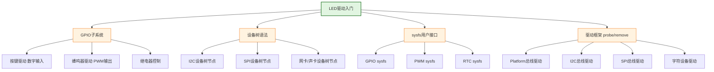

# 6.1.1 为什么从LED开始

> 所属章节：第6章 驱动开发入门 > 6.1 驱动开发的学习路线
> 难度：[B→B] | 预计阅读时间：15分钟

## 本节导读
本节回答一个初学者最常问的问题：学Linux驱动开发，为什么不先学串口、LCD或者网卡，而是先从一个小小的LED开始？读完本节，你会明白LED驱动作为"第一扇门的钥匙"的全部理由，并清楚从LED身上能学到哪些可迁移到其他外设的核心知识。

---

## 知识点1：LED是最好的入门硬件 [B] ~600字

如果你拿到一块新的开发板，面对密密麻麻的接口和外设，不知从何下手——那么先点亮LED永远是最佳策略。这不是随便选的"惯例"，而是由LED本身的四个核心特性决定的。

### 1. 极其简单：只有两种状态

LED本质上就是一个可控的开关电路。通电时电流流过LED，它发光；断电时电流中断，它熄灭。从驱动程序的角度看，控制LED只需要输出两个数字电平：高电平（亮）或低电平（灭）。这和控制复杂外设（如LCD需要初始化序列、帧缓冲管理、时序控制）形成鲜明对比。

这种简单的二元状态让初学者可以专注于**驱动程序的基本框架**本身，而不必被外设复杂的通信协议分散注意力。

### 2. 直观可见：调试零门槛

驱动开发最大的挑战是什么？是"看不到"程序在干什么。当驱动程序出错时，系统往往没有任何可见的反馈——屏幕没反应、串口没输出，你完全不知道代码执行到哪一步。

LED则不同。你可以直接把LED的开关状态作为调试信号：程序跑到A点就亮灯，跑到B点就灭灯。你的**眼睛就是最直接的调试器**，不需要示波器、不需要逻辑分析仪。

### 3. 绝对安全：烧不坏硬件

💡 **提示**：控制LED的GPIO引脚通常只输出3.3V或5V的数字信号，电流被电阻限制在几毫安到十几毫安。即使程序有bug（比如把GPIO配置方向配反了、频繁翻转），最坏的结果也只是LED不亮或者闪烁异常，绝不会烧毁芯片或损坏电路板。

相比之下，操作网卡、存储控制器、电源管理芯片时，配置错误可能导致硬件永久性损坏，或者让开发板变"砖"。LED给了你一个可以放心犯错的练习场。

### 4. 普适性强：哪里都有LED

无论是树莓派、STM32MP157、全志H3，还是i.MX6ULL、RK3588——**几乎所有嵌入式开发板都至少有一颗用户可控的LED**。这意味着你跟着教程操作时，不用担心"我的板子上没有这个外设"。LED是嵌入式世界最通用的"Hello World"硬件。

### 对比：LED vs 其他常见外设

| 对比维度 | LED | LCD显示屏 | UART串口 | SPI/I2C外设 |
|:------:|:---:|:-------:|:------:|:---------:|
| 状态复杂度 | 仅亮/灭2种 | 分辨率×色深百万种像素 | 波特率/数据位/校验位配置 | 时钟极性/相位/片选等配置 |
| 调试直观性 | 肉眼直接可见 | 需正常显示才可见 | 需接USB转串口工具 | 需逻辑分析仪抓波形 |
| 操作安全性 | 电阻限流，不会损坏 | 背光驱动可能烧保险 | 电平不匹配可能烧转换芯片 | 时序错误可能锁死总线 |
| 硬件普及率 | 几乎所有板子都有 | 需外接屏幕或专门板型 | 大多数有，但需额外接电脑 | 需外接对应传感器/芯片 |
| 驱动代码量 | 几十行 | 上千行+显存管理 | 上百行+环形缓冲区 | 上百行+协议层封装 |
| 适合入门 | ✅ 最佳 | ❌ 偏难 | ⚠️ 中等 | ⚠️ 中等 |

*表1：LED与其他常见外设作为入门选择的对比*

⚠️ **陷阱**：有些初学者觉得LED"太简单"，不屑于从它开始，直接去啃网卡驱动或DRM显示驱动。结果花了几周时间连基本的insmod/rmmod流程都没搞清楚，外设datasheet也看得云里雾里。循序渐进不是浪费时间，恰恰是最快的路径。

---

## 知识点2：从LED学到的知识 [B] ~500字

点亮一颗LED看似微不足道，但在嵌入式Linux的世界里，这个过程中你会自然接触到**驱动开发最核心的四块知识拼图**。更妙的是，这四块知识在后续学习其他驱动时几乎原样复用。

### 1. GPIO子系统——所有数字引脚的基础

LED由GPIO（General Purpose Input/Output，通用输入输出）引脚控制。通过LED驱动，你会学到如何：
- 在设备树中描述GPIO资源
- 使用`gpiod_get()`/`gpiod_set_value()` API
- 理解GPIO编号与物理引脚的映射关系

这些操作和控制蜂鸣器、继电器、按键（数字输入）完全一致。

### 2. 设备树（Device Tree）——硬件描述的通用语言

写LED驱动时，你需要在设备树（`.dts`文件）中添加一个LED节点，指定它用哪个GPIO、什么触发方式（心跳/定时器/默认亮灭）。这让你首次接触到**驱动代码与硬件描述分离**的设计思想。后续写任何驱动（网卡、声卡、SPI控制器），都要先写设备树节点，只是填写的属性名不同而已。

### 3. sysfs接口——用户空间与驱动的桥梁

内核LED子系统已经帮你把sysfs接口封装好了。你会通过下面的命令来控制LED：

```bash
# 查看系统有哪些LED
cat /sys/class/leds/

# 手动点亮LED
echo 1 > /sys/class/leds/user-led/brightness

# 手动熄灭LED
echo 0 > /sys/class/leds/user-led/brightness

# 设置LED为心跳模式（内核运行时闪烁）
echo heartbeat > /sys/class/leds/user-led/trigger
```

通过LED熟悉sysfs之后，再接触GPIO sysfs（`/sys/class/gpio/`）、PWM sysfs（`/sys/class/pwm/`）就会轻车熟路。

### 4. 驱动框架与模块化——驱动程序的骨架

无论是LED驱动、按键驱动还是串口驱动，它们都遵循相同的内核驱动框架：
- 实现`probe()`函数——驱动加载时初始化硬件
- 实现`remove()`函数——驱动卸载时清理资源
- 使用`module_init()`/`module_exit()`宏注册驱动
- 通过`insmod`/`rmmod`动态加载和卸载

LED驱动的这个骨架结构，在后续的I2C驱动、SPI驱动、platform驱动中几乎一模一样，只是`probe()`里初始化的具体内容不同。

### LED知识迁移全景图

下面这张图展示了从LED驱动学到的知识，如何像搭积木一样支撑起后续更复杂驱动的学习：



*图1：LED驱动知识的迁移路径——从LED学到的四大核心知识如何支撑后续各类驱动的学习*

🔴 **危险**：不要误解这张图的意思——学完LED并不等于自动学会了其他驱动。图中的箭头表示**知识框架可以迁移**，但每种外设特有的电气特性、通信协议、寄存器操作，仍然需要你单独学习。LED是帮你搭好"脚手架"，上面的建筑还需要你自己一块砖一块砖地砌。

💡 **提示**：建议在学LED驱动时，每学一个新概念都问自己："这个概念如果用到按键/蜂鸣器/SPI上，哪里需要改，哪里不用改？"养成这种迁移思维，学习效率会成倍提升。

---

## 本节总结

| 核心问题 | 关键结论 | 行动建议 |
|:-------:|:-------:|:-------:|
| 为什么选LED入门？ | 简单、直观、安全、通用 | 先别急着碰复杂外设 |
| LED简单在哪？ | 只有亮/灭两种状态，代码量少 | 用LED理解驱动基本框架 |
| 从LED能学到什么？ | GPIO、设备树、sysfs、驱动框架 | 每学一点就思考迁移路径 |
| 下一步学什么？ | 基于LED骨架，添加中断和定时器 | 过渡到按键和呼吸灯 |

## 下一步

明白了为什么从LED开始，下一节（6.1.2）我们将正式进入实操：找到你开发板上的LED硬件连接关系，确认它接在哪个GPIO引脚上，并查看内核是否已经为它注册了sysfs接口。准备好你的开发板和串口终端，我们要开始点灯了。

---

## 配套资源

### 表格清单
- 表1：LED与其他常见外设作为入门选择的对比

### 图示清单
- 图1：LED驱动知识的迁移路径 [mermaid图]

### 代码清单
- 代码1：通过sysfs控制LED的shell命令示例
