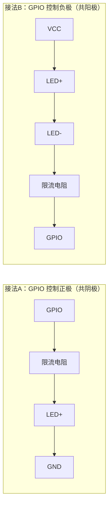

# 6.2.1 GPIO子系统初识

> 所属章节：第6章 设备驱动与硬件操作 > 6.2 GPIO子系统
> 难度：[B→I] | 预计阅读时间：25分钟

## 本节导读
本节从最基础的GPIO概念入手，带你理解"引脚"与"数字信号"的关系，学会查看开发板上GPIO的编号映射，并掌握LED与GPIO的正确硬件连接方法。学完后，你能独立确认手头的开发板有哪些GPIO可用、它们对应什么编号、以及如何安全地接一个LED灯。

---

## 知识点1：GPIO是什么 [B] ~900字

GPIO 全称 **General Purpose Input/Output**，中文叫"通用输入输出端口"。你可以把它理解为芯片伸出来的"数字手脚"——每个 GPIO 引脚一次只能做一件事：要么**输入**（读取外部电平），要么**输出**（向外发送电平），但这件事可以靠软件随时切换。

### 数字信号的本质

GPIO 处理的是**数字信号**，不是模拟信号。这意味着一个引脚上的电压只会被识别成两种状态之一：

| 状态名称 | 电平含义 | 典型电压（3.3V系统） | 典型电压（5V系统） |
|----------|----------|---------------------|-------------------|
| 低电平（逻辑0） | 关闭/假/LOW | 0V ~ 0.8V | 0V ~ 0.5V |
| 高电平（逻辑1） | 打开/真/HIGH | 2.0V ~ 3.3V | 2.2V ~ 5V |

💡 **提示**：不同芯片的"高低电平"阈值不同，但核心原则一样——中间那段模糊电压（如 1.0V~1.8V）是不确定的，电路设计时要避开。

用一个生活类比来理解：GPIO 就像你家门铃的按钮。按钮没按下去时，电路断开，读到的状态是 0；按下去接通，读到的状态是 1。输出也是同理——你软件写 1，芯片就把引脚内部接到高电压；写 0，就接到地（GND）。

### 输入 vs 输出

- **输出模式**：芯片主动驱动引脚。比如接个 LED，软件写 1 灯亮，写 0 灯灭。
- **输入模式**：芯片被动读取外部电平。比如接个按键，软件读引脚状态，判断 0 还是 1。

⚠️ **陷阱**：如果把一个引脚配置成**输出高电平（1）**，但外部电路恰好把它强行拉到地（GND），相当于电源和地直接短路，芯片可能烧毁。连接硬件前，务必确认引脚当前方向！

### 操作步骤：查看系统中的 GPIO

Linux 内核把 GPIO 资源统一放在 `/sys/class/gpio/` 目录下管理。跟着做下面的步骤，看看你的系统里有什么 GPIO：

1. 登录开发板（或树莓派、全志板等嵌入式设备）
2. 打开终端，执行以下命令：

### 代码示例

```bash
# 查看系统中有哪些 GPIO 控制器（gpiochip）
ls /sys/class/gpio/
# 典型输出：export  gpiochip0  gpiochip32  unexport

# 查看第一个控制器的信息
cat /sys/class/gpio/gpiochip0/ngpio
# 输出：32  （表示这个控制器管理 32 个 GPIO）

cat /sys/class/gpio/gpiochip0/label
# 输出：soc:gpio  （控制器的名字，不同芯片不一样）

cat /sys/class/gpio/gpiochip0/base
# 输出：0  （表示这个控制器下第一个 GPIO 在内核中的编号从 0 开始）
```

🔴 **危险**：旧版 Linux 通过 `echo 编号 > /sys/class/gpio/export` 手动导出 GPIO 来操作。这种方式在新内核（5.x 以后）已被标记为**弃用**，请优先使用内核提供的 GPIO 字符设备（`/dev/gpiochip0`）或设备树配置。后续章节会详细介绍。

---

## 知识点2：GPIO编号 [B] ~700字

拿到一块开发板，你会发现同一个引脚有好几种"名字"——原理图上标的是 `PA1`，芯片手册写的是 `GPIO_A_01`，Linux 里又变成数字 `1`。理解这三层映射，是操作 GPIO 的第一步。

### 三层映射关系


[图1：GPIO三层映射关系图]

1. **物理引脚**：开发板边缘那排金属针脚，丝印写着 `Pin 1`、`Pin 3`……这是你能摸到的东西。
2. **芯片 GPIO 名称**：芯片原厂手册里的命名，比如全志芯片用 `PA0`~`PA31`、`PB0`~`PB31`，树莓派用 `GPIO2`、`GPIO3`。名字里的字母代表 GPIO 端口（Port），数字代表该端口里的第几根线。
3. **内核 GPIO 编号**：Linux 内核给每个 GPIO 分配的唯一整数，从 0 开始递增。这是最终操作 GPIO 时使用的编号。

### 编号是怎么算出来的？

内核编号通常不是随机的，而是按照 **"端口 × 每端口引脚数 + 引脚偏移"** 计算的。以全志 H3 芯片为例：

| 芯片名称 | 端口 | 端口内引脚 | 内核编号计算公式 | 举例（PA3） |
|---------|------|-----------|-----------------|-----------|
| 全志 H3 | A~G | 0~31 | `端口序号 × 32 + 引脚序号` | `0 × 32 + 3 = 3` |
| 树莓派 4 | - | - | 由设备树固定分配，无简单公式 | GPIO2 对应内核 2 |
| i.MX6ULL | 1~5 | 0~31 | `(端口号 - 1) × 32 + 引脚号` | GPIO1_IO03 对应 `0 × 32 + 3 = 3` |

⚠️ **陷阱**：不同芯片、不同内核版本的编号规则完全不同。**千万不要**把树莓派的编号经验直接套到全志或瑞芯微上，否则操作错误的 GPIO 可能导致系统崩溃。

### 查看编号的方法

最靠谱的办法是从 `/sys/class/gpio/` 目录下的 `gpiochip` 节点推算：

```bash
# 查看每个 gpiochip 管理的范围
cat /sys/class/gpio/gpiochip0/base      # 起始编号
cat /sys/class/gpio/gpiochip0/ngpio     # 引脚数量

# 比如输出 base=0, ngpio=32，表示这个 chip 管理 0~31 号 GPIO
# 如果有 gpiochip32，base=32, ngpio=32，则表示管理 32~63 号
```

💡 **提示**：高端开发板（如 RK3588）动辄上百个 GPIO，内核会按 `gpiochip0`、`gpiochip32`、`gpiochip64`……这样分段管理。你的应用要操作哪个 GPIO，必须先确认它落在哪个 `gpiochip` 区间里。

[图2：开发板实物GPIO排针标注图（需标注物理Pin号与芯片名称的对应关系）]

---

## 知识点3：GPIO与LED的连接 [B] ~400字

学会查看 GPIO 编号之后，下一步就是让 GPIO "看得见"——最常见的方法就是接一个 LED。

### LED 的两种接法

LED 是单向导通的元件，电流只能从正极（长脚/阳极）流入、负极（短脚/阴极）流出。根据 GPIO 输出方式的不同，有两种标准接法：



[图3：LED与GPIO的两种连接方式示意图]

| 接法 | GPIO 输出 1 时 | GPIO 输出 0 时 | 常见场景 |
|------|---------------|---------------|---------|
| A（GPIO→电阻→LED+→GND）| LED 亮 | LED 灭 | 最常用，逻辑直观 |
| B（VCC→LED+→LED-→电阻→GPIO）| LED 灭 | LED 亮 | 也叫"灌电流"接法 |

### 限流电阻不能省

LED 导通后的内阻很小，如果直接接到 GPIO 上，相当于给芯片引脚灌入过大电流。

💡 **提示**：一个 3.3V GPIO 直接驱动普通 LED（正向压降约 1.8V），没有电阻的话电流可达 **100mA 以上**，远超一般 GPIO 最大输出能力（通常 8~16mA），LED 和芯片引脚双双烧毁。

电阻值快速计算公式：

```
R = (V_GPIO - V_LED) / I
```

以 3.3V 系统、红色 LED（压降 1.8V）、目标电流 10mA 为例：

```
R = (3.3V - 1.8V) / 0.01A = 150Ω
```

实际取值选标准阻值附近即可，比如 **220Ω**（电流约 6.8mA，足够亮又安全）或 **1kΩ**（电流约 1.5mA，微亮省电）。

🔴 **危险**：连接任何硬件前，**先断电**。带电插拔杜邦线可能导致 GPIO 引脚瞬间短路。养成"断电→接线→检查→上电"的习惯。

---

## 本节总结

本节从 GPIO 的数字本质出发，理清了物理引脚、芯片名称、内核编号的三层映射，并学习了 LED 的安全接法。核心内容汇总如下：

| 概念 | 要点 | 操作建议 |
|------|------|---------|
| GPIO 本质 | 数字引脚，0/1 两种状态 | 先确认开发板电压等级（3.3V 还是 5V） |
| 输入 vs 输出 | 输入读外部电平，输出驱动外部设备 | 连接硬件前确认当前方向，避免输出与外部短路 |
| 编号映射 | 物理 Pin → 芯片名称 → 内核编号 | 查看 `/sys/class/gpio/gpiochipX/base` 推算 |
| gpiochip | 内核按端口分段管理 GPIO | 多个 chip 时，先确认目标 GPIO 落在哪个区间 |
| LED 接法 | 限流电阻必须加，两种接法任选 | 初学者推荐"GPIO→电阻→LED→GND"接法，逻辑直观 |

## 下一步

知道了 GPIO 是什么、编号怎么算、LED 怎么接之后，下一节（6.2.2）我们将学习如何在命令行中**实际操作 GPIO**——通过 sysfs 和字符设备两种方式点亮你的第一颗 LED。

---

## 配套资源

### 表格清单
- 表1：高低电平电压范围对比表
- 表2：主流芯片 GPIO 编号计算公式对照表
- 表3：LED 两种接法对比表
- 表4：本节总结汇总表

### 图示清单
- 图1：GPIO 三层映射关系图 [mermaid图]
- 图2：开发板实物 GPIO 排针标注图 [配图说明]
- 图3：LED 与 GPIO 的两种连接方式示意图 [mermaid图]

### 代码清单
- 代码1：查看系统 GPIO 控制器信息（shell）
- 代码2：根据 gpiochip base/ngpio 推算编号范围（shell）
