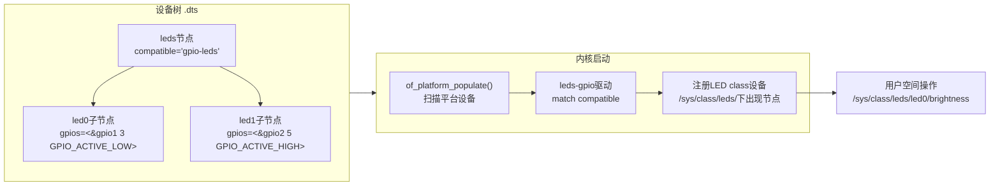

# 6.3.1 LED设备树节点编写

> 所属章节：第6章 GPIO与LED驱动开发 > 6.3 LED设备树驱动实战
> 难度：[I→I] | 预计阅读时间：25分钟

## 本节导读

本节带你从零开始，在设备树中描述LED硬件，让内核自动识别并注册LED设备。学完本节，你能独立编写LED设备树节点，编译并验证设备树二进制文件的正确性，打通"硬件描述→内核加载→驱动匹配"的完整链路。

---

## 知识点1：LED设备树节点 [I] ~1,000字

Linux内核为GPIO LED提供了一套通用驱动框架——`leds-gpio`（又称`gpio-leds`）。它的设计思路是：**你只需在设备树中描述LED长什么样、接在哪个GPIO上，内核里的通用驱动就会自动帮你注册LED设备**。这省去了自己从零写驱动的麻烦。

### 1.1 核心compatible

LED父节点必须声明`compatible = "gpio-leds"`。这相当于告诉内核："这个节点下面挂的全是GPIO控制的LED，请用`leds-gpio`驱动来接管"。

### 1.2 父子节点结构

LED设备树采用"一个父节点 + 多个子节点"的树形结构：

- **父节点**：描述这是一个LED集合，提供`compatible`和总线信息
- **子节点**：每个子节点描述**一个**具体的LED灯，包含GPIO编号、名称、默认状态

### 1.3 子节点关键属性

| 属性名 | 数据类型 | 是否必填 | 含义说明 |
|--------|----------|----------|----------|
| `gpios` | `<&gpioX GPIO_NUM GPIO_FLAGS>` | ✅ | LED连接的GPIO控制器、引脚号、标志 |
| `label` | 字符串 | ❌ | LED的人类可读名称，如"heartbeat" |
| `default-state` | 字符串 | ❌ | 开机默认状态：`on`、`off`、`keep` |
| `linux,default-trigger` | 字符串 | ❌ | 内核触发器，如`heartbeat`、`mmc0`、`timer` |
| `retain-state-suspended` | 空属性 | ❌ | 挂起时保持LED状态（省电场景用） |

💡 **提示**：`gpios`属性是**唯一必填项**，其他都是可选的。`label`虽然可选，但强烈建议填写——没有label的LED在内核日志里只会显示"led0"这种无意义名字，调试时很难分辨。

### 1.4 gpios属性详解

`gpios`采用标准设备树引脚引用格式：

```
gpios = <&gpio1 3 GPIO_ACTIVE_LOW>;
```

三个参数的含义：

| 参数 | 说明 |
|------|------|
| `&gpio1` | 引用设备树中名为`gpio1`的GPIO控制器节点 |
| `3` | 该控制器上的第3号引脚 |
| `GPIO_ACTIVE_LOW` | 有效电平标志。`GPIO_ACTIVE_HIGH`表示高电平点亮；`GPIO_ACTIVE_LOW`表示低电平点亮 |

⚠️ **陷阱**：`GPIO_ACTIVE_LOW`≠低电平无效！恰恰相反，它表示**写0（低电平）时LED点亮**。很多初学者搞反这个逻辑，导致LED状态跟预期完全相反。



[图1：设备树描述 → 内核匹配驱动 → 注册LED设备的完整流程]

### 1.5 default-state与触发器

- `default-state = "on"`：开机默认点亮（适合电源指示灯）
- `default-state = "off"`：开机默认熄灭（适合状态指示灯）
- `linux,default-trigger = "heartbeat"`：LED按心跳节奏闪烁，直观证明内核还活着

---

## 知识点2：设备树节点编写实战 [I] ~800字

现在以一块搭载i.MX6ULL的板子为例，手把手编写LED设备树节点。假设板上有两颗LED：

- **LED0（绿色）**：接GPIO1_IO03，低电平点亮，做系统状态灯
- **LED1（红色）**：接GPIO1_IO05，低电平点亮，做错误指示灯

### 2.1 确定GPIO编号

设备树里的GPIO编号不是"PA3"这种芯片引脚名，而是**GPIO控制器节点引用 + 控制器内序号**。i.MX6ULL的GPIO1控制器在设备树里通常叫`gpio1`，所以GPIO1_IO03写作`&gpio1 3`。

**如何找到你的GPIO控制器节点名？**

打开你的SoC级设备树文件（如`imx6ull.dtsi`），搜索`gpio@`：

```bash
# 在SoC设备树中搜索所有GPIO控制器
grep -n "gpio@" arch/arm/boot/dts/imx6ull.dtsi
```

你会看到类似`gpio1: gpio@209c000`这样的定义。冒号前面的`gpio1`就是引用名。

🔴 **危险**：不要直接用芯片手册上的物理地址（如`0x209C000`）填到`gpios`里！设备树要求用标签引用（`&gpio1`），因为内核需要知道整个GPIO控制器的配置（时钟、中断、父节点等），而不是孤零零一个地址。

### 2.2 完整设备树代码

在板级设备树文件（如`imx6ull-myboard.dts`）中，找到`/ {`根节点，在里面添加以下内容：

```dts
/ {
    /* 其他根节点内容... */

    leds {
        compatible = "gpio-leds";
        pinctrl-names = "default";
        pinctrl-0 = <&pinctrl_leds>;

        led-green {
            label = "status";
            gpios = <&gpio1 3 GPIO_ACTIVE_LOW>;
            default-state = "off";
            linux,default-trigger = "heartbeat";
        };

        led-red {
            label = "error";
            gpios = <&gpio1 5 GPIO_ACTIVE_LOW>;
            default-state = "off";
        };
    };
};

/* 在iomuxc节点中定义引脚复用 */
&iomuxc {
    pinctrl_leds: ledsgrp {
        fsl,pins = <
            /* GPIO1_IO03: LED绿色，复用为GPIO */
            MX6UL_PAD_GPIO1_IO03__GPIO1_IO03 0x10b0
            /* GPIO1_IO05: LED红色，复用为GPIO */
            MX6UL_PAD_GPIO1_IO05__GPIO1_IO05 0x10b0
        >;
    };
};
```

### 2.3 代码逐行解读

| 行号范围 | 内容 | 作用 |
|----------|------|------|
| `leds`父节点 | `compatible = "gpio-leds"` | 绑定`leds-gpio`通用驱动 |
| | `pinctrl-0 = <&pinctrl_leds>` | 引用下面的引脚复用配置 |
| `led-green`子节点 | `label = "status"` | 注册后出现在`/sys/class/leds/status` |
| | `gpios = <&gpio1 3 GPIO_ACTIVE_LOW>` | GPIO1控制器3号引脚，低电平有效 |
| | `linux,default-trigger = "heartbeat"` | 内核自动让这颗灯心跳闪烁 |
| `pinctrl_leds` | `MX6UL_PAD_...` | 把这两个芯片引脚复用为GPIO功能 |

💡 **提示**：`pinctrl`（引脚控制）是设备树中极易遗漏的一步。只写`gpios`而不配置`pinctrl`，GPIO控制器根本拿不到这个引脚的控制权，LED不会有任何反应。

---

## 知识点3：设备树编译与验证 [I] ~500字

写完`.dts`只是第一步，必须编译成`.dtb`（设备树二进制）并让内核正确加载。

### 3.1 使用dtc编译

设备树编译器`dtc`把人类可读的`.dts`转换成内核能解析的二进制`.dtb`：

```bash
# 方法1：直接用dtc（适合单独验证）
dtc -I dts -O dtb -o myboard.dtb imx6ull-myboard.dts

# 方法2：通过内核编译系统（推荐，会自动处理include）
make ARCH=arm CROSS_COMPILE=arm-linux-gnueabihf- imx6ull-myboard.dtb
```

⚠️ **陷阱**：直接用`dtc`编译时，如果`.dts`里通过`#include`引用了`.dtsi`，`dtc`不会自动解析C预处理器宏。需要先经过`cpp`预处理，或者干脆用内核的`make`命令——它内部已经处理了全套流程。

### 3.2 用fdtdump检查dtb内容

编译出来的`.dtb`是二进制，肉眼无法阅读。用`fdtdump`还原成文本，确认LED节点真的被编进去了：

```bash
fdtdump myboard.dtb | grep -A 20 "leds"
```

你应该能看到类似下面的输出片段：

```
  leds {
    compatible = "gpio-leds";
    led-green {
      label = "status";
      gpios = <0x01 0x03 0x01>;
      ...
    };
  };
```

如果`fdtdump`输出里没有`leds`节点，说明：
1. `.dts`文件没被正确包含进编译目标
2. 节点写在了语法错误的位置（如根节点外）

### 3.3 U-Boot加载验证

把生成的`.dtb`放到启动介质（TF卡、NFS、Flash等），在U-Boot命令行手动加载并启动：

```bash
# 从TF卡加载（mmc 0:1表示第0个mmc设备的第1分区）
load mmc 0:1 0x83000000 myboard.dtb

# 启动内核，把dtb地址传给bootz命令
bootz 0x80800000 - 0x83000000
```

内核启动后，检查LED设备是否成功注册：

```bash
# 查看内核日志中是否有leds-gpio的probe信息
dmesg | grep leds-gpio

# 查看sysfs节点是否出现
ls /sys/class/leds/
# 预期输出：status  error
```

如果`/sys/class/leds/`下空空如也，用`dmesg | grep -i led`查看probe失败原因。最常见的是`pinctrl`配置错误导致GPIO申请失败。

---

## 本节总结

| 概念 | 要点 | 操作 |
|------|------|------|
| LED父节点 | `compatible = "gpio-leds"` | 必须声明，否则内核不识别 |
| LED子节点 | `gpios`、`label`、`default-state` | `gpios`必填，引用GPIO控制器+引脚号+有效电平 |
| 有效电平 | `GPIO_ACTIVE_HIGH` / `GPIO_ACTIVE_LOW` | 根据硬件原理图选择，搞反则LED状态取反 |
| pinctrl | 引脚复用配置 | 必须配合`gpios`一起配置，否则引脚不工作 |
| 编译 | `make ARCH=arm xxx.dtb` | 优先用内核编译系统，别裸用dtc |
| 验证 | `fdtdump` + `dmesg` + `/sys/class/leds` | 三级验证确保节点存在、驱动匹配、设备注册 |

---

## 下一步

设备树节点成功让内核注册了LED设备，但"心跳闪烁"只是内核帮你点灯。下一节（6.3.2），我们将动手写自己的LED应用程序，通过`/sys/class/leds`接口直接控制LED亮灭——那才是你真正"掌握"LED的时刻。

---

## 配套资源

### 表格清单
- 表1：LED设备树子节点属性表（知识点1）
- 表2：`gpios`属性三个参数说明表（知识点1）
- 表3：实战代码逐行解读表（知识点2）
- 表4：本节核心概念总结表（本节总结）

### 图示清单
- 图1：设备树描述 → 内核匹配驱动 → 注册LED设备的完整流程 [mermaid流程图]
- 图2：i.MX6ULL GPIO1_IO03引脚与LED连接原理图示意 [配图说明：需硬件原理图截图，展示GPIO1_IO03→限流电阻→绿色LED→GND的完整回路]

### 代码清单
- 代码1：LED完整设备树节点（`leds`父节点 + `pinctrl_leds`配置）
- 代码2：`dtc`与内核`make`编译设备树命令
- 代码3：`fdtdump`验证与`dmesg`排查命令
- 代码4：U-Boot加载dtb并启动内核命令
