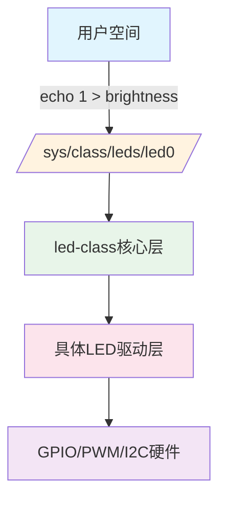
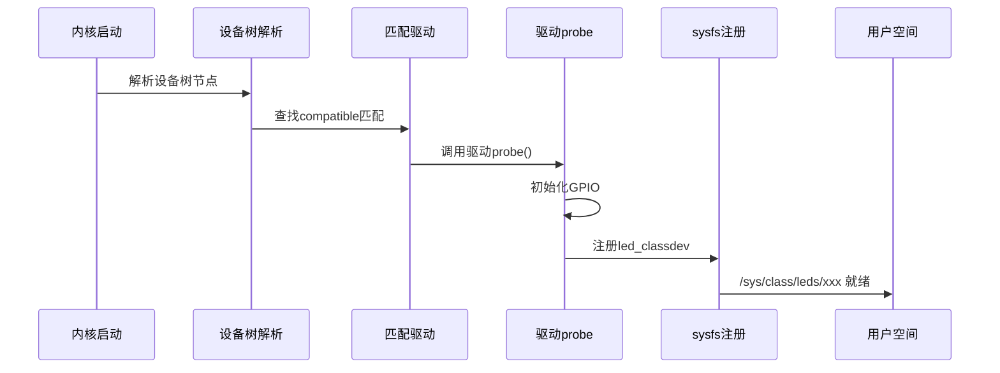

# 6.3.2 内核LED驱动框架初识

> 所属章节：第6章 嵌入式Linux驱动开发基础 > 6.3 LED驱动开发入门
> 难度：[B→I] | 预计阅读时间：25分钟

## 本节导读

本节带你认识Linux内核自带的 **LED子系统（led-class）**，了解内核如何把LED硬件包装成/sys/class/leds/下的"文件"，以及驱动是如何在开机时自动加载、自动注册、自动创建好所有用户接口的。学完本节，你无需写一行驱动代码，就能用`echo`命令点亮开发板上的LED。

## 知识点1：内核led-class驱动框架 [I] ~800字

在Linux内核中，驱动框架（Driver Framework）指的是内核为某一类硬件预先设计好的一套"基础设施"。开发者只需要按照框架的规则，填入硬件相关的操作，就能自动获得标准用户接口。LED子系统就是这样一个框架。

### 为什么需要led-class？

想象一个场景：A厂商的开发板LED在`/sys/class/leds/green_led/`下控制，B厂商却放在`/sys/class/gpio/led3/`下，C厂商又需要自己写ioctl接口。对用户来说，每个板子都要重新学习控制方式。

内核的解决方案是：**统一抽象**。不管底层LED接到GPIO、PWM还是I2C扩展芯片上，内核都在`/sys/class/leds/`目录下创建一个统一入口，用相同的文件名（`brightness`、`trigger`等）来控制。

### LED子系统的核心设计

LED子系统主要由两层组成：

1. **led-class核心层**：位于`drivers/leds/led-class.c`，负责维护所有LED设备的统一列表，在`/sys/class/leds/`下创建目录，注册标准sysfs属性文件。

2. **具体驱动层**：如`drivers/leds/leds-gpio.c`，负责识别硬件（GPIO编号、极性等），实现真正的"亮/灭"操作，并把自己的操作函数注册给核心层。



### 设备树中的LED节点

开发板的LED通常在设备树（Device Tree）中声明。以一颗接到GPIO 21的LED为例：

```dts
leds {
    compatible = "gpio-leds";
    
    led0: led-green {
        label = "green";
        gpios = <&gpio0 21 GPIO_ACTIVE_LOW>;
        default-state = "off";
    };
};
```

内核启动时，设备树被解析，LED框架自动知道这个LED的名字叫`green`，接到`gpio0`的第21号引脚，且低电平有效（GPIO_ACTIVE_LOW表示写1实际输出低电平，LED点亮）。

### /sys/class/leds/ 目录结构

当系统启动完成后，进入/sys/class/leds/查看：

```bash
# ls /sys/class/leds/
green  red  mmc0::

# ls /sys/class/leds/green/
brightness  device  max_brightness  power  subsystem  trigger  uevent
```

每个LED都有一个自己的目录。最核心的两个文件是：

- `brightness`：当前亮度值（0表示灭，1表示亮，部分LED支持PWM调光则有更大范围）
- `trigger`：触发模式，控制LED在什么事件下自动变化

| 接口文件 | 读写权限 | 功能说明 | 常用示例 |
|---------|---------|---------|---------|
| `brightness` | RW | 设置/读取LED亮度 | `echo 1 > brightness` 点亮 |
| `max_brightness` | R | 最大亮度值 | 通常为1（普通LED）或255（PWM LED） |
| `trigger` | RW | 设置触发模式 | `echo heartbeat > trigger` 心跳闪 |
| `device` | 链接 | 指向sysfs设备节点 | 查看底层设备信息 |
| `power` | RW | 电源管理相关 | 控制LED电源状态 |

⚠️ **陷阱**：`brightness`里的值是否能让LED真正亮起来，取决于`trigger`的设置。如果`trigger`不是"none"，内核会不断覆盖`brightness`的值，你的手动写入可能一闪就被改回去了。

💡 **提示**：在测试手动控制LED前，先执行`echo none > trigger`，把触发模式关掉，确保LED只听你的命令。

## 知识点2：驱动自动加载机制 [I] ~700字

上一节我们看到，设备树里有LED节点，系统启动后/sys/class/leds/下就出现了LED目录。这个过程完全自动，不需要用户手动`insmod`任何模块。这是怎么做到的？

### 整体流程：从开机到LED就绪



### 步骤拆解

**步骤1：设备树解析** [B]

内核启动早期，`of_platform_populate()`函数遍历整个设备树，把所有带`compatible`属性的节点都转换成"平台设备（platform_device）"。我们的LED节点`compatible = "gpio-leds"`，因此一个名为"gpio-leds"的平台设备被创建。

**步骤2：驱动匹配** [I]

LED的GPIO驱动（`leds-gpio.c`）在编译时向内核注册自己，声明匹配的compatible字符串：

```c
static const struct of_device_id of_gpio_leds_match[] = {
    { .compatible = "gpio-leds", },
    {},
};

static struct platform_driver gpio_led_driver = {
    .probe    = gpio_led_probe,
    .remove   = gpio_led_remove,
    .driver   = {
        .name  = "leds-gpio",
        .of_match_table = of_gpio_leds_match,
    },
};
```

当内核发现一个平台设备的`compatible = "gpio-leds"`，就会找`of_match_table`里也有同样字符串的驱动，匹配成功。

**步骤3：probe函数执行** [I]

匹配成功后，内核调用驱动的`probe()`函数。这个函数做三件事：

1. 从设备树读取GPIO编号、极性、默认状态
2. 向内核申请GPIO控制权（`gpio_request()`）
3. 填充一个`struct led_classdev`结构体，包含LED名字和亮度设置回调函数
4. 调用`led_classdev_register()`，把LED注册到led-class核心层

**步骤4：sysfs接口自动创建** [B]

`led_classdev_register()`在核心层中已经封装好了创建`/sys/class/leds/<name>/`目录和`brightness`、`trigger`等文件的逻辑。驱动只需要提供"硬件操作回调"，不需要自己写sysfs代码。

### 检查LED驱动是否加载

```bash
# 查看LED相关的已加载驱动
lsmod | grep led

# 或者直接查看模块是否存在
modinfo leds_gpio

# 查看内核日志，搜索LED注册信息
dmesg | grep -i led
```

典型输出示例：

```
[    2.345678] leds-gpio leds: LED Green registered
```

💡 **提示**：如果/sys/class/leds/目录为空，先用`dmesg | grep -i led`查看内核日志，常见问题有：设备树节点写错`compatible`字符串、GPIO被其他驱动占用、LED驱动编译时未选中。

🔴 **危险**：修改设备树或驱动后重新编译内核时，务必确认`CONFIG_LEDS_CLASS=y`和`CONFIG_LEDS_GPIO=y`（或对应驱动）已启用。可以通过`grep CONFIG_LEDS /boot/config-$(uname -r)`检查当前内核配置。

## 知识点3：LED驱动与用户空间的接口 [B] ~500字

LED驱动框架的最终目标，就是让用户空间可以用最简单的文件操作来控制硬件。本节的所有操作都可以直接在开发板的Shell中执行，无需编程。

### 手动控制LED亮灭

```bash
# 1. 查看系统中有哪些LED
ls /sys/class/leds/

# 2. 先关闭自动触发，改为手动控制
echo none > /sys/class/leds/green/trigger

# 3. 点亮LED
echo 1 > /sys/class/leds/green/brightness

# 4. 熄灭LED
echo 0 > /sys/class/leds/green/brightness

# 5. 查看当前亮度值
cat /sys/class/leds/green/brightness
```

⚠️ **陷阱**：如果你的LED是`GPIO_ACTIVE_LOW`（低电平有效），写入`brightness`的语义是"逻辑亮"，不是"物理电平"。即`echo 1 > brightness`实际输出低电平，`echo 0`实际输出高电平。这个细节在内核驱动中已经处理好了，用户只管写1=亮、0=灭即可。

### 使用内核内置触发器

内核自带多种LED触发模式，可以让LED自动响应系统事件：

```bash
# 查看当前支持的触发器
cat /sys/class/leds/green/trigger
```

输出示例（带`[]`的是当前激活的触发器）：

```
none rc-feedback kbd-scrolllock kbd-numlock kbd-capslock
kbd-kanalock kbd-shiftlock kbd-altgrlock kbd-ctrllock
kbd-altlock kbd-shiftllock kbd-shiftrlock kbd-ctrlllock
kbd-ctrlrlock usb-gadget usb-host [mmc0] timer heartbeat
```

常用触发器说明：

| 触发器名称 | 功能 | 适用场景 |
|-----------|------|---------|
| `none` | 手动控制，无自动行为 | 用户程序直接控制 |
| `heartbeat` | 模拟心跳，亮灭节奏像心跳 | 系统运行状态指示 |
| `timer` | 固定频率闪烁 | 需要周期性指示时 |
| `mmc0` | SD/eMMC读写时闪烁 | 磁盘活动指示灯 |
| `default-on` | 默认常亮 | 电源指示灯 |

```bash
# 设置为心跳模式
echo heartbeat > /sys/class/leds/green/trigger

# 设置定时器闪烁（需要先配置频率）
echo timer > /sys/class/leds/green/trigger
echo 200 > /sys/class/leds/green/delay_on    # 亮200ms
echo 800 > /sys/class/leds/green/delay_off   # 灭800ms
```

💡 **提示**：`timer`触发器激活后，会新增`delay_on`和`delay_off`两个文件，用来控制亮灭时长（单位毫秒）。这不需要重新编译任何代码，纯靠`echo`就能动态配置。

🔴 **危险**：在脚本中频繁写入`/sys/class/leds/xxx/brightness`做快速闪烁效果时，如果写入间隔小于10ms，可能会因为sysfs文件IO开销导致CPU占用升高。对高频控制需求，应该考虑在用户态程序中用`mmap`或直接写驱动，而不是反复echo。

## 本节总结

| 概念 | 要点 | 操作 |
|------|------|------|
| led-class | 内核LED统一框架，提供`/sys/class/leds/`标准接口 | 内核配置需开启`CONFIG_LEDS_CLASS` |
| 驱动匹配 | 设备树`compatible`与驱动的`of_match_table`匹配后自动probe | 查看`dmesg \| grep led`确认加载 |
| brightness | 0=灭，1=亮（逻辑值，内核自动处理极性） | `echo 1 > brightness` |
| trigger | 内核内置多种自动触发模式 | `echo heartbeat > trigger` |
| 手动控制前提 | 必须先把trigger设为`none` | `echo none > trigger` |

本节揭示了一个重要的驱动开发原则：**框架化设计**。驱动开发者只需实现硬件相关的最小代码（申请GPIO、亮灭操作），用户接口、sysfs文件、设备管理都由框架统一处理。这不仅减少了重复代码，更保证了不同硬件在用户体验上的一致性。

## 下一步

下一节（6.3.3）我们将动手编写一个最简LED驱动——从零开始注册`led_classdev`，实现`brightness_set`回调函数，让你的驱动真正接入内核LED框架。

---

## 配套资源

### 表格清单
- 表1：LED sysfs接口文件说明（知识点1中）
- 表2：常用LED trigger触发器对照表（知识点3中）
- 表3：本节核心概念总结表（本节总结中）

### 图示清单
- 图1：led-class分层架构图 [mermaid图，知识点1中]
- 图2：LED驱动从开机到就绪的时序图 [mermaid图，知识点2中]

### 代码清单
- 代码1：设备树LED节点示例（DTS）
- 代码2：驱动of_match_table匹配结构（C代码）
- 代码3：手动控制LED的shell命令序列
- 代码4：timer触发器配置命令序列

### 自检清单

在你继续下一节前，请确认：

- [ ] 能在开发板上执行`ls /sys/class/leds/`并看到LED目录
- [ ] 能用`echo none > trigger`关掉自动触发
- [ ] 能用`echo 1 > brightness`点亮LED，`echo 0 > brightness`熄灭LED
- [ ] 能用`echo heartbeat > trigger`让LED心跳闪烁
- [ ] 能用`dmesg | grep -i led`确认驱动已加载
