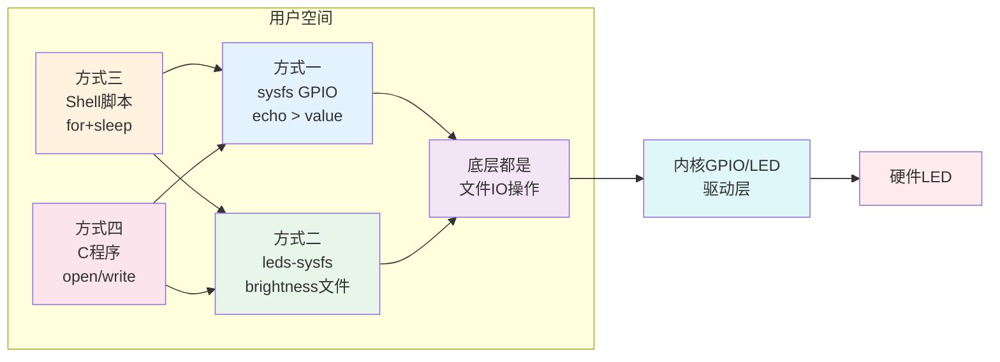

# 6.4.1 多种方式点亮LED

> 所属章节：第6章 嵌入式Linux驱动开发基础 > 6.4 LED驱动实战演练
> 难度：[B→I] | 预计阅读时间：30分钟

## 本节导读

本节是第6章的**动手实操高潮**——我们把前面学到的GPIO sysfs接口、LED子系统全部用起来，用**四种不同方式**点亮开发板上的LED。从最简单的`echo`命令，到编写C程序直接操作文件，你将完整体验"用户空间控制硬件"的全链路。学完本节，你的开发板将真正"活"起来。

## 知识点1：方式一——sysfs直接控制GPIO [B][M] ~600字

前面6.2.2节我们学习了GPIO子系统的sysfs接口。现在，我们把一个LED接到GPIO上，用最原始的方式点亮它。

### 原理回顾

sysfs GPIO接口的核心思路是：**把硬件引脚当成文件来读写**。无论LED接到哪个GPIO上，只要知道编号，就能通过 `/sys/class/gpio/gpioX/value` 控制亮灭。

### 操作步骤

假设你的LED接到了GPIO22（低电平点亮），按以下步骤操作：

**步骤1：导出GPIO引脚**

```bash
# 向内核申请GPIO22的使用权
echo 22 > /sys/class/gpio/export
```

执行成功后，会生成 `/sys/class/gpio/gpio22/` 目录。如果没有出现，检查GPIO编号是否正确（用 `dmesg | tail` 查看内核报错）。

**步骤2：设置引脚方向为输出**

```bash
# 将GPIO22设置为输出方向
echo out > /sys/class/gpio/gpio22/direction
```

**步骤3：控制LED亮灭**

```bash
# 写1：输出高电平。如果LED是低电平点亮，此时LED灭
echo 1 > /sys/class/gpio/gpio22/value

# 写0：输出低电平。LED点亮
echo 0 > /sys/class/gpio/gpio22/value
```

⚠️ **陷阱**：很多初学者在这里被"极性"搞晕。如果LED是 **GPIO_ACTIVE_LOW**（低电平点亮），写`1`反而灭，写`0`反而亮。你可以通过 `active_low` 文件查看和修改极性设置：

```bash
# 查看当前极性（0=正常，1=反转）
cat /sys/class/gpio/gpio22/active_low

# 设为反转模式：写1就输出低电平（LED亮），写0输出高电平（LED灭）
echo 1 > /sys/class/gpio/gpio22/active_low
```

**步骤4：用完后释放引脚**

```bash
echo 22 > /sys/class/gpio/unexport
```

### 特点总结

这种方式最灵活——**任何GPIO**都可以控制，不限于LED。但操作步骤较多（export→direction→value→unexport），而且需要root权限。适合临时测试和调试。

[图1：sysfs GPIO控制LED的完整流程示意]

---

## 知识点2：方式二——leds-sysfs接口 [B][M] ~600字

如果你的开发板已经配置好了LED子系统（见6.3.2节），内核会在开机时自动把LED注册到 `/sys/class/leds/` 目录下，你只需要一步就能控制。

### 原理回顾

LED子系统是内核为LED硬件提供的**统一抽象层**。驱动开发者已经把export、direction这些琐事在开机时做好了，用户只需要操作 `brightness` 文件。

### 操作步骤

**步骤1：查看系统中有哪些LED**

```bash
ls /sys/class/leds/
```

你会看到类似这样的输出（不同开发板名称不同）：

```
green  red  mmc0::  phy0-led
```

💡 **提示**：`mmc0::` 这类带双冒号的通常是内核触发器（trigger）自动控制的LED，比如SD卡读写指示灯，建议不要随意修改，以免影响系统正常运行。

**步骤2：直接控制LED亮度**

```bash
# 点亮名为"green"的LED
echo 1 > /sys/class/leds/green/brightness

# 熄灭
echo 0 > /sys/class/leds/green/brightness
```

有些LED还支持更精细的亮度控制（PWM调光），可以写入0~255之间的值：

```bash
# 50%亮度（如果硬件支持PWM）
echo 128 > /sys/class/leds/green/brightness
```

**步骤3：查看和修改触发器（trigger）**

LED子系统的一个强大功能是"触发器"——让LED根据系统事件自动闪烁。查看当前触发器：

```bash
cat /sys/class/leds/green/trigger
```

输出示例（中括号表示当前激活的触发器）：

```
[none] rc-feedback kbd-scrolllock kbd-numlock kbd-capslock kbd-kanalock kbd-shiftlock kbd-altgrlock kbd-ctrllock kbd-altlock kbd-shiftllock kbd-shiftrlock kbd-ctrlllock kbd-ctrlrlock timer oneshot disk-activity disk-read disk-write ide-disk mtd nand-none nand-read nand-write heartbeat backlight gpio cpu cpu0 default-on
```

💡 **提示**：`heartbeat` 触发器很有趣——LED会像心跳一样规律闪烁，常用于指示系统正常运行。试试看：

```bash
echo heartbeat > /sys/class/leds/green/trigger
```

要恢复手动控制，切回 `none` 触发器即可：

```bash
echo none > /sys/class/leds/green/trigger
echo 1 > /sys/class/leds/green/brightness
```

⚠️ **陷阱**：如果LED当前被某个触发器控制（如`heartbeat`），直接写 `brightness` 可能无效——控制权在触发器手里。必须先 `echo none > trigger`，才能手动控制。

[图2：LED子系统sysfs目录结构]

---

## 知识点3：方式三——Shell脚本实现LED闪烁 [B][M] ~700字

用`echo`命令手动点灯太单调了。接下来，我们把命令写进脚本，让LED自动闪烁——这是嵌入式开发中最常用的快速原型验证方法。

### 编写 blink.sh 脚本

在开发板上用`vi`或`nano`创建一个脚本文件：

```bash
nano /tmp/blink.sh
```

写入以下内容（以GPIO22 sysfs方式为例）：

```bash
#!/bin/bash

# LED闪烁脚本 - blink.sh
# 用法：sudo bash blink.sh [GPIO编号] [闪烁次数] [间隔秒数]

LED_GPIO="${1:-22}"      # 默认GPIO22
COUNT="${2:-10}"         # 默认闪烁10次
DELAY="${3:-0.5}"        # 默认间隔0.5秒

LED_PATH="/sys/class/gpio/gpio${LED_GPIO}"

# 导出GPIO（如果不存在则导出）
if [ ! -d "$LED_PATH" ]; then
    echo "$LED_GPIO" > /sys/class/gpio/export
    sleep 0.1  # 给内核一点时间创建目录
fi

# 设置方向为输出
echo out > "$LED_PATH/direction"

echo "开始闪烁GPIO${LED_GPIO}，共${COUNT}次，间隔${DELAY}秒"

for i in $(seq 1 $COUNT); do
    echo 1 > "$LED_PATH/value"
    sleep "$DELAY"
    echo 0 > "$LED_PATH/value"
    sleep "$DELAY"
    echo "  第 $i 次"
done

echo "闪烁结束，清理中..."

# 熄灭LED
echo 0 > "$LED_PATH/value"

# 释放GPIO
echo "$LED_GPIO" > /sys/class/gpio/unexport

echo "完成！"
```

### 运行脚本

```bash
# 给脚本执行权限
chmod +x /tmp/blink.sh

# 运行：GPIO22闪烁10次，间隔0.5秒
sudo /tmp/blink.sh 22 10 0.5
```

### 改用LED子系统方式

如果你的开发板有LED子系统，脚本可以更简单：

```bash
#!/bin/bash

LED="${1:-green}"
COUNT="${2:-10}"
DELAY="${3:-0.5}"
LED_PATH="/sys/class/leds/$LED"

# 关闭自动触发器，改为手动控制
echo none > "$LED_PATH/trigger"

echo "开始闪烁LED: $LED"

for i in $(seq 1 $COUNT); do
    echo 1 > "$LED_PATH/brightness"
    sleep "$DELAY"
    echo 0 > "$LED_PATH/brightness"
    sleep "$DELAY"
done

echo "完成！"
```

💡 **提示**：Shell脚本不需要编译，改一行就能立刻运行，是嵌入式调试的"瑞士军刀"。但它的精度有限——`sleep`的最小粒度约10毫秒，不适合做精确的时序控制。

⚠️ **陷阱**：`echo $GPIO > /sys/class/gpio/export` 后立即操作 `direction` 或 `value`，有时会报错"No such file or directory"。这是因为内核创建 sysfs 节点有**异步延迟**。解决方案：加一小段 `sleep 0.1` 等待，或者轮询检查目录是否存在。

🔴 **危险**：`for i in $(seq 1 $COUNT)` 这种写法在COUNT极大时可能效率低下。如果要做长时间运行的心跳灯，推荐用 `while true` 循环，但要注意加入退出条件（如检测按键或信号），否则脚本会无限占用GPIO。

[图3：blink.sh脚本运行时的LED闪烁时序]

---

## 知识点4：方式四——C程序控制LED [I] ~800字

Shell脚本方便但效率有限。当你需要精确的时序、复杂的逻辑、或者把LED控制集成到更大的应用程序中时，**C语言**是更好的选择。

### 设计思路

C程序操作sysfs的原理和Shell完全一样——**打开文件、读写内容、关闭文件**。只是用`open()`/`write()`/`read()`/`close()`这些系统调用来完成。

### 完整代码示例

创建文件 `led_control.c`：

```c
/*
 * led_control.c - 通过sysfs控制LED
 * 编译：gcc led_control.c -o led_control
 * 运行：sudo ./led_control <gpio_num> <blink_count> <delay_ms>
 */

#include <stdio.h>
#include <stdlib.h>
#include <string.h>
#include <fcntl.h>
#include <unistd.h>
#include <errno.h>

#define SYSFS_GPIO_DIR "/sys/class/gpio"
#define MAX_BUF 64

/* 向文件写入字符串，失败返回-1 */
static int sysfs_write(const char *path, const char *val)
{
    int fd = open(path, O_WRONLY);
    if (fd < 0) {
        perror("open");
        return -1;
    }
    int len = strlen(val);
    if (write(fd, val, len) != len) {
        perror("write");
        close(fd);
        return -1;
    }
    close(fd);
    return 0;
}

/* 导出GPIO */
static int gpio_export(int gpio)
{
    char path[MAX_BUF];
    snprintf(path, sizeof(path), "%s/export", SYSFS_GPIO_DIR);
    char val[MAX_BUF];
    snprintf(val, sizeof(val), "%d", gpio);
    return sysfs_write(path, val);
}

/* 释放GPIO */
static int gpio_unexport(int gpio)
{
    char path[MAX_BUF];
    snprintf(path, sizeof(path), "%s/unexport", SYSFS_GPIO_DIR);
    char val[MAX_BUF];
    snprintf(val, sizeof(val), "%d", gpio);
    return sysfs_write(path, val);
}

/* 设置GPIO方向 */
static int gpio_set_dir(int gpio, const char *dir)
{
    char path[MAX_BUF];
    snprintf(path, sizeof(path), "%s/gpio%d/direction",
             SYSFS_GPIO_DIR, gpio);
    return sysfs_write(path, dir);
}

/* 设置GPIO电平 */
static int gpio_set_value(int gpio, int val)
{
    char path[MAX_BUF];
    snprintf(path, sizeof(path), "%s/gpio%d/value",
             SYSFS_GPIO_DIR, gpio);
    char v[2] = { val ? '1' : '0', '\0' };
    return sysfs_write(path, v);
}

int main(int argc, char *argv[])
{
    if (argc != 4) {
        printf("用法: %s <gpio_num> <blink_count> <delay_ms>\n", argv[0]);
        printf("  例如: %s 22 10 500\n", argv[0]);
        return 1;
    }

    int gpio = atoi(argv[1]);
    int count = atoi(argv[2]);
    int delay_ms = atoi(argv[3]);

    /* 步骤1：导出GPIO */
    if (gpio_export(gpio) < 0) {
        fprintf(stderr, "导出GPIO%d失败（可能已被占用）\n", gpio);
        return 1;
    }

    /* 等待内核创建sysfs节点（解决异步延迟问题） */
    usleep(100000);  /* 100ms */

    /* 步骤2：设置方向 */
    if (gpio_set_dir(gpio, "out") < 0) {
        fprintf(stderr, "设置方向失败\n");
        gpio_unexport(gpio);
        return 1;
    }

    printf("GPIO%d开始闪烁 %d 次，间隔 %d ms\n", gpio, count, delay_ms);

    /* 步骤3：循环闪烁 */
    for (int i = 0; i < count; i++) {
        gpio_set_value(gpio, 1);
        usleep(delay_ms * 1000);
        gpio_set_value(gpio, 0);
        usleep(delay_ms * 1000);
    }

    /* 步骤4：清理 */
    gpio_set_value(gpio, 0);
    gpio_unexport(gpio);

    printf("完成！\n");
    return 0;
}
```

### 编译与运行

```bash
# 在开发板上编译（交叉编译请参考你的工具链）
gcc led_control.c -o led_control

# 运行：GPIO22闪烁10次，每次间隔500毫秒
sudo ./led_control 22 10 500
```

### 代码要点解析

| 函数 | 作用 | 替代Shell命令 |
|------|------|---------------|
| `gpio_export()` | 申请GPIO | `echo 22 > export` |
| `gpio_set_dir()` | 设置方向 | `echo out > direction` |
| `gpio_set_value()` | 控制电平 | `echo 1 > value` |
| `gpio_unexport()` | 释放GPIO | `echo 22 > unexport` |
| `usleep(100000)` | 等待100ms | `sleep 0.1` |

[表1：C函数与Shell命令对照表]

💡 **提示**：C程序相比Shell脚本有三大优势：(1) `usleep()` 精度达到微秒级，适合做精确时序；(2) 运行时没有进程fork开销，效率更高；(3) 可以方便地集成到更大的项目中（如守护进程、GUI程序）。

⚠️ **陷阱**：`write()` 写入sysfs时，必须包含**完整的字符串内容**（包括换行符与否都可以，但最好跟Shell保持一致）。如果写入长度不对，内核可能拒绝执行。本例中我们只写`"0"`或`"1"`单个字符，是最安全的方式。

🔴 **危险**：C程序出错时如果直接退出，可能会**忘记释放GPIO**（unexport），导致该引脚一直处于占用状态，其他程序无法使用。务必在**所有退出路径**（包括错误处理）中都调用 `gpio_unexport()`。更专业的做法是用 `atexit()` 注册清理函数，确保无论如何都会释放资源。

---

## 四种方式的关系与选择



[图4：四种控制方式的关系图——所有方式最终都通过内核驱动操作硬件]

---

## 本节总结

| 方式 | 难度 | 适用场景 | 精度 | 核心操作 |
|------|------|----------|------|----------|
| **sysfs直接控制** | [B] | 临时调试、任意GPIO | 中（Shell ms级） | `echo X > /sys/class/gpio/gpioN/value` |
| **leds-sysfs接口** | [B] | 快速控制已注册LED | 中 | `echo X > /sys/class/leds/XXX/brightness` |
| **Shell脚本** | [B] | 快速原型、自动测试 | 中（ms级） | `for`循环 + `sleep` + `echo` |
| **C程序** | [I] | 精确时序、集成应用 | 高（us级） | `open()`/`write()`/`usleep()` |

[表2：四种LED控制方式对比表]

💡 **提示**：在实际项目中，方式一和方式二往往不单独使用，而是作为方式三（Shell脚本）和方式四（C程序）的**底层手段**。选择哪种方式取决于你的需求：快速验证用Shell，产品集成用C。

## 下一步

恭喜你！现在你已经能用四种方式控制LED了。但这只是"用户空间"的玩法——接下来6.4.2节，我们将进入**内核空间**，自己编写一个完整的LED驱动模块，从`insmod`加载到`rmmod`卸载，真正理解"驱动"二字的分量。

---

## 配套资源

### 表格清单
- 表1：C函数与Shell命令对照表
- 表2：四种LED控制方式对比表

### 图示清单
- 图1：sysfs GPIO控制LED的完整流程示意 [配图说明]
- 图2：LED子系统sysfs目录结构 [配图说明]
- 图3：blink.sh脚本运行时的LED闪烁时序 [配图说明]
- 图4：四种控制方式的关系图 [mermaid图]

### 代码清单
- 代码1：sysfs GPIO控制命令（方式一）
- 代码2：leds-sysfs亮度控制与触发器切换（方式二）
- 代码3：blink.sh Shell闪烁脚本（方式三）
- 代码4：led_control.c 完整C控制程序（方式四）
