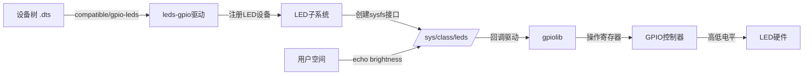

# 6.5.1 本章小结

> 所属章节：第6章 第一个外设：点亮LED > 6.5 本章小结
> 难度：[B] | 预计阅读时间：10分钟

## 本节导读

用一张表格回顾本章四大核心概念——GPIO、sysfs、设备树和LED驱动框架，帮你把零散的知识点串成一张完整的地图。

---

## 知识点：核心概念回顾 [B] ~500字

本章从"为什么用LED入门"出发，带你走完了从"敲命令"到"灯亮了"的完整链路。下面四个关键词，就是你本章的全部收获。

**GPIO子系统**是一切控制的物理基础。GPIO（General Purpose Input/Output）是SoC上最通用的数字引脚，输出高/低电平即可驱动LED。本章你学会了查看`/sys/class/gpio/gpiochipN/`下的`base`和`ngpio`，计算LED对应的全局编号，再用`export`→`direction`→`value`三步完成控制。这套编号与映射的思维方式，后续控制按键、蜂鸣器、继电器时完全复用。

**sysfs接口**是用户空间触碰硬件的桥梁。`/sys/class/gpio/`和`/sys/class/leds/`都不是磁盘上的真实文件，而是内核对象在用户空间的"影子"。你通过`echo`命令向这些文件写入字符串，内核驱动收到通知后去操作硬件寄存器——这是Linux"一切皆文件"哲学在硬件控制领域最直观的体现。

**设备树（Device Tree）**是硬件描述的通用语言。你在`.dts`文件里用`compatible = "gpio-leds"`声明LED节点，用`gpios = <&gpioX N GPIO_ACTIVE_LOW>`告诉内核"这个引脚连了一颗LED、低电平点亮"。内核启动时，`leds-gpio`驱动读取这段描述，自动完成GPIO申请和LED设备注册。这是你第一次实践"驱动代码与硬件描述分离"的设计思想。

**LED驱动框架**则是内核为你封装好的"黑盒"。你不需要写一行驱动代码，只要提供正确的设备树节点，内核就会帮你创建`/sys/class/leds/<name>/brightness`和`trigger`接口。`heartbeat`、`timer`、`netdev`等trigger让LED不只是"灯"，而成为系统状态的"可视化窗口"。

四个概念的关系可以用下面这张图概括：



[图1：本章核心概念的数据流——从设备树描述到LED发光的完整链路]

本章最核心的两条控制路径，命令如下：

```bash
# 路径A：手动GPIO控制（原始、灵活）
echo 35 > /sys/class/gpio/export
echo out > /sys/class/gpio/gpio35/direction
echo 1 > /sys/class/gpio/gpio35/value

# 路径B：LED子系统控制（语义化、推荐）
echo 1 > /sys/class/leds/myled/brightness
echo heartbeat > /sys/class/leds/myled/trigger
```

### 常见错误

⚠️ **陷阱**：混淆"GPIO全局编号"与"芯片手册上的bank.pin编号"。前者用于sysfs（如35），后者是物理分组（如GPIO1_IO03），两者需要通过`gpiochip base + pin`换算。

⚠️ **陷阱**：手动sysfs方式下，`echo 1 > value`灯却灭了——这通常是因为LED电路是ACTIVE_LOW设计，而sysfs的`active_low`文件默认为0，导致逻辑值与物理电平相反。LED子系统方式下，设备树中的`GPIO_ACTIVE_LOW`会自动帮你处理好这层翻转。

💡 **提示**：设备树节点里的`label`属性决定了LED在`/sys/class/leds/`下的目录名，命名建议采用`"board:color:function"`格式，方便后续管理。

---

## 本节总结

| 核心概念 | 一句话定义 | 本章关键操作 | 常见误区 |
|:------:|:-------:|:-------:|:-------:|
| GPIO | SoC通用数字引脚，输出高低电平驱动外设 | export→direction→value三步控制 | 混淆全局编号与bank.pin；忽略active_low |
| sysfs | 内核导出对象到用户空间的虚拟文件系统 | 用`echo`/`cat`读写`/sys`下的文件控制硬件 | 以为是磁盘文件；权限不足未用root |
| 设备树 | 描述硬件信息的树形结构，实现驱动与硬件分离 | 编写`compatible="gpio-leds"`节点并编译dtb | compatible拼写错误；phandle引用错误 |
| LED驱动框架 | 内核内置LED子系统，自动封装GPIO底层操作 | 通过`brightness`/`trigger`语义化控制LED | 以为必须手写驱动；忽略trigger的工程价值 |

*表1：本章核心概念总表——从定义到操作到避坑，一张表串联全部知识*

---

## 下一步

本章是第一部"快速上手"的收官章。你已经完成了从"拿到一块陌生的电路板"到"用C程序控制LED闪烁"的完整跨越。在第二部中，我们将打开驱动的"黑盒"——从内核源码层面理解`probe()`函数、`platform_driver`的注册流程、`gpiolib`的内部实现。你将亲手写一个属于自己的LED驱动，而不仅仅是使用现成的框架。

---

## 配套资源

### 表格清单
- 表1：本章核心概念总表

### 图示清单
- 图1：本章核心概念的数据流 [mermaid图]

### 代码清单
- 代码1：GPIO手动控制与LED子系统控制命令对比
