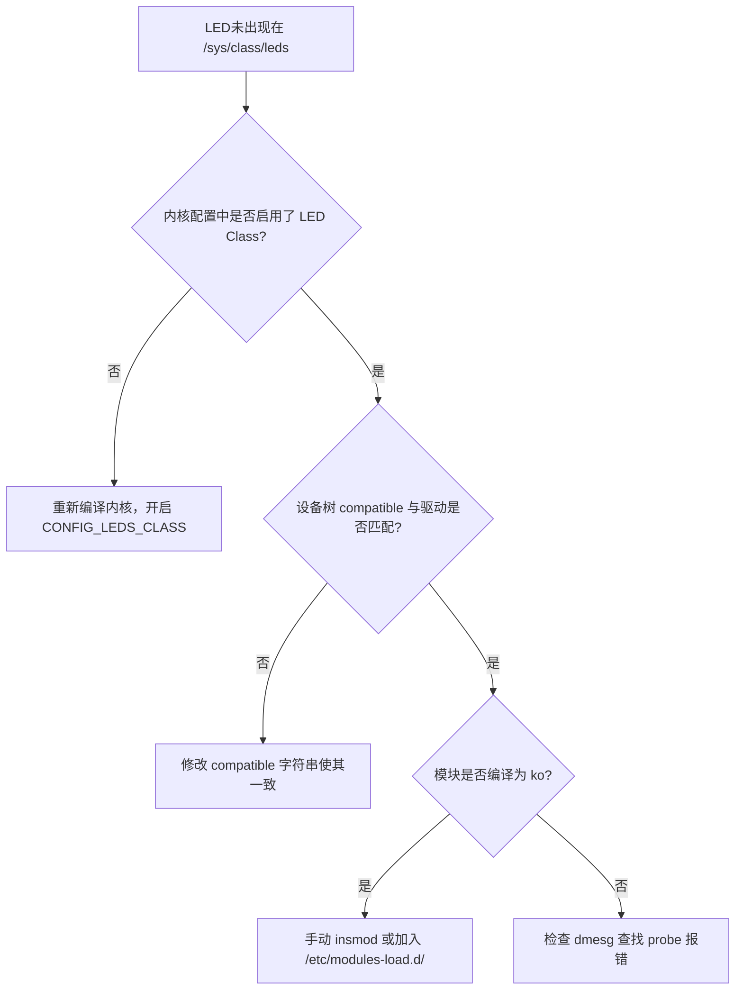

# 6.5.2 常见问题FAQ

> 所属章节：第6章 LED控制 > 6.5 故障排查
> 难度：[B] | 预计阅读时间：10分钟

## 本节导读

本节汇总LED控制中最常遇到的10个问题，帮助你快速定位故障、恢复调试进度。建议将此页加入浏览器收藏夹，遇到报错时直接对照排查。

---

## FAQ速查表 [B] ~120字

遇到问题时，先查下表锁定方向，再阅读详细解答。

| 编号 | 现象 | 最可能原因 | 快速处理 |
|------|------|------------|----------|
| Q1 | 不知道GPIO编号是多少 | 未查看原理图/设备树 | `cat /sys/kernel/debug/gpio` |
| Q2 | `echo` export 报错 "Device or resource busy" | 已被内核或驱动占用 | 检查设备树是否已声明该GPIO |
| Q3 | LED接上电源不亮 | 引脚接反、限流电阻过大 | 用万用表测电压，调换极性 |
| Q4 | 普通用户无法读写 `/sys/class/gpio` | 权限不足 | 用 `sudo` 或改组权限 |
| Q5 | `dtc` 编译设备树报错 | 语法错误或节点引用错误 | 检查分号、括号配对 |
| Q6 | LED驱动模块未自动加载 | 设备树 `compatible` 不匹配 | 确认 `.compatible` 与驱动一致 |
| Q7 | `trigger` 设置后无效 | 当前不在 `none` 模式 | 先执行 `echo none > trigger` |
| Q8 | C程序 `open()` 返回 -1 | 路径错误或权限不足 | 检查文件存在性，加 `O_RDWR` |
| Q9 | LED闪烁频率与设置不符 | 内核定时器精度或预分频 | 核对 `delay_on/delay_off` 单位 |
| Q10 | 多个LED同时控制互相干扰 | 共地/共电源或代码冲突 | 独立电源回路，加互斥锁 |

---

## 10个高频问题详解 [B] ~800字

### Q1：GPIO编号不确定

🔴 **危险**：直接使用网上教程里的编号，而不核对**自己板子**的原理图，是烧毁GPIO的头号原因。

不同开发板（树莓派、全志、RK系列）的GPIO编号映射完全不同。例如在树莓派上，物理引脚40对应的BCM编号是21；而在全志H3上可能是PG7。

**解决方法**：

1. 查看原理图或开发板文档，确认引脚名称（如 `GPIO1_A7`）
2. 使用公式换算，或运行如下命令直接查看内核已识别的GPIO：

```bash
# 代码1：查看内核已注册的GPIO编号
sudo cat /sys/kernel/debug/gpio
```

💡 **提示**：有厂商提供了 `gpio` 命令行工具（如 `gpio readall`），可以直接打印编号对照表。

---

### Q2：export 失败 "Device or resource busy"

当你尝试 `echo N > /sys/class/gpio/export` 时，提示设备忙，说明该GPIO**已被内核中的某个驱动或设备树节点占用**。

⚠️ **陷阱**：不要试图 `unexport` 别人的设备。你需要检查设备树（`.dts`），确认该GPIO是否已被声明为 `leds` 或 `gpio_keys` 的节点。如果是，应直接使用对应驱动的sysfs接口（如 `/sys/class/leds/`），而不是手动操作GPIO。

---

### Q3：LED不亮（接线错误）

这是硬件问题中的"经典重现"。LED不亮，不一定是软件bug。

**排查清单**：
1. 万用表测量引脚是否有电压跳变
2. LED正负极是否接反（长脚为正）
3. 限流电阻是否过大（一般100Ω~1kΩ）
4. 开发板GPIO电流驱动能力是否足够（有些GPIO只能输出几mA）

🔴 **危险**：直接将LED接到3.3V或5V而不串联电阻，会烧毁LED甚至损坏GPIO引脚。

---

### Q4：sysfs 权限不足

普通用户无法写入 `/sys/class/gpio/export` 或 `/sys/class/leds/` 下的文件。

**解决方法**：

```bash
# 临时方案：使用 sudo
echo 17 | sudo tee /sys/class/gpio/export

# 长期方案：将用户加入 gpio 组（部分发行版已预置）
sudo usermod -aG gpio $USER
```

⚠️ **陷阱**：修改后需要**重新登录**或执行 `newgrp gpio` 使组权限生效。

---

### Q5：设备树编译失败

使用 `dtc` 编译设备树时提示语法错误。

常见原因：
- 缺少分号 `;`
- `&` 引用节点时拼写错误
- 花括号 `{}` 未闭合

💡 **提示**：先用 `dtc -I dts -O dtb -o test.dtb your.dts` 做语法检查，确认无错再部署到 `/boot`。

---

### Q6：LED驱动没有自动加载

设备树中定义了LED节点，但启动后 `/sys/class/leds/` 下看不到设备。

**排查流程**：



---

### Q7：trigger 设置无效

想设置自定义闪烁模式，但 `echo heartbeat > trigger` 没反应。

⚠️ **陷阱**：LED处于某些trigger模式（如 `mmc0`）时，内核会接管控制权，你无法再写入 `brightness`。必须先切回 `none`：

```bash
# 先释放控制权，再设置自定义行为
echo none > /sys/class/leds/myled/trigger
echo 1 > /sys/class/leds/myled/brightness
```

---

### Q8：C程序打开 sysfs 文件失败

```c
int fd = open("/sys/class/gpio/gpio17/value", O_WRONLY);
```

返回 `-1`，errno 为 `ENOENT` 或 `EACCES`。

原因与修复：
- `ENOENT`：GPIO尚未export，先执行export
- `EACCES`：权限不足，以root运行或修改udev规则
- 忘记 `O_RDWR` 或 `O_WRONLY` 标志

---

### Q9：LED闪烁频率不对

你设置了 `delay_on=500` `delay_off=500`，但肉眼观察明显偏快或偏慢。

内核LED子系统的定时器基于jiffies，精度约10ms~4ms不等。如果要求毫秒级精确闪烁，建议改用**用户空间程序**直接控制GPIO，而不是依赖内核trigger。

💡 **提示**：通过 `cat /proc/config.gz | gunzip | grep HZ` 查看内核节拍频率（通常100Hz或250Hz），可估算最小可控精度。

---

### Q10：多LED控制冲突

同时控制多个LED时，其中一个亮会拉低整体电压，导致其他LED变暗。

**根本原因**：共地/共电源回路阻抗导致电压跌落。

**解决方法**：
1. 每个LED使用独立的限流电阻
2. 避免多LED共用一根细杜邦线供电
3. 软件层面：如果多线程操作不同LED，不需要锁；但如果操作同一组GPIO寄存器位，需要互斥锁

---

## 本节总结

| 问题类型 | 核心根因 | 首选排查动作 |
|----------|----------|--------------|
| 硬件不亮 | 接线/极性/电阻 | 万用表量电压 |
| 软件无权 | 权限/占用 | `sudo` + `debugfs` |
| 驱动不加载 | compatible/配置 | `dmesg` 查日志 |
| 控制异常 | trigger冲突/精度 | 先切`none`再自定义 |

遇到LED问题时，记住四字口诀：**"先查硬件，再看日志，核对编号，确认权限"**。

## 下一步

6.5.3节将介绍如何使用 `dmesg`、`strace` 等工具做深度调试，继续攻克更复杂的驱动故障。

---

## 配套资源

### 表格清单
- 表1：FAQ速查表（10个高频问题索引）
- 表2：本节总结表（按问题类型归纳）

### 图示清单
- 图1：LED驱动未加载的排查流程图 [mermaid图]

### 代码清单
- 代码1：`cat /sys/kernel/debug/gpio` — 查询内核已注册GPIO
