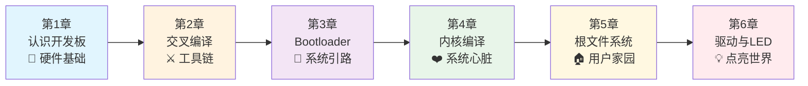

# 6.5.3 第一部总结与展望

> 所属章节：第6章 驱动初探 — 点亮LED > 6.5 点亮你的第一个LED
> 难度：[B] | 预计阅读时间：15分钟

## 本节导读

恭喜你，走到了第一部的终点！本节将带领你回顾从一块"裸板"到"能跑系统、能亮LED"的完整旅程，并为你展望第二部的深度学习路径。

---

## 知识点1：第一部六章旅程回顾 [B][M] ~800字

还记得你第一次拿起开发板时的心情吗？那是一块沉默的电路板，上面的芯片、接口、引脚对你来说就像天书。而现在的你，已经能让它上电、启动Linux内核、挂载文件系统，甚至控制一个LED灯按照你的意愿闪烁。

这一路，我们走了六步。

**第1章：认识开发板** — 我们从"看"开始。认识了ARM处理器、内存、存储、串口、网口这些硬件部件，学会了用万用表确认供电，用串口线连接调试终端。你第一次让开发板"开口说话"，在串口终端上看到了U-Boot的启动信息。那一刻，你和一个"活过来"的硬件建立了连接。

**第2章：交叉编译** — 我们打造了"武器库"。在自己的PC上搭建交叉编译工具链，理解了"为什么PC编译的程序不能直接跑在ARM板上"。你编译了第一个能在开发板上运行的`hello`程序，亲手验证了"不同架构，不同指令集"的道理。

**第3章：Bootloader** — 我们安装了"引路人"。U-Boot是系统启动的第一段代码，它初始化硬件、加载内核。你学会了编译U-Boot、烧录到开发板、配置启动参数。没有它，内核就是一块躺在存储器里的二进制数据，永远无法执行。

**第4章：内核配置与编译** — 我们锻造了"系统心脏"。从千万行源码中裁剪出适合你开发板的配置，编译出专属的zImage。你理解了Kconfig菜单背后的配置系统，知道了一个`.config`文件如何决定内核的"高矮胖瘦"。当你看到内核启动日志刷屏时，那是系统真正"苏醒"的时刻。

**第5章：根文件系统** — 我们搭建了"家园"。用BusyBox构建了一个最小根文件系统，学会了制作ext4镜像、用NFS挂载调试。init进程是第一个用户空间程序，`/bin/sh`是第一个交互接口。系统从此有了"家"，你终于可以登录、执行命令了。

**第6章：驱动与LED** — 我们点亮了"第一盏灯"。从设备树中查找LED的GPIO引脚，编写了一个最简单的平台驱动，用`sysfs`接口控制LED亮灭。这盏灯虽然微小，却是你第一次让软件直接控制硬件外设——这是驱动开发者的成人礼。

六章看似独立，实则环环相扣，构成了嵌入式Linux世界的完整拼图。

### 六章成就回顾表

| 章节 | 核心内容 | 关键技能 | 成就感时刻 |
|------|----------|----------|------------|
| 第1章 | 认识开发板硬件 | 串口连接、电源确认 | 串口终端第一次输出信息 |
| 第2章 | 交叉编译工具链 | 编译、交叉编译、文件传输 | `hello`程序在开发板上成功运行 |
| 第3章 | Bootloader（U-Boot） | 编译烧录、启动参数配置 | 看到U-Boot成功引导内核 |
| 第4章 | 内核配置与编译 | Kconfig、设备树、模块编译 | 内核启动日志在终端刷屏 |
| 第5章 | 根文件系统 | BusyBox、init进程、NFS挂载 | 登录shell，执行第一条命令 |
| 第6章 | LED驱动初探 | 设备树解析、平台驱动、sysfs接口 | LED按照自己的程序闪烁 |

### 第一部六章旅程全景图



[图1：第一部六章旅程全景图——从硬件基础到驱动开发的完整成长路径，六章环环相扣、层层递进]

### 回顾代码：点亮LED的那一刻

还记得第6章那个让你兴奋不已的命令吗？它标志着第一部的最高光时刻——你第一次用软件直接控制硬件外设：

```bash
# 第6章：点亮LED（回顾）
# 查找LED在sysfs中的路径
ls /sys/class/leds/
# 输出：heartbeat  user_led

# 手动点亮用户LED
echo 1 > /sys/class/leds/user_led/brightness
# LED亮起！✨

# 熄灭
echo 0 > /sys/class/leds/user_led/brightness
```

这段简单的命令背后，凝聚了前六章的全部积累：开发板硬件（GPIO）、交叉编译后的工具链、U-Boot启动参数、内核LED驱动子系统、sysfs文件接口、以及根文件系统提供的shell环境——缺了任何一个环节，这盏灯都不会亮。

### 旅程中的成长

从最初的"看硬件发呆"，到现在能独立搭建一套完整的嵌入式Linux系统，你已经跨越了新手最艰难的门槛。你不再是那个对着开发板不知所措的旁观者，而是成为了能让硬件"听话"的参与者。

⚠️ **陷阱**：回顾时最容易犯的错误是"跳过实验直接读代码"——很多人觉得自己"已经懂了"，就不再动手验证。但嵌入式的精髓在于" hardware in the loop "（硬件在环）。即使到了第二部，每学一个概念，都要在开发板上跑一遍。

💡 **提示**：第一部的定位是"从0到1"——让你把系统跑起来。接下来的第二部，我们将深入每一个组件的内部机制，完成"从1到精通"的跨越。

---

## 知识点2：展望第二部 — 核心机制深度解析 [B] ~500字

第一部我们做到了"知其然"：系统能启动、能运行、能控制硬件。第二部将带你走向"知其所以然"。

### 第二部内容预告

**内核启动流程深度剖析**：我们将从`reset`向量开始，追踪每一行汇编和C代码，理解ARM处理器如何从裸机状态进入C语言世界，`start_kernel()`到底做了什么，你的`init`进程是如何被"召唤"出来的。

**设备驱动模型精讲**：第6章我们写了一个简单的LED驱动，但它背后依赖的是Linux庞大的设备驱动框架。第二部门将详解总线（bus）、设备（device）、驱动（driver）的匹配机制，`platform_driver`的注册与探测流程，以及`sysfs`、`devtmpfs`、`udev`如何协同工作，让`/dev`目录下自动出现设备节点。

**字符设备与并发控制**：从`open`/`read`/`write`的系统调用，到驱动中的`file_operations`，再到进程调度与中断上下文。你将学会处理多个进程同时访问设备时的竞态问题，掌握自旋锁、信号量、互斥量、完成量等内核同步原语。

**中断与定时器**：理解ARM中断控制器（GIC）的工作原理，编写中断处理程序（顶半部与底半部），用内核定时器实现LED的呼吸灯效果——这将比你第6章的`echo 1 > brightness`酷得多。

**块设备与网络驱动进阶**：从简单的字符设备迈向更复杂的存储和网络子系统，理解Linux的块层、网络协议栈分层设计。

🔴 **重要提醒**：第二部的学习曲线会比第一部陡峭。你会遇到更多内核源码层面的细节，更多C语言指针和结构体的操作，更多"为什么这样设计"的追问。但请相信，第一部打下的实操基础，将让你在第二部中"有抓手"——你不是在真空中学理论，每一次深入都能在你已经跑起来的系统上做实验验证。

---

## 本节总结

| 维度 | 第一部已达成 | 第二部将深入 |
|------|------------|-------------|
| 内核 | 能编译、能启动 | 启动流程源码级追踪 |
| 驱动 | 会写简单平台驱动 | 驱动模型、并发、中断、定时器 |
| 调试 | 串口日志、NFS挂载 | printk级别、ftrace、kgdb |
| 文件系统 | BusyBox最小系统 | 真实根fs构建、initramfs、systemd |
| 设备树 | 会查节点、改引脚 | 绑定文档、自定义节点、驱动解析 |

---

## 写在第一部末尾的话

如果你一路跟着做到这里，请暂停一下，为自己鼓掌。

你完成了太多"第一次"：第一次让开发板说话，第一次交叉编译成功，第一次烧录Bootloader，第一次编译内核，第一次构建根文件系统，第一次让LED闪烁。每一个"第一次"都不容易，每一个"第一次"都是真实的成长。

嵌入式Linux的世界很大。第一部只是带你推开了那扇门，门后的风景才是精彩所在。

第二部的旅程即将开始。在那里，我们将不再满足于"让灯亮起来"，而是要回答"为什么灯能亮起来"。

**第一部，完。**

**第二部，再见。**

---

## 配套资源

### 表格清单
- 表1：六章成就回顾表（知识点1）
- 表2：第一部已达成 vs 第二部将深入对比表（本节总结）

### 图示清单
- 图1：第一部六章旅程全景图（mermaid流程图）[mermaid图]
- 图2：配图说明 — 开发板LED点亮实物照片，建议拍摄一个LED亮起的开发板特写，作为第一部收官的视觉纪念

### 代码清单
- 代码1：第6章LED点亮命令回顾（知识点1，sysfs控制LED亮灭）
