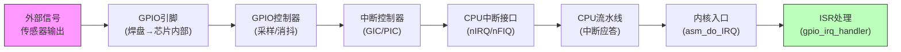

**知识点63 [I]**

老陈是深圳一家工控公司的嵌入式工程师，去年他们给一个半导体晶圆厂做了一套PLC信号采集系统。外部传感器的信号通过GPIO引脚进来，触发中断后由内核线程处理。大部分时候响应都很快，几十微秒就搞定了。但产线上偶尔会出现信号来了之后延迟超过1毫秒才响应的情况——在晶圆切割这种场景下，1毫秒意味着几毫米的位置偏差，客户直接把电话打到了老板那里。

老陈第一反应是怀疑中断处理函数里做了什么耗时操作。他加了`printk`进去，发现中断处理本身很短，十几微秒就跑完了。那延迟到底出在哪？

这里要用到一个很有力的工具：ftrace的`irqsoff` tracer。这个tracer会追踪内核里**中断被关闭的最长时间段**——注意，不是中断处理时间长，而是某个地方把中断给关了，导致即使有外部信号进来，CPU也响应不了。

```bash
# 挂载tracefs后开启irqsoff追踪
echo irqsoff > /sys/kernel/debug/tracing/current_tracer
echo 1 > /sys/kernel/debug/tracing/tracing_on

# 复现问题后读取结果
cat /sys/kernel/debug/tracing/trace
```

老陈跑了一晚上，终于抓到一条：`irqsoff`记录到的最长中断关闭时间达到了800微秒。这意味着在这段时间窗口内，任何外部中断都被屏蔽了。加上中断恢复后可能的调度延迟，总的可见延迟突破1毫秒就不难理解了。

但800微秒只是表象。要真正理解延迟根因，得把眼光从软件层面扩展到**完整的硬件中断链路**。从传感器引脚上的电平跳变，到CPU最终执行中断处理函数，中间经过的环节远比很多人想象的要复杂。


整个链路大致是这样的：



每个环节都有自己的延迟贡献。GPIO控制器的同步时钟可能引入一个时钟周期的采样延迟；中断控制器要对多个中断源做仲裁和优先级排序；CPU那边，如果当前正在执行一条不可中断的指令序列（比如某些体系结构下的LDM/STM多寄存器操作），还得等指令执行完才能响应中断。更别提有些平台上还有中断路由的问题——一个GPIO中断可能要穿过两级中断控制器才能到达CPU。

| 链路环节 | 典型延迟量级 | 备注 |
|---------|-----------|------|
| GPIO引脚电平变化 | ns级 | 物理信号传播 |
| GPIO控制器采样 | 1~几个时钟周期 | 取决于总线时钟 |
| 中断控制器仲裁 | 10~100ns | GIC通常为2~3个时钟 |
| CPU中断应答 | 几个到十几个时钟 | 与流水线深度相关 |
| 内核中断入口 | 几百ns~1μs | 保存上下文开销 |
| **irqsoff导致的屏蔽** | **可达数百μs甚至ms级** | **软件因素，可控** |

> **陷阱**：很多工程师排查延迟问题时只关注ISR本身的执行时间，却忽略了"中断被关闭"这个更隐蔽的因素。`irqsoff` tracer抓的是中断屏蔽窗口，和`function_graph`抓的是两回事，两个工具要配合着用。

这个案例给我们的启示是：GPIO中断延迟分析不能只看软件层面的ISR，必须从信号进入芯片的第一站开始，逐层拆解每个环节的延迟贡献。下一节我们就从这个链路的起点——GPIO控制器开始讲起。
