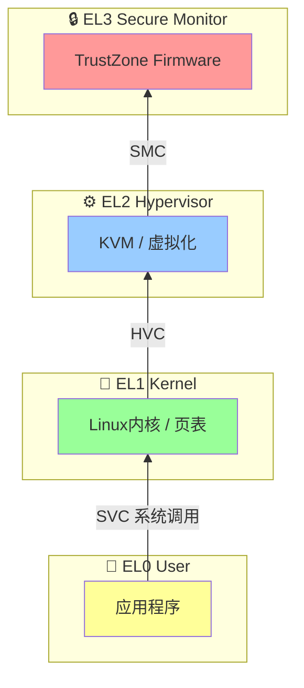

**知识点64 [I][M] 异常级别EL0-EL3**

ARM64的特权级设计跟x86的ring 0-3是两码事。Intel当年为了兼容历史包袱搞了四个ring，结果实际就用上两个——ring 3跑用户态，ring 0跑内核。ARM64从头设计，直接定义了四个异常级别（Exception Level），简称EL。

EL0跑应用程序，没有特权，不能直接访问硬件寄存器、改页表或关中断——就是个"听话干活"的级别。EL1是操作系统内核的地盘，Linux内核绝大部分代码跑在这里，有完整的MMU、中断控制能力。用户态想干特权操作？通过SVC指令从EL0**陷进去**到EL1。

EL2跑Hypervisor（比如KVM），负责虚拟化。Guest OS跑在EL1，EL2可以截获它的一举一动——页表切换、敏感指令，全能拦下来。没开虚拟化的系统，EL2基本闲置。EL3是最顶层，跑Secure Monitor，管TrustZone的Normal World和Secure World切换。你手机里的指纹认证、DRM密钥管理，背后就有EL3的身影。EL0→EL1→EL2→EL3，特权逐级递增，上层可以控制下层，反过来则不行。



| 异常级别 | 运行代码 | 特权能力 |
|---------|---------|---------|
| EL0 | 应用程序 | 无特权，访问受限 |
| EL1 | OS内核 | 完整MMU/中断控制 |
| EL2 | Hypervisor | 虚拟化控制，截获EL1 |
| EL3 | Secure Monitor | 安全世界切换 |

再来说异常类型，分**同步异常**和**异步中断**。

同步异常是CPU执行指令时自己发现的错误，跟当前指令同步发生。访问非法地址MMU报data abort、执行了不认识的指令报undefined instruction——程序段错误的源头就是这种同步异常。

异步中断是外部事件打断CPU，跟当前指令无关。键盘按键、网卡收包、定时器到期都属于这一类。ARM64分IRQ（普通中断）和FIQ（快速中断），FIQ优先级更高、有独立向量入口，但Linux里基本统一走IRQ处理，FIQ很少单独使用。区分同步和异步的关键就看：它是不是由某条特定指令"引起"的。

> **⚠️ 陷阱**：page fault经常被新手误当成"中断"，它是**同步异常**，不是异步中断。CPU执行`ldr x0, [addr]`时MMU发现页表项无效，立即触发data abort。整个过程跟这条指令严格绑定——处理完还能回到原指令重试。异步中断可没有"回原指令"这说法。

---

**知识点65 [I] 异常向量表**

CPU决定进异常之后，下一个问题：往哪跳？ARM64靠**异常向量表**解决。`VBAR_EL1`寄存器指向这张表的基址。

ARM64按三个维度给异常分类：从哪来（当前EL还是更低EL）、啥类型（同步异常/IRQ/FIQ/SError）、用哪个栈指针。组合起来，每个情况有独立的入口：

| 偏移 | 场景 |
|------|------|
| `0x000` | SP_EL0 + 同步异常 |
| `0x080` | SP_EL0 + IRQ |
| `0x200` | SP_EL1 + 同步异常 |
| `0x280` | SP_EL1 + IRQ |
| `0x400` | 低EL(AArch64) + 同步异常 |
| `0x480` | 低EL(AArch64) + IRQ |

Linux内核查`entry.S`铺设这张表，所有通往EL1的异常都走这里：

```asm
/* arch/arm64/kernel/entry.S */
    .align  11
ENTRY(vectors)
    ventry  el1t_sync
    ventry  el1t_irq
    ...
    ventry  el1h_sync
    ventry  el1h_irq
    ...
    ventry  el0_sync
    ventry  el0_irq
```

`ventry`是个宏，把入口展开成固定`0x80`字节的槽位，刚好塞下小段汇编：保存现场、跳转到C函数处理。空间很紧，所以每个入口都是"快速保存、跳转干活"的模式。

> **⚠️ 陷阱**：VBAR指向的向量表必须按**2KB对齐**（硬件硬要求），地址不对齐写进去直接行为未定义。另外每个入口只有`0x80`字节，处理逻辑太长会链接报错——`ventry`宏存在的意义就是确保入口规矩地跳转到外部大函数。
