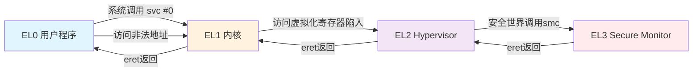
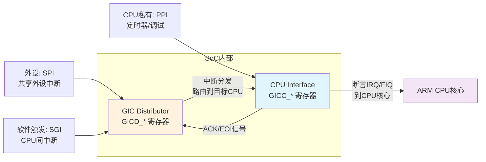
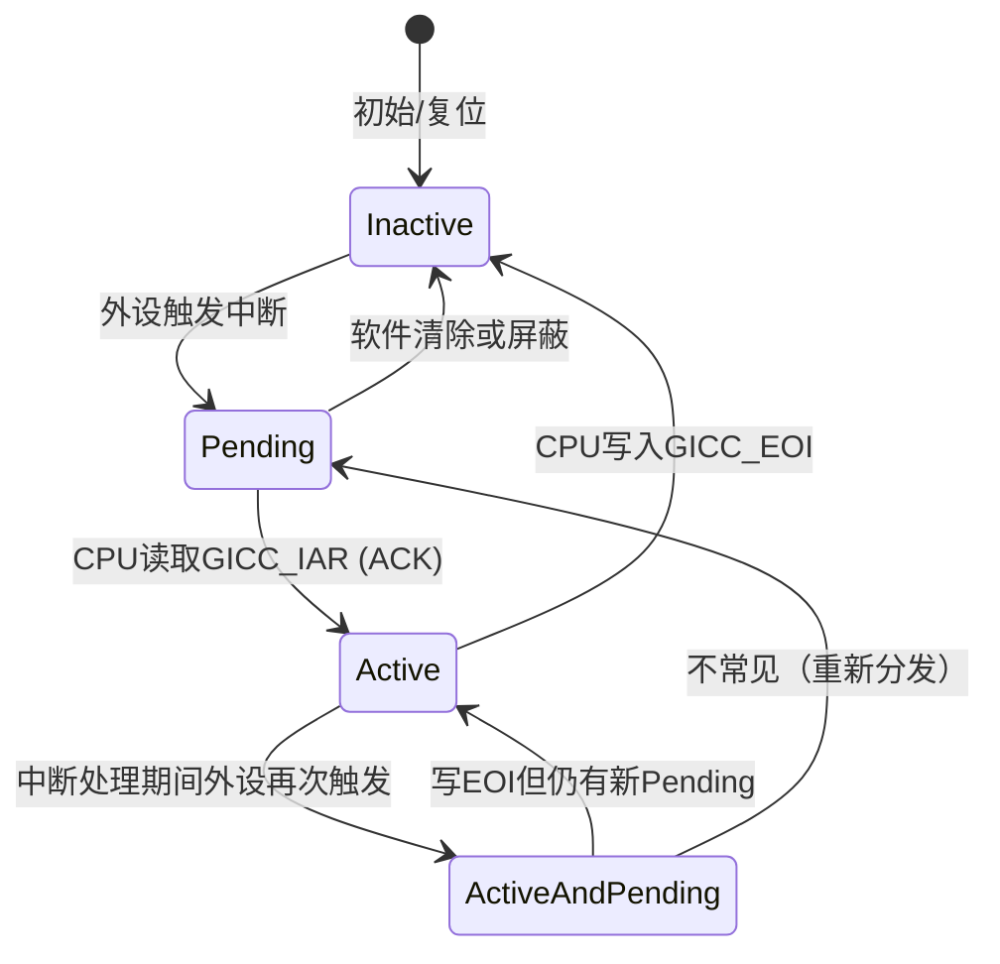

# 10.1.2 ARM64异常级别与GICv2

> 所属章节：第10章 中断与时间 > 10.1 中断的硬件链路
>
> 难度：[I→M] | 预计阅读时间：25分钟

## <span class="blue"> 本节导读

ARM64 把特权级别直接硬件化为 EL0–EL3 四层，外设的中断请求则要经过 GIC（通用中断控制器）的分发才能到达 CPU。这两个主题是读懂中断硬件链路的地基。<BR>
本节覆盖：EL0–EL3 的分工与切换规则、`entry.S` 异常向量表的 16 个入口、同步异常与异步中断的本质区别、GICv2 Distributor 与 CPU Interface 的双组件架构、中断四状态机、优先级"数字越小越高"的规则，以及上述机制在 v6.6 源码中的初始化流程。

---

## <span class="blue"> 异常级别体系：EL0到EL3 [I]

ARM64架构把CPU的执行状态划分为四个异常级别（Exception Level），级别数字越大，权限越高。这种设计不是凭空想出来的——它把CPU的特权层次直接硬件化了。

### 四个级别各自做什么

| 异常级别 | 用途 | 运行代码 | 特权 | 典型操作 |
|:---:|:---|:---|:---:|:---|
| **EL0** | 用户态（应用层） | 普通应用程序 | 最低 | 访问用户空间内存、标准库调用 |
| **EL1** | 内核态（操作系统） | Linux内核、驱动 | 高 | MMU配置、进程调度、系统调用处理 |
| **EL2** | 虚拟化层 | Hypervisor（KVM/Xen） | 更高 | CPU虚拟化、中断虚拟化、VM切换 |
| **EL3** | 安全监控 | Trusted Firmware、OP-TEE | 最高 | 安全世界切换、信任链管理 |

CPU上电后从EL3开始执行，初始化完成后逐级下降。Linux这种普通操作系统跑在EL1，用户程序跑在EL0。如果你在做虚拟化，KVM的代码运行在EL2，管理多个Guest OS。

EL3是个特殊的存在——它负责"安全世界"和"普通世界"的切换。当你用手机指纹解锁时，指纹传感器的数据处理就是在安全世界里完成的，EL3充当两个世界之间的隔离与切换点。

### 异常级别怎么切换

切换方向只有一条规则：**只能通过异常（Exception）提升级别，只能通过ERET指令降低级别**。



用户程序想要读个文件？触发`svc #0`系统调用，CPU从EL0进入EL1，内核接手处理。处理完了执行`eret`，沿着来时的路返回。这条路径不能绕过——硬件里写死了。

想知道自己当前跑在哪个级别？读`CurrentEL`寄存器就行：

```asm
/* 读取当前异常级别 */
mrs x0, CurrentEL         /* CurrentEL[3:2] 存放EL值 */
lsr x0, x0, #2            /* 右移2位，得到 0/1/2/3 */
```

系统启动时，内核把异常向量表的地址写入`VBAR_EL1`（Vector Base Address Register），这样CPU遇到异常时就知道该跳到哪里：

```asm
/* arch/arm64/kernel/head.S 中设置向量表 */
ldr x0, =vectors
msr VBAR_EL1, x0          /* 将向量表基地址写入VBAR_EL1 */
isb                       /* 指令同步屏障，确保生效 */
```

### 异常向量表：entry.S里的16个入口

`arch/arm64/kernel/entry.S` 里定义了ARM64的异常向量表`vectors`。它不是一张简单的跳转表，而是按照异常来源和当前级别精心排列的16个入口：

```mermaid
graph TD
    V[vectors 基地址] --> S1[同步异常: 当前EL使用SP_EL0]
    V --> S2[IRQ: 当前EL使用SP_EL0]
    V --> S3[FIQ: 当前EL使用SP_EL0]
    V --> S4[SError: 当前EL使用SP_EL0]
    V --> S5[同步异常: 当前EL使用SP_ELx]
    V --> S6[IRQ: 当前EL使用SP_ELx]
    V --> S7[FIQ: 当前EL使用SP_ELx]
    V --> S8[SError: 当前EL使用SP_ELx]
    V --> S9[同步异常: 低EL运行在AArch64]
    V --> S10[IRQ: 低EL运行在AArch64]
    V --> S11[FIQ: 低EL运行在AArch64]
    V --> S12[SError: 低EL运行在AArch64]
    V --> S13[同步异常: 低EL运行在AArch32]
    V --> S14[IRQ: 低EL运行在AArch32]
    V --> S15[FIQ: 低EL运行在AArch32]
    V --> S16[SError: 低EL运行在AArch32]

    style V fill:#fff3e0
    style S5 fill:#e8f5e9
    style S6 fill:#e8f5e9
    style S9 fill:#e1f5fe
    style S10 fill:#e1f5fe
```



**16个入口的排列逻辑**：4种异常类型（同步、IRQ、FIQ、SError）× 4种上下文（当前EL用SP_EL0、当前EL用SP_ELx、来自低EL且AArch64、来自低EL且AArch32）。Linux内核中最常用的是**S6（EL1中发生的IRQ）**和**S9（用户态触发的同步异常，如系统调用、page fault）**。

---

## <span class="blue"> 同步异常与异步中断：两种完全不同的"打扰" [M]

异常不是只有一种。有些是指令执行自身触发的（同步异常），有些是外设发来的（异步中断）。搞混这两者，排查问题时容易南辕北辙。

### 同步异常：指令自身触发

同步异常的特点是——**跟某条指令直接相关，执行到哪条就炸哪条**。触发原因包括：

- **Data Abort**：访问了非法内存地址（最常见的page fault就属于这类）
- **Instruction Abort**：取指令时地址翻译失败
- **Undefined Instruction**：执行了CPU不认识的指令码
- **SVC/HVC/SMC**：软件主动触发的系统调用
- **Alignment Fault**：未对齐的内存访问

> 💡 page fault 是同步异常中的 data abort，这是**正常的内存管理机制**，不是错误。进程访问的虚拟地址还没映射到物理页，MMU 触发 data abort，内核的 page fault 处理函数分配物理页、建立映射，一切恢复如常。日志里频繁的 page fault，通常是按需分配（demand paging）在工作。

### 异步中断：外设触发

异步中断跟当前执行的指令没有直接关系——它**随时可能到来**，由外部设备触发：

- **IRQ（Interrupt Request）**：普通中断，如定时器到期、网卡收到数据包
- **FIQ（Fast Interrupt Request）**：快速中断，优先级高于IRQ，Linux中很少用
- **SError**：系统错误，如外部总线故障、奇偶校验错误

| 对比维度 | 同步异常 | 异步中断 |
|:---:|:---|:---|
| **触发原因** | 指令执行本身导致 | 外部设备信号触发 |
| **与指令关系** | 与触发指令精确相关 | 与当前指令无关，随机到达 |
| **典型类型** | Data Abort、SVC、Undefined Instruction | IRQ（定时器、网卡）、FIQ |
| **是否可屏蔽** | 一般不可屏蔽 | IRQ/FIQ可通过PSTATE.I/F位屏蔽 |
| **Linux处理** | do_mem_abort、el0_svc | el1_irq → handle_arch_irq |
| **返回值** | 通常返回触发指令的下一条 | 返回被中断的位置继续执行 |
| **是否可恢复** | 多数可恢复（page fault），有些不可（Oops） | 总是可恢复 |

怎么处理同步异常？CPU把触发异常的指令地址存入`ELR_EL1`（Exception Link Register），把异常原因写入`ESR_EL1`（Exception Syndrome Register），然后跳到向量表中对应的入口。内核从`ESR_EL1`读取`EC`（Exception Class）字段，就知道具体是哪类异常了。

异步中断的处理流程则完全不同——它需要GIC的参与。这就是下一个知识点的主题。

---

## <span class="blue"> GICv2双组件架构：Distributor与CPU Interface [I]

GICv2（Generic Interrupt Controller version 2）是ARM最经典的中断控制器架构。从软件角度看，它由两个独立的硬件组件构成，各自有独立的寄存器接口。

### GICv2整体架构



| 组件 | 寄存器前缀 | 核心职责 |
|:---:|:---:|:---|
| **Distributor** | `GICD_*` | 全局中断使能、优先级设置、目标CPU路由、SGI生成 |
| **CPU Interface** | `GICC_*` | 中断确认（ACK）、优先级屏蔽、向CPU发送IRQ/FIQ信号、EOI通知 |

**Distributor**是全局的，所有CPU共享同一个。它决定了这个中断该发给哪个CPU（或哪些CPU）。**CPU Interface**是每个CPU核心私有的，它决定"当前这个CPU要不要响应这个中断"。

一个中断从外设到CPU的完整路径是：外设拉高中断线 → Distributor检测到Pending → Distributor根据路由规则发给目标CPU的CPU Interface → CPU Interface判断优先级是否足够高 → CPU Interface向CPU核心断言IRQ信号 → CPU从异常向量表进入IRQ处理 → 读取GICC_IAR确认中断 → 处理中断 → 写GICC_EOI通知完成。

### 中断状态机：四个状态的流转

每个中断在GIC内部都有一个状态机，这是理解中断处理的核心：



| 转换 | 条件 | 说明 |
|:---:|:---|:---|
| **Inactive → Pending** | 中断源触发 | 外设拉高信号线，Distributor检测到 |
| **Pending → Active** | CPU读`GICC_IAR`（ACK） | CPU"签收"了这个中断，开始处理 |
| **Active → Inactive** | CPU写`GICC_EOI` | 处理完毕，通知GIC可以清理 |
| **Active → Active and Pending** | 处理期间再次触发 | 边沿触发的中断可能重复触发 |
| **Active and Pending → Active** | 写EOI但新Pending仍在 | 需要再次ACK/处理 |
| **Pending → Inactive** | 软件写`GICD_ICPENDR` | 手动清除pending状态 |

**Inactive**表示这个中断线当前没事。**Pending**表示"有个活等你干"，但CPU还没开始处理。**Active**表示CPU正在处理。**Active and Pending**表示CPU正在处理上一轮，但外设又触发了新一轮——这在高速外设上很常见。

### 优先级机制：数字越小，优先级越高

GICv2支持中断优先级，通常用3-8位表示（0-255）。**数值越小，优先级越高**。这意味着优先级0是最高优先级，优先级255是最低。

> ⚠️ 优先级数字越小越高，与多数人的直觉相反。设了高数值以为优先级高，实际中断会被其他中断抢占。**GIC 的优先级是"倒数"的：0 最急，255 最闲。**

高优先级中断可以抢占低优先级中断的处理。CPU Interface里有一个`GICC_PMR`（Priority Mask Register），只有优先级高于这个阈值的中断才能打断当前CPU。Linux内核初始化时会在这里设置合适的掩码。

### 关键代码路径：irq-gic.c

GICv2的Linux驱动在`drivers/irqchip/irq-gic.c`，Distributor与SGI/PPI的公共配置函数在`drivers/irqchip/irq-gic-common.c`。Distributor初始化入口是`gic_dist_init()`（irq-gic.c:467）：

```c
/* drivers/irqchip/irq-gic.c:467（节选） */
static void gic_dist_init(struct gic_chip_data *gic)
{
    void __iomem *base = gic_data_dist_base(gic);
    ...
    writel_relaxed(GICD_DISABLE, base + GIC_DIST_CTRL);  /* 1. 全局关闭转发 */

    /* 2. 所有SPI默认路由到当前CPU（通常是CPU0） */
    for (i = 32; i < gic_irqs; i += 4)
        writel_relaxed(cpumask, base + GIC_DIST_TARGET + i * 4 / 4);

    gic_dist_config(base, gic_irqs, NULL);               /* 3. 触发方式/优先级/关闭 */

    writel_relaxed(GICD_ENABLE, base + GIC_DIST_CTRL);   /* 4. 全局使能转发 */
}
```

逐项配置在`gic_dist_config()`（irq-gic-common.c:93）里完成：

```c
/* drivers/irqchip/irq-gic-common.c:93（节选） */
void gic_dist_config(void __iomem *base, int gic_irqs,
                     void (*sync_access)(void))
{
    /* 1. 所有SPI设为电平触发、低有效 */
    for (i = 32; i < gic_irqs; i += 16)
        writel_relaxed(GICD_INT_ACTLOW_LVLTRIG,
                       base + GIC_DIST_CONFIG + i / 4);

    /* 2. 所有SPI设默认优先级0xa0（GICD_INT_DEF_PRI_X4 = 0xa0a0a0a0） */
    for (i = 32; i < gic_irqs; i += 4)
        writel_relaxed(GICD_INT_DEF_PRI_X4, base + GIC_DIST_PRI + i);

    /* 3. 去激活并关闭所有SPI（PPI/SGI由gic_cpu_config处理） */
    for (i = 32; i < gic_irqs; i += 32) {
        writel_relaxed(GICD_INT_EN_CLR_X32,
                       base + GIC_DIST_ACTIVE_CLEAR + i / 8);
        writel_relaxed(GICD_INT_EN_CLR_X32,
                       base + GIC_DIST_ENABLE_CLEAR + i / 8);
    }
    ...
}
```

注意内核源码的寄存器宏名（`GIC_DIST_CTRL`、`GIC_DIST_PRI`）与ARM手册名（`GICD_CTLR`、`GICD_IPRIORITYR`）不同，对照手册读源码时需要做一次映射。

默认优先级`0xa0`（160）属于中等偏低。主线内核没有供驱动在运行期调整GIC中断优先级的通用API（v6.6全树不存在`irq_set_priority`这类接口），驱动一律接受默认值；需要差异化响应速度时，走FIQ或线程化中断的路线（见10.4）。

CPU Interface的初始化在`gic_cpu_init()`（irq-gic.c:490），核心三步：

```c
/* drivers/irqchip/irq-gic.c:490（节选） */
static int gic_cpu_init(struct gic_chip_data *gic)
{
    void __iomem *dist_base = gic_data_dist_base(gic);
    void __iomem *base = gic_data_cpu_base(gic);
    ...
    gic_cpu_config(dist_base, 32, NULL);      /* 1. SGI/PPI：去激活、设默认优先级 */
    writel_relaxed(GICC_INT_PRI_THRESHOLD,    /* 2. 优先级掩码 = 0xf0 */
                   base + GIC_CPU_PRIMASK);
    gic_cpu_if_up(gic);                       /* 3. 使能CPU Interface */
    return 0;
}
```

`GICC_INT_PRI_THRESHOLD`定义在`include/linux/irqchip/arm-gic.h:23`，值为`0xf0`——只有优先级数值**小于0xf0**（即0-239）的中断才能穿过这道门。默认优先级0xa0（160）< 0xf0，所以默认配置的中断都能通过。

GICv2是理解中断控制器的经典模型——Cortex-A53/A57时代的GIC-400就是GICv2实现。更新的架构已转向GICv3/GICv4（支持LPI、更灵活的路由），本书的实锚点RK3568用的正是GICv3，10.1.4展开。

---

## <span class="blue"> 本节总结

| 主题 | 核心要点 |
|:---|:---|
| **异常级别EL0-EL3** | 四级权限体系，EL0用户态→EL1内核→EL2虚拟化→EL3安全监控，只能经异常提升、ERET降低 |
| **同步异常** | 与触发指令直接相关，包括page fault（data abort）、SVC系统调用、undefined instruction |
| **异步中断** | 由外部设备触发，与当前指令无关，包括IRQ/FIQ/SError |
| **异常向量表** | `arch/arm64/kernel/entry.S`中16个入口，按异常类型×来源上下文排列 |
| **GICv2 Distributor** | 全局组件，负责中断使能、优先级、目标CPU路由 |
| **GICv2 CPU Interface** | 每CPU私有，负责ACK、EOI、优先级屏蔽、向CPU发IRQ信号 |
| **中断状态机** | Inactive→Pending→Active→Active and Pending，ACK读IAR、EOI写EOIR |
| **优先级规则** | **数字越小优先级越高**，PMR（默认阈值0xf0）做阈值屏蔽，主线无运行期调优先级API |

---

## <span class="blue"> 下一步

你已经掌握了ARM64异常级别和GICv2的整体架构。接下来，10.1.3 将深入**SPI（共享外设中断）、PPI（私有外设中断）、SGI（软件生成中断）**三种中断类型的具体差异，以及它们在设备树中如何被描述和注册。这是从"架构理解"走向"驱动实战"的关键一步。

---

## <span class="blue"> 配套资源

| 资源类型 | 路径/命令 | 说明 |
|:---:|:---|:---|
| 📄 源码 | `arch/arm64/kernel/entry.S` | ARM64异常向量表定义 |
| 📄 源码 | `arch/arm64/kernel/head.S` | 启动时VBAR_EL1设置 |
| 📄 源码 | `drivers/irqchip/irq-gic.c` | GICv2驱动主文件 |
| 📄 源码 | `drivers/irqchip/irq-gic-common.c` | Distributor与SGI/PPI公共配置 |
| 📄 头文件 | `include/linux/irqchip/arm-gic.h` | GIC寄存器偏移与阈值宏定义 |
| 🔍 验证 | `cat /proc/interrupts` | 查看当前系统中断统计 |
| 🔍 验证 | `cat /sys/kernel/debug/pinctrl/gpio-interrupt` | GPIO中断调试信息 |
| 📚 手册 | ARM DDI 0471B: GICv2 Architecture Spec | GICv2官方架构手册 |
