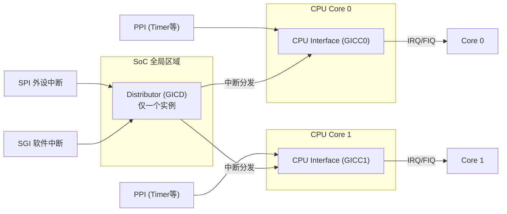
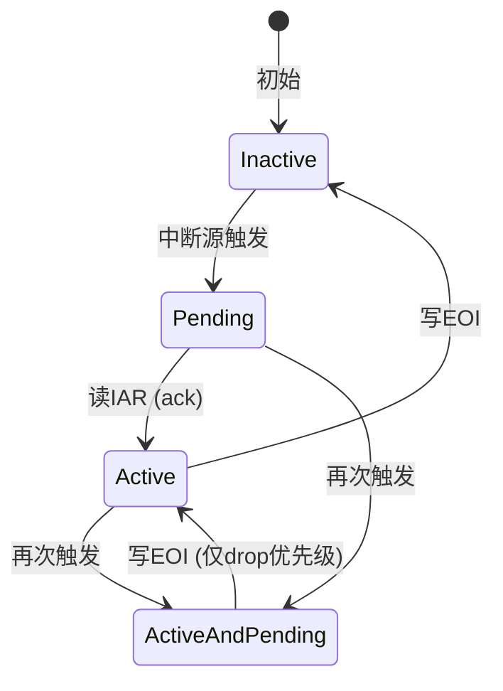

GICv2的架构设计很有意思——它没有被做成铁板一块，而是拆成两个独立组件：Distributor和CPU Interface。这种拆分背后有实实在在的工程考量，理解这个划分，你就抓住了GICv2的灵魂。

**知识点66 GICv2的双组件架构 [I][M]**

Distributor（GICD）是整个中断系统的"调度中心"，SoC里只有一个实例。所有外设发来的SPI（Shared Peripheral Interrupt）都要先经它这一关。哪个中断使能了、优先级怎么排、该发给哪个CPU核心——这些全局性策略全由Distributor拍板。可以理解为中断的"总调度室"。

CPU Interface（GICC）则每个CPU核心各有一个。它离软件最近，配置mask/unmask、设置优先级阈值、acknowledge中断、写EOI，这些操作最终都落在CPU Interface的寄存器上。Distributor决定"哪个中断发给谁"，CPU Interface决定"我这个CPU现在要不要理它"。

这种一分为二的设计好处很明显：多核场景下Distributor负责全局仲裁，CPU Interface负责本地管控，互不干扰。早年间有些中断控制器把两块硬揉在一起，多核扩展时一团糟，GICv2算是吸取了教训。



从图里能看出，SPI和SGI走Distributor→CPU Interface的路径，而PPI（每个核私有的中断，比如定时器）直通各自CPU Interface，不经过Distributor。这个细节在编程时很重要——配PPI不需要动Distributor的寄存器。

再说中断状态机。GICv2给每个中断定义了四种状态：



- **Inactive**：中断线静默，无事发生。
- **Pending**：中断源已触发，Distributor也决定发给这个CPU，但软件还没acknowledge。此时中断对CPU可见（如果unmask）。
- **Active**：软件读取了GICC_IAR，正在处理。同优先级或更低的中断被阻塞。
- **Active and Pending**：还在处理上次触发，中断源又来了新请求。电平触发或高频中断场景下很常见。

Active and Pending这个状态新手容易忽略。我见过有人acknowledge了中断但迟迟不写EOI，第二次中断来了卡在Active and Pending，同优先级新中断全被堵住。排查这类问题时读一下GICC_IAR和GICC_HPPIR寄存器，看看状态机卡在哪一步，通常能快速定位。

代码实现位于`drivers/irqchip/irq-gic.c`，核心初始化逻辑大致如下：

```c
static int __init gic_of_init(struct device_node *node,
                               struct device_node *parent)
{
    void __iomem *dist_base = of_iomap(node, 0);  /* GICD */
    void __iomem *cpu_base  = of_iomap(node, 1);  /* GICC */
    
    gic_dist_init(dist_base);   /* 配Distributor */
    gic_cpu_init(cpu_base);     /* 配当前CPU Interface */
    
    irq_domain_add_linear(node, irq_num, &gic_irq_domain_ops, NULL);
    return 0;
}
```

| 寄存器 | 所属组件 | 用途 |
|--------|---------|------|
| `GICD_CTLR` | Distributor | 全局使能/禁用 |
| `GICD_ISENABLERn` | Distributor | 中断使能 |
| `GICD_ITARGETSRn` | Distributor | 目标CPU掩码 |
| `GICD_IPRIORITYRn` | Distributor | 优先级设置 |
| `GICC_CTLR` | CPU Interface | 本地控制 |
| `GICC_PMR` | CPU Interface | 优先级掩码（阈值） |
| `GICC_IAR` | CPU Interface | Acknowledge中断 |
| `GICC_EOIR` | CPU Interface | 结束中断处理 |

> **陷阱**：`GICC_EOIR`写入的值必须与之前`GICC_IAR`读到的中断号一致，否则GICv2行为未定义。另外注意区分"优先级下降"（写EOI时）和"deactivate"两个操作，GICv2在EOImode=1时分开处理，Linux默认走合并路径。

**知识点67 GICv2的中断优先级 [I]**

GICv2用8位表示优先级，范围0~255。**数字越小优先级越高**，0最高，255最低。跟ARM处理器异常优先级逻辑一脉相承。

但实际实现很少用满8位。常见做法是4位或5位，即16级或32级优先级。想知道芯片用了几位？上电后写0xFF到`GICD_IPRIORITYRn`，读回来看低几位是只读零——写0xFF读回0xF8，说明低3位没用，实际有效5位。

优先级体现在两个层面：一是抢占，高优先级中断可打断低优先级的处理。CPU正在处理0x80的中断，来了0x10的中断，CPU Interface立即发新IRQ，内核进入嵌套处理。二是通过`GICC_PMR`设阈值，只有优先级高于阈值（数值更小）的中断才能递送。`GICC_PMR`初始值0，屏蔽所有中断；想允许中断进来，必须主动设成更高数值。

```c
/* 允许优先级高于0x80的中断通过 */
writel_relaxed(0x80, gicc_base + GICC_PMR);
```

抢占行为还受`GICC_BPR`控制，它决定抢占需要比较优先级的高几位。BPR值越大抢占粒度越粗，裸机或普通Linux里用默认配置即可，一般不需要动。
