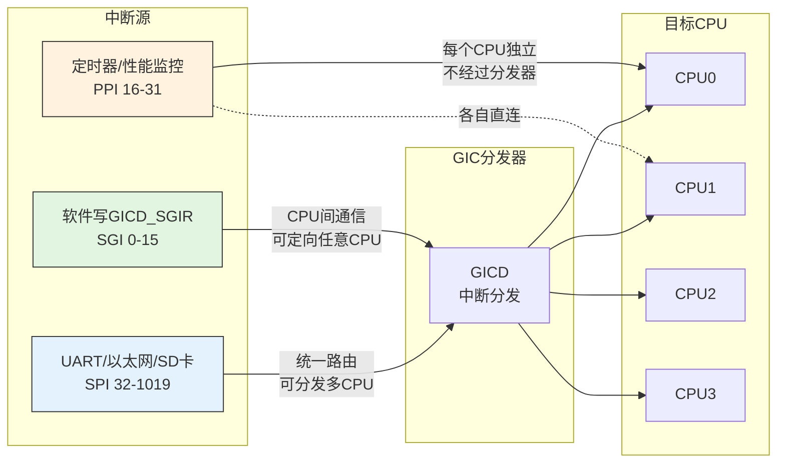

# 10.1.3 SPI、PPI、SGI三种中断

> 所属章节：第10章 中断与时间 > 10.1 ARM中断体系结构
>
> 难度：[I] 中级 | 预计阅读时间：15分钟

## <span class="blue"> 本节导读

GIC最多可以管理1024个中断，但这1024个编号并不是一锅粥。Arm把它们分成了三个"势力范围"：SGI、PPI、SPI。<br>
如果你看到一个中断号是83，它到底是什么？从哪个设备来的？能发给哪些CPU？这些问题的答案，取决于它属于哪种类型。<br>
学完后，你将能根据中断号一眼判断出它的类型，读懂设备树中的`interrupts`属性，并理解为什么CPU之间的调度通信要用SGI而不是SPI。

---

## <span class="blue"> 三种中断类型：SGI、PPI、SPI [I]

想象一下一栋1024层的大楼，每层住一个中断。Arm把这栋楼分成了三个区域，每个区域住着不同类型的"住户"，各有各的门禁系统和串门规则。

### 编号空间的划分

GIC把1024个中断号（0~1019）切成了三段：

| 中断类型 | 编号范围 | 英文全称 | 核心特征 | 住户数量 |
|---------|---------|---------|---------|---------|
| SGI | 0 ~ 15 | Software Generated Interrupt | 软件触发，CPU间通信 | 16个 |
| PPI | 16 ~ 31 | Private Peripheral Interrupt | 每个CPU独立一份 | 16个 |
| SPI | 32 ~ 1019 | Shared Peripheral Interrupt | 全局共享，外设专用 | 988个 |

SGI和PPI是每个CPU核私有的——换句话说，CPU0看到的PPI 16和CPU1看到的PPI 16，是两个完全不同的中断。SPI才是全局共享的，中断号83在任何一个CPU看来都指向同一个设备。

### 三种中断的"出身"与"去向"



### SGI（软件生成中断）—— CPU之间的"传纸条"

SGI 0~15是唯一一种**由软件主动触发**的中断。你可以把它理解为CPU核之间互相"传纸条"。一个CPU往GIC的SGI寄存器写一条指令，目标CPU就收到一个中断。

Linux内核里，SGI最出名的用途就是**IPI（Inter-Processor Interrupt，核间中断）**。来看几个经典场景：

| IPI类型 | 通常使用的SGI号 | 用途 |
|--------|--------------|------|
| RESCHEDULE | SGI 1 | 告诉目标CPU重新执行调度 |
| CALL_FUNCTION | SGI 2 | 请求目标CPU执行某个函数 |
| TLB SHOOTDOWN | SGI 3 | 通知其他CPU刷新TLB缓存 |
| RCU | SGI 4 | RCU宽限期状态同步 |

当CPU0调度器决定让某个进程迁移到CPU1时，就会通过SGI拍一下CPU1的肩膀："喂，醒醒，有新任务了！"

> 💡 **提示**：在Linux系统中执行`cat /proc/interrupts`，看到以`IPI`开头的行了吗？那些计数就是SGI的触发次数。如果IPI数值增长很快，说明CPU之间的通信非常频繁——有时候这是性能瓶颈的信号。

> ⚠️ **陷阱**：SGI的0~15编号是**每个CPU独立的**！CPU0的SGI 0和CPU1的SGI 0不是同一个中断。SGI虽然也是16个号，但每个CPU都有自包含的一套。这跟SPI完全不同——SPI 83在所有CPU看来都是同一个中断。

### PPI（私有外设中断）—— 每个CPU的"私人物品"

PPI 16~31是每个CPU核的**私有财产**。同一个PPI编号在不同CPU上是完全独立的中断线。

典型映射关系：

| PPI编号 | 典型用途 | 说明 |
|--------|---------|------|
| PPI 16 | 定时器中断（Cortex-A9） | 每个CPU有自己的定时器 |
| PPI 17 | 定时器中断（Cortex-A53/A72） | 架构版本差异 |
| PPI 23 | 性能监控单元（PMU） | 性能计数器溢出 |
| PPI 25 | 调试通信通道 | JTAG/调试口 |

定时器中断走PPI而不是SPI，这是非常合理的设计——每个CPU需要独立地收到自己的时钟滴答，不需要互相争抢同一条中断线。

### SPI（共享外设中断）—— 外设的大本营

SPI 32~1019是外部设备的"主战场"。UART、以太网、SD卡控制器、USB控制器……几乎所有外设都把自己的中断线挂在这里。

实际系统中的典型映射：

| SPI编号 | 典型设备 | 说明 |
|--------|---------|------|
| SPI 32 | PL011 UART0 | 串口数据收发 |
| SPI 33 | UART1 | 第二个串口 |
| SPI 44 | USB控制器 | USB插拔/传输 |
| SPI 46 | 以太网MAC | 网络数据包到达 |
| SPI 54 | SD/MMC控制器 | SD卡读写完成 |
| SPI 72 | I2C控制器 | I2C传输完成 |
| SPI 83 | SPI控制器 | SPI传输完成 |

同一个SPI可以由GIC分发到多个CPU，但通常Linux会把外设中断绑定到一个特定CPU上，以减少缓存抖动和竞争。

### 设备树中的中断描述

在设备树（Device Tree）中，外设的中断通过`interrupts`属性声明。格式是`<类型, 硬件中断号, 触发方式>`：

```dts
// 示例：Cortex-A9 上的 timer 使用 PPI 16
timer {
    compatible = "arm,cortex-a9-twd-timer";
    interrupts = <1 13 0x301>;  // PPI类型, 硬件irq 13, 上升沿+私有
};

// 示例：UART 使用 SPI
uart0: serial@101f1000 {
    compatible = "arm,pl011";
    interrupts = <0 44 4>;  // SPI类型, 硬件irq 44, 上升沿触发
};
```

属性的三个数值含义：

| 字段 | 含义 | 取值 |
|------|------|------|
| 第1个 `<0>` | 中断类型 | 0=SPI, 1=PPI, 2=SGI |
| 第2个 `<44>` | 硬件中断号 | SPI/PPI/SGI各自的编号 |
| 第3个 `<4>` | 触发方式flags | 1=上升沿, 2=下降沿, 4=高电平, 8=低电平 |

> 💡 **提示**：`<0 44 4>` 读起来就是：SPI类型、硬件中断号44、高电平触发。设备树绑定文档位于`Documentation/devicetree/bindings/interrupt-controller/`目录下，不同架构的具体数值可能有差异，最好查阅对应平台的绑定文档。

---

## <span class="blue"> GICv2的中断优先级与抢占 [I]

中断来了，总得有个先后顺序。GICv2用**优先级寄存器**来决定谁先进CPU。这里面的规则，既简单又容易踩坑。

### 数字越小，越"牛"

GICv2的优先级是一个8位值（0~255），但通常只用高4位（0~15）。规则就一条：**数字越小，优先级越高**。

| 优先级值 | 抢占能力 | 典型用途 |
|---------|---------|---------|
| 0 | 最高 | 不可屏蔽的关键中断 |
| 4~8 | 高 | 定时器、DMA完成 |
| 10~14 | 低 | 普通外设（UART、SD卡） |
| 15 | 最低（通常禁止） | 默认/未初始化 |

如果一个高优先级中断（优先级值=4）到来，而CPU正在处理一个低优先级中断（优先级值=10），GIC会**抢占**——暂停当前中断处理，先服务高优先级的那个。

### 优先级分组：抢占 vs 同组排队

GICv2有个精巧的设计叫**优先级分组（Priority Grouping）**。它把8位优先级切分成两段：

```
优先级值（8位）: |  Group Priority  |  Subpriority  |
                  |  决定能否抢占   |  同组内谁先   |
```

- **Group Priority（组优先级）**：只有Group Priority不同的中断之间才能抢占。如果两个中断的Group Priority相同，后到的那个不能抢占正在运行的中断。
- **Subpriority（子优先级）**：当多个中断有相同的Group Priority且都在等待时，Subpriority决定谁先被执行。

举个具体例子，假设分组点为4（即高4位是Group，低4位是Sub）：

| 中断 | 优先级二进制 | Group(高4位) | Sub(低4位) | 能否抢占优先级12？ |
|------|------------|-------------|-----------|-----------------|
| A | 0x08 = 00001000 | 0000 | 1000 | 能（Group 0 < Group 1） |
| B | 0x10 = 00010000 | 0001 | 0000 | 能（Group 1 < Group 1？看下面） |
| C | 0x12 = 00010010 | 0001 | 0010 | 不能（Group同为1） |
| 当前运行 | 0x14 = 00010100 | 0001 | 0100 | — |

中断B的Group也是0001，跟当前运行的中断相同。所以即使B的Subpriority更小（0000 < 0100），它也不能抢占。只有当Group Priority严格更小时，抢占才会发生。

> 🔴 **危险**：Linux内核在`irq_set_priority()`中设置的优先级值，经过GIC驱动的转换后才写入硬件。如果你在裸机编程时直接把应用层的"优先级号"写进GIC寄存器，可能因为优先级分组的存在而得不到预期的抢占行为。裸机代码中务必核对`GICC_BPR`（Binary Point Register）的分组配置。

### Linux内核中的优先级操作

```c
// 内核中设置中断优先级（drivers/irqchip/irq-gic.c）
static void gic_set_priority(struct irq_data *d, u8 priority)
{
    void __iomem *base = gic_dist_base(d);
    unsigned int irq = gic_irq(d);

    // 写入GICD_IPRIORITYRn寄存器
    // 每个中断对应一个8位优先级字段
    writeb_relaxed(priority, base + GIC_DIST_PRI + irq);
}
```

在Linux里，优先级的设置通常交给GIC驱动自动管理。除非你写裸机代码或者做实时补丁（PREEMPT_RT），否则一般不需要手动干预优先级。

---

## <span class="blue"> 本节总结

| 对比维度 | SGI (0~15) | PPI (16~31) | SPI (32~1019) |
|---------|-----------|-------------|--------------|
| 触发源 | 软件写寄存器 | 私有外设硬件 | 共享外设硬件 |
| 是否私有 | 每个CPU独立一套 | 每个CPU独立 | 全局共享 |
| 典型设备 | IPI（调度/TLB/RCU） | 定时器、PMU | UART、以太网、SD |
| 路由方式 | 可定向任意CPU | 直连对应CPU | GIC分发器路由 |
| 多CPU可见 | 各自独立编号 | 各自独立编号 | 统一编号 |
| 设备树类型值 | 2 | 1 | 0 |
| Linux典型用途 | 核间通信 | 每CPU时钟滴答 | 外设驱动中断 |

一句话总结：**SGI是CPU之间的传声筒，PPI是每个CPU的私人物品，SPI是外设共享的会议室。** 再加上优先级分组这个"分流器"，GICv2就搭建起了一个完整的中断调度体系。

---

## <span class="blue"> 下一步

GICv2的1024个中断号在多数场景下够用了，但随着SoC外设越来越多，1024也开始捉襟见肘。更重要的是，ARM64架构引入了一些新变化——**GICv3**把中断号的范围扩展到了更多位，还引入了LPI（Locality-specific Peripheral Interrupt）和ITS（Interrupt Translation Service）等全新概念。下一节10.1.4，我们就来揭开GICv3与中断号映射的面纱，看看它是怎么处理动辄几千个中断的大型SoC的。

---

## <span class="blue"> 配套资源

| 资源类型 | 路径/说明 |
|---------|----------|
| 核心源码 | `drivers/irqchip/irq-gic.c` — GICv2驱动 |
| 寄存器定义 | `include/linux/irqchip/arm-gic.h` |
| 设备树绑定 | `Documentation/devicetree/bindings/interrupt-controller/arm,gic.yaml` |
| 内核IPI实现 | `kernel/smp.c` — `smp_cross_call()` |
| 查看当前中断 | `cat /proc/interrupts` — 观察IPI和SPI计数 |
| ARM参考手册 | 《ARM Generic Interrupt Controller Architecture Specification v2.0》 |
