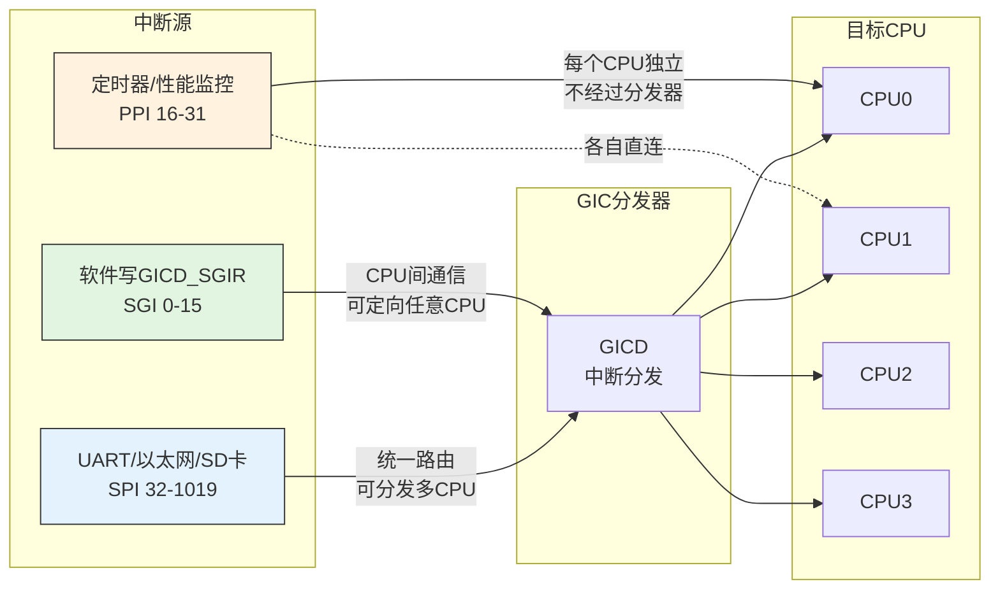

# 10.1.3 SPI、PPI、SGI三种中断

> 所属章节：第10章 中断与时间 > 10.1 中断的硬件链路
>
> 难度：[I] | 预计阅读时间：15分钟

## <span class="blue"> 本节导读

GIC 管理的中断号不是一锅粥：ARM 把它切成了 SGI、PPI、SPI 三段，每段的触发源、可见范围、路由方式都不同。看到一个中断号，它从哪个设备来、能发给哪些 CPU，答案取决于它落在哪一段。<BR>
本节覆盖：SGI/PPI/SPI 的编号划分与语义差异、arm64 的七类 IPI（核间中断）、设备树 `interrupts` 属性的三字段格式，以及高优先级中断的抢占规则与优先级分组。

---

## <span class="blue"> 三种中断类型：SGI、PPI、SPI [I]

### 编号空间的划分

GICv2 最多管理 1020 个中断号（INTID 0~1019），切成三段：

| 中断类型 | 编号范围 | 英文全称 | 核心特征 | 数量 |
|---------|---------|---------|---------|---------|
| SGI | 0 ~ 15 | Software Generated Interrupt | 软件触发，CPU间通信 | 16个 |
| PPI | 16 ~ 31 | Private Peripheral Interrupt | 每个CPU独立一份 | 16个 |
| SPI | 32 ~ 1019 | Shared Peripheral Interrupt | 全局共享，外设专用 | 988个 |

SGI和PPI是每个CPU核私有的——换句话说，CPU0看到的PPI 16和CPU1看到的PPI 16，是两个完全不同的中断。SPI才是全局共享的，中断号83在任何一个CPU看来都指向同一个设备。

### 三种中断的来源与去向



### SGI（软件生成中断）：CPU 间通信

SGI 0~15是唯一一种**由软件主动触发**的中断，专门用于 CPU 核间通信：一个 CPU 写 GIC 的 SGI 寄存器，目标 CPU 就收到一个中断。

Linux内核里，SGI的用途就是**IPI（Inter-Processor Interrupt，核间中断）**。v6.6 的 arm64 定义了七类（`arch/arm64/kernel/smp.c:68`）：

| IPI类型 | `/proc/interrupts` 中的名称 | 用途 |
|--------|--------------------------|------|
| IPI_RESCHEDULE | Rescheduling interrupts | 通知目标CPU重新执行调度 |
| IPI_CALL_FUNC | Function call interrupts | 请求目标CPU执行指定函数（smp_call_function 系列） |
| IPI_CPU_STOP | CPU stop interrupts | 要求目标CPU停机（panic 等场景） |
| IPI_CPU_CRASH_STOP | CPU stop (for crash dump) interrupts | crash dump 时停住其他CPU |
| IPI_TIMER | Timer broadcast interrupts | 定时器广播（唤醒处于 idle 的 CPU） |
| IPI_IRQ_WORK | IRQ work interrupts | 在目标CPU上执行 irq_work 回调 |
| IPI_WAKEUP | CPU wake-up interrupts | 唤醒被阻塞的 CPU |

当CPU0调度器决定让某个进程迁移到CPU1时，就向CPU1发一个 IPI_RESCHEDULE，CPU1 收到后执行一次调度。

> 💡 执行 `cat /proc/interrupts`，IPI0~IPI6 各行就是上述七类核间中断的计数。IPI 计数增长很快，说明 CPU 间通信频繁——有时是性能瓶颈的信号。注意 v6.6 的 arm64 上 SGI 号由内核启动时动态分配（`smp.c` 中的 `ipi_irq_base`），不再与 IPI 类型固定对应，所以表中不列"SGI 几号"。

> ⚠️ SGI的0~15编号是**每个CPU独立的**：CPU0的SGI 0和CPU1的SGI 0不是同一个中断，每个CPU都有自包含的一套。这跟SPI完全不同——SPI 83在所有CPU看来都是同一个中断。

### PPI（私有外设中断）：每个 CPU 独立一份

PPI 16~31是每个CPU核的**私有中断**。同一个PPI编号在不同CPU上是完全独立的中断线。

最重要的 PPI 住户是**架构定时器（arch timer）**——10.1.1 说过 tick 走 PPI 通道，落点就在这里。ARM 架构规范固定了四个定时器中断号（INTID），RK3568 的设备树原样照搬（`rk356x.dtsi` 的 timer 节点）：

| DT 写法 | 对应 INTID | 用途 |
|--------|-----------|------|
| GIC_PPI 13 | 29 | 安全世界物理定时器（EL3） |
| GIC_PPI 14 | 30 | 非安全物理定时器（EL1，Linux 的 tick 用它） |
| GIC_PPI 11 | 27 | 虚拟定时器（Guest OS 用） |
| GIC_PPI 10 | 26 | Hypervisor 定时器（EL2 用） |

注意 DT 里的 PPI 编号 = INTID − 16：PPI 从 INTID 16 起算，DT 从 0 起算。

定时器中断走PPI而不是SPI，是合理的设计——每个CPU需要独立地收到自己的时钟滴答，不需要互相争抢同一条中断线。PMU（性能监控单元）在老平台（如 Cortex-A9）上也走 PPI，但 ARM64 平台上 PMU 通常走 SPI。

### SPI（共享外设中断）：外设专用

SPI 32~1019是外部设备的专用段。UART、以太网、SD卡控制器、USB控制器……几乎所有外设都把自己的中断线挂在这里。

SPI 没有跨平台的固定编号——每颗 SoC 的映射由芯片手册定义，写死在设备树里。查一颗真实芯片的映射，看两个地方就够了：

- **设备树**：如 RK3568 的 uart2 节点写着 `interrupts = <GIC_SPI 118 IRQ_TYPE_LEVEL_HIGH>`（`rk356x.dtsi:1353`），即 INTID = 118 + 32 = 150；
- **运行中的系统**：`cat /proc/interrupts`，左列就是 Linux 中断号与设备名的对照。

同一个SPI可以由GIC分发到多个CPU，但通常Linux会把外设中断绑定到一个特定CPU上，以减少缓存抖动和竞争。

### 设备树中的中断描述

在设备树中，外设的中断通过`interrupts`属性声明。格式是 `<类型, 中断号, 触发方式>`，看 RK3568 的两个真实节点：

```dts
/* rk356x.dtsi:216 —— 架构定时器，四个 PPI 各占一项 */
timer {
    compatible = "arm,armv8-timer";
    interrupts = <GIC_PPI 13 IRQ_TYPE_LEVEL_HIGH>,
                 <GIC_PPI 14 IRQ_TYPE_LEVEL_HIGH>,
                 <GIC_PPI 11 IRQ_TYPE_LEVEL_HIGH>,
                 <GIC_PPI 10 IRQ_TYPE_LEVEL_HIGH>;
    arm,no-tick-in-suspend;
};

/* rk356x.dtsi:1350 —— uart2，一个 SPI */
uart2: serial@fe660000 {
    compatible = "rockchip,rk3568-uart", "snps,dw-apb-uart";
    reg = <0x0 0xfe660000 0x0 0x100>;
    interrupts = <GIC_SPI 118 IRQ_TYPE_LEVEL_HIGH>;
    ...
};
```

三个字段的含义：

| 字段 | 含义 | 取值 |
|------|------|------|
| 第1个 | 中断类型 | `GIC_SPI`（=0）或 `GIC_PPI`（=1）；SGI 不出现在设备树中，由内核启动时动态分配 |
| 第2个 | 中断号 | 该类型段内的编号（SPI 从 0 起对应 INTID 32，PPI 从 0 起对应 INTID 16） |
| 第3个 | 触发方式flags | 1=上升沿, 2=下降沿, 4=高电平, 8=低电平 |

> 💡 `<GIC_SPI 118 IRQ_TYPE_LEVEL_HIGH>` 读起来就是：SPI 类型、SPI 段内编号 118（INTID 150）、高电平触发。`GIC_SPI`/`GIC_PPI` 宏定义在 `include/dt-bindings/interrupt-controller/arm-gic.h`，GIC 的设备树绑定文档是 `Documentation/devicetree/bindings/interrupt-controller/arm,gic.yaml`。

---

## <span class="blue"> 中断抢占与优先级分组 [I]

优先级的基本规则——数字越小越高、Linux 默认写 0xa0、PMR 掩码 0xf0——10.1.2 已经讲过，此处不再重复。本节补一个 10.1.2 没展开的问题：高优先级中断如何**抢占**正在处理的低优先级中断，以及"分组"如何决定谁能抢。

### 抢占规则

如果一个高优先级中断（优先级值=0x40）到来，而CPU正在处理一个低优先级中断（优先级值=0xa0），GIC会**抢占**——暂停当前中断处理，先服务高优先级的那个，处理完再回来继续。能否抢占，看的不是完整的优先级值，而是下面要讲的"组优先级"。

### 优先级分组：Group 决定能否抢，Subpriority 决定排队顺序

GICv2有个精巧的设计叫**优先级分组（Priority Grouping）**。它把8位优先级切分成两段：

```
优先级值（8位）: |  Group Priority  |  Subpriority  |
                  |  决定能否抢占   |  同组内谁先   |
```

- **Group Priority（组优先级）**：只有Group Priority严格更小的中断才能抢占正在运行的中断。Group 相同，后到的只能排队。
- **Subpriority（子优先级）**：当多个中断有相同的Group Priority且都在等待时，Subpriority决定谁先被执行。

举个具体例子，假设分组点设为高4位Group、低4位Sub：

| 中断 | 优先级值 | Group(高4位) | Sub(低4位) | 能否抢占当前中断？ |
|------|------------|-------------|-----------|-----------------|
| A | 0x08 | 0000 | 1000 | 能（Group 0 < 1） |
| B | 0x10 | 0001 | 0000 | 不能（Group 同为 1，Sub 再小也只能排队） |
| C | 0x12 | 0001 | 0010 | 不能（Group 同为 1） |
| 当前运行 | 0x14 | 0001 | 0100 | — |

中断B的Subpriority最小（0000），但Group与当前中断相同，所以不能抢占。**能否抢占只看 Group，Subpriority 只管排队。**

> ⚠️ 分组点由 `GICC_BPR`（Binary Point Register）配置，Linux 启动时已设好固定值，驱动开发无需关心。只有裸机代码或固件场景才需要核对这个寄存器——直接往 GIC 寄存器写优先级时，分组配置不同会得到完全不同的抢占行为。

---

## <span class="blue"> 本节总结

| 对比维度 | SGI (0~15) | PPI (16~31) | SPI (32~1019) |
|---------|-----------|-------------|--------------|
| 触发源 | 软件写寄存器 | 私有外设硬件 | 共享外设硬件 |
| 是否私有 | 每个CPU独立一套 | 每个CPU独立 | 全局共享 |
| 典型设备 | IPI（调度/函数调用/定时器广播） | 架构定时器 | UART、以太网、SD |
| 路由方式 | 可定向任意CPU | 直连对应CPU | GIC分发器路由 |
| 多CPU可见 | 各自独立编号 | 各自独立编号 | 统一编号 |
| 设备树类型值 | 不出现在DT | `GIC_PPI`（=1） | `GIC_SPI`（=0） |
| Linux典型用途 | 核间通信 | 每CPU时钟滴答 | 外设驱动中断 |

三类中断的划分决定了**编号语义**：SGI 服务核间通信，PPI 服务每 CPU 私有外设，SPI 服务全局外设；抢占与否只看 Group Priority，Subpriority 只决定同组排队顺序。

---

## <span class="blue"> 下一步

GICv2的1020个中断号在多数场景下够用，但随着SoC外设越来越多，它开始捉襟见肘。GICv3把中断号空间扩展到更多位，还引入了LPI（Locality-specific Peripheral Interrupt）和ITS（Interrupt Translation Service）等新机制。下一节10.1.4，看GICv3怎么处理动辄几千个中断的大型SoC，以及硬件中断号到Linux中断号的映射过程。

---

## <span class="blue"> 配套资源

| 资源类型 | 路径/说明 |
|---------|----------|
| 核心源码 | `drivers/irqchip/irq-gic.c` — GICv2驱动 |
| 寄存器定义 | `include/linux/irqchip/arm-gic.h` |
| DT宏定义 | `include/dt-bindings/interrupt-controller/arm-gic.h` — `GIC_SPI`/`GIC_PPI` |
| 设备树绑定 | `Documentation/devicetree/bindings/interrupt-controller/arm,gic.yaml` |
| IPI实现 | `arch/arm64/kernel/smp.c` — 七类 IPI 定义与名称表 |
| 查看当前中断 | `cat /proc/interrupts` — 观察IPI和SPI计数 |
| ARM参考手册 | 《ARM Generic Interrupt Controller Architecture Specification v2.0》 |
