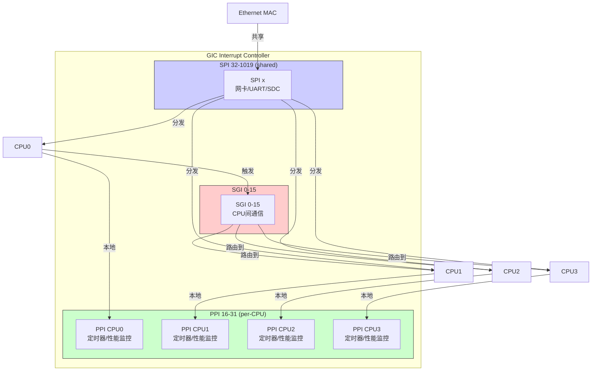

**知识点68 [I][M]**

GIC（Generic Interrupt Controller）把中断源分成了三类。这个分类不是拍脑袋定的，而是反映了ARM多核体系结构里一个核心的设计问题：**中断该发给谁？**

想象一个四核ARM芯片。网卡收到一个数据包，它该让哪个CPU去处理？四个核都能收，这就是所谓的"共享"。但本地定时器不一样——每个核有自己的定时器，定时器中断肯定只发给它所属的那个核，别的核收了也没用。还有一种情况，内核调度器觉得某个核负载太重了，想让它把手头的活匀一点出去，这时候需要一个核主动打断另一个核。三种完全不同的场景，对应三种中断类型。

先看清它们的编号分配。GICv2里，0~15是SGI，16~31是PPI，32~1019是SPI。这个编号范围不是随便画的——它直接决定了中断控制器内部的硬件路由逻辑。

```c
/* include/linux/irqchip/arm-gic.h */
#define GIC_SPI_BASE    32      /* 外设共享中断起始 */
#define GIC_PPI_BASE    16      /* 私有外设中断起始 */
#define GIC_SGI_BASE    0       /* 软件生成中断起始 */

/* 典型的GIC中断号划分 */
#define NR_GIC_SGI      16      /* SGI: 0-15 */
#define NR_GIC_PPI      16      /* PPI: 16-31 */
#define NR_GIC_SPI      988     /* SPI: 32-1019 */
```

SPI（Shared Peripheral Interrupt），外设共享中断。你的UART、网卡、SD卡控制器，这些挂在系统总线上的外设，中断线通常都连到GIC的SPI输入上。SPI不绑定任何特定CPU，GIC的中断分发逻辑（Distributor）会根据配置决定把它发给哪个核，或者哪些核。Linux里注册SPI时，`irq_set_affinity()`就是用来指定亲和性的——你可以把网卡中断绑到CPU0，也可以让它在四个核上轮询。

PPI（Private Peripheral Interrupt），私有外设中断。编号16~31，每个CPU有自己独立的一套。最典型的就是ARM架构定时器——`arch_timer`的物理定时器和虚拟定时器中断都是PPI。CPU0的定时器中断只会发到CPU0，CPU1收不到，也不需要收。GIC里每个CPU接口有自己独立的PPI配置寄存器，这让每个核能独立控制本地中断的使能和优先级。

SGI（Software Generated Interrupt），软件生成中断。这是ARM多核通信的基石。编号0~15，**唯一一种可以由软件主动触发的中断**。一个核往GIC的`GICD_SGIR`寄存器写个值，就能在指定的目标核上触发一次SGI。Linux内核里的IPI（Inter-Processor Interrupt）就是建立在SGI之上的。`smp_call_function_single()`底层走的就是这个机制。



对比三种类型，差异主要体现在**路由方式**和**触发来源**上：

| 特性 | SGI (0-15) | PPI (16-31) | SPI (32-1019) |
|------|-----------|------------|--------------|
| 触发源 | 软件写寄存器 | 硬件外设 | 硬件外设 |
| 目标CPU | 由软件指定 | 固定到所属CPU | 由Distributor分发 |
| 每个CPU是否有独立实例 | 共享ID，路由区分 | 有独立的一套 | 共享 |
| 典型用途 | IPI跨核通信 | 本地定时器 | 网卡/UART等 |
| Linux配置 | 内核内部管理 | 每CPU独立使能 | `irq_set_affinity()` |
| 数量 | 16个 | 16个 | 最多988个 |

> **⚠️ 陷阱**：很多新手搞混SPI的"共享"含义。这里的Shared不是指"多个设备共享一个中断号"，而是指"多个CPU共享接收这个中断"。多个设备共享一个中断号是另一个概念（IRQ sharing），跟SPI/PPI的分类维度不同，别搅在一起。

> **⚠️ 陷阱**：SGI的编号0~15是全局统一的，但**每个CPU有自己独立的SGI pending状态**。CPU0触发SGI 8给CPU1，CPU1上SGI 8的pending位被置位；这时候CPU0再触发一次SGI 8给CPU1，如果CPU1还没处理完第一次，第二次会不会丢失？GICv2的做法是：同一个SGI从同一个源CPU发往同一个目标CPU，在目标CPU处理完之前只能pending一次。但不同源CPU发来的同编号SGI，在目标CPU上是各自独立pending的。这个细节在写IPI逻辑时很重要。

---

**知识点69 [I]**

看看实际系统里这三种中断是怎么分工的，印象会更深。

网络收发包走的是SPI。你的以太网控制器（比如DW MAC、Cavium Thunder）连在系统总线上，收到一个数据帧后拉高中断线，GIC Distributor把这个中断路由到配置了亲和性的那个CPU。Linux内核的NAPI机制在这里配合——中断触发一次收一批包，然后关中断用轮询继续收，收完再开中断。`irq_set_affinity_hint()`经常用来把网卡中断绑到特定的核上，减少缓存抖动。

CPU本地定时器走的是PPI。ARM架构里每个核内置了Generic Timer，物理定时器中断号通常是PPI 30，虚拟定时器是PPI 27。`arch_timer_handler_virt()`这样的处理函数只会在对应CPU上执行，因为别的核根本收不到这个中断。内核的tick调度、高精度定时器（hrtimer）、CPU频率调度（sched_clock），都依赖这个PPI定时器的稳定节拍。

调度器做跨核负载均衡时，走的是SGI。比如`schedule()`发现某个runqueue积压了太多任务，就通过`smp_send_reschedule()`向目标CPU发送一个IPI——底层就是往GIC写SGIR寄存器，触发一次SGI。目标CPU收到后进入调度逻辑，检查是否需要把任务拉过来。这种"一个核主动打断另一个核让其做某事"的模式，是多核SMP系统的核心协作机制。

```c
/* kernel/smp.c 节选 - 典型的IPI发送 */
void smp_send_reschedule(int cpu)
{
    /* 底层调用架构相关的SGI发送函数 */
    arch_send_call_function_single_ipi(cpu);
    /* GIC上对应写 GICD_SGIR，触发SGI到目标CPU */
}
```

三种中断，三种路由逻辑，三种使用场景。搞清楚它们的区别，你在调多核系统的性能问题时，才知道该往哪个方向下手。
