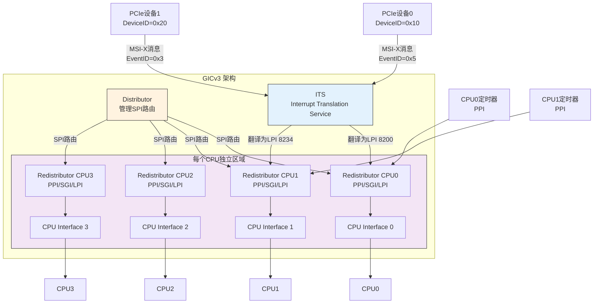
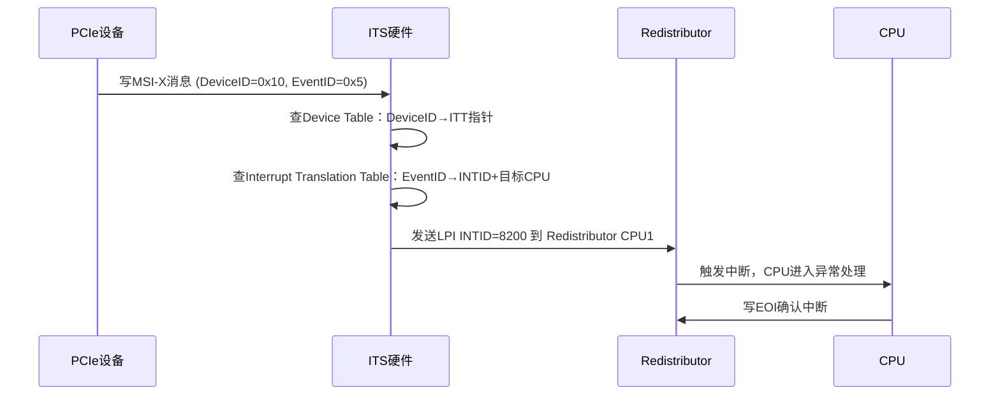
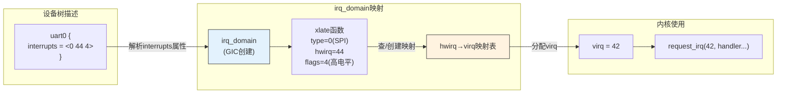

# 10.1.4 GICv3与中断号映射

> 所属章节：第10章 中断与时间 > 10.1 中断子系统全景
>
> 难度：[I][M] 中级/大师 | 预计阅读时间：20分钟

## <span class="blue"> 本节导读

GICv2的1024个中断号在小型嵌入式系统里够用，但面对48核ARM服务器和PCIe插满的大型SoC，它开始力不从心。GICv3登场了——Redistributor让每个CPU管理自己的中断，LPI用消息机制替代了中断线，ITS则像中断控制器的"MMU"一样做地址翻译。<br>
本节带你理解GICv3的架构升级，以及Linux如何把硬件中断号映射为内核使用的虚拟IRQ号。学完后，你将能读懂GICv3的设备树节点，理解LPI和ITS在PCIe MSI-X中的角色，并搞清楚hwirq到virq的映射链条。

---

## <span class="blue"> GICv3架构演进：从集中式到分布式 [I]

GICv2有个根本性的结构问题：Distributor太集中了。所有中断的使能、优先级、亲和性，统统要经过那组全局寄存器。四个核的时候看不出来，到了48核、128核呢？全挤在Distributor前面抢锁，中断延迟蹭蹭往上涨。

ARM的解法很直接——**拆**。把跟CPU绑定的中断配置下沉到每个CPU身边，Distributor只管真正需要全局管理的SPI。

### 四组件架构

GICv3引入了四个核心组件，各司其职：

```
┌─────────────────────────────────────────────────────────────┐
│                        GICv3 架构                           │
├─────────────┬───────────────────────────────────────────────┤
│ Distributor │  只管理SPI（共享外设中断）的全局路由和配置     │
├─────────────┼───────────────────────────────────────────────┤
│Redistributor│  每个CPU一个，管理本地PPI、SGI、LPI           │
├─────────────┼───────────────────────────────────────────────┤
│ CPU Interface│ 每个CPU一个，负责中断优先级屏蔽和确认        │
├─────────────┼───────────────────────────────────────────────┤
│     ITS     │  将PCIe设备的DeviceID翻译为LPI中断号          │
└─────────────┴───────────────────────────────────────────────┘
```

**Redistributor**是GICv3最大的架构创新。每个CPU配一个，有自己的寄存器组，互相不抢锁。想改本地定时器的优先级？直接访问自己的Redistributor，不用去Distributor排队。



### LPI：基于消息的中断

**LPI（Locality-specific Peripheral Interrupt）**是GICv3新增的中断类型。它跟SPI/PPI/SGI最大的区别是什么？**没有物理中断线**。

传统中断靠外设拉高/拉低一根物理线来通知GIC。LPI则完全不同——设备想发中断，往内存中的特定地址写一条消息就行。消息里包含设备标识（Device ID）和事件标识（Event ID），ITS负责把这些翻译为CPU能识别的中断号。

这招特别适合PCIe MSI-X。PCIe设备本来就没有专用中断线，全靠消息机制发中断。GICv3的LPI就是为此量身定制的。

> ⚠️ **陷阱**：LPI的中断号（INTID）从**8192**开始，不是从1024顺延！GICv3保留0~1019给SGI/PPI/SPI，1020~8191是保留区间，LPI从8192起跳。你在内核日志里看到`irq = 12345`这样的巨大编号，不要慌，那是正常的LPI中断号。

### ITS：中断控制器的"MMU"

**ITS（Interrupt Translation Service）**负责把PCIe设备发来的消息翻译为具体的中断号和目标CPU。

它的工作流程像是一个翻译官：



> 💡 **提示**：你可以把ITS理解为中断控制器的MMU。MMU把虚拟地址翻译为物理地址，ITS把设备的DeviceID/EventID翻译为中断号（INTID）和目标CPU。两者都是硬件翻译单元，而且都需要软件提前配置好翻译表才能工作。

### GICv2 vs GICv3：关键差异

| 特性 | GICv2 | GICv3 |
|------|-------|-------|
| Distributor角色 | 管理所有中断 | 只管理SPI |
| 每CPU组件 | CPU Interface | Redistributor + CPU Interface |
| PPI/SGI配置 | 走Distributor全局寄存器 | 走各自Redistributor，无竞争 |
| 最大中断数 | 1024个（0~1019） | 可超10000个（LPI 8192+） |
| 新增中断类型 | 无 | LPI（基于消息） |
| MSI/MSI-X支持 | 需外部翻译逻辑 | 原生支持（LPI + ITS） |
| 中断号空间 | 连续0~1019 | 非连续，LPI从8192起跳 |
| 虚拟化支持 | 有限 | 完整的中断虚拟化 |
| 适用场景 | ≤8核嵌入式 | 多核服务器/大型SoC |

为什么GICv3更适合大型SoC？说白了就三点：Redistributor把配置负载分散到每个CPU，避免了Distributor成为瓶颈；LPI的消息机制打破了中断线数量的物理限制；ITS让PCIe MSI-X原生工作，不再需要额外翻译芯片。这三板斧下去，GICv3就能撑住上千个中断源、上百个CPU核的阵仗。

```c
/* drivers/irqchip/irq-gic-v3.c - GICv3 Redistributor数据结构 */
struct rdists {
    struct {
        void __iomem *rd_base;      /* Redistributor 基地址 */
        phys_addr_t phys_base;
    } __percpu *rdist;
    u64 flags;
};

/* ITS节点结构 */
struct its_node {
    raw_spinlock_t lock;
    void __iomem *base;
    struct its_cmd_block *cmd_write;    /* ITS命令队列写指针 */
    /* Device ID → 中断映射表 */
    struct idr its_device_idr;
    struct list_head its_device_list;
};
```

---

## <span class="blue"> 中断号映射：从硬件到Linux虚拟IRQ [I][M]

硬件中断号和Linux内核使用的IRQ号不是一回事。GIC说"SPI 44"，Linux内核说"virq 23"——这中间隔着一层翻译。

### 三层映射模型

Linux内核用**irq_domain**机制来做hwirq到virq的映射。整个过程分三层：

```
┌─────────────────────────────────────────────────────────────┐
│                    中断号映射三层模型                          │
├─────────────┐    ┌──────────────┐    ┌─────────────────────┐ │
│   hwirq     │───→│  irq_domain  │───→│       virq          │ │
│ (硬件中断号) │    │  (映射层)    │    │ (Linux虚拟IRQ号)    │ │
├─────────────┤    ├──────────────┤    ├─────────────────────┤ │
│ SPI 44      │    │ 线性映射     │    │ 23                  │ │
│ PPI 16      │    │ 树映射       │    │ 45                  │ │
│ LPI 8200    │    │ 传统映射     │    │ 198                 │ │
└─────────────┘    └──────────────┘    └─────────────────────┘ │
└─────────────────────────────────────────────────────────────┘
```

**hwirq（硬件中断号）**：中断控制器 datasheet 上的编号。GICv2里SPI从32开始，PPI从16开始。设备树里的`interrupts`属性用的就是这个。

**virq（虚拟IRQ号）**：Linux内核统一分配的编号。它跟具体的中断控制器无关，是一个全局命名空间里的整数。你调用`request_irq()`时传入的就是virq。

**irq_domain**：中间的映射层。每个中断控制器创建一个irq_domain，注册自己的映射规则。当设备树被解析时，内核根据`interrupts`属性找到对应的irq_domain，调用它的`xlate`函数把硬件中断号翻译成virq。



### 设备树中的interrupts属性解读

设备树里`interrupts`属性的格式是`<type, hwirq, flags>`，但GICv3的设备树会用到**中断域引用**：

```dts
// GICv3设备树节点示例
intc: interrupt-controller@f9010000 {
    compatible = "arm,gic-v3";
    #interrupt-cells = <3>;           // 三个cell描述一个中断
    #address-cells = <0>;
    interrupt-controller;             // 标记为中断控制器
    reg = <0xf9010000 0x10000>,      // Distributor地址
          <0xf9020000 0x100000>;     // Redistributor地址范围
    interrupts-extended = <&its 0>;   // 连接ITS
};

// 外设使用SPI中断（type=0, hwirq=44, 高电平触发）
uart0: serial@101f1000 {
    compatible = "arm,pl011";
    interrupts = <GIC_SPI 44 IRQ_TYPE_LEVEL_HIGH>;
    // 等价于 <0 44 4>
};

// 使用PPI的本地定时器（type=1, hwirq=13, flags=0x301）
timer {
    compatible = "arm,armv8-timer";
    interrupts = <GIC_PPI 13 IRQ_TYPE_LEVEL_LOW>,   // 物理定时器
                 <GIC_PPI 14 IRQ_TYPE_LEVEL_LOW>,   // 虚拟定时器
                 <GIC_PPI 11 IRQ_TYPE_LEVEL_LOW>,   // 超虚拟定时器
                 <GIC_PPI 10 IRQ_TYPE_LEVEL_LOW>;   // 物理非安全定时器
};
```

三个cell的含义：

| 字段 | 名称 | 含义 |
|:---:|:---|:---|
| 第1个cell | 类型 | 0=GIC_SPI, 1=GIC_PPI, 2=GIC_SGI, 3=GIC_LPI |
| 第2个cell | hwirq | 硬件中断号，在对应类型空间内的编号 |
| 第3个cell | flags | 触发方式：1=上升沿, 2=下降沿, 4=高电平, 8=低电平 |

### irq_domain的三种映射方式

irq_domain提供了三种映射策略，适应不同的中断控制器需求：

| 映射类型 | 函数 | 适用场景 | 特点 |
|:---|:---|:---|:---|
| 线性映射 | `irq_domain_add_linear()` | 中断号连续、数量少 | O(1)查找，数组存储，简单高效 |
| 树映射 | `irq_domain_add_tree()` | 中断号稀疏、数量多 | 基数树存储，节省内存 |
| 传统映射 | `irq_domain_add_legacy()` | 固定映射（ISA等） | hwirq = virq，一一对应 |

大部分现代中断控制器用线性映射就够了。来看看GIC驱动的典型代码：

```c
/* drivers/irqchip/irq-gic-v3.c - GICv3创建irq_domain */
static int __init gic_init_bases(void __iomem *dist_base,
                                  struct redist_region *rdist_regs,
                                  u32 nr_redist_regions,
                                  u64 redist_stride,
                                  struct fwnode_handle *handle)
{
    /* ... */

    // 创建线性irq_domain，支持GIC支持的所有中断
    gic_data.domain = irq_domain_create_tree(handle, &gicv3_domain_ops, &gic_data);
    if (!gic_data.domain) {
        pr_err("GICv3: Failed to create irq_domain\n");
        return -ENOMEM;
    }

    irq_domain_update_bus_token(gic_data.domain, DOMAIN_BUS_WIRED);

    /* ... */
}

/* irq_domain_ops 操作集 */
static const struct irq_domain_ops gicv3_domain_ops = {
    .alloc          = gicv3_irq_domain_alloc,
    .free           = gicv3_irq_domain_free,
    .activate       = gicv3_irq_domain_activate,
    .deactivate     = gicv3_irq_domain_deactivate,
};
```

### 级联中断控制器：GPIO Expander案例

一个中断控制器的中断输出，可以连到另一个中断控制器的输入上。这就是**级联中断控制器**。最常见的场景是GPIO Expander：

```
┌─────────────────────────────────────────────────────────────┐
│                    级联中断控制器示例                          │
├─────────────────────────────────────────────────────────────┤
│                                                             │
│  ┌─────────┐      SPI 67      ┌──────────────┐             │
│  │  GIC    │◄────────────────│ GPIO Expander │             │
│  │ (父)    │   一级中断       │   (子/从)    │             │
│  └─────────┘                 │              │             │
│                              │ 管理8个GPIO  │             │
│                              │ 每个GPIO独立 │             │
│                              │ 中断源       │             │
│                              └──────────────┘             │
│                                                             │
│  中断流：GPIO引脚翻转 → Expander内部处理 → 拉高SPI 67       │
│          → GIC收到 → CPU响应 → 父handler调用子handler       │
│          → 子handler查询expander状态 → 找到真正的源           │
└─────────────────────────────────────────────────────────────┘
```

级联的核心在于**父中断的处理函数中要调用子中断控制器的处理链**。来看代码骨架：

```c
/* GPIO Expander级联中断处理的典型模式 */

// 1. 父中断（GIC SPI 67）的handler
static irqreturn_t expander_parent_handler(int irq, void *data)
{
    struct expander_chip *chip = data;

    /* 读取expander状态寄存器，判断哪些子中断触发了 */
    unsigned long pending = read_status_reg(chip);

    /* 逐个调用子handler */
    for_each_set_bit(child_irq, &pending, chip->num_gpios) {
        generic_handle_irq(irq_find_mapping(chip->irq_domain, child_irq));
    }

    return IRQ_HANDLED;
}

// 2. 注册父中断时传入expander私有数据
static int expander_probe(struct i2c_client *client)
{
    struct expander_chip *chip;
    int parent_irq;

    /* ... */

    // 获取父中断（从设备树解析得到GIC SPI 67）
    parent_irq = client->irq;

    // 注册父中断handler
    ret = request_threaded_irq(parent_irq,
                               expander_parent_handler,  /* 顶半部 */
                               NULL,                     /* 无底半部 */
                               IRQF_ONESHOT | IRQF_SHARED,
                               "gpio-expander", chip);

    // 3. 为expander创建自己的irq_domain（子域）
    chip->irq_domain = irq_domain_add_linear(client->dev.of_node,
                                              chip->num_gpios,
                                              &expander_domain_ops,
                                              chip);
    /* ... */
}
```

> 🔴 **危险**：级联中断里，父handler如果忘了调用`generic_handle_irq()`去分发子中断，子设备的中断处理函数就永远得不到执行。更隐蔽的是，如果父handler里没读清expander的状态寄存器，中断线一直被拉高，会导致中断风暴（irq storm）——CPU被卡死在中断上下文出不来。

> 💡 **提示**：级联层数理论上可以无限深（中断控制器连中断控制器再连中断控制器），但实际中超过两层就很罕见了。每多一层就多一次分发开销，调试难度也指数级增长。如果你发现系统在irq处理里消耗大量CPU时间，检查一下是不是级联太深或者父handler效率太低。

---

## <span class="blue"> 本节总结

| 维度 | GICv3关键变化 | 影响 |
|:---|:---|:---|
| 架构 | Distributor拆分为Distributor + Redistributor | 每个CPU独立配置，消除竞争热点 |
| 新组件 | Redistributor（每CPU一个） | PPI/SGI配置本地化，支持在线迁移 |
| 新中断类型 | LPI（基于消息，INTID 8192+） | 打破1024中断限制，支持PCIe MSI-X |
| 新服务 | ITS（Interrupt Translation Service） | 硬件翻译DeviceID→INTID，原生MSI支持 |
| 中断映射 | hwirq → irq_domain → virq | 硬件无关抽象，支持级联中断控制器 |
| irq_domain类型 | linear / tree / legacy | 适配不同中断控制器的编号特征 |
| 级联处理 | 父handler → generic_handle_irq → 子handler | GPIO expander等二级中断的标准模式 |
| 适用场景 | 大型SoC、多核服务器、PCIe丰富系统 | GICv2在≤8核嵌入式中仍有性价比优势 |

---

## <span class="blue"> 下一步

GICv3的架构和中断号映射只是理解中断子系统的第一步。irq_domain到底是如何在设备树解析时动态创建映射的？级联中断控制器的`irq_domain_ops`里`xlate`和`map`函数各自做什么？下一节**10.1.5 irq_domain详解与级联中断**，我们将深入irq_domain的内部实现，看看内核是怎么把设备树里的`<0 44 4>`一步步变成`virq 42`的，以及级联中断的完整注册流程。

---

## <span class="blue"> 配套资源

| 资源类型 | 路径/说明 |
|:---|:---|
| 核心源码 | `drivers/irqchip/irq-gic-v3.c` — GICv3驱动实现 |
| ITS实现 | `drivers/irqchip/irq-gic-v3-its.c` — ITS完整逻辑 |
| irq_domain框架 | `kernel/irq/irqdomain.c` — irq_domain核心代码 |
| 设备树绑定 | `Documentation/devicetree/bindings/interrupt-controller/arm,gic-v3.yaml` |
| 级联参考 | `drivers/gpio/gpio-pcf857x.c` — GPIO expander级联中断示例 |
| 查看映射 | `cat /proc/interrupts` — 观察hwirq到virq的映射关系 |
| ARM参考手册 | 《ARM Generic Interrupt Controller Architecture Specification v3/v4》 |
