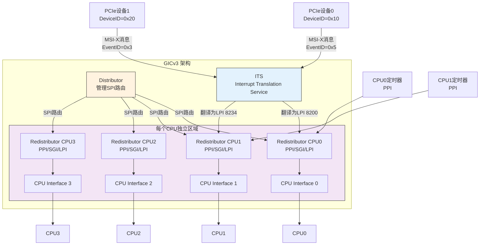
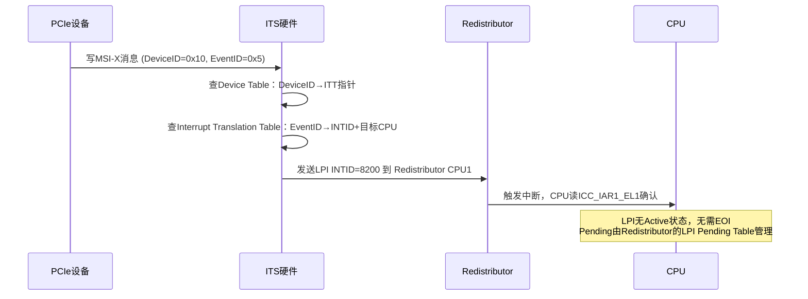
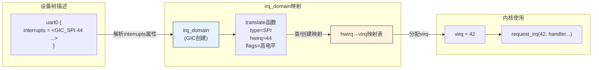

# 10.1.4 GICv3与中断号映射

> 所属章节：第10章 中断与时间 > 10.1 中断的硬件链路
>
> 难度：[I→M] | 预计阅读时间：20分钟

## <span class="blue"> 本节导读

GICv2 的 1020 个中断号在小型嵌入式系统里够用，但面对几十核的 ARM 服务器和 PCIe 插满的大型 SoC，它开始力不从心。<BR>
GICv3 的答案：Redistributor 让每个 CPU 管理自己的中断，LPI 用消息机制替代物理中断线，ITS 负责把设备消息翻译成中断号。<BR>

本节覆盖：

- GICv3 的四组件架构与 GICv2 的差异
- LPI 与 ITS 在 PCIe MSI-X 中的角色
- hwirq 到 virq 的三层映射概念
- GICv3 设备树节点的读法。

---

## <span class="blue"> GICv3架构演进：从集中式到分布式 [I]

GICv2有个根本性的结构问题：Distributor太集中了。<br>
所有中断的使能、优先级、亲和性，统统要经过那组全局寄存器。<br>
四个核的时候看不出来，到了48核、128核，所有CPU都挤在Distributor前面抢锁，中断延迟随之上升。

ARM的解法很直接——**拆**。<br>
把跟CPU绑定的中断配置下沉到每个CPU身边，Distributor只管真正需要全局管理的SPI。

### 四组件架构

GICv3引入了四个核心组件，各司其职：

```
┌─────────────────────────────────────────────────────────────┐
│                        GICv3 架构                       │
├─────────────┬───────────────────────────────────────────────┤
│ Distributor│  只管理SPI（共享外设中断）的全局路由和配置      │
├─────────────┼───────────────────────────────────────────────┤
│Redistributor│  每个CPU一个，管理本地PPI、SGI、LPI           │
├─────────────┼───────────────────────────────────────────────┤
│CPU Interface│ 每个CPU一个，负责中断优先级屏蔽和确认          │
├─────────────┼───────────────────────────────────────────────┤
│     ITS    │  将PCIe设备的DeviceID翻译为LPI中断号         │
└─────────────┴───────────────────────────────────────────────┘
```

> ⚠️ GICv3 与 GICv2 的关键差异：<br>
> CPU Interface 不再通过内存映射寄存器（`GICC_*`）访问，而是改为 **系统寄存器（`ICC_*_EL1`）**，用 `MRS`/`MSR` 指令读写。<br>
> Redistributor（`GICR_*`）和 Distributor（`GICD_*`）仍保持内存映射。

**Redistributor**是GICv3最大的架构创新。每个CPU配一个，有自己的寄存器组，互相不抢锁。<br>
想改本地定时器的优先级？直接访问自己的Redistributor，不用去Distributor排队。



### LPI：基于消息的中断

**LPI（Locality-specific Peripheral Interrupt）**是GICv3新增的中断类型。<br>
它跟SPI/PPI/SGI最大的区别是什么？**没有物理中断线**。

传统中断靠外设拉高/拉低一根物理线来通知GIC。<br>
LPI则完全不同: 设备想发中断，往内存中的特定地址写一条消息就行。<br>
消息里包含设备标识（Device ID）和事件标识（Event ID），ITS负责把这些翻译为CPU能识别的中断号。

> 有 ITS 时，设备向 ITS 的 GITS_TRANSLATER 寄存器写入消息（包含 Device ID 和 Event ID），ITS 翻译后发给 Redistributor；<br>
> 无 ITS 时（如 RK3568），通过直接设置 Redistributor 的 LPI Pending Table 触发。

这招特别适合PCIe MSI-X。PCIe设备本来就没有专用中断线，全靠消息机制发中断。GICv3的LPI就是为此量身定制的。

> ⚠️ LPI 的中断号（INTID）从 **8192** 开始，不是从 1020 顺延。<br>
> GICv3 保留 0~1019 给 SGI/PPI/SPI，1020~8191 是保留区间，LPI 从 8192 起跳。<br>
> 内核日志里出现 `irq = 12345` 这样的大编号，是正常的 LPI 中断号。

### ITS：中断号的硬件翻译单元

**ITS（Interrupt Translation Service）**负责把PCIe设备发来的消息翻译为具体的中断号和目标CPU。

它的工作流程：



> 💡 ITS 的角色可以类比 MMU：MMU 把虚拟地址翻译为物理地址，ITS 把设备的 DeviceID/EventID 翻译为中断号（INTID）和目标 CPU。<br>
> 两者都是硬件翻译单元，都需要软件提前配置好翻译表才能工作。

### GICv2 vs GICv3：关键差异

| 特性 | GICv2 | GICv3 |
|------|-------|-------|
| Distributor角色 | 管理所有中断 | 只管理SPI |
| 每CPU组件 | CPU Interface | Redistributor + CPU Interface |
| PPI/SGI配置 | 走Distributor全局寄存器 | 走各自Redistributor，无竞争 |
| 最大中断数 | 1020个（0~1019） | 可超10000个（LPI 8192+） |
| 新增中断类型 | 无 | LPI（基于消息） |
| MSI/MSI-X支持 | 需外部翻译逻辑 | 原生支持（LPI + ITS） |
| 中断号空间 | 连续0~1019 | 非连续，LPI从8192起跳 |
| 虚拟化支持 | 有限 | 完整的中断虚拟化 |
| 适用场景 | 早期嵌入式/低端平台 | 现代嵌入式、多核服务器、PCIe丰富系统 |

GICv3 适合大型 SoC 的原因就三点：

1. Redistributor 把配置负载分散到每个 CPU，Distributor 不再是瓶颈；
2. LPI 的消息机制打破了中断线数量的物理限制；
3. ITS 让 PCIe MSI-X 原生工作，不再需要额外翻译逻辑。

ITS 节点在内核中的数据结构（`drivers/irqchip/irq-gic-v3-its.c:96`，字段有删减）：

```c
struct its_node {
    raw_spinlock_t          lock;
    struct list_head        entry;
    void __iomem            *base;           /* ITS 寄存器基地址 */
    struct its_cmd_block    *cmd_base;       /* ITS 命令队列 */
    struct its_cmd_block    *cmd_write;      /* 命令队列写指针 */
    struct its_baser        tables[GITS_BASER_NR_REGS];  /* Device/ITT 等翻译表 */
    struct its_collection   *collections;    /* 目标 CPU 集合 */
    ...
};
```

---

## <span class="blue"> 中断号映射：从硬件到Linux虚拟IRQ [I→M]

硬件中断号和Linux内核使用的IRQ号不是一回事。<br>
GIC说"SPI 44"，Linux内核说"virq 23" ——> 这中间隔着一层翻译。

### 三层映射模型

Linux内核用**irq_domain**机制来做hwirq到virq的映射。整个过程分三层：

| 硬件层 (hwirq) | → | 映射层 (irq_domain) | → | 内核层 (virq) |
|:---|:---|:---|:---|:---|
| SPI 44 (INTID 76) | → | translate & alloc | → | virq 23 |
| PPI 0 (INTID 16) | → | translate & alloc | → | virq 45 |
| LPI 8200 | → | translate & alloc | → | virq 198 |

**hwirq（硬件中断号）**：中断控制器 datasheet 上的绝对编号（如 INTID）。<br>
设备树里的 interrupts 属性写的是控制器-relative 编号（如 GIC_SPI 44），经 irq_domain 的 translate 函数转换后才得到 hwirq。

**virq（虚拟IRQ号）**：Linux内核统一分配的编号。<br>
它跟具体的中断控制器无关，是一个全局命名空间里的整数。你调用`request_irq()`时传入的就是virq。

**irq_domain**：中间的映射层。<br>
每个中断控制器创建一个irq_domain，注册自己的映射规则。当设备树被解析时，内核根据`interrupts`属性找到对应的irq_domain，把硬件中断号翻译成virq。



irq_domain 有 linear/tree/legacy 三种映射策略，设备树中断的完整解析链路，以及级联中断控制器（GPIO Expander）的实现<br>
这些细节都在下一节 10.1.5 展开，本节先把概念层立住。

### 设备树中的GICv3节点

GICv3控制器的设备树节点长这样（通用形式）：

```dts
intc: interrupt-controller@f9010000 {
    compatible = "arm,gic-v3";
    #interrupt-cells = <3>;           /* 三个cell描述一个中断 */
    interrupt-controller;             /* 标记为中断控制器 */
    reg = <0xf9010000 0x10000>,       /* Distributor地址 */
          <0xf9020000 0x100000>;      /* Redistributor地址范围 */
};

its: msi-controller@f9040000 {        /* ITS 是独立节点 */
    compatible = "arm,gic-v3-its";
    msi-controller;
    #msi-cells = <1>;
    reg = <0xf9040000 0x20000>;
};
```

对照本书的实锚点 RK3568（`rk356x.dtsi:316`）：

```dts
gic: interrupt-controller@fd400000 {
    compatible = "arm,gic-v3";
    reg = <0x0 0xfd400000 0 0x10000>,   /* GICD */
          <0x0 0xfd460000 0 0x80000>;   /* GICR */
    interrupts = <GIC_PPI 9 IRQ_TYPE_LEVEL_HIGH>;  /* 维护中断 */
    interrupt-controller;
    #interrupt-cells = <3>;
    mbi-alias = <0x0 0xfd410000>;       /* 用 MBI 别名支持消息中断 */
    mbi-ranges = <296 24>;
    msi-controller;
};
```

注意 RK3568 **没有独立的 ITS 节点**: 它用 `mbi-alias`/`mbi-ranges` 提供消息中断能力。<br>
读芯片设备树时，见不到 ITS 不代表不支持 MSI。

外设引用中断的例子（同文件 timer 节点，`rk356x.dtsi:216`）：

```dts
timer {
    compatible = "arm,armv8-timer";
    interrupts = <GIC_PPI 13 IRQ_TYPE_LEVEL_HIGH>,  /* 安全物理定时器（EL3） */
                 <GIC_PPI 14 IRQ_TYPE_LEVEL_HIGH>,  /* 非安全物理定时器（EL1，Linux tick） */
                 <GIC_PPI 11 IRQ_TYPE_LEVEL_HIGH>,  /* 虚拟定时器 */
                 <GIC_PPI 10 IRQ_TYPE_LEVEL_HIGH>;  /* Hypervisor定时器（EL2） */
    arm,no-tick-in-suspend;
};
```

三个cell的含义：

| 字段 | 名称 | 含义 |
|:---:|:---|:---|
| 第1个cell | 类型 | `GIC_SPI`（=0）或 `GIC_PPI`（=1）；SGI 由内核动态分配、LPI 由 ITS 运行时分配，都不出现在设备树中 |
| 第2个cell | hwirq | 硬件中断号，在对应类型空间内的编号 |
| 第3个cell | flags | 触发方式：1=上升沿, 2=下降沿, 4=高电平, 8=低电平 |

### GICv3创建irq_domain的代码

```c
/* drivers/irqchip/irq-gic-v3.c:2045（节选） */
gic_data.domain = irq_domain_create_tree(handle, &gic_irq_domain_ops,
                                         &gic_data);
if (!gic_data.domain) {
    pr_err("Failed to create domain\n");
    return -ENOMEM;
}
irq_domain_update_bus_token(gic_data.domain, DOMAIN_BUS_WIRED);

/* drivers/irqchip/irq-gic-v3.c:1716 —— 操作集 */
static const struct irq_domain_ops gic_irq_domain_ops = {
    .translate = gic_irq_domain_translate,  /* DT三字段 → hwirq+type */
    .alloc     = gic_irq_domain_alloc,      /* 分配并绑定 virq */
    .free      = gic_irq_domain_free,
    .select    = gic_irq_domain_select,     /* 为 fwspec 选中本 domain */
};
```

---

## <span class="blue"> 本节总结

| 维度 | GICv3关键变化 | 影响 |
|:---|:---|:---|
| 架构 | Distributor拆分为Distributor + Redistributor | 每个CPU独立配置，消除竞争热点 |
| 新组件 | Redistributor（每CPU一个） | PPI/SGI配置本地化 |
| 新中断类型 | LPI（基于消息，INTID 8192+） | 打破1020中断限制，支持PCIe MSI-X |
| 新服务 | ITS（Interrupt Translation Service） | 硬件翻译DeviceID→INTID，原生MSI支持 |
| 中断映射 | hwirq → irq_domain → virq | 硬件无关抽象，支持级联中断控制器 |
| 设备树 | `#interrupt-cells = <3>`，类型仅 SPI/PPI | SGI/LPI 不由 DT 描述 |
| 适用场景 | 大型SoC、多核服务器、PCIe丰富系统 | GICv2适用于早期嵌入式/低端平台 |

---

## <span class="blue"> 下一步

概念层已经立住：hwirq 经 irq_domain 翻译成 virq。<br>
但线性映射、树映射、传统映射三种策略怎么选？<br>
设备树里的 `<GIC_SPI 44 ...>` 在内核里具体走过哪些函数？<br>
GPIO Expander 这种"控制器之上再挂控制器"的级联中断怎么注册？<br>

下一节 **10.1.5 irq_domain详解与级联中断** 逐个展开，顺带把 `/proc/interrupts` 的读法和中断绑核（smp_affinity）的实操一并解决。

---

## <span class="blue"> 配套资源

| 资源类型 | 路径/说明 |
|:---|:---|
| 核心源码 | `drivers/irqchip/irq-gic-v3.c` — GICv3驱动实现 |
| ITS实现 | `drivers/irqchip/irq-gic-v3-its.c` — ITS完整逻辑 |
| irq_domain框架 | `kernel/irq/irqdomain.c` — irq_domain核心代码 |
| 设备树绑定 | `Documentation/devicetree/bindings/interrupt-controller/arm,gic-v3.yaml` |
| 实锚点对照 | `arch/arm64/boot/dts/rockchip/rk356x.dtsi` — gic/timer 节点 |
| 查看映射 | `cat /proc/interrupts` — 观察hwirq到virq的映射关系 |
| ARM参考手册 | 《ARM Generic Interrupt Controller Architecture Specification v3/v4》 |
