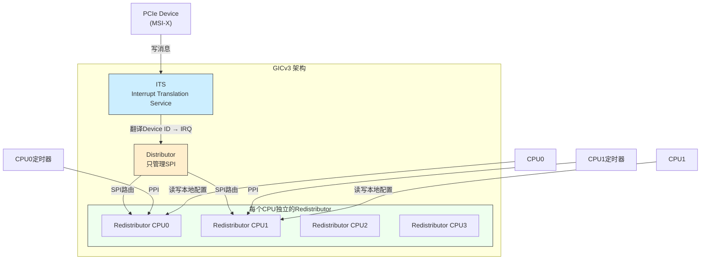

**知识点70 [I]**

GICv2用久了，你会发现一个结构性问题：Distributor太 centralized（集中式）了。所有中断的使能、优先级、亲和性配置，都要经过Distributor里那一套全局寄存器。核少的时候还好，八个核以内的系统基本感知不到瓶颈。但ARM后来开始进军服务器市场——你见过48核、甚至128核的ARM服务器芯片吧？这么多核围着Distributor打转，读写寄存器竞争、中断分发延迟，全都暴露出来了。

ARM的解决方案很干脆：给每个CPU配一个**Redistributor**。

GICv3的架构变了。Distributor还在，但只负责SPI（共享外设中断）的全局管理。PPI、SGI这些跟具体CPU绑定的中断，全部下沉到Redistributor里去处理。每个CPU一个Redistributor，有自己的寄存器组，互相之间不抢锁。CPU想改本地定时器中断的优先级？直接访问自己的Redistributor，不用再去Distributor那边排队。



这里还引入了两个新东西，得说清楚。

**LPI（Locality-specific Peripheral Interrupt）**。这是GICv3新增的中断类型，跟传统的中断不一样，它不是靠物理中断线触发的，而是**基于消息的**。设备想发中断，往一个特定地址写一条消息就行，消息里带有设备标识。这种方式天然适合PCIe MSI-X——PCIe设备本来就没有专用中断线，全靠消息机制发中断。GICv3的LPI就是为了迎合这个趋势设计的。

**ITS（Interrupt Translation Service）**。LPI来了之后有个问题：设备发过来的消息里带的是设备ID（Device ID），但CPU处理中断需要IRQ number。谁来翻译？ITS就是干这个的。它维护了一张表，把Device ID映射到具体的IRQ number和CPU目标。ITS本质上是一个硬件翻译单元，跟IOMMU把设备DMA地址翻译成物理地址的思路很像，只不过这里翻译的是中断。

```c
/* drivers/irqchip/irq-gic-v3.c 节选 */
/* GICv3 Redistributor 寄存器框架 */
struct rdists {
    struct {
        void __iomem *rd_base;      /* Redistributor 基地址 */
        phys_addr_t phys_base;
    } __percpu *rdist;
    u64 flags;
};

/* ITS 相关 */
struct its_node {
    raw_spinlock_t lock;
    struct device_node *node;
    struct fwnode_handle *fwnode_handle;
    void __iomem *base;
    struct its_cmd_block *cmd_write;    /* ITS命令队列 */
    struct its_cmd_block *cmd_base;
    /* Device ID → 中断映射表 */
    struct its_device *devices;
    struct list_head its_device_list;
};
```

> **⚠️ 陷阱**：LPI的编号是从**8192**开始的，不是跟SPI挨着。这是因为GICv3要兼容旧的中断类型，0~1019还是SPI/PPI/SGI的地盘，LPI从8192起跳。你在设备树或内核日志里看到irq号特别大（比如上万的），不要慌，大概率是LPI，不是bug。

> **⚠️ 陷阱**：ITS的Device ID翻译表是软件配置的，不是自动生成的。如果PCIe设备枚举时ITS的映射表没配好，设备发中断消息过来翻译失败，中断就丢了。这类问题在调试新板子时经常遇到——设备驱动加载了，DMA也正常，就是没中断，查半天发现ITS表没填。

---

**知识点71 [I]**

说白了，GICv3就是为**大型SoC**重新设计的。GICv2的Distributor是所有CPU共享的配置中心，核数一多，这里就成了不折不扣的热点。GICv3把配置拆散，每个CPU管好自己的一亩三分地，Distributor只管SPI这个真正的"共享"部分。

| 特性 | GICv2 | GICv3 |
|------|-------|-------|
| Distributor角色 | 管理所有中断 | 只管理SPI |
| 每CPU组件 | CPU Interface | **Redistributor** + CPU Interface |
| PPI/SGI配置 | 走Distributor全局寄存器 | 走各自Redistributor，无竞争 |
| 最大中断数 | 1019 | 可上万（LPI） |
| MSI/MSI-X支持 | 需要外部翻译 | 原生支持（通过LPI+ITS） |
| 适用场景 | ≤8核嵌入式 | 多核服务器/大型SoC |
| 中断类型 | SGI/PPI/SPI | SGI/PPI/SPI + **LPI** |

这个架构上的分治策略，让GICv3在核数上去之后依然能线性扩展。我见过一个48核的ARM服务器在压力测试下，GICv3各个Redistributor的寄存器访问几乎没有竞争，而同样场景下GICv2的Distributor早就成了性能瓶颈。这不是巧合，是架构设计决定的。

```c
/* kernel/irqchip/irq-gic-v3.c 节选 - 选择Redistributor的典型路径 */
static struct redist_region *gic_data_rdist(void)
{
    return this_cpu_ptr(gic_data.rdist);
}

/* CPU访问自己的Redistributor，per-CPU指针直接取 */
static void gic_write_pmr(u32 val)
{
    writeb_relaxed(val, gic_data_rdist_sgi_base() + GICR_NSACR);
}
```

Redistributor是每个CPU独立的，内核代码直接用`per_cpu`变量去访问，不需要加锁。这就是为什么GICv3在大型系统上表现更好——不光是硬件上不竞争，软件路径也简洁了。一条per-CPU指针直接到位，比GICv2里围着Distributor转一圈快得多。

所以你看，ARM从GICv2到v3的演进，本质上是从" centralized 管理"走向" distributed 管理"。这个思路在系统架构设计里很普遍——当一个中心节点成为瓶颈时，最好的解法往往不是去优化那个瓶颈，而是把它拆开。
