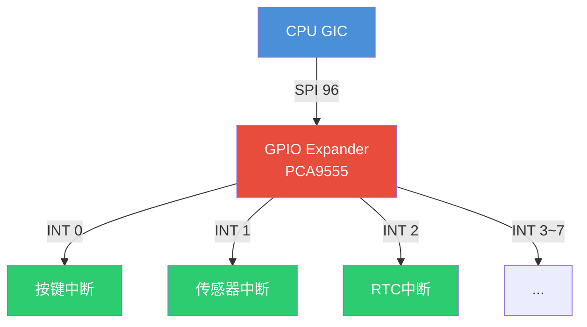

# 10.1.5 irq_domain详解与级联中断

> 所属章节：第10章 中断与时间 > 10.1 中断的硬件链路
>
> 难度：[I→E] | 预计阅读时间：25分钟

## <span class="blue"> 本节导读

上一节建立了 hwirq→virq 的三层映射概念和 GICv3 架构，但映射层本身还没拆：irq_domain 有哪几种实现？<BR>
设备树里的 `interrupts` 属性在内核里具体走过哪些函数？<BR>
主控制器上再挂一个 GPIO expander，中断信号层层传递，内核怎么组织这种级联？<BR>

本节覆盖：

- irq_domain 三种映射策略的选择依据、
- 设备树中断解析的完整函数链、
- 级联中断控制器的注册与 handler 写法、
- `/proc/interrupts` 的读法、
- smp_affinity 中断绑核实操与中断风暴排查。

---

## <span class="blue"> irq_domain的三种映射与级联中断 [E]

### 为什么需要映射层

每个中断控制器有自己的本地编号（hwirq），内核需要一个全局统一编号（virq）来管理所有中断。<BR>
irq_domain 就是两者之间的映射层：它把硬件侧的 hwirq 翻译成内核侧的 virq。

Linux内核为不同硬件场景准备了三种映射策略。选错了，轻则浪费内存，重则中断注册失败。

### 三种domain类型对比

| 类型 | 数据结构 | 查找复杂度 | 适用场景 | 内存开销 |
|------|---------|-----------|---------|---------|
| linear | 数组 `linear_revmap[]` | O(1) | hwirq连续且范围小（如32路GPIO） | 与最大hwirq成正比 |
| tree | radix tree | O(logN) | hwirq稀疏且范围大（如PCI MSI） | 仅分配已使用的节点 |
| legacy | 固定偏移 `virq = hwirq + offset` | O(1) | 无设备树的旧平台（已逐渐淘汰） | 无额外开销 |

**linear domain**是最直白的: 内核维护一个数组，下标就是hwirq，存的是对应的virq号。查找一次数组访问搞定。<BR>
代价呢？如果你的hwirq最大是1023，哪怕只用其中3个，数组也得开1024个槽位。适合"连续密集"的场景。

**tree domain**用radix tree（基树）来存映射关系。<BR>
hwirq可以不连续，比如PCI设备的MSI中断号动不动就稀疏地散在几万号区间。<BR>
radix tree只在有实际映射的路径上分配节点，省内存。查找需要沿着树往下走，复杂度O(logN)，但实际中树高很浅，基本可以忽略。

**legacy domain**最简单粗暴：`virq = hwirq + first_irq`。<BR>
这是早期没有设备树时代的产物，现在新项目基本不用了。你看到代码里有`irq_domain_add_legacy()`，大概率是在兼容旧驱动。

> 💡 linear domain 的数组大小由创建时传入的 `hwirq_max` 决定。<BR>
> GPIO 控制器有 128 路但只用到前 8 路时，可以把 `hwirq_max` 设小一点，省点内存。

### 设备树中断解析链路

你在设备树里写的`interrupts = <23 IRQ_TYPE_EDGE_FALLING>;`是怎么变成内核里的virq的？<BR>
这条链路很长，但搞懂了排查中断问题就轻松多了。

```c
/* 设备树片段 */
&i2c1 {
    pcf8574: gpio@38 {
        compatible = "nxp,pcf8574";
        reg = <0x38>;
        interrupt-parent = <&gpio0>;    /* 上级是gpio0 */
        interrupts = <23 IRQ_TYPE_EDGE_FALLING>;  /* 硬件中断号23 */
        gpio-controller;
        #gpio-cells = <2>;
        interrupt-controller;
        #interrupt-cells = <2>;
    };
};
```

解析流程——**注意这不是你手动调用的，而是内核自动完成的**（函数名以 v6.6 为准）：

```
设备树节点probe
    ↓
irq_of_parse_and_map(dev_node, index)     /* 从设备树解析第index个中断 */
    ↓
irq_create_fwspec_mapping(&fwspec)        /* kernel/irq/irqdomain.c */
    ├─ irq_find_matching_fwspec()         /* 按 interrupt-parent 找到对应 irq_domain */
    └─ domain->ops->translate()           /* DT字段 → hwirq + 触发类型 */
    ↓
irq_create_mapping(domain, hwirq)         /* 创建/查找映射 */
    ↓
irq_domain_associate(domain, virq, hwirq) /* 把virq和hwirq绑定到irq_data */
    ↓
返回 virq，驱动用 request_irq(virq, ...) 注册handler
```

`irq_create_mapping()`是核心函数（位于`kernel/irq/irqdomain.c`）。<BR>
它会先检查这个(hwirq, domain)对是否已经有映射了——有就直接返回老的virq，没有才分配新的。这保证了一个hwirq只对应一个virq，避免重复注册。

### 级联中断：控制器之上再挂控制器

现实硬件里，中断常常要"过两道手"。主GIC管着100多个SPI中断，其中一个SPI接到了GPIO expander（如PCF8574、PCA9555）上。<BR>
这个GPIO expander 自己又是中断控制器，管着8路GPIO中断。

这就是**级联中断**: 二级控制器的中断信号要借一级控制器的通道往上报。



| 模式 | 父中断注册方式 | handler 签名 | 分发函数 | 子中断上下文 | 能否睡眠 |
|:---|:---|:---|:---|:---|:---:|
| **Chained** | `gpiochip_set_chained_irqchip()` | `void fn(struct irq_desc *)` | `generic_handle_irq()` | hardirq | ❌ |
| **Nested** | `devm_request_threaded_irq()` | `irqreturn_t fn(int, void *)` | `handle_nested_irq()` | 线程 | ✅ |

级联链在内核里的搭法对应上表的两种模式。<BR>
pca953x 走的是 **Nested**, 原因很实在：它的 pending 寄存器要经 I2C 传输才能读到，而 I2C 传输必须能睡眠，hardirq 上下文的 Chained 路线从物理上就走不通。

搭建代码（v6.6 真实实现，`pca953x_irq_setup()` 节选）：
```c
/* drivers/gpio/gpio-pca953x.c - v6.6 节选 */
static int pca953x_irq_setup(struct pca953x_chip *chip, int irq_base)
{
    struct i2c_client *client = chip->client;
    struct gpio_irq_chip *girq;
    int ret;
    /* ... 读一次 input/direction 寄存器，记录初始状态 ... */

    girq = &chip->gpio_chip.irq;
    gpio_irq_chip_set_chip(girq, &pca953x_irq_chip);
    /* 父中断由驱动自己注册处理，不交给 gpiolib 的 chained 机制 */
    girq->parent_handler = NULL;
    girq->num_parents = 0;
    girq->parents = NULL;
    girq->default_type = IRQ_TYPE_NONE;
    girq->handler = handle_simple_irq;
    girq->threaded = true;              /* 子中断在线程上下文分发 */

    /* 父中断：线程化注册，IRQF_ONESHOT 保证 handler 跑完前不再触发 */
    ret = devm_request_threaded_irq(&client->dev, client->irq,
                                    NULL, pca953x_irq_handler,
                                    IRQF_ONESHOT | IRQF_SHARED,
                                    dev_name(&client->dev), chip);
    if (ret)
        dev_err(&client->dev, "failed to request irq %d\n", client->irq);
    return ret;
}
```

级联的精髓在handler里。当PCA9555的某路GPIO触发中断时，它的INT引脚会拉低，这个信号连到了GIC的SPI 96上。<br>
CPU响应SPI 96，进入`pca953x_irq_handler()`。这个handler要做什么呢？

```c
/* drivers/gpio/gpio-pca953x.c - v6.6 节选 */
static irqreturn_t pca953x_irq_handler(int irq, void *devid)
{
    struct pca953x_chip *chip = devid;
    struct gpio_chip *gc = &chip->gpio_chip;
    DECLARE_BITMAP(pending, MAX_LINE);
    int level;
    bool ret;

    /* 1. 经 I2C 读 pending 寄存器——这步会睡眠，所以 handler 必须在线程上下文 */
    mutex_lock(&chip->i2c_lock);
    ret = pca953x_irq_pending(chip, pending);
    mutex_unlock(&chip->i2c_lock);

    if (ret) {
        ret = 0;
        /* 2. 遍历每个 pending 的 bit，找到对应 virq 并在线程上下文分发 */
        for_each_set_bit(level, pending, gc->ngpio) {
            int nested_irq = irq_find_mapping(gc->irq.domain, level);

            if (unlikely(nested_irq <= 0)) {
                dev_warn_ratelimited(gc->parent,
                                     "unmapped interrupt %d\n", level);
                continue;
            }
            handle_nested_irq(nested_irq);
            ret = 1;
        }
    }

    /* 3. 按是否处理过中断返回 IRQ_HANDLED / IRQ_NONE */
    return IRQ_RETVAL(ret);
}
```

这里有两个容易混淆的函数：`generic_handle_irq()`和`handle_nested_irq()`。<br>
前者在硬中断上下文执行，会关本地中断；后者专门给 threaded IRQ 的级联场景用，会在进程上下文处理。<BR>

PCA953x 用 devm_request_threaded_irq() 注册父中断（带 IRQF_ONESHOT），父中断在线程上下文执行，<BR>
因此 handler 里用 handle_nested_irq() 分发子中断，子中断也在线程上下文处理

> virq 由 irq_create_mapping() 自动分配，驱动无需关心

> 🔴 级联 handler 里忘了调用 `handle_nested_irq()` 分发子中断，子设备的中断处理函数就永远得不到执行。<BR>
> 更隐蔽的是 handler 里没读清 expander 的状态寄存器：中断线一直被拉高，会引发中断风暴——CPU 被卡死在中断上下文出不来。

---

## <span class="blue"> /proc/interrupts解读与中断亲和性 [I]

### 中断的计数清单

`/proc/interrupts`是排查中断问题的第一现场。它长这样（GICv3 平台，示意）：

```
           CPU0       CPU1       CPU2       CPU3
  1:       1024        512          0          0  GICv3  50  Level  uart-pl011
  3:       2048       2048       2048       2048  GICv3  30  Level  arch_timer
 42:          0          0      56000          0  GICv3 150  Level  eth0
160:        128          0          0          0  pca9555  0  Level  gpio-keys
```

每列什么意思？看这张图：


重点看这几列：

| 列 | 含义 | 排查技巧 |
|----|------|---------|
| virq号 | 内核全局中断号 | 和`/sys/kernel/debug/irq/irqs`交叉验证 |
| CPUx计数 | 该中断在各CPU的触发次数 | 某CPU计数暴增→可能中断风暴 |
| 控制器名 | 处理该中断的irqchip | `GICv3`=一级, `pca9555`=二级 |
| hwirq | 硬件中断号 | 和芯片手册的中断向量表对照 |
| 触发类型 | Level/Edge | 和设备树`interrupts`属性中的flag一致 |
| 设备名 | 注册中断的驱动 | 找不到对应设备→可能是 spurious interrupt（伪中断） 或中断 handler 未正确注册 |

### 把中断绑到指定CPU

多核平台上，默认中断由哪个CPU处理？答案是：GIC的distributor决定，通常是第一个响应的CPU。<BR>
但网络中断要是都在CPU0上处理，那CPU0就炸了。

`smp_affinity`让你手动指定中断的CPU亲和性：

```bash
# 查看中断42当前的亲和性掩码
cat /proc/irq/42/smp_affinity
# 输出: f  (二进制1111，表示4个CPU都能处理)

# 把中断42绑定到CPU1（掩码0x2 = 0010）
echo 2 > /proc/irq/42/smp_affinity

# 绑定到CPU0和CPU2（掩码0x5 = 0101）
echo 5 > /proc/irq/42/smp_affinity

# 恢复默认：写入系统默认掩码（先查出来再写）
cat /proc/irq/default_smp_affinity      # 比如输出 f
echo f > /proc/irq/42/smp_affinity
```

> ⚠️ 不要执行 `echo 0 > /proc/irq/<n>/smp_affinity` 来"恢复自动分配"。<br>
> 空掩码（不含任何 CPU）会被内核拒绝，返回 `Invalid argument`。<br>
> 恢复默认的正确做法是写入 `/proc/irq/default_smp_affinity` 的值；装了 irqbalance 的系统，恢复默认后由它自动均衡。

编程方式设置亲和性：

```c
/* 在驱动中设置中断亲和性（内核代码） */
#include <linux/interrupt.h>
#include <linux/cpumask.h>

static void set_irq_affinity(int irq, int cpu)
{
    cpumask_t mask;

    cpumask_clear(&mask);
    cpumask_set_cpu(cpu, &mask);
    irq_set_affinity_hint(irq, &mask);  /* 给中断子系统提建议 */
    irq_set_affinity(irq, &mask);        /* 强制设置 */
}
```

### 中断风暴检测

中断风暴（IRQ Storm）是指某个中断在短时间内疯狂触发，把CPU吃满。典型原因：

- 电平触发的中断，handler没清中断源，导致反复进入
- 硬件故障，中断线一直拉高
- 级联控制器里，子 handler 没有读取/清除 expander 的 pending 寄存器，导致父中断线持续拉高，CPU 反复进入父 handler

检测方法简单粗暴——看计数：

```bash
# 每秒采样一次/proc/interrupts，看哪个中断在暴涨
# 按所有 CPU 的合计计数排序
watch -n 1 'cat /proc/interrupts | awk "{s=0; for(i=2;i<=NF;i++) s+=\$i; print s, \$0}" | sort -rn | head'
```

如果某个中断的计数每秒增加几千甚至上万，风暴源就找到了。<br>
下一步用`smp_affinity`把它绑到一个不重要的CPU上，然后抓`ftrace`看调用栈。

---

## <span class="blue"> 实战带练：中断亲和性配置实验

### 实验目标
把网卡中断从默认CPU绑定到CPU2，观察吞吐量变化。

**步骤1：找到网卡中断号**
```bash
grep eth0 /proc/interrupts
# 输出类似： 42:   1234    0    0    0  GICv3  150  Level  eth0
# virq 是 42
```

**步骤2：查看默认亲和性**
```bash
cat /proc/irq/42/smp_affinity
# f  (4核全开)
```

**步骤3：绑到CPU2**
```bash
# CPU编号从0开始，CPU2对应第3位
echo 4 > /proc/irq/42/smp_affinity
cat /proc/irq/42/smp_affinity
# 应该显示 4
```

**步骤4：用iperf3测吞吐量**
```bash
# 终端1：服务端
iperf3 -s

# 终端2：客户端，压测10秒
iperf3 -c <server_ip> -t 10
```

**步骤5：对比多核分布**
```bash
# 终端3：观察中断分布
watch -n 1 'grep eth0 /proc/interrupts'
```

你应该看到网卡中断计数只在CPU2那一列增加。<BR>
如果压测时CPU2被打满而其他CPU空闲，说明单核成了瓶颈, 试试把中断拆到多个CPU（如`echo 5`绑CPU0+CPU2）。

**扩展实验**：把`smp_affinity`写回默认掩码（见上文的正确做法），装了 irqbalance 时观察它的自动均衡行为差异。

---

## <span class="blue"> 本节总结

| 主题 | 核心要点 |
|------|---------|
| irq_domain类型 | linear适合连续hwirq（数组O(1)）；tree适合稀疏号段（radix tree）；legacy已淘汰 |
| 中断解析链路 | 设备树`interrupts` → `irq_of_parse_and_map()` → `irq_create_fwspec_mapping()` → `irq_create_mapping()` → 返回virq |
| 级联中断架构 | 二级控制器借一级通道上报；Chained 模式用 gpiochip_set_chained_irqchip()，Nested 模式用 devm_request_threaded_irq()（如 I2C GPIO expander） |
| 级联handler | Nested 模式：读pending → handle_nested_irq() 在线程上下文分发，返回 IRQ_RETVAL；Chained 模式：generic_handle_irq() 在硬中断上下文分发；忘分发=子中断丢失，忘清状态=中断风暴" |
| /proc/interrupts | 每CPU计数暴露中断分布；控制器名区分级联层级；计数突增=风暴信号 |
| smp_affinity | `echo mask > /proc/irq/<n>/smp_affinity`手动绑定；空掩码会被拒绝，恢复默认写`default_smp_affinity`的值 |
| 中断风暴排查 | `watch`采样计数定位；绑到空闲CPU隔离；ftrace跟调用栈找根因 |

---

## <span class="blue"> 下一步

irq_domain解决了中断号的映射与管理，但还有一个关键问题：**中断handler本身应该怎么写？** <br>
直接在中断上下文里做所有事情，还是拆成两半分工？

10.2.1 顶半部的约束与设计哲学——为什么中断里不能睡眠、不能调度，以及顶半部的设计哲学。

---

## <span class="blue"> 配套资源

| 资源类型 | 路径/命令 | 说明 |
|---------|----------|------|
| 内核源码 | `kernel/irq/irqdomain.c` | irq_domain核心实现 |
| 内核源码 | `include/linux/irqdomain.h` | irq_domain API头文件 |
| 内核源码 | `drivers/gpio/gpio-pca953x.c` | 级联GPIO expander驱动实例 |
| 内核文档 | `Documentation/core-api/irq/irq-domain.rst` | 官方irq_domain文档 |
| 调试命令 | `cat /proc/interrupts` | 中断计数与亲和性查看 |
| 调试命令 | `cat /proc/irq/<n>/smp_affinity` | 单中断亲和性掩码 |
| 调试命令 | `cat /proc/irq/default_smp_affinity` | 系统默认亲和性掩码 |
| 工具 | `irqbalance`（用户态） | 多核中断自动均衡 |
