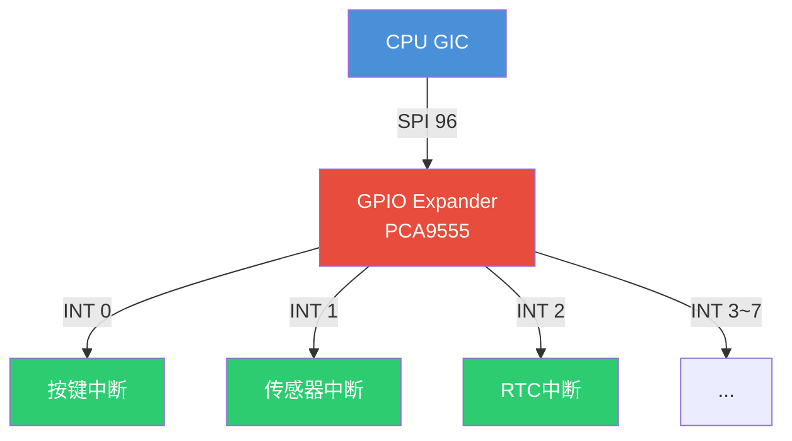
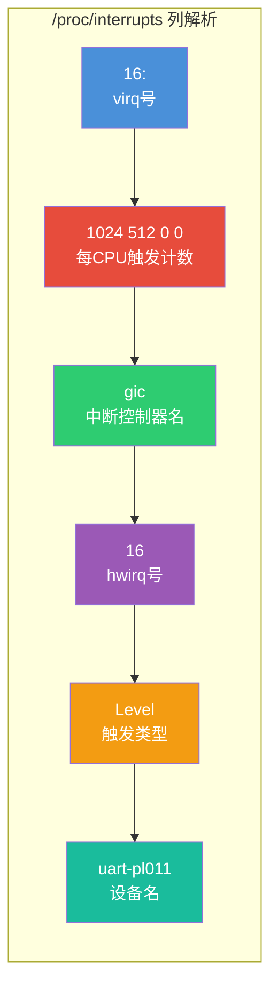

# 10.1.5 irq_domain详解与级联中断

> 所属章节：第10章 中断与时间 > 10.1 中断控制器与硬件中断
>
> 难度：[E] [I] | 预计阅读时间：25分钟

## <span class="blue">本节导读

上一节你搞懂了irqchip的注册流程，但有个核心问题还没解决：**硬件中断号（hwirq）是怎么映射到Linux内核虚拟中断号（virq）的？** 如果主控制器挂了个GPIO expander，中断信号还要层层传递，内核又怎么管理这种"中断套娃"？<br>
本节带你深入irq_domain的三种映射策略，拆解设备树中断解析的完整链路，并揭开级联中断控制器的运作内幕。学完后，你将能：

- 根据硬件特性选对irq_domain类型，不被`irq_alloc_descs()`的基数问题坑到
- 看懂级联中断的链式调用，理解GPIO expander中断是怎么逐层上报的
- 用`/proc/interrupts`定位中断风暴，通过`smp_affinity`把中断绑到指定CPU

---

## <span class="blue">irq_domain的三种映射与级联中断 [E]

### 从"中断号翻译官"说起

想象一下联合国开会——每个国家有自己的内部编号系统，但要交流就得有个统一的"代表编号"。irq_domain就是这个**翻译官**：它把硬件侧的hwirq（本地中断号）映射到内核侧的virq（全局虚拟中断号）。

Linux内核为不同硬件场景准备了三种翻译策略。选错了？轻则浪费内存，重则中断注册失败。

### 三种domain类型对比

| 类型 | 数据结构 | 查找复杂度 | 适用场景 | 内存开销 |
|------|---------|-----------|---------|---------|
| linear | 数组 `irq_xxx[]` | O(1) | hwirq连续且范围小（如32路GPIO） | 与最大hwirq成正比 |
| tree | radix tree | O(logN) | hwirq稀疏且范围大（如PCI MSI） | 仅分配已使用的节点 |
| legacy | 固定偏移 `virq = hwirq + offset` | O(1) | 无设备树的旧平台（已逐渐淘汰） | 无额外开销 |

**linear domain**是最直白的——内核维护一个数组，下标就是hwirq，存的是对应的irq_data指针。查找一次数组访问搞定，快得很。代价呢？如果你的hwirq最大是1023，哪怕只用其中3个，数组也得开1024个槽位。说白了，适合"连续密集"的场景。

**tree domain**用radix tree（基树）来存映射关系。hwirq可以不连续，比如PCI设备的MSI中断号动不动就稀疏地散在几万号区间。radix tree只在有实际映射的路径上分配节点，省内存。查找需要沿着树往下走，复杂度O(logN)，但实际中树高很浅，基本可以忽略。

**legacy domain**最简单粗暴：`virq = hwirq + first_irq`。这是早期没有设备树时代的产物，现在新项目基本不用了。你看到代码里有`irq_domain_add_legacy()`，大概率是在兼容旧驱动。

> 💡 **提示**：linear domain的数组大小由创建时传入的`hwirq_max`决定。如果你的GPIO控制器有128路但只用到前8路，可以把`hwirq_max`设小一点，省点内存。

### 设备树中断解析链路

你在设备树里写的`interrupts = <0 23 4>;`是怎么变成内核里的virq的？这条链路很长，但搞懂了排查中断问题就轻松多了。

```c
// 设备树片段
&i2c1 {
    pcf8574: gpio@38 {
        compatible = "nxp,pcf8574";
        reg = <0x38>;
        interrupt-parent = <&gpio0>;    // 上级是gpio0
        interrupts = <23 IRQ_TYPE_EDGE_FALLING>;  // 硬件中断号23
        gpio-controller;
        #gpio-cells = <2>;
        interrupt-controller;
        #interrupt-cells = <2>;
    };
};
```

解析流程是这样的——**注意这不是你手动调用的，而是内核自动完成的**：

```
设备树节点probe
    ↓
irq_of_parse_and_map(dev_node, index)     // 从设备树解析第index个中断
    ↓
irq_find_matching_fwspec()              // 找到对应的irq_domain
    ↓
domain->ops->translate() 或 .map()       // hwirq → virq 翻译
    ↓
irq_create_mapping(domain, hwirq)       // 创建/查找映射
    ↓
irq_domain_associate(domain, virq, hwirq)  // 把virq和hwirq绑定到irq_data
    ↓
返回 virq，驱动用 request_irq(virq, ...) 注册handler
```

`irq_create_mapping()`是核心函数（位于`kernel/irq/irqdomain.c`）。它会先检查这个(hwirq, domain)对是否已经有映射了——有就直接返回老的virq，没有才分配新的。这保证了一个hwirq只对应一个virq，避免重复注册。

### 级联中断：中断控制器的"外包"

现实硬件里，中断控制器也常常搞"外包"。主GIC管着100多个SPI中断，其中一个SPI接到了GPIO expander（如PCF8574、PCA9555）上。这个GPIO expander自己又是中断控制器，管着8路GPIO中断。这就是**级联中断**——二级控制器的中断信号要借一级控制器的"通道"往上报。



级联链在内核里怎么搭建？关键函数是`gpiochip_set_chained_irqchip()`：

```c
// drivers/gpio/gpio-pca953x.c 节选 + 注释
static int pca953x_probe(struct i2c_client *client,
                         const struct i2c_device_id *id)
{
    struct pca953x_chip *chip;
    struct gpio_irq_chip *girq;
    int ret;

    chip = devm_kzalloc(&client->dev, sizeof(*chip), GFP_KERNEL);
    // ... 初始化chip ...

    // 申请irq_domain，用于管理8路GPIO中断的hwirq→virq映射
    ret = gpiochip_irqchip_add_nested(&chip->gpio_chip,
                                       &pca953x_irq_chip,
                                       0,           // first_hwirq
                                       handle_level_irq);

    // 把GPIO expander的中断"挂"到父中断控制器上
    // parent_irq: GIC分配给我们的SPI中断号
    // irqchip: 父级中断控制器的irqchip
    gpiochip_set_chained_irqchip(&chip->gpio_chip,
                                  &pca953x_irq_chip,
                                  chip->parent_irq,   // 来自设备树的parent中断
                                  pca953x_irq_handler);
    return 0;
}
```

级联的精髓在handler里。当PCA9555的某路GPIO触发中断时，它的INT引脚会拉低，这个信号连到了GIC的SPI 96上。CPU响应SPI 96，进入`pca953x_irq_handler()`。这个handler要做什么呢？

```c
// 级联handler示例
static irqreturn_t pca953x_irq_handler(int irq, void *data)
{
    struct pca953x_chip *chip = data;
    unsigned long pending;
    int i;

    // 1. 读芯片寄存器，确定是哪几路GPIO触发了中断
    pending = pca953x_read_pending(chip);

    // 2. 遍历每个pending的bit，调用对应的virq handler
    for_each_set_bit(i, &pending, chip->gpio_chip.ngpio) {
        // generic_handle_irq() 会根据virq找到对应的irq_desc并执行action
        generic_handle_irq(
            irq_find_mapping(chip->gpio_chip.irq.domain, i));
    }

    // 3. 返回HANDLED，告诉上层这个中断已处理
    return IRQ_HANDLED;
}
```

这里有两个容易混淆的函数：`generic_handle_irq()`和`handle_nested_irq()`。前者在硬中断上下文执行，会关本地中断；后者专门给 threaded IRQ 的级联场景用，会在进程上下文处理。如果你给级联irq设置了`IRQF_ONESHOT`，就得用`handle_nested_irq()`。

> ⚠️ **陷阱**：级联场景下，`irq_alloc_descs()`申请的virq基数（base）不能和父控制器的virq范围重叠。比如父控制器用了virq 16~150，你申请子控制器的irq_desc时如果base=0、cnt=8，可能会和已有的系统中断冲突。正确的做法是传base=`-1`让内核自动分配。

---

## <span class="blue">/proc/interrupts解读与中断亲和性 [I]

### 中断的"体检报告"

`/proc/interrupts`是排查中断问题的第一现场。它长这样：

```
$ cat /proc/interrupts
           CPU0       CPU1       CPU2       CPU3
 16:       1024        512          0          0  gic  16  Level  uart-pl011
 23:       2048       2048       2048       2048  gic  23  Level  arch_timer
 42:          0          0      56000          0  gic  42  Level  eth0
160:        128          0          0          0  pca9555  0  Level  gpio-keys
```

每列什么意思？看这张图就懂了：



重点看这几列：

| 列 | 含义 | 排查技巧 |
|----|------|---------|
| virq号 | 内核全局中断号 | 和`/sys/kernel/debug/irq/irqs`交叉验证 |
| CPUx计数 | 该中断在各CPU的触发次数 | 某CPU计数暴增→可能中断风暴 |
| 控制器名 | 处理该中断的irqchip | `gic`=一级, `pca9555`=二级 |
| hwirq | 硬件中断号 | 和芯片手册的中断向量表对照 |
| 触发类型 | Level/Edge/Rising/Falling | 和设备树`interrupts`属性中的flag一致 |
| 设备名 | 注册中断的驱动 | 找不到对应设备→可能是孤儿中断 |

### 把中断绑到指定CPU

多核平台上，默认中断由哪个CPU处理？答案是：GIC的distributor决定，通常是第一个响应的CPU。但网络中断要是都在CPU0上处理，那CPU0就炸了。

`smp_affinity`让你手动指定中断的CPU亲和性：

```bash
# 查看中断42当前的亲和性掩码
cat /proc/irq/42/smp_affinity
# 输出: f  (二进制1111，表示4个CPU都能处理)

# 把中断42绑定到CPU1（掩码0x2 = 0010）
echo 2 > /proc/irq/42/smp_affinity

# 绑定到CPU0和CPU2（掩码0x5 = 0101）
echo 5 > /proc/irq/42/smp_affinity

# 恢复自动分配
echo 0 > /proc/irq/42/smp_affinity
```

> 💡 **提示**：`echo 0 > /proc/irq/<n>/smp_affinity`不是"不分配"，而是让内核的irqbalance自动选择最优CPU。如果你手动绑了核想恢复，就用这条命令。

编程方式设置亲和性：

```c
// 在驱动中设置中断亲和性（内核代码）
#include <linux/interrupt.h>
#include <linux/cpumask.h>

static void set_irq_affinity(int irq, int cpu)
{
    cpumask_t mask;

    cpumask_clear(&mask);
    cpumask_set_cpu(cpu, &mask);
    irq_set_affinity_hint(irq, &mask);  // 给中断子系统提建议
    irq_set_affinity(irq, &mask);        // 强制设置
}
```

### 中断风暴检测

中断风暴（IRQ Storm）是指某个中断在短时间内疯狂触发，把CPU吃满。典型原因：

- 电平触发的中断，handler没清中断源，导致反复进入
- 硬件故障，中断线一直拉高
- 级联控制器里，子handler返回了错误的状态码

检测方法简单粗暴——看计数：

```bash
# 每秒采样一次/proc/interrupts，看哪个中断在暴涨
watch -n 1 'cat /proc/interrupts | sort -rnk2 | head'
```

如果某个中断的计数每秒增加几千甚至上万，恭喜你，找到风暴源了。下一步用`echo 0 > /proc/irq/<n>/smp_affinity`把它绑到一个不重要的CPU上，然后抓`ftrace`看调用栈。

---

## <span class="blue">实战带练：中断亲和性配置实验

### 实验目标
把网卡中断从默认CPU绑定到CPU2，观察吞吐量变化。

**步骤1：找到网卡中断号**
```bash
grep eth0 /proc/interrupts
# 输出类似： 42:   1234    0    0    0  gic  42  Level  eth0
# 中断号是 42
```

**步骤2：查看默认亲和性**
```bash
cat /proc/irq/42/smp_affinity
# f  (4核全开)
```

**步骤3：绑到CPU2**
```bash
# CPU编号从0开始，CPU2对应第3位
echo 4 > /proc/irq/42/smp_affinity
cat /proc/irq/42/smp_affinity
# 应该显示 4
```

**步骤4：用iperf3测吞吐量**
```bash
# 终端1：服务端
iperf3 -s

# 终端2：客户端，压测10秒
iperf3 -c <server_ip> -t 10
```

**步骤5：对比多核分布**
```bash
# 终端3：观察中断分布
watch -n 1 'grep eth0 /proc/interrupts'
```

你应该看到网卡中断计数只在CPU2那一列增加。如果压测时CPU2被打满而其他CPU空闲，说明单核成了瓶颈——试试把中断拆到多个CPU（如`echo 5`绑CPU0+CPU2）。

**扩展实验**：把`smp_affinity`改成0恢复自动分配，观察内核irqbalance的行为差异。

---

## <span class="blue">本节总结

| 主题 | 核心要点 |
|------|---------|
| irq_domain类型 | linear适合连续hwirq（数组O(1)）；tree适合稀疏号段（radix tree）；legacy已淘汰 |
| 中断解析链路 | 设备树`interrupts` → `irq_of_parse_and_map()` → `irq_create_mapping()` → 返回virq |
| 级联中断架构 | 二级控制器借一级通道上报，用`gpiochip_set_chained_irqchip()`搭建链路 |
| 级联handler | 读pending寄存器 → `generic_handle_irq()`分发 → 返回IRQ_HANDLED |
| /proc/interrupts | 每CPU计数暴露中断分布；控制器名区分级联层级；计数突增=风暴信号 |
| smp_affinity | `echo mask > /proc/irq/<n>/smp_affinity`手动绑定；echo 0恢复自动分配 |
| 中断风暴排查 | `watch`采样计数定位；绑到空闲CPU隔离；ftrace跟调用栈找根因 |

---

## <span class="blue">下一步

irq_domain让你理解了中断号的映射与管理，但还有一个关键问题：**中断handler本身应该怎么写？** 直接在中断上下文里做所有事情，还是用上半部+下半部的分工模式？10.2.1 顶半部的约束与设计哲学，我们来聊聊为什么中断里不能sleep、不能调度，以及顶半部的设计哲学。

---

## <span class="blue">配套资源

| 资源类型 | 路径/命令 | 说明 |
|---------|----------|------|
| 内核源码 | `kernel/irq/irqdomain.c` | irq_domain核心实现 |
| 内核源码 | `include/linux/irqdomain.h` | irq_domain API头文件 |
| 内核源码 | `drivers/gpio/gpio-pca953x.c` | 级联GPIO expander驱动实例 |
| 内核文档 | `Documentation/core-api/irq/irq-domain.rst` | 官方irq_domain文档 |
| 调试命令 | `cat /proc/interrupts` | 中断计数与亲和性查看 |
| 调试命令 | `cat /proc/irq/<n>/smp_affinity` | 单中断亲和性掩码 |
| 调试命令 | `watch -n1 'grep <dev> /proc/interrupts'` | 中断风暴实时监控 |
| 工具 | `irqbalance`（用户态） | 多核中断自动均衡 |
