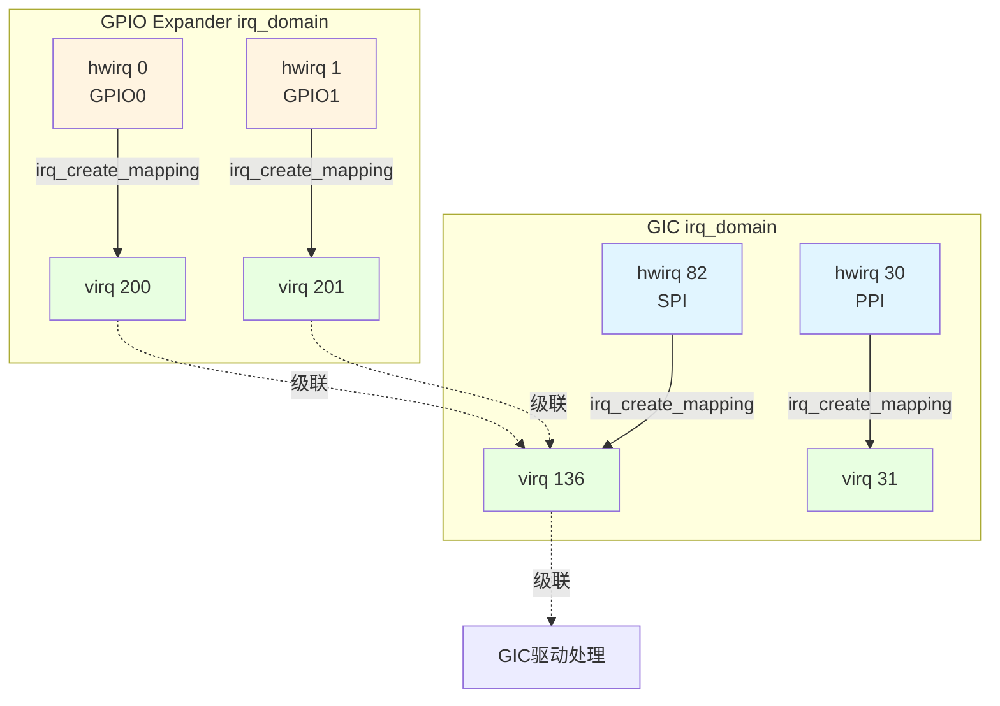

早年间做单中断控制器的SoC，硬件中断号直接拿来当Linux的IRQ号用，简单粗暴——hwirq 0就是IRQ 0，hwirq 1就是IRQ 1。但后来芯片越来越复杂，一个系统里挂两三个甚至更多的中断控制器成了常态。问题来了：两个控制器各自都有hwirq 0，Linux内核怎么区分？这就是irq_domain机制要解决的命名空间冲突问题。

**知识点72 [I][M]**

irq_domain的核心思想很朴素：给每个中断控制器分配一个独立的域（domain），硬件中断号只在域内有效，映射到Linux这边再转换成全局唯一的虚拟IRQ号（virq）。你完全可以把irq_domain理解成一个"翻译官"——设备驱动请求的是virq，中断控制器操作的是hwirq，irq_domain在中间维护这张转换表。

设备树里的`interrupts`属性是这个映射的起点。它的格式是`<type, hwirq, flags>`三元组：

| 字段 | 含义 | 示例 |
|------|------|------|
| type | 中断类型（如SPI、PPI，ARM GIC特有） | 0=SPI，1=PPI |
| hwirq | 该中断控制器本地的硬件中断号 | 如82表示GIC上的hwirq 82 |
| flags | 触发方式标志位 | 1=上升沿，2=下降沿，4=高电平，8=低电平 |

这里容易踩的一个坑是：hwirq前面那个"type"字段不是所有中断控制器都有。GIC有SPI/PPI之分所以需要，但普通的外设中断控制器（比如一个I2C挂的GPIO expander）可能压根没有type字段，设备树里只写`<hwirq flags>`两个cell。如果你在dts里把`#interrupt-cells`写错了，内核解析的时候就会错位，映射出来的virq完全是乱的，调试起来一头雾水。

级联中断控制器的场景更能体现irq_domain的价值。想象一个GPIO expander（比如PCA9535）通过I2C接到主SoC上，它的16个GPIO各自都能产生中断，但这些中断并不是直连CPU的——它们要先汇总成一根中断线，接到主GIC的某个hwirq上。这时候GPIO expander自己就是一个二级中断控制器，有自己的irq_domain。当某个GPIO引脚触发中断时，硬件层面走的是"GPIO expander → GIC hwirq → CPU"这条路，软件层面则是"GPIO expander的hwirq → 它的irq_domain → 分配virq → 挂到GIC那个hwirq的中断处理链下"。这种层级结构，irq_domain把它们梳理得清清楚楚。

下面这张图展示了完整的映射关系：



从图里能直观看到，两个irq_domain各自独立管理自己的hwirq→virq映射，互不干扰。GPIO expander的virq最终挂载到GIC的virq 136下面，形成级联。

> **陷阱**：调试级联中断时，如果`cat /proc/interrupts`能看到父级中断的计数在涨，但子中断的handler始终不被调用，十有八九是级联handler里没正确调用`irq_find_mapping()`或`generic_handle_irq()`。我见过有人在这卡了整整两天。

**知识点73 [I]**

irq_domain的建立有一套标准流程。中断控制器驱动在初始化时调用`irq_domain_add_linear()`（或`irq_domain_add_tree()`，取决于你期望的查找方式），把自己注册到内核里：

```c
/* 以GIC v2为例，注册irq_domain */
domain = irq_domain_add_linear(node, gic_data.irq_nr,
                               &gic_irq_domain_ops, &gic_data);
```

这里`irq_nr`是这个控制器能支持的最大中断数，`gic_irq_domain_ops`里填的是核心回调：`.map`、`.unmap`、`.xlate`。`.xlate`负责解析设备树里的`interrupts`属性，把hwirq和flags提取出来；`.map`则负责真正建立映射。

设备驱动申请中断时，通常走`platform_get_irq()`→`irq_of_parse_and_map()`这条路径，内核会自动找到对应该设备的中断控制器的irq_domain，调用`irq_create_mapping()`在domain里查找或分配一个virq。如果是线性映射（linear），irq_domain内部直接用一个数组`linear_revmap[hwirq]`存对应的virq，查找复杂度O(1)。树形映射（tree）则用radix树，适合hwirq编号稀疏的场景。

```c
/* 建立映射的核心调用链 */
virq = irq_create_mapping(domain, hwirq);
    -> irq_domain_alloc_descs()   /* 从全局irq_desc池分配 */
    -> irq_domain_associate()     /* hwirq和virq绑定 */
        -> domain->ops->map()     /* 调用控制器的map回调 */
```

映射一旦建立，`hwirq → virq`的关系就固化在那个irq_domain的数据结构里了。后续同一个hwirq再来，直接查表返回已有的virq，不会重复分配。你卸载驱动然后重新加载，如果映射没清理干净，就可能拿到不同的virq号——这在某些硬编码irq号的遗留代码里会出奇怪的问题。

> **经验**：写中断控制器驱动时，`.map`回调里一定要记得设置正确的`irq_chip`和触发类型。很多人忘了调用`irq_domain_set_info()`，结果中断注册成功了，但默认触发方式不对，边沿中断当成了电平处理，导致中断挂死或者重复触发。
