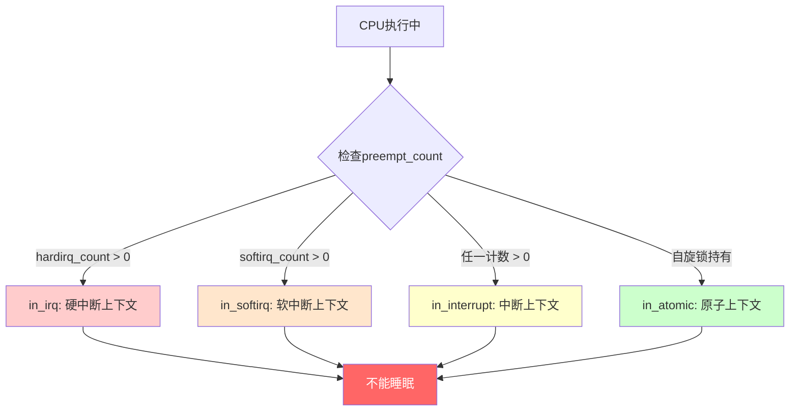

# 10.2.1 顶半部的约束与设计哲学

> 所属章节：第10章 中断与时间 > 10.2 顶半部：硬中断处理
>
> 难度：[I][M] | 预计阅读时间：15分钟

## <span class="blue"> 本节导读

你有没有想过，为什么中断处理程序里不能随便调用`sleep()`？<br>
为什么内核文档一遍又一遍地强调"中断处理要越快越好"？<br>
这背后不是凭空制定的规矩，而是硬件架构和内核设计的必然结果。

本节带你深入顶半部运行的环境——中断上下文——理解它的三个铁律：**不能睡眠、栈极小、必须速战速决**。你会看到`request_irq()`背后的设计意图，搞懂中断上下文和进程上下文的本质区别，学会用`in_interrupt()`等宏来判断当前运行环境。学完后，你将能写出既正确又高效的中断处理函数，并深刻理解为什么"只做不得不做的事"是中断处理的黄金法则。

---

## <span class="blue"> 三个铁律：顶半部为何"戴着镣铐跳舞" [I]

想象一下急诊室的值班医生。凌晨三点，警报响起，一个病人被推进来。医生必须立刻处理——不能打电话叫人代班（不能调度），不能去库房慢慢找药（不能分配大块内存），不能花时间写论文（不能做复杂计算）。简单处理后，赶紧把病人转到住院部（底半部），然后回去等下一个警报。

顶半部就是那个值班医生。它的运行环境被三个硬约束锁死：

### 铁律一：不能睡眠

中断处理函数运行在**中断上下文**（interrupt context），不是进程上下文。说白了，这里没有对应的`task_struct`。

进程上下文里，当调用`sleep()`或`schedule()`时，内核会把当前进程的`task_struct`从运行队列摘下，保存寄存器状态，然后切换出去。但中断上下文的入口不是通过调度器触发的——它是硬件异步闯入的。CPU收到中断向量号，查IDT表，一跳就进来了。没有任何"进程"被登记为这个执行的"所有者"。

如果你在顶半部调用`schedule()`，内核会尝试保存当前进程的上下文——但这里根本没有当前进程！结果？<br>
> 🔴 **危险**：在中断上下文中调用`schedule()`会导致**内核崩溃**或不可预测的行为。内核的`BUG_ON(in_interrupt())`会捕获这种情况，但在某些配置下可能直接死机。

同样的逻辑适用于所有可能睡眠的操作：加互斥锁（`mutex_lock`）、等待完成量（`wait_for_completion`）、分配大块内存（`kmalloc(GFP_KERNEL)`）……它们最终都会走到调度路径上。

```c
/* 内核源码：kernel/sched/core.c */
/* schedule() 会检查当前是否在中断上下文 */
static inline void schedule_debug(struct task_struct *prev, bool preempt)
{
    /* 如果在硬中断或软中断中调用schedule，触发警告 */
    WARN_ONCE(in_atomic_preempt_off(),
              "schedule() called from atomic context!\n");
}
```

那么需要分配内存怎么办？用`GFP_ATOMIC`标志。它告诉内存分配器：如果内存不足，**不要尝试回收或交换**，直接失败返回`NULL`。这避免了进入可能睡眠的回收路径。

> ⚠️ **陷阱**：在顶半部调用`kmalloc(size, GFP_KERNEL)`。`GFP_KERNEL`允许分配器在内存不足时进入回收流程（可能睡眠）。正确的做法是`kmalloc(size, GFP_ATOMIC)`。如果返回`NULL`，你需要有降级策略——比如丢弃这个中断的数据包，或者用预分配的内存池。

### 铁律二：栈空间极小

进程有自己的内核栈（通常是8KB或16KB），但中断处理程序共享这个栈——而且不是任意进程的栈，而是**当前被中断的那个进程的内核栈**。

在x86-64上，每个CPU有两个固定的中断栈（per-cpu stack）：一个用于硬件中断，一个用于异常。大小是多少？通常只有**1~2个page**（4KB或8KB）。ARM64上类似，`irq_stack`的大小也是`THREAD_SIZE`或更小（通常是8KB）。

```c
/* arch/x86/include/asm/processor.h */
/* 早期x86的中断栈只有4KB */
#define IRQ_STACK_SIZE          THREAD_SIZE
```

这意味着什么？你的中断处理函数里不能嵌套太深，不能定义大数组，不能随意传大结构体值。栈溢出会直接踩到别的数据，debug起来极为痛苦。

### 铁律三：尽快完成

顶半部执行期间，**本地CPU的中断通常是关闭的**（除非显式开启了`IRQF_NO_THREAD`等标志配合中断线程化）。也就是说，这个CPU在这段时间内收不到任何中断——包括定时器中断、网卡中断、磁盘中断。

如果一个顶半部跑了10毫秒，而这期间网卡涌入了100个数据包？这些中断被挂起，网卡Ring Buffer可能溢出，丢包。这就是为什么Linux社区对中断延迟极度敏感。

### "注册-执行"模型：request_irq

理解了约束，看看怎么注册一个遵守规矩的处理函数：

```c
/* 注册中断处理函数的完整示例 */
#include <linux/interrupt.h>
#include <linux/gpio.h>

static irqreturn_t my_interrupt_handler(int irq, void *dev_id)
{
    struct my_device *dev = dev_id;
    
    /* 读取硬件状态，确认是否是自己的中断 */
    u32 status = readl(dev->reg_base + REG_STATUS);
    if (!(status & MY_IRQ_FLAG))
        return IRQ_NONE;          /* 不是我，别冤枉好人 */
    
    /* 清除中断标志——必须在顶半部做！ */
    writel(status | IRQ_CLEAR_BIT, dev->reg_base + REG_STATUS);
    
    /* 只做一件事：把数据标记为"待处理"，唤醒底半部 */
    schedule_work(&dev->bottom_half_work);
    
    return IRQ_HANDLED;
}

static int my_probe(struct platform_device *pdev)
{
    int irq = platform_get_irq(pdev, 0);
    struct my_device *dev = devm_kzalloc(&pdev->dev, sizeof(*dev), GFP_KERNEL);
    
    /* 注册中断：irq号、处理函数、标志、名字、传给handler的dev_id */
    ret = request_irq(irq, my_interrupt_handler,
                      IRQF_TRIGGER_RISING | IRQF_SHARED,
                      "my_driver", dev);
    if (ret) {
        dev_err(&pdev->dev, "Failed to request IRQ %d\n", irq);
        return ret;
    }
    
    dev->irq = irq;
    return 0;
}
```

`request_irq()` 五个参数的含义：

| 参数 | 类型 | 含义 |
|------|------|------|
| `irq` | `unsigned int` | 硬件中断号（Linux IRQ number） |
| `handler` | `irq_handler_t` | 顶半部处理函数指针 |
| `flags` | `unsigned long` | 中断触发方式与属性 |
| `name` | `const char *` | 驱动名称，`/proc/interrupts` 会显示 |
| `dev_id` | `void *` | 传给handler的私有数据，**共享中断时必须有唯一值** |

常用flags标志位：

| 标志 | 含义 |
|------|------|
| `IRQF_TRIGGER_RISING` | 上升沿触发 |
| `IRQF_TRIGGER_FALLING` | 下降沿触发 |
| `IRQF_TRIGGER_HIGH` | 高电平触发 |
| `IRQF_TRIGGER_LOW` | 低电平触发 |
| `IRQF_SHARED` | 多个设备共享同一中断线 |
| `IRQF_ONESHOT` | 中断线程化时，handler返回后重新使能中断 |
| `IRQF_NO_THREAD` | 禁止线程化，强制在硬中断上下文执行 |

> 💡 **提示**：共享中断（`IRQF_SHARED`）时，`dev_id`不能为`NULL`，且每个驱动必须提供唯一值。这是`free_irq()`能正确释放指定驱动的唯一依据。

### 黄金法则

把三个铁律浓缩成一句话：**顶半部只做不得不做的事**——读取硬件状态、清除中断标志、标记底半部需要工作。仅此而已。

---

## <span class="blue"> 中断上下文 vs 进程上下文：为什么不是一回事 [I]

中断上下文到底是什么？它和进程上下文的根本区别在哪里？

### 没有task_struct = 没有"身份"

进程上下文中的任何代码，背后都有一个`task_struct`撑腰。调度器认识它，内存管理器认识它，`ptrace`能追踪它。但中断上下文的"出生"完全不同——硬件中断发生时，CPU只是保存了少量寄存器，跳转到IDT表指定的入口点。没有创建`task_struct`，没有进入调度队列，没有任何进程管理结构。

用一个类比：进程上下文像是持证上岗的员工，有工牌、有档案、有休假权限。中断上下文像是临时被拉来的志愿者——干完活就走，没有档案，没有福利，也不能请假。

### in_interrupt() / in_irq() / in_softirq()：如何判断环境

内核提供了一组宏来查询当前运行的上下文：

```c
/* include/linux/preempt.h */
/* 判断是否在中断上下文（硬中断或软中断或NMI） */
#define in_interrupt()      (irq_count())

/* 判断是否仅在硬中断（顶半部）上下文 */
#define in_irq()            (hardirq_count())

/* 判断是否仅在软中断上下文 */
#define in_softirq()        (softirq_count())

/* 判断是否处于原子上下文（中断、软中断、持有自旋锁） */
#define in_atomic()         ((preempt_count() & ~PREEMPT_MASK) != 0)

/* include/linux/hardirq.h */
#define irq_count()     (preempt_count() & (HARDIRQ_MASK | SOFTIRQ_MASK \
                     | NMI_MASK))
```

这几个宏的嵌套关系可以用下面这张图理解：



关键区别：

| 特性 | 进程上下文 | 中断上下文 |
|------|-----------|-----------|
| **代表结构** | `task_struct` | 无 |
| **调度** | ✅ 可以调用`schedule()` | ❌ 调用`schedule()`会崩溃 |
| **栈空间** | 8KB~16KB（独立内核栈） | 1~2 page（共享/极小的中断栈） |
| **内存分配** | `kmalloc(GFP_KERNEL)` | `kmalloc(GFP_ATOMIC)` |
| **休眠** | ✅ `msleep()`, `mutex_lock()` | ❌ 所有睡眠操作非法 |
| **信号处理** | ✅ 可以接收信号 | ❌ 无信号机制 |
| **优先级** | 由nice/cgroup决定 | 高于任何进程，仅次于NMI |
| **CPU亲和** | 由调度器迁移 | 通常绑在接收到中断的CPU |

### 为什么共享内核栈那么危险？

假设进程A正在内核态执行系统调用，它的内核栈已经被用了5KB。这时候网卡中断来了，顶半部在这个进程的内核栈上执行。如果handler再用掉3KB——总深度8KB，而栈只有8KB——boom，`double fault`。

这就是现代内核给每个CPU分配独立中断栈的原因（x86从2.6起，ARM64从3.x起）。即便如此，中断栈的大小依然远小于进程内核栈，大函数调用仍然需要警惕。

```
/* 中断栈的演进 */
                    x86早期           现代x86/ARM64
进程内核栈          8KB              8KB或16KB
中断处理栈          无（用当前进程栈）  独立的per-cpu中断栈（4~8KB）
风险                极易栈溢出        可控，但仍受限
```

### 一个快速验证的方法

想亲手看看区别？在自己的驱动handler里加一行：

```c
static irqreturn_t demo_handler(int irq, void *dev_id)
{
    pr_info("in_irq=%d in_interrupt=%d in_softirq=%d preempt_count=0x%x\n",
            (int)in_irq(), (int)in_interrupt(), 
            (int)in_softirq(), preempt_count());
    return IRQ_HANDLED;
}
```

加载驱动后触发中断，`dmesg`会显示`in_irq=1`，`in_interrupt=1`，而`preempt_count`的高位会有硬中断计数。再对比进程上下文里的打印——全是0。

---

## <span class="blue"> 本节总结

| 要点 | 核心内容 |
|------|---------|
| **三大约束** | 不能睡眠（无`task_struct`）、栈极小（1~2 page）、必须速战速决（关中断期间） |
| **不能睡眠的根因** | 中断上下文没有`task_struct`，`schedule()`无法保存和恢复上下文 |
| **栈限制原因** | 中断处理共享极小中断栈或借用被中断进程的内核栈 |
| **`request_irq`参数** | `irq`、`handler`、`flags`（触发方式+共享标志）、`name`、`dev_id` |
| **上下文判断宏** | `in_irq()`（硬中断）、`in_softirq()`（软中断）、`in_interrupt()`（两者之一）、`in_atomic()`（含自旋锁） |
| **黄金法则** | 顶半部只做不得不做的事：读状态、清标志、调度底半部 |

---

## <span class="blue"> 下一步

你已经理解了顶半部的"牢笼"——但中断到底是怎么进入处理函数的？CPU收到中断信号后，从硬件向量表到`do_IRQ()`，再到你注册的handler，这条完整的路径上发生了什么？

**10.2.2 中断入口的完整路径** 将带你从x86的IDT表出发，沿着汇编入口`irq_entries_start`，经过`common_interrupt`，最终到达`handle_irq_event`，走完硬件到软件的最后一公里。

---

## <span class="blue"> 配套资源

| 资源 | 说明 |
|------|------|
| 📋 代码清单 | `request_irq()`完整注册示例 + 中断上下文判断宏的使用 |
| 📊 对比表格 | 中断上下文 vs 进程上下文（7维度对比） |
| 📈 图示 | `preempt_count`位域与`in_irq`/`in_softirq`/`in_interrupt`的判定关系 |
| 📁 源码路径 | `kernel/irq/manage.c` — `request_irq()`与`free_irq()` |
| 📁 源码路径 | `kernel/sched/core.c` — `schedule()`的上下文检查 |
| 📁 源码路径 | `arch/x86/entry/entry_64.S` — 中断汇编入口 |
| 📁 源码路径 | `include/linux/preempt.h` — `in_interrupt()`等宏定义 |
