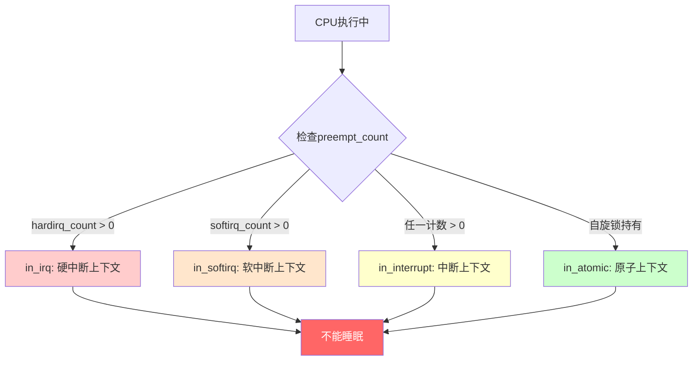

# 10.2.1 顶半部的约束与设计哲学

> 所属章节：第10章 中断与时间 > 10.2 顶半部
>
> 难度：[I→M] | 预计阅读时间：15分钟

## <span class="blue"> 本节导读

为什么中断处理程序里不能调用 `sleep()`？为什么内核文档反复强调"中断处理要越快越好"？<br>
这些不是凭空定的规矩，而是硬件架构和内核设计的必然结果。<BR>

本节覆盖：

- 顶半部运行环境（中断上下文）的三条铁律: 不能睡眠、栈受限、必须快进快出；
- `request_irq()` 的参数与标志位语义；
- 中断上下文与进程上下文的本质区别；
- `in_interrupt()` 一组宏的判断逻辑。

---

## <span class="blue"> 三个铁律：顶半部的硬约束 [I]

顶半部的运行环境被三个硬约束锁死，每一条都对应一类真实的内核崩溃案例。

### 铁律一：不能睡眠

中断处理函数运行在**中断上下文**（interrupt context），不是进程上下文。关键在于：这里没有对应的`task_struct`。

进程上下文里，当调用`sleep()`或`schedule()`时，内核会把当前进程的`task_struct`从运行队列摘下，保存寄存器状态，然后切换出去。<br>
但中断上下文的入口不是通过调度器触发的，它是硬件异步闯入的：CPU收到中断信号，查异常向量表，一跳就进来了。<br>
没有任何"进程"被登记为这个执行流的所有者。

如果你在顶半部调用`schedule()`，内核要保存"当前进程"的上下文——但这里根本没有当前进程。

> 🔴 在中断上下文中调用 `schedule()` 会导致内核崩溃或不可预测的行为。<br>
> 开启 `CONFIG_DEBUG_ATOMIC_SLEEP` 后，内核在 `schedule()` 路径上的检查（`kernel/sched/core.c:5933` 的 `schedule_debug()`）会触发 `__schedule_bug()`，打印 `BUG: scheduling while atomic` 并给出调用栈。

同样的逻辑适用于所有可能睡眠的操作：<br>
加互斥锁（`mutex_lock`）、等待完成量（`wait_for_completion`）、分配内存（`kmalloc(GFP_KERNEL)`）……它们最终都会走到调度路径上。

那么需要分配内存怎么办？用`GFP_ATOMIC`标志。<br>
它告诉内存分配器：如果内存不足，**不要尝试回收或交换**，直接失败返回`NULL`。这避免了进入可能睡眠的回收路径。

> ⚠️ 顶半部里 `kmalloc(size, GFP_KERNEL)` 是典型错误：`GFP_KERNEL` 允许分配器在内存不足时进入回收流程（可能睡眠）。<br>
> 正确做法是 `kmalloc(size, GFP_ATOMIC)`。返回 `NULL` 时要有降级策略, <BR>
> 比如丢弃这次中断的数据，或者改用预分配的内存池。

### 铁律二：栈空间受限

进程有自己的内核栈（x86-64 和 arm64 默认都是 16KB），中断处理程序可以共享这个栈——共享的是**当前被中断的那个进程的内核栈**。<BR>
被中断的系统调用已经用掉多少，中断 handler 可用空间就少了多少。

为降低风险，现代内核给每个 CPU 准备了独立的中断栈：x86-64 和 arm64 都是 per-CPU 的 irq stack，大小与 `THREAD_SIZE` 同级（arm64 默认 16KB）。<BR>
即便如此，中断 handler 里也不能嵌套太深、不能定义大数组、不能按值传大结构体。<BR>
栈溢出会直接踩到别的数据，debug 起来极为痛苦。

### 铁律三：尽快完成

顶半部执行期间，**本地 CPU 的中断是关闭的**（自 v2.6.36 起，所有架构的 IRQ handler 一律在关本地中断状态下运行；曾经用于区分"快/慢" handler 的 IRQF_DISABLED 标志在 v4.1 被彻底移除）。<BR>
也就是说，这个 CPU 在这段时间内收不到任何中断——包括定时器中断、网卡中断、磁盘中断。

> 💡 唯一的例外是 NMI（不可屏蔽中断）：它不走普通中断屏蔽路径，仍可能在顶半部运行期间闯入。<BR>
> arm64 + GICv3 开启 `ARM64_PSEUDO_NMI` 时，高优先级中断也享有类似待遇——这是 PREEMPT_RT 场景常用的手段。

如果一个顶半部跑了10毫秒，而这期间网卡涌入了100个数据包？这些中断被挂起，网卡Ring Buffer可能溢出，丢包。<BR>
这就是为什么Linux社区对中断延迟极度敏感。

### "注册-执行"模型：request_irq

理解了约束，看看怎么注册一个遵守规矩的处理函数：

```c
/* 注册中断处理函数的完整示例 */
#include <linux/interrupt.h>
#include <linux/gpio.h>

static irqreturn_t my_interrupt_handler(int irq, void *dev_id)
{
    struct my_device *dev = dev_id;

    /* 读取硬件状态，确认是否是自己的中断 */
    u32 status = readl(dev->reg_base + REG_STATUS);
    if (!(status & MY_IRQ_FLAG))
        return IRQ_NONE;          /* 不是我的中断 */

    /* 清除中断标志——必须在顶半部做！ */
    writel(status | IRQ_CLEAR_BIT, dev->reg_base + REG_STATUS);

    /* 只做一件事：把数据标记为"待处理"，唤醒底半部 */
    schedule_work(&dev->bottom_half_work);

    return IRQ_HANDLED;
}

static int my_probe(struct platform_device *pdev)
{
    int irq = platform_get_irq(pdev, 0);
    struct my_device *dev = devm_kzalloc(&pdev->dev, sizeof(*dev), GFP_KERNEL);

    /* 注册中断：irq号、处理函数、标志、名字、传给handler的dev_id */
    ret = request_irq(irq, my_interrupt_handler,
                      IRQF_TRIGGER_RISING | IRQF_SHARED,
                      "my_driver", dev);
    if (ret) {
        dev_err(&pdev->dev, "Failed to request IRQ %d\n", irq);
        return ret;
    }

    dev->irq = irq;
    return 0;
}
```

`request_irq()` 五个参数的含义：

| 参数 | 类型 | 含义 |
|------|------|------|
| `irq` | `unsigned int` | 硬件中断号（Linux IRQ number） |
| `handler` | `irq_handler_t` | 顶半部处理函数指针 |
| `flags` | `unsigned long` | 中断触发方式与属性 |
| `name` | `const char *` | 驱动名称，`/proc/interrupts` 会显示 |
| `dev_id` | `void *` | 传给handler的私有数据，**共享中断时必须有唯一值** |

常用flags标志位：

| 标志 | 含义 |
|------|------|
| `IRQF_TRIGGER_RISING` | 上升沿触发 |
| `IRQF_TRIGGER_FALLING` | 下降沿触发 |
| `IRQF_TRIGGER_HIGH` | 高电平触发 |
| `IRQF_TRIGGER_LOW` | 低电平触发 |
| `IRQF_SHARED` | 多个设备共享同一中断线 |
| `IRQF_ONESHOT` | 中断线程化时，handler返回后重新使能中断 |
| `IRQF_NO_THREAD` | 禁止线程化，强制在硬中断上下文执行 |

> 💡 共享中断（`IRQF_SHARED`）时，`dev_id` 不能为 `NULL`，且每个驱动必须提供唯一值。<BR>
> 这是 `free_irq()` 能正确释放指定驱动的唯一依据。

### 黄金法则

把三个铁律浓缩成一句话：**顶半部只做不得不做的事**<BR>
——读取硬件状态、清除中断标志、标记底半部需要工作。仅此而已。

---

## <span class="blue"> 中断上下文 vs 进程上下文：为什么不是一回事 [I]

中断上下文到底是什么？它和进程上下文的根本区别在哪里？

### 没有task_struct = 没有调度实体

进程上下文中的任何代码，背后都有一个`task_struct`撑腰。<BR>
调度器认识它，内存管理器认识它，`ptrace`能追踪它。

但中断上下文的"出生"完全不同——硬件中断发生时，CPU只是保存了现场寄存器（arm64 上是 `SPSR_EL1`/`ELR_EL1` 加通用寄存器入栈），跳转到向量表指定的入口点。<BR>
没有创建`task_struct`，没有进入调度队列，没有任何进程管理结构。

没有 `task_struct` 的直接后果：调度器无从保存/恢复这个执行流，`current` 宏指向的仍是**被中断的那个进程**<BR>
——所以中断上下文里操作 `current` 看到的数据属于别人，睡眠、信号、用户空间访问这些依赖"当前进程"语义的机制全部失效。

### in_interrupt() / in_irq() / in_softirq()：如何判断环境

内核提供了一组宏来查询当前运行的上下文（v6.6，`include/linux/preempt.h`）：

```c
/* include/linux/preempt.h:109 */
#define irq_count()     (nmi_count() | hardirq_count() | softirq_count())

/* :130-132 */
#define in_irq()        (hardirq_count())      /* 仅在硬中断（顶半部） */
#define in_softirq()    (softirq_count())      /* 仅在软中断上下文 */
#define in_interrupt()  (irq_count())          /* 硬中断/软中断/NMI 任一 */

/* :175 */
#define in_atomic()     (preempt_count() != 0) /* 计数非零即原子上下文 */
```

这几个宏的嵌套关系可以用下面这张图理解：



关键区别：

| 特性 | 进程上下文 | 中断上下文 |
|------|-----------|-----------|
| **代表结构** | `task_struct` | 无 |
| **调度** | ✅ 可以调用`schedule()` | ❌ 调用`schedule()`会崩溃 |
| **栈空间** | 独立内核栈（默认 16KB） | 共享进程栈或 per-CPU 中断栈 |
| **内存分配** | `kmalloc(GFP_KERNEL)` | `kmalloc(GFP_ATOMIC)` |
| **休眠** | ✅ `msleep()`, `mutex_lock()` | ❌ 所有睡眠操作非法 |
| **信号处理** | ✅ 可以接收信号 | ❌ 无信号机制 |
| **优先级** | 由nice/cgroup决定 | 高于任何进程，仅次于NMI |
| **CPU亲和** | 由调度器迁移 | 通常绑在接收到中断的CPU |

### 为什么共享内核栈那么危险？

假设进程A正在内核态执行系统调用，它的内核栈已经被用了5KB。这时候网卡中断来了，顶半部在这个进程的内核栈上执行。<BR>
如果handler再用掉3KB——总深度8KB，而栈只剩3KB可用——栈溢出，直接踩穿。

这就是现代内核给每个CPU分配独立中断栈的原因。即便如此，中断栈的大小依然受限，深层调用仍然需要警惕。

```
/* 中断栈的演进 */
                    早期               现代 x86-64 / ARM64
进程内核栈          8KB                16KB（默认）
中断处理栈          无（用当前进程栈）   独立的 per-cpu 中断栈
风险                极易栈溢出          可控，但仍受限
```

### 一个快速验证的方法

想亲手看看区别？在自己的驱动handler里加一行：

```c
static irqreturn_t demo_handler(int irq, void *dev_id)
{
    pr_info("in_irq=0x%x in_interrupt=0x%x in_softirq=0x%x preempt_count=0x%x\n",
            (unsigned int)in_irq(), (unsigned int)in_interrupt(),
            (unsigned int)in_softirq(), preempt_count());
    return IRQ_HANDLED;
}
```

加载驱动后触发中断，dmesg 会显示类似：
```bash
in_irq=0x10000 in_interrupt=0x10000 in_softirq=0x0 preempt_count=0x10000
```

> 💡 为什么是 0x10000 而不是 1？这组宏返回的不是布尔值，而是 preempt_count 的位域原值

再对比进程上下文里的打印——正常情况下全是 0（除非正持有自旋锁，preempt_count 低 8 位会非零）。

---

## <span class="blue"> 本节总结

| 要点 | 核心内容 |
|------|---------|
| **三大约束** | 不能睡眠（无`task_struct`）、栈受限（共享或 per-CPU 中断栈）、必须快进快出（全程关本地中断） |
| **不能睡眠的根因** | 中断上下文没有`task_struct`，`schedule()`无法保存和恢复上下文 |
| **栈限制原因** | 中断处理共享被中断进程的内核栈，或使用大小受限的 per-CPU 中断栈 |
| **`request_irq`参数** | `irq`、`handler`、`flags`（触发方式+共享标志）、`name`、`dev_id` |
| **上下文判断宏** | `in_irq()`（硬中断）、`in_softirq()`（软中断）、`in_interrupt()`（两者加 NMI）、`in_atomic()`（计数非零） |
| **黄金法则** | 顶半部只做不得不做的事：读状态、清标志、调度底半部 |

---

## <span class="blue"> 下一步

三个铁律已经明确——但你写的 handler 到底是怎么被跑起来的？<BR>
CPU 收到中断信号后，从 `entry.S` 的汇编入口，到 GIC 驱动读取中断号，再到你注册的 handler，这条完整路径上发生了什么？

**10.2.2 中断入口的完整路径** 沿 arm64 真实链路走一遍：<BR>
`el1h_64_irq_handler` → `handle_arch_irq` → `gic_handle_irq` → `generic_handle_domain_irq` → `handle_irq_event` → 你的 handler。

---

## <span class="blue"> 配套资源

| 资源 | 说明 |
|------|------|
| 📋 代码清单 | `request_irq()`完整注册示例 + 中断上下文判断宏的使用 |
| 📊 对比表格 | 中断上下文 vs 进程上下文（7维度对比） |
| 📈 图示 | `preempt_count`位域与`in_irq`/`in_softirq`/`in_interrupt`的判定关系 |
| 📁 源码路径 | `kernel/irq/manage.c` — `request_irq()`与`free_irq()` |
| 📁 源码路径 | `kernel/sched/core.c` — `schedule_debug()` 的原子上下文检查 |
| 📁 源码路径 | `arch/arm64/kernel/entry.S` — arm64 中断汇编入口 |
| 📁 源码路径 | `include/linux/preempt.h` — `in_interrupt()`等宏定义 |
