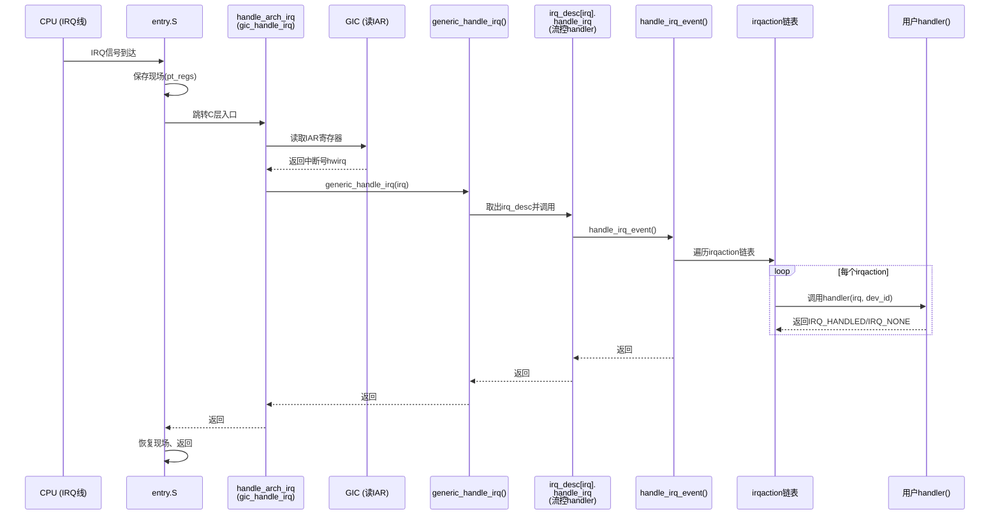

当那个电信号从引脚一路穿过GIC，最终抵达CPU的IRQ线时，真正的"大戏"才刚刚开场。很多初学者会以为中断处理就是"调个回调函数"这么简单——嗯，这么想也不算全错，毕竟最终确实是调了你的handler。但在此之前，内核要走完一条相当漫长的"接力赛道"，每一棒都不能掉链子。这一节我们就跟着中断号一起，完整地跑一趟这条链。

**知识点78 中断入口的完整路径：从电信号到handler [I][M]**

一切始于那个你不愿在凌晨三点见到的身影——entry.S。当CPU检测到IRQ异常向量时，PC指针被硬性地拽到`vector_irq`（ARMv7时代的叫法，ARM64则是`el1_irq`或`el0_irq`入口）。这时候CPU的状态还是一团糟：通用寄存器里可能存着用户态进程的宝贵数据，LR和SP也还在上一个上下文的值上。entry.S干的活，用老工程师的话说就是"抢救现场"——把所有可能被破坏的寄存器一股脑儿压到内核栈上，构建一个`struct pt_regs`。

现场保存完毕之后，entry.S调用C层的入口函数。早年间ARM32用的是`asm_do_IRQ()`，这个名字直截了当。到了ARM64时代，架构层做了个更优雅的抽象——`handle_arch_irq()`。这是个函数指针，由GIC驱动在初始化时注册，指向`gic_handle_irq()`。为什么要用函数指针而不是直接调用？因为不同中断控制器（GICv2、GICv3、甚至自定义的PLIC）的入口逻辑不一样，把决定权交给平台代码，这是分层设计的一贯思路。

`gic_handle_irq()`进来后的第一件事，是读GIC的IAR寄存器（Interrupt Acknowledge Register，GICv2是GICC_IAR，GICv3是ICC_IAR0_EL1 / ICC_IAR1_EL1）。读这个寄存器有两个效果：一方面告诉GIC"这个中断我认领了"，另一方面返回值就是咱们苦苦追寻的**中断号**（hwirq）。中断号有了，就有了后续一切的索引。

拿到中断号以后，流程进入架构无关层。`gic_handle_irq()`调用`generic_handle_irq(irq)`，这个函数看似简单，实则是一扇大门——它根据irq号从`irq_desc[irq]`数组里取出中断描述符，然后调用`irq_desc[irq].handle_irq()`。

这里很多人会有个疑惑：这个`handle_irq()`是什么？为什么不是直接调用户注册的handler？事实是，`irq_desc[irq].handle_irq`通常指向`handle_level_irq()`或`handle_edge_irq()`这类"流控handler"（flow handler）。它们负责处理中断的触发方式——电平触发和边沿触发在ACK、屏蔽、重触发等方面的处理差异很大，这部分逻辑需要由内核统一管理，不能交给各个驱动各自为政。

流控handler处理完触发类型相关的事务后，调用`handle_irq_event()`。这个函数终于开始接近我们的目标了——它遍历挂载在这条IRQ线上的`irqaction`链表。每个`irqaction`对应一个调用`request_irq()`注册上来的handler，`handle_irq_event()`逐个调用它们的`handler(irq, dev_id)`。

> 💀 **陷阱：你的handler为什么没被调到？**
>
> 很多人注册共享中断时漏了`IRQF_SHARED`标志，结果后续注册者直接失败返回`-EBUSY`。或者虽然共享了，但handler里没判断`irq == dev_id`就直接开干，结果别的设备的中断也会触发你的handler。再有一种更隐蔽的情况：你的handler返回`IRQ_NONE`太多次，内核会认为这条线是"伪中断"而暂时屏蔽它——这在调试文档不完整的老硬件时尤其容易踩坑。

整条链路的时序如下：



这里有几个值得一提的细节。GIC读IAR这一步，在中断嵌套场景下尤为重要——如果高优先级中断打断了一个正在执行的低优先级中断handler，`gic_handle_irq()`会再次从IAR读取新中断号，递归地走一遍上面的流程。Linux内核的中断栈设计保证了这种嵌套不会爆栈（默认独立中断栈，深度有限制）。

另一个值得品味的点是`irqaction`链表的设计。早期内核一个irq只能挂一个handler，后来共享中断的需求越来越强烈（PCI总线就是典型代表，多个设备共享一条INT线），内核才把`irqaction`改成了链表。`handle_irq_event()`遍历它的时候，会收集每个handler的返回值——如果所有人都返回`IRQ_NONE`，意味着没人认领这个中断，内核会记录下来并在dmesg里吐一句"irq XX: nobody cared"。见过这个打印的同学应该不少吧？

**知识点79 request_irq与free_irq的正确姿势 [I]**

说了这么多入口链路，那你作为驱动开发者，该怎么把自己的handler挂上去呢？最核心的两个接口就是`request_irq()`和`free_irq()`。

```c
/* 注册中断 */
int request_irq(unsigned int irq,
                irq_handler_t handler,
                unsigned long flags,
                const char *name,
                void *dev_id);

/* 释放中断 */
void free_irq(unsigned int irq, void *dev_id);
```

`request_irq()`的参数看着多，实际上逻辑很清晰。irq号可以从平台资源（`platform_get_irq()`）或者设备树解析得到。handler就是你写的中断服务函数。name会在`/proc/interrupts`里显示出来，方便定位。最关键的、也是出问题最多的，是`flags`和`dev_id`。

`flags`的常用取值用或运算组合：

| 标志 | 含义 | 典型使用场景 |
|------|------|-------------|
| `IRQF_SHARED` | 允许与其他驱动共享此IRQ | PCI设备、多个设备共用中断线 |
| `IRQF_TRIGGER_RISING` / `FALLING` / `HIGH` / `LOW` | 指定触发方式 | GPIO中断 |
| `IRQF_ONESHOT` | 硬件中断在handler执行期间保持屏蔽 |  threaded irq场景 |
| `IRQF_NO_SUSPEND` | 系统挂起期间不关闭此中断 | 唤醒源设备 |

`dev_id`在共享中断场景下是** mandatory 的**——它作为handler的第二个参数传入，同时也是`free_irq()`匹配要卸载哪个irqaction的唯一依据。如果共享中断时传NULL，内核会拒绝注册（返回`-EINVAL`）。我见过有人图省事传个固定字符串，结果`free_irq()`时找不到匹配项，irq卸载不掉，rmmod的时候直接oops。

```c
/* 正确使用示例 */
static irqreturn_t my_handler(int irq, void *dev_id)
{
    struct my_device *dev = dev_id;
    /* ... 处理中断 ... */
    return IRQ_HANDLED;
}

static int my_probe(struct platform_device *pdev)
{
    int irq = platform_get_irq(pdev, 0);
    int ret;

    ret = request_irq(irq, my_handler,
                      IRQF_SHARED | IRQF_TRIGGER_RISING,
                      "my_driver", pdev);
    if (ret)
        return ret;
    return 0;
}

static int my_remove(struct platform_device *pdev)
{
    int irq = platform_get_irq(pdev, 0);
    free_irq(irq, pdev);   /* dev_id必须和注册时一致 */
    return 0;
}
```

说白了，`request_irq`和`free_irq`一定要成对出现，而且`dev_id`要传一个你内核地址空间里唯一且稳定的指针——通常就是你的device结构体指针。这样卸载时才能精确匹配，不会误伤邻居。共享中断的世界里，"我的"和"你的"之间，就靠这个`dev_id`划清界限。
