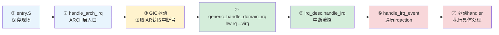

# 10.2.2 中断入口的完整路径

> 所属章节：第10章 中断与时间 > 10.2 顶半部
>
> 难度：[I→M] | 预计阅读时间：18分钟

## <span class="blue"> 本节导读

上一节明确了顶半部的三条铁律，但还差一环：你写的 handler 是怎么被跑起来的？硬件引脚电平翻转之后，CPU 到底走过哪些函数才进入你的代码？<BR>
本节覆盖：arm64 上从汇编入口到驱动 handler 的七步链路（全部按 v6.6 源码核对）、`irq_desc` 的中继作用、电平与边沿触发在流控层的差异、共享中断的 `irqaction` 链表与"认领"机制。

---

## <span class="blue"> 从entry.S到handler的七步链路 [I→M]

### 一条irq触发后的完整旅程

中断从硬件信号到驱动 handler，中间经过 7 个明确的阶段，每个阶段的代码位于内核不同层次：



### 第①站：entry.S —— 保存现场

中断信号到达 CPU 核心时，硬件自动完成几个动作：把 PSTATE 存入 `SPSR_EL1`、把返回地址存入 `ELR_EL1`、切换到 EL1 并按向量表跳到 IRQ 入口。通用寄存器（x0-x30）还在原地，由汇编代码保存：

```asm
/* arch/arm64/kernel/entry.S（简化示意） */
el1h_64_irq:
    kernel_entry 1                /* 分配栈帧，x0-x30 与 SPSR/ELR 入栈 */
    mov     x0, sp
    bl      el1h_64_irq_handler   /* 进入 C 代码，现场已安全存放在栈上 */
    ...
```

这里最关键的概念是**中断现场**。CPU在这一步把"我正在执行什么"完整封存，确保处理完中断后能无缝恢复。`S_FRAME_SIZE` 在 arm64 上是 272 字节，包含 31 个通用寄存器加几个系统寄存器。

### 第②站：handle_arch_irq —— ARCH层统一入口

C 侧的第一站在 `arch/arm64/kernel/entry-common.c:520`：

```c
/* arch/arm64/kernel/entry-common.c:520 */
asmlinkage void noinstr el1h_64_irq_handler(struct pt_regs *regs)
{
    el1_interrupt(regs, handle_arch_irq);
}
```

`handle_arch_irq` 是一个函数指针，在GIC驱动初始化时被赋值（`set_handle_irq(gic_handle_irq)`）。设计理念很清晰：不同SoC的中断控制器千差万别，但CPU核心进来后第一个调用的C函数必须是统一的，`handle_arch_irq` 就是这层抽象。

### 第③站：GIC驱动 —— 读取IAR，获取硬件中断号

以 GICv3 为例（`drivers/irqchip/irq-gic-v3.c:861`）：

```c
/* drivers/irqchip/irq-gic-v3.c:861（v6.6 真实链，有删减） */
static asmlinkage void __exception_irq_entry gic_handle_irq(struct pt_regs *regs)
{
    if (unlikely(gic_supports_nmi() && !interrupts_enabled(regs)))
        __gic_handle_irq_from_irqsoff(regs);   /* pseudo-NMI 路径 */
    else
        __gic_handle_irq_from_irqson(regs);    /* 常规路径 */
}

/* :801 常规路径 → :764 分发 */
static void __gic_handle_irq_from_irqson(struct pt_regs *regs)
{
    irqnr = gic_read_iar();        /* 读 ICC_IAR1_EL1，认领中断 */
    ...
    __gic_handle_irq(irqnr, regs);
}

static void __gic_handle_irq(u32 irqnr, struct pt_regs *regs)
{
    if (gic_irqnr_is_special(irqnr))    /* 1020~1023：spurious，直接返回 */
        return;
    gic_complete_ack(irqnr);
    if (generic_handle_domain_irq(gic_data.domain, irqnr))  /* → 第④站 */
        WARN_ONCE(true, "Unexpected interrupt (irqnr %u)\n", irqnr);
}
```

`gic_read_iar()` 读的是 GIC CPU Interface 的 `ICC_IAR1_EL1` 寄存器。这个读操作是"原子认领"——读一次，GIC就认为这个中断已被CPU接管，状态从Pending变为Active。这个设计避免了多个CPU核同时处理同一个中断。

### 第④站：generic_handle_domain_irq() —— hwirq翻译成virq

`generic_handle_domain_irq()`（`kernel/irq/irqdesc.c`）拿着 GIC 给的 hwirq，查 irq_domain 映射得到 virq，取出对应的 `irq_desc`，进入内核通用层。ARCH 和 irqchip 相关的代码到此结束，后面全是 irq core 的通用逻辑。

> 💡 `cat /proc/interrupts` 看到的计数在这条处理链上累加（`kstat_incr_irqs_this_cpu()`）。计数不涨，说明中断卡在硬件层或 GIC 配置，根本没进入这条链——先用 10.1.5 的方法核对设备树和 `/proc/interrupts`。

### 第⑤站：irq_desc.handle_irq —— 中断流控层

每个 `irq_desc` 都有一个 `handle_irq` 成员，它不是驱动注册的handler，而是**流控处理函数**（flow handler）。不同类型的中断用不同的流控：

```c
/* include/linux/irqdesc.h（字段节选） */
struct irq_desc {
    struct irq_data        irq_data;      /* irq号、芯片操作函数 */
    irq_flow_handler_t     handle_irq;    /* 流控函数: handle_level_irq / handle_edge_irq */
    struct irqaction       *action;       /* 驱动handler链表头 */
    unsigned int           status;        /* IRQ状态位 */
    /* ... */
};

/* kernel/irq/chip.c —— 电平触发: 屏蔽+应答+处理+解除屏蔽（节选） */
void handle_level_irq(struct irq_desc *desc)
{
    raw_spin_lock(&desc->lock);
    mask_ack_irq(desc);          /* 1. 屏蔽并应答，防止电平持续触发 */
    ...
    handle_irq_event(desc);      /* 2. 调用所有注册的驱动handler */
    ...
    unmask_irq(desc);            /* 3. 解除屏蔽 */
    raw_spin_unlock(&desc->lock);
}

/* 边沿触发: 应答后直接处理，靠清中断源来停止触发 */
void handle_edge_irq(struct irq_desc *desc)
{
    ...
    desc->istate &= ~(IRQS_REPLAY | IRQS_WAITING);
    if (irqd_irq_disabled(&desc->irq_data) ...) { ... }
    desc->istate |= IRQS_PENDING;    /* 处理期间再来边沿：记 PENDING */
    ...
    handle_irq_event(desc);
    ...
}
```

电平触发和边沿触发的处理差异就在这一层。电平触发必须**先 mask 再处理**，否则 handler 执行期间中断线一直有效，CPU 会反复进入中断。边沿触发没有"持续有效"的问题，但要小心处理期间再次到来的边沿——内核用 `IRQS_PENDING` 标记补一次。

### 第⑥站：handle_irq_event() —— 遍历irqaction链表

```c
/* kernel/irq/handle.c（节选） */
irqreturn_t handle_irq_event(struct irq_desc *desc)
{
    struct irqaction *action;
    irqreturn_t retval = IRQ_NONE;

    /* 遍历该irq上的所有action（共享中断会有多个） */
    for (action = desc->action; action; action = action->next) {
        irqreturn_t res;

        res = action->handler(action->irq, action->dev_id);  /* 第⑦站 */

        if (res == IRQ_HANDLED)
            retval = IRQ_HANDLED;
    }
    return retval;
}
```

### 第⑦站：驱动handler —— 你的代码在这里跑

这就是你用 `request_irq()` 或 `request_threaded_irq()` 注册的那个函数。它执行完返回 `IRQ_HANDLED` 或 `IRQ_NONE`，然后一路沿着调用栈返回，最终 entry.S 恢复现场，CPU回到被打断的地方继续执行。

| 层级 | 核心函数/结构 | 所在文件 | 职责 |
|------|--------------|---------|------|
| 汇编入口 | `el1h_64_irq` → `kernel_entry` | `arch/arm64/kernel/entry.S` | 保存寄存器现场 |
| ARCH层 | `el1h_64_irq_handler` → `handle_arch_irq` | `arch/arm64/kernel/entry-common.c` | 架构统一入口 |
| IRQChip | `gic_handle_irq()` | `drivers/irqchip/irq-gic-v3.c` | 读取IAR，认领中断 |
| IRQ Core | `generic_handle_domain_irq()` | `kernel/irq/irqdesc.c` | hwirq→virq，找 irq_desc |
| 流控层 | `handle_level_irq()` / `handle_edge_irq()` | `kernel/irq/chip.c` | 屏蔽/应答/调用handlers |
| 事件层 | `handle_irq_event()` | `kernel/irq/handle.c` | 遍历irqaction链表 |
| 驱动层 | `my_irq_handler()` | 各驱动文件 | 实际的设备处理逻辑 |

---

## <span class="blue"> 共享中断与handler的"认领"机制 [I]

### 一条中断线，多个设备

前面我们看到 `irqaction` 是个链表。为什么要链表？因为多个设备可能共享同一个中断号（尤其是IRQ资源紧张的SoC）。

```c
/* include/linux/interrupt.h（字段节选） */
struct irqaction {
    irq_handler_t       handler;     /* 顶半部handler函数 */
    void                *dev_id;     /* 设备的唯一标识，free_irq要用 */
    void                __percpu    *percpu_dev_id;
    struct irqaction    *next;       /* 链表指针，指向下一个共享irq的action */
    irq_handler_t       thread_fn;   /* 如果注册了线程化中断 */
    struct task_struct  *thread;     /* 对应的内核线程 */
    unsigned int        irq;         /* 中断号 */
    unsigned int        flags;       /* IRQF_SHARED / IRQF_TRIGGER_* */
    unsigned long       thread_flags;
    const char          *name;       /* /proc/interrupts中显示的名字 */
} ____cacheline_internodealigned_in_smp;
```

当多个驱动都传了 `IRQF_SHARED` 标志注册同一个irq时，内核会把它们的 `irqaction` 串成链表：

```c
/* 驱动A注册 */
request_irq(irq_num, handler_a, IRQF_SHARED, "dev_a", (void *)dev_a_ptr);

/* 驱动B注册 */
request_irq(irq_num, handler_b, IRQF_SHARED, "dev_b", (void *)dev_b_ptr);

/* 内核中的irqaction链表结构：
 *
 *  irq_desc[irq_num].action
 *       │
 *       ▼
 *   ┌──────────┐     ┌──────────┐
 *   │ handler_a│────▶│ handler_b│────▶ NULL
 *   │ dev_id=a │next │ dev_id=b │next
 *   └──────────┘     └──────────┘
 */
```

### handler怎么知道"是不是我的中断"

关键在返回值。每个handler都要检查自己的设备状态寄存器，确认这次中断是否由自己触发：

```c
/* 共享中断handler的标准写法 */
static irqreturn_t my_shared_handler(int irq, void *dev_id)
{
    struct my_device *dev = dev_id;

    /* 第一步：读设备的中断状态寄存器 */
    u32 status = readl(dev->regs + IRQ_STATUS_REG);

    /* 第二步：检查是否有挂起的中断位 */
    if (!(status & MY_IRQ_PENDING))
        return IRQ_NONE;          /* 不是我的中断 */

    /* 第三步：清中断标志（必须在顶半部完成！） */
    writel(status, dev->regs + IRQ_CLEAR_REG);

    /* 第四步：做该做的处理 */
    /* ... */

    return IRQ_HANDLED;           /* 是我处理的 */
}
```

| 返回值 | 含义 | 内核行为 | 共享中断场景 |
|--------|------|----------|-------------|
| `IRQ_HANDLED` | 该handler处理了此中断 | 计数+1，正常返回 | 链表中可以有多个HANDLED |
| `IRQ_NONE` | 不是我的中断 | 内核记录一次"unhandled" | 如果全部handler都返回NONE，触发警告 |

> ⚠️ 共享中断中，如果链表中所有 handler 都返回 `IRQ_NONE`，内核会判定为**虚假中断（spurious interrupt）**，打印 `irq X: nobody cared` 警告（`kernel/irq/spurious.c`），达到阈值后甚至关闭该 irq 线。这在调试时非常隐蔽——明明设备在发中断，怎么突然就收不到了？

> 💡 调用 `free_irq(irq, dev_id)` 时，`dev_id` 必须和 `request_irq()` 时传入的完全一致。内核用这个指针在irqaction链表中匹配要卸载的节点。传错了会卸载错handler，或者返回 `-EINVAL`。

### 共享线上的阻塞风险

共享中断有个隐性风险：假设设备A的handler执行时间很长，而设备B也在同一个irq上频繁触发——设备B的中断会被设备A的handler拖延处理。

```
时间线：
├─ 设备A触发 ──[handler_a执行10ms]─────────────────────────────┤
├─ 设备B触发 ──[等待]──[等待]──[等待]──[handler_b终于执行]──────┤
```

极端情况下，如果某个handler死循环或耗时过长，整个中断线会被"卡死"。解法是**中断线程化**：用 `request_threaded_irq()` 把handler放到内核线程里跑，顶半部只做快速ack，真正的处理在进程上下文执行（10.4 展开）。这样即使处理慢，也不会阻塞其他共享设备的中断响应。中断风暴的检测方法（`watch` 采样 `/proc/interrupts`）见 10.1.5。

---

## <span class="blue"> 本节总结

| 要点 | 核心结论 |
|------|----------|
| 7步链路 | entry.S → el1h_64_irq_handler → gic_handle_irq → generic_handle_domain_irq → irq_desc.handle_irq → handle_irq_event → 驱动handler |
| irq_desc的作用 | 每个virq对应一个irq_desc，是中断管理的中枢节点，包含irq_data、action链表、流控函数 |
| 流控函数差异 | 电平触发(handle_level_irq)必须先mask/ack再处理；边沿触发(handle_edge_irq)直接处理，用 IRQS_PENDING 补记期间的边沿 |
| 共享中断机制 | 多个驱动的irqaction通过next指针串成链表，中断来时逐个调用 |
| handler返回值 | IRQ_HANDLED表示"我处理了"，IRQ_NONE表示"不是我的"；全NONE会触发虚假中断警告 |
| dev_id的重要性 | request_irq/free_irq配对使用dev_id来定位链表节点，必须保持一致 |
| 共享线风险 | 一个handler耗时过长会拖住整条中断线，可用 irq 线程化解决 |

---

## <span class="blue"> 下一步

中断从硬件到驱动走了哪些函数，现在已经清楚。但顶半部执行过长会发生什么？中断到底能关多久才不出事？10.2.3 用 `irqsoff` tracer 可视化追踪中断关闭时间，看真实系统里中断延迟的主要来源。

---

## <span class="blue"> 配套资源

| 资源 | 路径/说明 |
|------|----------|
| 汇编入口代码 | `arch/arm64/kernel/entry.S`（`kernel_entry` 宏） |
| ARCH层入口 | `arch/arm64/kernel/entry-common.c`（`el1h_64_irq_handler`） |
| GIC-v3驱动 | `drivers/irqchip/irq-gic-v3.c`（`gic_handle_irq`） |
| irq_desc管理 | `kernel/irq/irqdesc.c`（`generic_handle_domain_irq`） |
| 流控处理函数 | `kernel/irq/chip.c`（`handle_level_irq`、`handle_edge_irq`） |
| 事件分发 | `kernel/irq/handle.c`（`handle_irq_event`） |
| 注册接口 | `kernel/irq/manage.c`（`request_irq`、`free_irq`） |
| 虚假中断检测 | `kernel/irq/spurious.c`（`nobody cared` 判定逻辑） |
| 本文图示 | mermaid 7步链路图 + irqaction链表图 |
| 推荐实验 | 注册一个共享中断handler，故意返回IRQ_NONE，观察 `dmesg` 中的虚假中断警告 |
