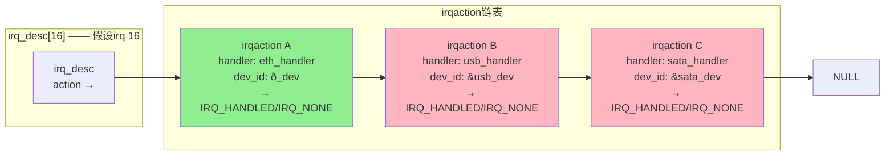

irq_desc这名字听着就直白——中断描述符。但别被它的朴素名字骗了，它是整个Linux中断子系统的"户籍档案"。每个硬件中断号在这里都有一本账，记录着这路中断从哪来、谁在用、该怎么伺候。

早年间内核用的是一个固定的数组`irq_desc[NR_IRQS]`，NR_IRQS在x86上定义成224或者更大的数。简单直接，数组下标就是IRQ号，O(1)查找。但问题来了：现在什么设备都走中断，PCI设备动不动上千个MSI中断，拿个大数组硬撑着简直是浪费。于是较新的内核改成了**radix tree**来按需分配irq_desc，你需要多少就长出来多少，内存用起来也讲究了。

**知识点80 [I][M]**

irq_desc的核心结构里有一个`struct irqaction *action`字段。注意它是个链表头——这就是共享中断的秘密所在。多个驱动都想注册同一个irq？没问题，大家的irqaction串成一个链表挂在这里。当中断发生时，内核沿着这个链表逐个调用handler，谁的手快谁先上。

```c
/* 简化后的irq_desc关键字段 */
struct irq_desc {
    struct irq_data       irq_data;
    struct irqaction     *action;    /* 共享中断的handler链表头 */
    unsigned int          status;
    const char           *name;
    /* ... */
};

struct irqaction {
    irq_handler_t         handler;   /* 你的中断处理函数 */
    void                 *dev_id;    /* 唯一标识，共享中断必须填 */
    struct irqaction     *next;      /* 链表指针 */
    struct irq_thread     *thread;   /* 线程化中断用 */
    /* ... */
};
```

共享中断的关键问题是：handler怎么知道"这次是不是我的设备发出的中断"？答案很实在——**读设备的状态寄存器**。一个成熟的共享中断handler上来第一件事就是查自家的寄存器，发现不是自己的，立刻滚蛋，返回`IRQ_NONE`。是自己的，干活，返回`IRQ_HANDLED`。内核看到IRQ_HANDLED就不再继续遍历链表了。

这个设计用mermaid画出来很清晰：



来看一眼注册共享中断的代码，`dev_id`必须是全局唯一的，通常传设备结构体指针。注销的时候也靠它找到对应的irqaction：

```c
/* 注册 —— 第三个参数irqflags带上IRQF_SHARED */
ret = request_irq(irq_num, my_handler, IRQF_SHARED, "mydev", dev);
if (ret) {
    pr_err("Failed to request shared irq %d\n", irq_num);
    return ret;
}

/* 注销 —— dev_id必须和注册时一样 */
free_irq(irq_num, dev);
```

`IRQ_HANDLED`和`IRQ_NONE`不只是返回值那么简单，它们直接影响内核的中断统计和共享链表的遍历行为。返回IRQ_NONE意味着"这次不是我的"，内核记账时会给你记一笔spurious interrupt，链表继续往下走。返回IRQ_HANDLED表示"我认领了"，遍历终止。如果一路遍历到链表末尾都没人返回IRQ_HANDLED，内核就会报一个"nobody cared"的警告——这是个很经典的排错信号，说明某个设备的中断信号在飘，但注册的handler不认它。

**知识点81 [I]**

共享中断有个让人头疼的特性：**链表上的所有handler都会被调用，直到某个返回IRQ_HANDLED为止**。这个顺序很重要——它是注册顺序，谁先request_irq谁就排在前面。

问题来了：如果一个"错误的"或者"慢的"handler排在链表头，每次中断它先被执行，查半天寄存器发现不是自己的，慢吞吞返回IRQ_NONE，然后才轮到真正的主人干活。这一来一回就是几个微秒的延迟，高频中断场景下累积起来很可观。

我见过一个案例：一个网卡驱动和一个GPIO按键共享一个irq，GPIO驱动的handler写得比较重，每次进来先读一堆寄存器，然后才发现不是自己的。网卡收包延迟 jitter 大得吓人，后面靠调整加载顺序把网卡驱动放前面才解决。

```c
/* 共享中断handler的最佳实践：先快判，后慢做 */
static irqreturn_t my_handler(int irq, void *dev_id)
{
    struct mydev *dev = dev_id;
    
    /* 第一步：极速判断是不是自己的中断 */
    if (!mydev_has_interrupt(dev))
        return IRQ_NONE;    /* 不是，立刻走人 */
    
    /* 第二步：是自己的，再慢慢处理 */
    mydev_ack_interrupt(dev);   /* 清中断标志 */
    schedule_work(&dev->work);  /* 重活丢给工作队列 */
    
    return IRQ_HANDLED;
}
```

共享中断还要求你**绝对不能在handler里假设自己就是唯一的主人**。比如直接读中断状态寄存器清掉所有bit——这会直接把别人的中断也给清了，结果就是有的设备永远收不到中断通知，调试时能把人逼疯。共享时清中断必须是fine-grained的，只清自己的bit，别人的碰都不要碰。

另外一个隐性要求是：共享中断的所有handler必须都支持共享。也就是说，request_irq的时候如果irqflags有`IRQF_SHARED`，那之前就注册在那同一个irq上的handler也得是IRQF_SHARED的。第一个注册的人没带这个标志，第二个想带也注册不上去，request_irq直接返回`-EBUSY`。
