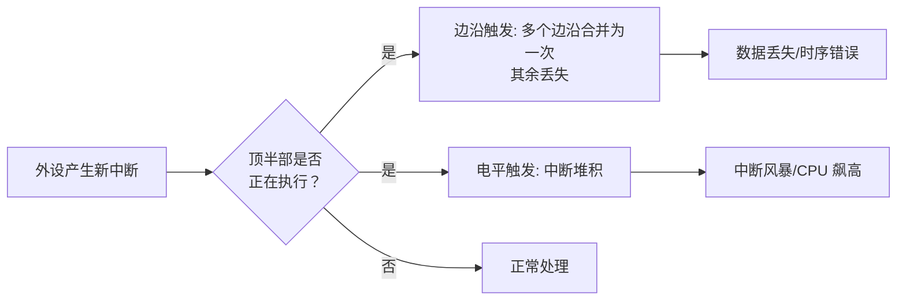

# 10.2.3 顶半部执行过长的后果与irqsoff_tracer

> 所属章节：第10章 中断与时间 > 10.2 顶半部
>
> 难度：[I→M] | 预计阅读时间：18分钟

## <span class="blue"> 本节导读

`request_irq()` 注册好之后，handler 里干的活多少直接决定系统行为。<br>
一个真实案例：某驱动在顶半部做 I2C 通信耗时 500μs，结果 GPIO 中断频繁丢失。<BR>

本节覆盖：

- 顶半部过长的三个连锁后果（中断丢失、softirq 推迟、调度失明）、
- 顶半部的"该做/不该做"清单、
- 用 ftrace irqsoff tracer 定量测量中断关闭时长的完整流程与日志解读。

---

## <span class="blue"> 三个致命后果：顶半部太胖会怎样 [I]

v6.6 起，中断 handler 一律在**本地 CPU 关中断**的状态下运行。<br>
handler 执行得越久，以下三个问题就越严重：

### 后果一：中断丢失——处理期间的边沿合并为一个

外设配置为**边沿触发**时，一个边沿到来，CPU 进入顶半部。<br>
处理期间外设又产生新边沿：内核的边沿流控（`handle_edge_irq`）只记一个 `IRQS_PENDING` 标记，handler 退出后补处理一次<br>
——也就是说，**处理期间到达的多个边沿会合并成一次**，来几个丢几个（只剩一次）。

**电平触发**稍好——电平持续有效，handler 结束解除屏蔽后会再次触发。<br>
但 handler 一直忙，外设侧的数据可能早已被覆盖；handler 退出后中断连续触发，CPU 占用飙升，形成中断风暴。



### 后果二：softirq 推迟——irq_exit 被拖住

这是最容易被忽视的一点。中断退出路径上，`irq_exit()` 会检查并执行待处理的 softirq。

顶半部拖得越久，`irq_exit()` 到得越晚，所有 softirq（定时器、网络收发、块设备）一并推迟。<br>
拖了一个 handler，卡住的是整个系统的底半部流水线：网络包收不进来、块设备 IO 延迟上升、定时器不准。

### 后果三：系统卡顿——调度器拿不到 tick

内核调度器依赖 tick 中断触发调度检查。<br>
handler 执行时间超过一个 tick 周期（HZ=1000 时 1ms），这段时间内调度器无法抢占正在运行的线程，高优先级任务在就绪队列里等着，用户感知就是"卡顿"。

实时系统里，这直接拉长最坏情况响应时间（WCRT）。

| 后果 | 触发条件 | 影响范围 | 修复方法 |
|------|---------|---------|---------|
| 中断丢失（边沿） | 顶半部执行期间同一线的新边沿到来（只补一次） | 单个外设，数据丢失 | 缩短顶半部，改用底半部 |
| 中断堆积（电平） | 顶半部执行期间电平持续有效 | 该中断线连续触发，CPU 飙高 | 缩短顶半部，检查硬件去抖 |
| softirq 推迟 | `irq_exit()` 被长时间推迟 | 全局 softirq 延迟，网络/IO/定时器 | 缩短顶半部，控制 softirq 执行时间 |
| 系统卡顿 | handler 时间 > tick 周期 | 全局调度延迟，用户感知卡顿 | 缩短顶半部，RT 场景配合线程化中断 |

### 真实案例：I2C 驱动在顶半部做 500μs 读写

某工业控制板的 GPIO 按键驱动（基于 gpio-keys 改写），开发者在顶半部里直接调用 `i2c_smbus_read_byte_data()` 读外设寄存器确认中断源。<BR>
I2C 总线 100kHz，一次寄存器读取约 500μs。

结果：GPIO 按键中断频繁丢失，按了按钮没反应。<BR>
`cat /proc/interrupts` 发现中断计数远小于实际按键次数。<BR>
更隐蔽的是，该 GPIO 配置为边沿触发，丢失的中断没有痕迹——不像电平触发还能从中断风暴看出端倪。

修复：把 I2C 通信挪到底半部（workqueue），顶半部只确认中断来源后立即返回。修复后中断丢失归零。

> 🔴 在顶半部里调用可能睡眠的函数（`i2c_transfer()`、`kmalloc(GFP_KERNEL)`）是**双重错误**：既可能睡眠导致内核 BUG（`scheduling while atomic`），又会拖长中断关闭时间。顶半部分配内存只能用 `GFP_ATOMIC`。

### 黄金法则：只做不得不做的事

核心就一句话——**顶半部只做不得不做的事，其他全部推迟到底半部**：

- ✅ 必须做的：读取中断状态寄存器、清除中断标志、记录时间戳、唤醒底半部
- ❌ 不能做的：设备通信（I2C/SPI 读写）、可能睡眠的内存分配、复杂计算、用户空间数据拷贝

> 💡 经验值：handler 执行时间超过 **100μs** 就该认真考虑拆分；高速外设（网卡、高速串口）阈值压到 **10μs** 量级。这只是工程经验，不是硬性标准——最终用 irqsoff 的实测数据说话。

---

## <span class="blue"> 用 ftrace irqsoff_tracer 定量测量 [I]

怎么验证自己的 handler 跑了多久？printk 本身就有延迟，测不准。标准工具是 ftrace 的 **irqsoff tracer**——它记录内核中"中断被关闭"的最大时间区间，以及这个区间里的完整调用链。

### irqsoff tracer 原理

irqsoff tracer 跟踪中断的关闭与打开：从关中断起到重新开中断止，算一个关闭区间；它只保留**最长**的那个区间，并捕获区间内的函数调用图。这个设计直接帮你定位最坏情况，而不是淹没在海量数据里。

> 💡 注意区间的切分：handler 中途开关一次中断，就会被切成两个独立区间分别计时。irqsoff 报告的是单一最长区间，不是全程累计。

### 实战带练：6 步定位最大中断关闭时间

```bash
# 步骤1：挂载 debugfs（通常已自动挂载）
mount -t debugfs none /sys/kernel/debug

# 步骤2：切换到 irqsoff tracer
echo irqsoff > /sys/kernel/debug/tracing/current_tracer

# 步骤3：清空之前的 trace 缓冲区
echo > /sys/kernel/debug/tracing/trace

# 步骤4：开始跟踪
echo 1 > /sys/kernel/debug/tracing/tracing_on

# 步骤5：运行你的测试（比如触发中断密集的操作）
# ... 在这里跑你的测试程序 ...

# 步骤6：停止跟踪并查看结果
echo 0 > /sys/kernel/debug/tracing/tracing_on
cat /sys/kernel/debug/tracing/trace | head -100
```

### trace 日志解读示例

典型输出（节选，列有压缩）：

```
# tracer: irqsoff
#
# irqsoff latency trace v1.1.5 on 6.6.0
# --------------------------------------------------------------------
# latency: 524 us, #4/4, CPU#0 | (M:preempt VP:0, KP:0, SP:0 HP:1 #P:4)
#    | task: swapper/0-0 (uid:0 nice:0 policy:0 rt_prio:0)
# => started at: tick_irq_enter
# => ended at:   tick_irq_exit
#
# 标志列含义：d=irqs-off  .=中断开启  N=need-resched  h=hardirq  s=softirq
#
#      cmd        pid   flags   delay   function
     swapper/0    0d..    0us!: tick_irq_enter
     swapper/0    0d..  120us : gpio_keys_irq_isr
     swapper/0    0d..  350us : i2c_smbus_read_byte_data
     swapper/0    0d..  524us : tick_irq_exit
```

解读要点：

1. **`latency: 524 us`** —— 最坏情况下中断被关闭的总时长。
2. **flags 列的 `d`** —— 表示该时刻中断处于关闭状态；如果中间出现 `.`，说明中断曾被短暂打开。
3. **`gpio_keys_irq_isr` 出现在 120us 处** —— handler 从这里开始。
4. **`i2c_smbus_read_byte_data` 在 350us 处** —— 罪魁祸首，I2C 通信花了 200μs 以上。
5. **`524us` 时 `tick_irq_exit`** —— 中断退出，中断重新开启。

> ⚠️ trace 里的 latency 是**整个中断关闭区间的总时间**，不是某个函数的执行时间。`gpio_keys_irq_isr` 到 `tick_irq_exit` 之间的 400μs 不等于 handler 跑了 400μs——还可能包含嵌套中断处理、softirq 执行等。要结合调用链逐行分析。

### 其他 tracer 配合

irqsoff 只是 ftrace tracer 家族的一员。实际调试中，常常需要多把尺子一起量：

| tracer | 用途 | 典型输出 | 配合工具 |
|--------|------|---------|---------|
| `irqsoff` | 定位最大中断关闭时间 | 最大延迟 + 调用链 | 顶半部优化 |
| `preemptoff` | 定位最大抢占关闭时间 | 最大延迟 + 调用链 | RT 延迟分析 |
| `function_graph` | 看函数执行时间和调用关系 | 每个函数的耗时 | 精确测量 handler 时长 |
| `hwlat` | 检测硬件导致的延迟（如 SMI） | 硬件延迟直方图 | 判断延迟来自软件还是固件 |
| `wakeup` | 跟踪任务唤醒延迟 | 唤醒到执行的时间 | 实时性验证 |

实际工作流：**先用 `irqsoff` 抓最大延迟区间 → 切 `function_graph` 精确测量 handler 内部函数耗时 → 延迟异常大但软件层找不到原因时，用 `hwlat` 排查硬件/固件干扰**。

```bash
# function_graph 追踪单个 handler 的示例
echo function_graph > /sys/kernel/debug/tracing/current_tracer
echo gpio_keys_irq_isr > /sys/kernel/debug/tracing/set_graph_function
echo 1 > /sys/kernel/debug/tracing/tracing_on
# ... 测试 ...
echo 0 > /sys/kernel/debug/tracing/tracing_on
cat /sys/kernel/debug/tracing/trace | grep -A 20 gpio_keys_irq_isr
```

---

## <span class="blue"> 本节总结

| 要点 | 核心内容 |
|------|---------|
| 后果一 | 顶半部过长 → 边沿触发只补一次（多余边沿丢失），电平触发堆积成风暴 |
| 后果二 | `irq_exit()` 推迟 → 全局 softirq 延迟 |
| 后果三 | tick 中断无法触发 → 调度器失明，系统卡顿 |
| 黄金法则 | 顶半部只做不得不做的事，经验值 < 100μs（高速外设 < 10μs） |
| irqsoff tracer | 记录最长中断关闭区间 + 完整调用链，6 步定位 |
| 关键陷阱 | latency 是整个关闭区间，不是单个函数时间 |
| 组合拳 | irqsoff → function_graph → hwlat，层层深入 |

顶半部要快，底半部要稳——而"快"不靠感觉，用 irqsoff 的实测数据验收。

---

## <span class="blue"> 下一步

顶半部不能干什么、干久了会怎样，已经明确。那具体怎么拆分？底半部有哪些机制可选、各适合什么场景？下一节 **10.3.1 为什么需要底半部**，从设计动机讲起，再逐个拆解 softirq、tasklet、workqueue。

---

## <span class="blue"> 配套资源

| 资源类型 | 路径/说明 |
|---------|----------|
| 内核源码 | `kernel/trace/trace_irqsoff.c` —— irqsoff tracer 实现 |
| 内核源码 | `kernel/softirq.c` —— `irq_exit()` 与 softirq 执行逻辑 |
| ftrace 文档 | `Documentation/trace/ftrace.rst` |
| 调试命令 | `cat /proc/interrupts` —— 查看各中断线计数 |
| 调试命令 | `echo irqsoff > current_tracer` —— 启用 tracer |
| 实战练习 | 用 irqsoff tracer 测量自己驱动的最大中断关闭时间 |
