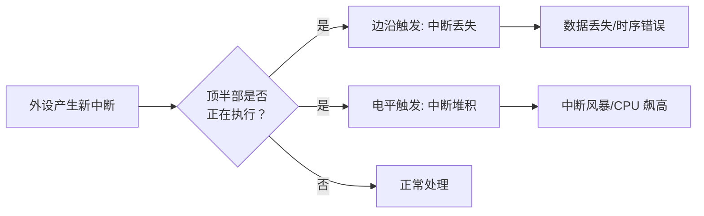

# 10.2.3 顶半部执行过长的后果与irqsoff_tracer

> 所属章节：第10章 中断与时间 > 10.2 中断处理流程
>
> 难度：[I][M] | 预计阅读时间：18分钟

## <span class="blue"> 本节导读

你已经学会了用 `request_irq()` 注册中断处理函数，但有没有想过——如果你的 `handler` 里面磨磨蹭蹭干了太多活，会发生什么？<br>
本节先讲一个真实的"惨案"：某驱动在顶半部做 I2C 通信耗时 500us，结果 GPIO 中断频繁丢失。接着你会搞清楚三个连锁后果（中断丢失、softirq 饥饿、系统卡顿），并掌握用 **ftrace irqsoff tracer** 定量测量"中断关闭时长"的实战技能。<br>
学完后，你将能够判断自己的中断 handler 是否"太胖"，并知道怎么用 ftrace 抓出罪魁祸首。

---

## <span class="blue"> 三个致命后果：顶半部太胖会怎样 [I]

把中断 handler 比作急诊室的值班医生。病人（中断事件）推门进来，医生必须立刻做两件事：第一，确认病情并打上标记（读取状态寄存器、清除中断标志）；第二，决定哪些可以当场处理，哪些必须转住院（推迟到底半部）。<br>
如果这位医生当场给病人做 fully 手术，后面推门进来的病人怎么办？——对，全堵在门口。这就是顶半部执行过长的本质问题。

内核进入中断 handler 时，本地 CPU 的硬中断是被屏蔽的（或者说，当前中断线被屏蔽，取决于架构和配置）。handler 执行得越久，以下三个问题就越严重：

### 后果一：中断丢失——同一条中断线的新中断被忽略

假设你的外设配置为**边沿触发**（Edge-triggered）。一个上升沿到来，CPU 进入顶半部。此时如果外设又产生一个新的边沿，中断控制器不会记录这个事件——因为当前中断线正在处理中，新边沿被直接丢弃。<br>
如果是**电平触发**（Level-triggered），情况稍好——电平保持高，handler 结束后会再次触发。但如果你的 handler 一直在忙，中断控制器可能堆积多个中断，导致 handler 退出后连续触发多次，形成"中断风暴"。

看看这个连锁反应：



### 后果二：softirq 饥饿——irq_exit 推迟，底半部迟迟不执行

这是最容易被忽视的一点。回忆一下中断退出路径：`irq_exit()` 中会检查并执行待处理的 softirq。如果顶半部拖得太久，`irq_exit()` 被推迟，所有 softirq（包括定时器 softirq、网络收发 softirq、块设备 softirq）都被一并推迟。<br>
说白了，你拖了一个 handler，整个系统的"底半部流水线"都被卡住了。网络包收不进来、块设备 IO 延迟飙升、定时器不准确——全是连锁反应。

### 后果三：系统卡顿——调度器拿不到 tick

内核的调度器依赖 tick 中断来触发任务切换。如果你的 handler 执行时间超过一个 tick 周期（比如 1ms），在这段时间内调度器完全"失明"，无法抢占正在运行的线程。高优先级任务饿死在就绪队列里，用户感觉到的就是"卡顿"。<br>
在实时系统里，这可能导致最坏情况响应时间（WCRT）被严重拉长，直接违反实时性约束。

| 后果 | 触发条件 | 影响范围 | 修复方法 |
|------|---------|---------|---------|
| 中断丢失（边沿） | 顶半部执行期间同一条线的新边沿到来 | 单个外设，数据丢失 | 缩短顶半部，改用底半部 |
| 中断堆积（电平） | 顶半部执行期间电平持续高 | 该中断线连续触发，CPU 飙高 | 缩短顶半部，检查硬件去抖 |
| softirq 饥饿 | `irq_exit()` 被长时间推迟 | 全局 softirq 延迟，网络/IO/定时器 | 缩短顶半部，控制 softirq 执行时间 |
| 系统卡顿 | handler 时间 > tick 周期 | 全局调度延迟，用户感知卡顿 | 缩短顶半部，或使用 NO_HZ 全 tickless |

### 真实案例：I2C 驱动在顶半部做 500us 读写

某工业控制板上的 GPIO 按键驱动（irq-gpio-keys），开发者在顶半部里直接调用 `i2c_smbus_read_byte_data()` 读取外设寄存器来确认中断源。I2C 总线频率 100kHz，一次寄存器读取约 500us。<br>
结果呢？GPIO 按键中断频繁丢失，用户按了按钮但没反应。抓 `cat /proc/interrupts` 发现中断计数远小于实际按键次数。更隐蔽的是，该 GPIO 配置为边沿触发，丢失的中断没有任何痕迹可循——不像电平触发还能从中断风暴看出端倪。<br>
修复方案？把 I2C 通信挪到底半部（workqueue），顶半部只做 `gpio_get_value()` 确认电平后立即返回。修复后中断丢失归零。

> 🔴 **危险**：在顶半部里调用可能睡眠的函数（如 `i2c_transfer()`、`kmalloc(GFP_KERNEL)`）是**双重错误**——既可能睡眠导致内核 panic，又会严重拖长中断关闭时间。顶半部只能用 `GFP_ATOMIC`。

### 黄金法则：只做不得不做的事

说了这么多，核心就一句话——**顶半部只做不得不做的事，其他全部推迟到底半部**。具体来说：

- ✅ 必须做的：读取中断状态寄存器、清除中断标志、记录时间戳、唤醒底半部
- ❌ 不能做的：设备通信（I2C/SPI 读写）、内存分配（`kmalloc(GFP_KERNEL)`）、复杂计算、用户空间数据拷贝

> 💡 **提示**：一个简单判断标准——如果你的 handler 执行时间超过 **100us**，就该认真考虑拆分了。对于高速外设（网卡、高速串口），这个阈值应该更低，比如 **10us**。

---

## <span class="blue"> 用 ftrace irqsoff_tracer 抓出"真凶" [I]

说了一堆理论，怎么验证自己的 handler 到底跑了多久？printk？别闹了，printk 本身就有延迟。我们要用的是 ftrace 的 **irqsoff tracer**——它能精确记录内核中"中断被关闭"的最大时间区间，以及这个区间里的完整调用链。

### irqsoff tracer 原理

irqsoff tracer 利用 ftrace 的 tracepoint 机制，跟踪 `local_irq_disable()` 和 `local_irq_enable()` 这对操作。它会记录从 `local_irq_disable()` 到 `local_irq_enable()` 之间的最大时间差，并捕获这段时间内的函数调用图。<br>
关键是——它记录的是**最大**的延迟区间，帮你直接定位"最坏情况"，而不是让你淹没在海量数据中。

> 💡 **提示**：irqsoff tracer 本质上记录的是 `preempt_count` 中硬中断位从非零回到零的最大时间区间。也就是说，它统计的是"中断被关闭的累计时长"，而不是单个函数的执行时间。如果你的代码中反复开关中断，它会合并计算整个关闭区间。

### 实战带练：6 步定位最大中断关闭时间

下面是完整的操作流程，每一步都有注释：

```bash
# 步骤1：挂载 debugfs（通常已自动挂载）
mount -t debugfs none /sys/kernel/debug

# 步骤2：切换到 irqsoff tracer
echo irqsoff > /sys/kernel/debug/tracing/current_tracer

# 步骤3：清空之前的 trace 缓冲区
echo > /sys/kernel/debug/tracing/trace

# 步骤4：开始跟踪
echo 1 > /sys/kernel/debug/tracing/tracing_on

# 步骤5：运行你的测试（比如触发中断密集的操作）
# ... 在这里跑你的测试程序 ...

# 步骤6：停止跟踪并查看结果
echo 0 > /sys/kernel/debug/tracing/tracing_on
cat /sys/kernel/debug/tracing/trace | head -100
```

### trace 日志解读示例

典型的输出长这样：

```
# tracer: irqsoff
#
# irqsoff latency trace v1.1.5 on 6.1.0-rt
# --------------------------------------------------------------------
# latency: 524 us, #4/4, CPU#0  (M:preempt_rt VP:0, KP:0, SP:0 HP:1 #P:4)
#     -----------------
#     | task: swapper/0-0 (uid:0 nice:0 policy:0 rt_prio:0)
#     -----------------
#
#  _-----=> irqs-off          [】表示中断关闭区间
# / _----=> need-resched       N 表示需要调度
#| / _---=> hardirq/softirq    H=hardware irq  S=softirq
#|| / _--=> preempt-depth      数字=抢占深度
#||| / _-=> migrate-disable    D=migration disabled
#|||| /     delay
#|||||/       cmd        pid      CPU||||||  timestamp  function
#||||||        \          |         |  ||||||    |         |
   【】N.    0.    0.    0  swapper/0    0d...    0us!: tick_irq_enter <-tick_handle_periodic
   【】N.    0.    0.    0  swapper/0    0d...  120us : gpio_keys_irq_isr
   【】N.    0.    0.    0  swapper/0    0d...  350us : i2c_smbus_read_byte_data
   【】N.    0.    0.    0  swapper/0    0d...  524us : tick_irq_exit
```

解读要点：

1. **`latency: 524 us`** —— 这就是最坏情况下中断被关闭的总时长。
2. **第一列 `【】`** —— 表示这整段时间中断都是关闭的。如果中间变成 `.` ，说明中断曾被短暂打开。
3. **`gpio_keys_irq_isr` 出现在 120us 处** —— 你的 handler 从这里开始。
4. **`i2c_smbus_read_byte_data` 在 350us 处** —— 这就是罪魁祸首，I2C 通信花了 200us+。
5. **`524us` 时 `tick_irq_exit`** —— 中断退出，中断重新开启。

> ⚠️ **陷阱**：trace 日志中的 latency 是**整个中断关闭区间的总时间**，不是某个单个函数的执行时间！如果你看到 `gpio_keys_irq_isr` 到 `tick_irq_exit` 之间有 400us，不要误以为你的 handler 只跑了 400us——它还可能包含了中断嵌套处理、softirq 执行等。要结合调用链逐行分析。

### 其他 tracer 配合

irqsoff 只是 ftrace tracer 家族的一员。实际调试中，常常需要多把尺子一起量：

| tracer | 用途 | 典型输出 | 配合工具 |
|--------|------|---------|---------|
| `irqsoff` | 定位最大中断关闭时间 | 最大延迟 + 调用链 | 顶半部优化 |
| `preemptoff` | 定位最大抢占关闭时间 | 最大延迟 + 调用链 | RT 延迟分析 |
| `function_graph` | 看函数执行时间和调用关系 | 每个函数的耗时 | 精确测量 handler 时长 |
| `hwlat` | 检测硬件导致的延迟（如 SMIs） | 硬件延迟直方图 | 判断延迟来自软件还是固件 |
| `wakeup` | 跟踪任务唤醒延迟 | 唤醒到执行的时间 | 实时性验证 |

实际工作流建议：**先用 `irqsoff` 抓最大延迟区间 → 切换到 `function_graph` 精确测量 handler 内部函数耗时 → 如果延迟异常大但软件层找不到原因，用 `hwlat` 排查硬件/固件干扰**。

```bash
# function_graph 追踪单个 handler 的示例
echo function_graph > /sys/kernel/debug/tracing/current_tracer
echo gpio_keys_irq_isr > /sys/kernel/debug/tracing/set_graph_function
echo 1 > tracing_on
# ... 测试 ...
echo 0 > tracing_on
cat trace | grep -A 20 gpio_keys_irq_isr
```

---

## <span class="blue"> 本节总结

| 要点 | 核心内容 |
|------|---------|
| 后果一 | 顶半部过长 → 同中断线的新中断被忽略（边沿）或堆积（电平） |
| 后果二 | `irq_exit()` 推迟 → softirq 饥饿，底半部延迟 |
| 后果三 | tick 中断无法触发 → 调度器"失明"，系统卡顿 |
| 黄金法则 | 顶半部只做不得不做的事，目标 < 100us（高速外设 < 10us） |
| irqsoff tracer | 记录最大中断关闭区间 + 完整调用链，6 步定位 |
| 关键陷阱 | latency 是整个关闭区间，不是单个函数时间 |
| 组合拳 | irqsoff → function_graph → hwlat，层层深入 |

一句话总结：**顶半部要快，底半部要稳；irqsoff 一测，真凶现形。**

---

## <span class="blue"> 下一步

你已经知道了顶半部不能干什么，那具体应该怎么拆分工作？底半部又有哪些机制可选？下一节 **10.3.1 为什么需要底半部**，带你从设计哲学到技术实现，彻底搞懂 softirq、tasklet、workqueue 的选型策略。

---

## <span class="blue"> 配套资源

| 资源类型 | 路径/说明 |
|---------|----------|
| 内核源码 | `kernel/trace/trace_irqsoff.c` —— irqsoff tracer 实现 |
| 内核源码 | `kernel/softirq.c` —— `irq_exit()` 与 softirq 执行逻辑 |
| ftrace 文档 | `Documentation/trace/ftrace.rst`（内核 6.x） |
| 调试命令 | `cat /proc/interrupts` —— 查看各中断线计数 |
| 调试命令 | `echo irqsoff > current_tracer` —— 启用 tracer |
| 实战练习 | 用 irqsoff tracer 测量自己驱动的最大中断关闭时间 |
