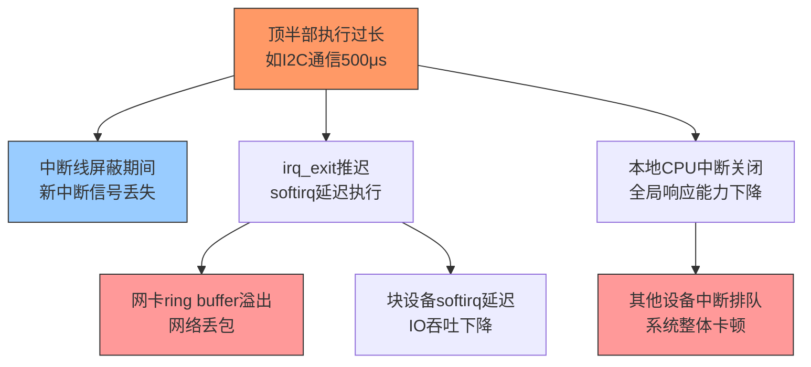

**知识点82 [I][M]**

见过一个让人头疼的案例。某块ARM板子上接了个触摸屏，驱动工程师图省事，在GPIO中断的顶半部里直接调了I2C读取坐标，整个handler跑了将近500微秒。结果用户报告说："触摸偶尔没反应"。最后拿示波器一量，问题很清楚——触摸芯片的中断引脚又拉低了，但CPU根本没进中断。500微秒的顶半部，直接把后续的中断给"吞"了。

这不是个例。顶半部跑太久，后果比你想象的更严重，而且往往是连环套。

## 后果一：同一条中断线上的新中断被忽略

顶半部执行期间，本地CPU这条中断线是被屏蔽的（local irq disabled或者具体irq line masked，取决于芯片设计和handler注册方式）。对大多数设备中断来说，这意味着同一条中断线上的新中断信号会被挂住——硬件层面最多缓存一个pending位，如果你运气不好连续来了两个，第二个就丢了。

上面那个I2C案例就是这个典型：触摸屏报点频率大约100Hz（每10ms一次），500us的handler意味着你有5%的时间窗口是"聋"的。听起来不高？但实际场景里，I2C总线抖动、用户快速滑动，都可能在那个窗口里再来一次中断。丢了一个点就丢了一个event，用户体验就是"偶尔没反应"。

更惨的是有些芯片没有pending位缓存，或者handler返回前清中断的时机不对，那就不是"偶尔丢"，而是连续丢一片。

## 后果二：softirq饥饿，irq_exit()推迟

很多人没注意到这个。顶半部跑完之后，`irq_exit()`才会去检查并执行pending的softirq。你顶半部拖了500us，`irq_exit()`就晚执行500us，网络收包softirq、块设备softirq、定时器softirq……统统跟着往后推。

```c
/* kernel/softirq.c */
void irq_exit(void)
{
    /* ... */
    if (!in_interrupt() && local_softirq_pending())
        invoke_softirq();  /* 顶半部跑完才到这里 */
    /* ... */
}
```

在高吞吐场景下，这500us的softirq延迟可能让网卡ring buffer溢出，丢包。最后你可能怪到网卡驱动头上，但根子其实在那个触摸驱动的顶半部。

## 后果三：整个系统跟着卡顿

顶半部执行期间，当前CPU是关中断的（至少关了本地中断）。这意味着这个CPU上所有的硬中断都进不来。你拖了500us，其他CPU如果也有事忙，那全局的中断响应都受影响。

```
时间线示意：

CPU0: [====顶半部(I2C 500us)====] [irq_exit][softirq][...]
       |<-------- 中断关闭 -------->|
       ↑
       此处其他中断无法响应

CPU1: [正常调度运行中...]
         ↑ 如果共享irq line或全局affinity配置，也会受波及
```

在多核手机上，这个效应尤其隐蔽。触摸屏中断绑在CPU0上，网卡中断也在CPU0上，500us的延迟足够让WiFi吞吐量掉一截。

下图更清晰地展示了三个后果之间的因果关系：



三个后果一张表概括：

| 后果 | 直接影响 | 典型症状 | 容易误诊为 |
|:---|:---|:---|:---|
| 同线中断丢失 | 相同irq line的中断被忽略 | 设备偶发"没反应"、事件丢失 | 硬件接触不良 |
| softirq饥饿 | 底半部推迟执行 | 网卡丢包、块设备延迟突增 | 驱动buffer太小 |
| 系统卡顿 | 本CPU中断关闭时间过长 | 全局延迟抖动、其他设备连带变慢 | CPU频率不够 |

> 陷阱：有些驱动开发者看到"中断丢失"，第一反应是去加调试打印。可printk本身也会让顶半部更长，问题反而更严重。调试中断延迟应该用ftrace的irqsoff tracer或者tracepoint，千万别在handler里printk。

---

**知识点83 [I]**

## 黄金法则与最佳实践

上面那个案例后来怎么修的？很简单——把I2C通信挪到底半部（workqueue），顶半部只做一个`gpio_to_irq()`确认和`schedule_work()`。handler执行时间从500us降到了不到5us，问题再也没出现过。

说白了，顶半部就一个原则：**只做不得不做的事，其他的统统推迟到底半部**。

什么叫"不得不做"？三件事：

1. **读中断状态寄存器**，确认是自己设备的中断
2. **清中断源**，否则硬件会一直assert中断线
3. **记录最少必要信息**，比如把状态字保存到某个上下文结构里

什么叫"不该做"？这有一份常见错误清单：

| 不该做的事 | 原因 | 该用替代方案 |
|:---|:---|:---|
| 访问慢速总线（I2C/SPI） | 总线本身可能就几百微秒 | workqueue或threaded irq |
| 动态内存分配（kmalloc/GFP_KERNEL） | 可能睡眠，handler里绝对不行 | 预先分配好buffer |
| 获取可能睡眠的锁（mutex/semaphore） | 同上，handler上下文不可睡眠 | 用spinlock，或推迟到底半部 |
| 大量数据处理 | 拖长中断关闭时间 | tasklet或workqueue |
| printk调试输出 | 串口输出极慢 | ftrace/tracepoint |

> 最佳实践：写handler之前，先在脑子里过一遍——"如果这个东西执行期间又来了一个中断会怎样？"如果答案让你不安，那就把它挪到底半部。这几乎永远不会错。

那有人问，"如果我的中断频率特别高，底半部调度开销也受不了怎么办？"好问题。这种情况考虑用threaded irq（`request_threaded_irq()`），把中断处理线程化，内核会自动在threaded handler里处理，既不会丢中断，也不会阻塞硬中断太久。或者直接上NAPI、轮询模式，绕过传统中断模型。不过这些方案各有利弊，后面会展开聊。
